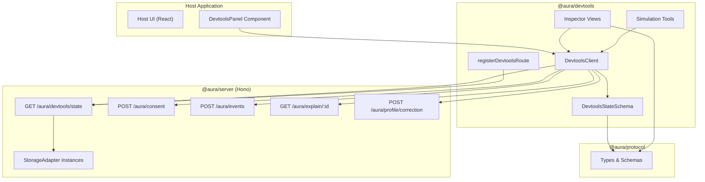
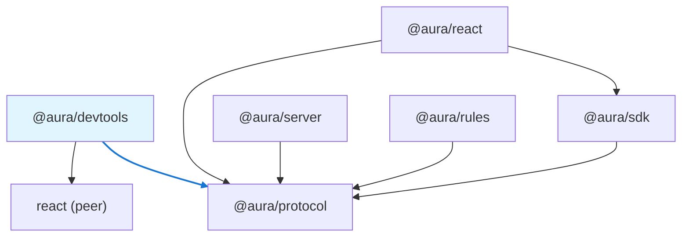
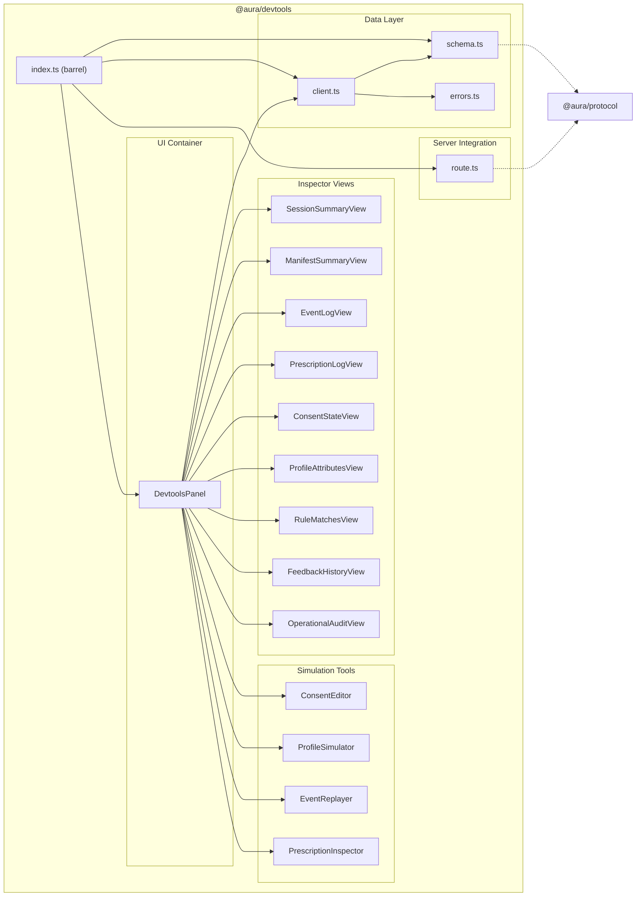
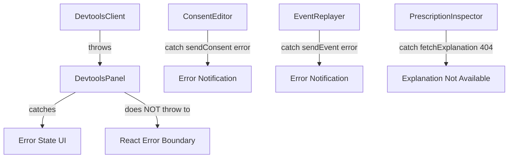

# Design Document: @aura/devtools

## Overview

`@aura/devtools` is the developer inspection and simulation package for the AURA adaptive UI framework. It provides a real-time window into the AURA server's decision-making pipeline — sessions, events, prescriptions, rule evaluations, consent state, profile attributes, feedback signals, and operational audit records — and offers simulation tools for consent toggling, profile scenario testing, event replay, and prescription inspection.

The package is designed for developers and UX researchers who need to understand why the AURA pipeline produced (or did not produce) a specific adaptation. It is not an end-user tool and is explicitly excluded from production bundles.

### Design Goals

| Goal | Rationale |
|------|-----------|
| Single-request data hydration | One `GET /aura/devtools/state` call provides all inspector data, minimizing network chatter |
| Honest data sourcing | All views derive from real server state; simulations execute through the real AUIP pipeline |
| Strict package boundary | Depends only on `@aura/protocol` + React (peer); never imported by SDK, server, or rules |
| Simulation fidelity | Consent, event, and profile simulations use the same AUIP endpoints as the SDK |
| Schema-validated data layer | `DevtoolsClient` validates all responses through Zod schemas before exposing to views |
| Composable container model | Works as a React component (`DevtoolsPanel`) or a Hono-mounted route |

### Key Design Decisions

| Decision | Rationale |
|----------|-----------|
| Combined `DevtoolsState` endpoint | Avoids N+1 queries across 9 AUIP endpoints; single snapshot ensures consistency |
| React component as primary UI container | React is already a peer dep for `@aura/react`; reuse in host apps is natural |
| Simulations POST to real AUIP endpoints | Ensures consent gating, rule evaluation, and risk enforcement are exercised end-to-end |
| Zod schema for `DevtoolsState` | Provides runtime validation + TypeScript inference from a single definition |
| `registerDevtoolsRoute` opt-in pattern | Server never exposes devtools surface unless explicitly wired; safe by default |
| Local-only profile simulation (v0) | Avoids needing a dedicated server-side simulation endpoint in the first release |
| Hono route handler for standalone mode | Developers without a React host can still access devtools via a local web route |

---

## Architecture

### System Context Diagram



### Package Dependency Graph



The dependency arrow is strictly one-way: `@aura/devtools` → `@aura/protocol`. No other `@aura/*` package imports from `@aura/devtools`.

### Internal Module Architecture



---

## Components and Interfaces

### 1. DevtoolsState Schema (`schema.ts`)

The central data contract between the server endpoint and the client-side views.

```typescript
import { z } from "zod";
import {
  CapabilityManifestSchema,
  AuraEventSchema,
  ConsentProfileSchema,
  ProfileAttributeSchema,
  FeedbackEventSchema,
  ExplanationRecordSchema,
  ISOTimestamp,
  NonEmptyString,
  ContextSequenceId,
  DataClassSchema,
  RiskClassSchema,
  LatencyClassSchema,
  PrescriptionModeSchema,
} from "@aura/protocol";

// --- Devtools-specific sub-schemas ---

export const PrescriptionDispositionSchema = z.enum([
  "accepted",
  "rejected",
  "dropped",
]);
export type PrescriptionDisposition = z.infer<typeof PrescriptionDispositionSchema>;

export const RuleConditionResultSchema = z.object({
  path: NonEmptyString,
  operator: NonEmptyString,
  expected: z.unknown(),
  passed: z.boolean(),
});
export type RuleConditionResult = z.infer<typeof RuleConditionResultSchema>;

export const RuleMatchRecordSchema = z.object({
  ruleId: NonEmptyString,
  prescriptionId: NonEmptyString,
  matched: z.boolean(),
  conditionResults: z.array(RuleConditionResultSchema),
  failureReason: z.string().optional(),
});
export type RuleMatchRecord = z.infer<typeof RuleMatchRecordSchema>;

export const ContextLockSnapshotSchema = z.object({
  sequenceId: ContextSequenceId,
  capturedAt: ISOTimestamp,
});

export const PrescriptionAuditSchema = z.object({
  decisionSource: NonEmptyString,
  policyVersion: NonEmptyString,
  manifestVersion: NonEmptyString,
  dataClassesUsed: z.array(DataClassSchema),
  latencyClass: LatencyClassSchema,
  evaluationTimeMs: z.number().nonneg().optional(),
  modelTier: z.string().optional(),
  llmJustification: z.string().optional(),
  cloudModelConsentGranted: z.boolean().optional(),
});
export type PrescriptionAudit = z.infer<typeof PrescriptionAuditSchema>;

export const AdaptationSummarySchema = z.object({
  type: NonEmptyString,
  target: z.string().optional(),
});

export const PrescriptionEntrySchema = z.object({
  id: NonEmptyString,
  surfaceId: NonEmptyString,
  mode: PrescriptionModeSchema,
  riskClass: RiskClassSchema,
  manifestVersion: NonEmptyString,
  contextLock: ContextLockSnapshotSchema,
  disposition: PrescriptionDispositionSchema,
  dispositionTimestamp: ISOTimestamp,
  adaptations: z.array(AdaptationSummarySchema).min(1),
  rejectionReason: z.string().optional(),
  dropReason: z.string().optional(),
  currentContextSequenceId: ContextSequenceId.optional(),
  expiresAt: ISOTimestamp.optional(),
  replacedBy: z.string().optional(),
  layoutStabilityBudgetMs: z.number().nonneg().optional(),
  elapsedMs: z.number().nonneg().optional(),
});
export type PrescriptionEntry = z.infer<typeof PrescriptionEntrySchema>;

export const SecurityAuditRecordSchema = z.object({
  id: NonEmptyString,
  category: NonEmptyString,
  reason: NonEmptyString,
  timestamp: ISOTimestamp,
});
export type SecurityAuditRecord = z.infer<typeof SecurityAuditRecordSchema>;

export const OperationalAuditEntrySchema = z.object({
  prescriptionId: NonEmptyString.optional(),
  latencyClass: LatencyClassSchema.optional(),
  evaluationTimeMs: z.number().nonneg().optional(),
  decisionSource: NonEmptyString.optional(),
  policyVersion: NonEmptyString.optional(),
  manifestVersion: NonEmptyString.optional(),
  dataClassesUsed: z.array(DataClassSchema).optional(),
  disposition: PrescriptionDispositionSchema.optional(),
  budgetMs: z.number().nonneg().optional(),
  elapsedMs: z.number().nonneg().optional(),
  dropReason: z.string().optional(),
  llmJustification: z.string().optional(),
  cloudModelConsentGranted: z.boolean().optional(),
});
export type OperationalAuditEntry = z.infer<typeof OperationalAuditEntrySchema>;

export const SessionMetadataSchema = z.object({
  sessionId: NonEmptyString,
  userId: NonEmptyString,
  status: z.enum(["active", "rejected"]),
  manifestVersion: z.string().optional(),
  contextSequenceId: ContextSequenceId,
  createdAt: ISOTimestamp,
});
export type SessionMetadata = z.infer<typeof SessionMetadataSchema>;

export const DevtoolsStateSchema = z.object({
  session: SessionMetadataSchema,
  manifest: CapabilityManifestSchema,
  events: z.array(AuraEventSchema),
  prescriptions: z.array(PrescriptionEntrySchema),
  ruleMatches: z.array(RuleMatchRecordSchema),
  consentProfile: ConsentProfileSchema,
  profileAttributes: z.array(ProfileAttributeSchema),
  feedbackHistory: z.array(FeedbackEventSchema),
  operationalAudit: z.array(OperationalAuditEntrySchema),
  securityAudit: z.array(SecurityAuditRecordSchema),
});
export type DevtoolsState = z.infer<typeof DevtoolsStateSchema>;
```

### 2. DevtoolsClient (`client.ts`)

A typed, schema-validated HTTP client for all devtools data operations.

```typescript
export interface DevtoolsClientConfig {
  /** Base URL of the AURA server (e.g. "http://localhost:3000") */
  endpoint: string;
  /** Session to inspect */
  sessionId: string;
  /** Optional AbortSignal for cancellation */
  signal?: AbortSignal;
}

export interface DevtoolsClient {
  fetchState(): Promise<DevtoolsState>;
  sendConsent(consentPatch: ConsentProfile): Promise<void>;
  sendEvent(event: AuraEvent): Promise<void>;
  sendProfileCorrection(correction: ProfileCorrectionPayload): Promise<void>;
  fetchExplanation(prescriptionId: string): Promise<ExplanationRecord | null>;
}

export function createDevtoolsClient(config: DevtoolsClientConfig): DevtoolsClient;
```

**Error types:**

```typescript
export class DevtoolsSessionNotFoundError extends Error {
  constructor(public readonly sessionId: string) {
    super(`Session not found: ${sessionId}`);
    this.name = "DevtoolsSessionNotFoundError";
  }
}

export class DevtoolsRequestError extends Error {
  constructor(public readonly statusCode: number, message: string) {
    super(message);
    this.name = "DevtoolsRequestError";
  }
}

export class DevtoolsNetworkError extends Error {
  constructor(message: string, public readonly cause?: unknown) {
    super(message);
    this.name = "DevtoolsNetworkError";
  }
}

export class DevtoolsValidationError extends Error {
  constructor(
    message: string,
    public readonly validationErrors: Array<{ path: (string | number)[]; message: string }>
  ) {
    super(message);
    this.name = "DevtoolsValidationError";
  }
}
```

**`fetchState()` algorithm:**

```
1. Build URL: `${endpoint}/aura/devtools/state?sessionId=${sessionId}`
2. Send GET request with signal for cancellation
3. If response status is 404 → throw DevtoolsSessionNotFoundError
4. If response status is 400 → parse body, throw DevtoolsRequestError with server message
5. If network error or timeout → throw DevtoolsNetworkError
6. Parse JSON body
7. Validate through DevtoolsStateSchema.safeParse()
8. If validation fails → throw DevtoolsValidationError with field paths
9. Return typed DevtoolsState
```

**`sendConsent()` algorithm:**

```
1. Build ConsentRequest body: { sessionId, consentPatch }
2. POST to `${endpoint}/aura/consent`
3. If error → throw DevtoolsRequestError
```

**`sendEvent()` algorithm:**

```
1. Build EventsRequest body: { sessionId, events: [event] }
2. POST to `${endpoint}/aura/events`
3. If error → throw DevtoolsRequestError
```

**`fetchExplanation()` algorithm:**

```
1. GET `${endpoint}/aura/explain/${prescriptionId}`
2. If 404 → return null
3. Parse and validate through ExplanationRecordSchema
4. Return typed ExplanationRecord
```

### 3. Server Route (`route.ts`)

```typescript
import type { Hono } from "hono";

export interface RegisterDevtoolsRouteOptions {
  /** The Hono app instance to mount the route on */
  app: Hono;
  /** The same StorageAdapter instances used by registerAuipRoutes */
  storage: {
    sessions: SessionStorage;
    events: EventStorage;
    prescriptions: PrescriptionStorage;
    consent: ConsentStorage;
    profile: ProfileStorage;
    feedback: FeedbackStorage;
    ruleMatches: RuleMatchStorage;
    audit: AuditStorage;
    security: SecurityAuditStorage;
  };
}

export function registerDevtoolsRoute(options: RegisterDevtoolsRouteOptions): void;
```

**Route handler algorithm for `GET /aura/devtools/state`:**

```
1. Extract `sessionId` from query params
2. If missing → return 400 { error: "sessionId query parameter is required" }
3. Fetch session metadata from sessions storage
4. If not found → return 404 { error: "Session not found: {sessionId}" }
5. Fetch all data in parallel:
   - manifest from sessions storage
   - events from events storage (ordered by timestamp)
   - prescriptions from prescriptions storage (with disposition metadata)
   - ruleMatches from ruleMatches storage
   - consentProfile from consent storage
   - profileAttributes from profile storage
   - feedbackHistory from feedback storage (ordered by timestamp)
   - operationalAudit from audit storage
   - securityAudit from security storage
6. Assemble DevtoolsState object
7. Return 200 with JSON body
```

### 4. DevtoolsPanel (`DevtoolsPanel.tsx`)

The top-level React component that orchestrates data fetching and view rendering.

```typescript
export interface DevtoolsPanelProps {
  /** Base URL of the AURA server */
  endpoint: string;
  /** Session ID to inspect */
  sessionId: string;
  /** Optional fixture events for EventReplayer */
  fixtureEvents?: Array<{ name: string; event: AuraEvent }>;
  /** Optional className for styling */
  className?: string;
}

export function DevtoolsPanel(props: DevtoolsPanelProps): React.ReactElement;
```

**Component lifecycle:**

```
1. On mount:
   - Create AbortController
   - Call createDevtoolsClient({ endpoint, sessionId, signal: controller.signal })
   - Call client.fetchState()
   - On success: set state to fetched DevtoolsState
   - On error: set error state (render error UI, no throw to error boundary)

2. On unmount:
   - Call controller.abort() to cancel in-flight requests

3. On simulation action (consent toggle, event replay):
   - Call appropriate client method
   - Re-fetch state to get updated snapshot
   - Update views with new data
```

**View rendering (tab-based navigation):**

| Tab | View Component | Data Source |
|-----|---------------|-------------|
| Session | `SessionSummaryView` | `state.session` |
| Manifest | `ManifestSummaryView` | `state.manifest` |
| Events | `EventLogView` | `state.events` |
| Prescriptions | `PrescriptionLogView` | `state.prescriptions` |
| Rules | `RuleMatchesView` | `state.ruleMatches` |
| Consent | `ConsentStateView` + `ConsentEditor` | `state.consentProfile` |
| Profile | `ProfileAttributesView` + `ProfileSimulator` | `state.profileAttributes` |
| Feedback | `FeedbackHistoryView` | `state.feedbackHistory` |
| Audit | `OperationalAuditView` | `state.operationalAudit` + `state.securityAudit` |
| Simulate | `EventReplayer` | `fixtureEvents` prop |

### 5. Inspector View Interfaces

Each view receives its slice of `DevtoolsState` as props and renders a read-only display.

```typescript
// SessionSummaryView
interface SessionSummaryViewProps {
  session: SessionMetadata;
}

// ManifestSummaryView
interface ManifestSummaryViewProps {
  manifest: CapabilityManifest;
}

// EventLogView
interface EventLogViewProps {
  events: AuraEvent[];
  replayedEventIds?: Set<string>;
}

// PrescriptionLogView
interface PrescriptionLogViewProps {
  prescriptions: PrescriptionEntry[];
  sessionContextSequenceId: number;
  onSelectPrescription: (prescriptionId: string) => void;
}

// ConsentStateView
interface ConsentStateViewProps {
  consentProfile: ConsentProfile;
}

// ProfileAttributesView
interface ProfileAttributesViewProps {
  attributes: ProfileAttribute[];
  simulatedAttributes?: ProfileAttribute[];
}

// RuleMatchesView
interface RuleMatchesViewProps {
  ruleMatches: RuleMatchRecord[];
  prescriptions: PrescriptionEntry[];
  onNavigateToPrescription: (prescriptionId: string) => void;
}

// FeedbackHistoryView
interface FeedbackHistoryViewProps {
  feedbackHistory: FeedbackEvent[];
  onNavigateToPrescription: (prescriptionId: string) => void;
}

// OperationalAuditView
interface OperationalAuditViewProps {
  operationalAudit: OperationalAuditEntry[];
  securityAudit: SecurityAuditRecord[];
}
```

### 6. Simulation Tool Interfaces

```typescript
// ConsentEditor
interface ConsentEditorProps {
  consentProfile: ConsentProfile;
  onToggle: (dataClass: DataClass, value: boolean) => Promise<void>;
}

// ProfileSimulator
interface ProfileSimulatorProps {
  onApplyScenario: (attribute: ProfileAttribute) => void;
  onClearScenario: () => void;
  simulatedAttributes: ProfileAttribute[];
}

// EventReplayer
interface EventReplayerProps {
  fixtureEvents: Array<{ name: string; event: AuraEvent }>;
  onReplay: (event: AuraEvent) => Promise<void>;
  isReplaying: boolean;
}

// PrescriptionInspector
interface PrescriptionInspectorProps {
  prescription: PrescriptionEntry;
  ruleMatches: RuleMatchRecord[];
  explanation: ExplanationRecord | null;
  consentProfile: ConsentProfile;
  manifest: CapabilityManifest;
}
```

---

## Data Models

### DevtoolsState — Complete Session Snapshot

```typescript
interface DevtoolsState {
  session: {
    sessionId: string;          // Non-empty
    userId: string;             // Non-empty
    status: "active" | "rejected";
    manifestVersion?: string;   // Optional version identifier
    contextSequenceId: number;  // Non-negative integer
    createdAt: string;          // ISO 8601 timestamp
  };
  manifest: CapabilityManifest; // From @aura/protocol
  events: AuraEvent[];          // Ordered by timestamp ascending
  prescriptions: PrescriptionEntry[];
  ruleMatches: RuleMatchRecord[];
  consentProfile: ConsentProfile; // Partial Record<DataClass, boolean>
  profileAttributes: ProfileAttribute[];
  feedbackHistory: FeedbackEvent[]; // Ordered by timestamp ascending
  operationalAudit: OperationalAuditEntry[];
  securityAudit: SecurityAuditRecord[];
}
```

### PrescriptionEntry — Enriched Prescription Log Record

```typescript
interface PrescriptionEntry {
  id: string;
  surfaceId: string;
  mode: PrescriptionMode;
  riskClass: RiskClass;
  manifestVersion: string;
  contextLock: { sequenceId: number; capturedAt: string };
  disposition: "accepted" | "rejected" | "dropped";
  dispositionTimestamp: string;
  adaptations: Array<{ type: string; target?: string }>;
  rejectionReason?: string;        // e.g. "consent revoked", "manifest check failed"
  dropReason?: string;             // e.g. "stale context", "expired before delivery"
  currentContextSequenceId?: number;
  expiresAt?: string;
  replacedBy?: string;             // Prescription ID that superseded this one
  layoutStabilityBudgetMs?: number;
  elapsedMs?: number;
}
```

### RuleMatchRecord — Rule Evaluation Trace

```typescript
interface RuleMatchRecord {
  ruleId: string;
  prescriptionId: string;
  matched: boolean;
  conditionResults: Array<{
    path: string;
    operator: string;
    expected: unknown;
    passed: boolean;
  }>;
  failureReason?: string;
}
```

### DevtoolsClientConfig

```typescript
interface DevtoolsClientConfig {
  endpoint: string;    // Non-empty base URL
  sessionId: string;   // Non-empty session identifier
  signal?: AbortSignal;
}
```

### Storage Adapter Interfaces (consumed by route handler)

The route handler accepts the same storage adapter instances used by the main AUIP routes. These interfaces are defined in `@aura/server` — the devtools route handler receives them as constructor arguments, not via import.

```typescript
// Conceptual interface (implemented in @aura/server)
interface SessionStorage {
  getSession(sessionId: string): Promise<SessionData | null>;
}
interface EventStorage {
  getEvents(sessionId: string): Promise<AuraEvent[]>;
}
interface PrescriptionStorage {
  getPrescriptions(sessionId: string): Promise<PrescriptionEntry[]>;
}
interface ConsentStorage {
  getConsent(sessionId: string): Promise<ConsentProfile>;
}
interface ProfileStorage {
  getAttributes(sessionId: string): Promise<ProfileAttribute[]>;
}
interface FeedbackStorage {
  getFeedback(sessionId: string): Promise<FeedbackEvent[]>;
}
interface RuleMatchStorage {
  getRuleMatches(sessionId: string): Promise<RuleMatchRecord[]>;
}
interface AuditStorage {
  getAuditEntries(sessionId: string): Promise<OperationalAuditEntry[]>;
}
interface SecurityAuditStorage {
  getSecurityRecords(sessionId: string): Promise<SecurityAuditRecord[]>;
}
```

---


## Correctness Properties

*A property is a characteristic or behavior that should hold true across all valid executions of a system — essentially, a formal statement about what the system should do. Properties serve as the bridge between human-readable specifications and machine-verifiable correctness guarantees.*

### Property 1: DevtoolsState Round-Trip Serialization

*For any* valid `DevtoolsState` value `ds`, serializing via `JSON.stringify(ds)` and parsing the result through `DevtoolsStateSchema` SHALL produce a value deeply equal to `ds`.

**Validates: Requirements 1.8, 14.11, 17.9**

### Property 2: Event Log Ordering Invariant

*For any* `DevtoolsState` value `ds` returned by the devtools endpoint, all adjacent pairs `(ds.events[i], ds.events[i+1])` SHALL satisfy `ds.events[i].timestamp <= ds.events[i+1].timestamp`.

**Validates: Requirements 4.2, 17.1**

### Property 3: Feedback Log Ordering Invariant

*For any* `DevtoolsState` value `ds` returned by the devtools endpoint, all adjacent pairs `(ds.feedbackHistory[i], ds.feedbackHistory[i+1])` SHALL satisfy `ds.feedbackHistory[i].timestamp <= ds.feedbackHistory[i+1].timestamp`.

**Validates: Requirements 9.2, 17.2**

### Property 4: Feedback-to-Prescription Referential Integrity

*For any* `DevtoolsState` value `ds`, every `prescriptionId` referenced in `ds.feedbackHistory` SHALL appear as the `id` of at least one entry in `ds.prescriptions`.

**Validates: Requirements 17.3**

### Property 5: Prescription-to-Manifest Referential Integrity

*For any* `DevtoolsState` value `ds`, every `surfaceId` referenced in `ds.prescriptions` SHALL appear as the `id` of at least one surface in `ds.manifest.surfaces`.

**Validates: Requirements 17.4**

### Property 6: Manifest Display Completeness

*For any* `CapabilityManifest` rendered by `ManifestSummaryView`, the count of displayed surfaces SHALL equal the count of surfaces in the input manifest, and the count of displayed components SHALL equal the total count of components across all surfaces in the input manifest.

**Validates: Requirements 3.3, 3.6**

### Property 7: Event Log Display Accuracy

*For any* `DevtoolsState` value `ds`, the events rendered by `EventLogView` SHALL be structurally equal to `ds.events`, the display order SHALL match the input array order, and the displayed count SHALL equal `ds.events.length`.

**Validates: Requirements 4.1, 4.4, 4.5, 4.6**

### Property 8: Consent Display Accuracy

*For any* `DevtoolsState` value `ds`, the consent values rendered by `ConsentStateView` SHALL be structurally equal to `ds.consentProfile` for all present keys, and missing standard `DataClass` keys SHALL be displayed as `false`.

**Validates: Requirements 6.1, 6.4, 6.5**

### Property 9: Profile Attributes Display Accuracy

*For any* `DevtoolsState` value `ds`, the attributes rendered by `ProfileAttributesView` SHALL be structurally equal to `ds.profileAttributes`, with a low-confidence indicator displayed for every attribute with `confidence < 0.5` and an expired indicator for every attribute with `expiresAt` in the past.

**Validates: Requirements 7.1, 7.3, 7.5, 7.6**

### Property 10: Client Schema Validation Rejection

*For any* HTTP response body that does not conform to `DevtoolsStateSchema`, `fetchState()` SHALL reject with a `DevtoolsValidationError` containing structured field-level error information; it SHALL NOT return a partially-typed object.

**Validates: Requirements 14.3**

### Property 11: Client Request Envelope Conformance

*For any* `ConsentProfile` patch passed to `sendConsent()`, the resulting HTTP POST body SHALL conform to `ConsentRequestSchema`; and *for any* `AuraEvent` passed to `sendEvent()`, the resulting HTTP POST body SHALL conform to `EventsRequestSchema`.

**Validates: Requirements 14.7, 14.8**

### Property 12: Consent Editor Request Fidelity

*For any* standard `DataClass` key `k` and boolean value `v`, toggling `k` to `v` via `ConsentEditor` SHALL produce a POST to `/aura/consent` with a body containing `sessionId` and a `consentPatch` where `consentPatch[k] === v`.

**Validates: Requirements 10.2, 10.3**

### Property 13: Consent Toggle Idempotence

*For any* `DataClass` key `k` and initial consent state, toggling `k` to `false` and then back to `true` SHALL restore the `ConsentProfile` for key `k` to its original value.

**Validates: Requirements 10.7**

### Property 14: Deterministic Event Replay

*For any* valid `AuraEvent` replayed twice against identical session state (same consent, profile, and prior events), both replays SHALL produce prescription entries with the same `PrescriptionDisposition` and the same set of `RuleMatchRecord.ruleId` values.

**Validates: Requirements 12.6, 17.8**

### Property 15: Event Replayer Request Fidelity

*For any* valid `AuraEvent` payload submitted to `EventReplayer`, the resulting HTTP POST body SHALL conform to `EventsRequestSchema` with the configured `sessionId` and the submitted event.

**Validates: Requirements 12.2**

### Property 16: Profile Simulator Validation

*For any* `ProfileAttribute` input with `confidence` outside `[0, 1]` or an unrecognized `DataClass`, the `ProfileSimulator` SHALL display a field-level validation error and SHALL NOT submit the scenario.

**Validates: Requirements 11.6**

### Property 17: No Connection Leak After Unmount

*For any* `DevtoolsPanel` component that is mounted and then unmounted, the count of open HTTP connections initiated by `DevtoolsClient` SHALL return to zero.

**Validates: Requirements 15.5, 17.10**

---

## Error Handling

### Error Categories

| Error Type | Source | Handling Strategy |
|-----------|--------|-------------------|
| `DevtoolsSessionNotFoundError` | `fetchState()` returns 404 | Display "Session not found" message in panel; do not crash |
| `DevtoolsRequestError` | Server returns 400 or 5xx | Display error notification with server message; retain last valid state |
| `DevtoolsNetworkError` | Network unreachable / timeout | Display "Server unreachable" with retry option |
| `DevtoolsValidationError` | Response fails schema validation | Display "Invalid server response" with validation details; do not render stale data |
| Consent toggle failure | `sendConsent()` returns error | Show inline error on ConsentEditor; do NOT update ConsentStateView |
| Event replay failure | `sendEvent()` returns error | Show inline error; do NOT add replayed event to EventLogView |
| Explanation fetch 404 | `fetchExplanation()` returns null | Display "Explanation not available" in PrescriptionInspector |

### Error Propagation Flow



### Design Principles

1. **No silent failures**: Every error produces visible feedback to the developer
2. **No crashes**: Panel never throws to React error boundary; all errors are caught internally
3. **No stale data on validation failure**: If schema validation fails, panel shows error rather than rendering potentially incorrect data
4. **Optimistic UI only for display**: Simulation tools do NOT optimistically update views before server confirmation
5. **Abort on unmount**: All in-flight requests are cancelled when DevtoolsPanel unmounts to prevent state updates on unmounted components

---

## Testing Strategy

### Dual Testing Approach

`@aura/devtools` uses a combination of property-based tests and example-based unit tests.

- **Property-based tests** (via `fast-check`): Verify universal invariants across randomly generated inputs — round-trip serialization, ordering invariants, referential integrity, display accuracy, and request envelope conformance
- **Example-based unit tests** (via `vitest`): Verify specific scenarios — error states, empty states, UI interactions, visual distinctions, navigation callbacks

### Property-Based Testing Configuration

- **Library**: `fast-check` (TypeScript-native, integrates with vitest)
- **Minimum iterations**: 100 per property test
- **Tag format**: `Feature: aura-devtools, Property {N}: {property title}`

Each correctness property maps to a single `fast-check` property test:

| Property | Generator Strategy |
|----------|-------------------|
| P1: Round-trip serialization | Generate arbitrary `DevtoolsState` objects using custom arbitraries for each sub-schema |
| P2: Event log ordering | Generate arrays of `AuraEvent` with random timestamps, sort before inserting into state |
| P3: Feedback log ordering | Generate arrays of `FeedbackEvent` with random timestamps, sort before inserting |
| P4: Feedback referential integrity | Generate prescriptions first, then generate feedback referencing those prescription IDs |
| P5: Prescription-to-manifest integrity | Generate manifest surfaces first, then generate prescriptions referencing those surface IDs |
| P6: Manifest display completeness | Generate random `CapabilityManifest` with varying surface/component counts |
| P7: Event log display accuracy | Generate random event arrays, render `EventLogView`, extract rendered data |
| P8: Consent display accuracy | Generate partial `ConsentProfile` objects with random DataClass subsets |
| P9: Profile attributes display | Generate random `ProfileAttribute` arrays with varying confidence and expiry |
| P10: Client validation rejection | Generate objects that violate `DevtoolsStateSchema` in various ways |
| P11: Client request conformance | Generate random consent patches and events, verify serialized POST bodies |
| P12: Consent editor requests | Generate random DataClass keys and boolean values |
| P13: Consent toggle idempotence | Generate random initial consent states and DataClass keys to toggle |
| P14: Deterministic replay | Generate random valid events and session states |
| P15: Event replayer requests | Generate random `AuraEvent` payloads |
| P16: Profile simulator validation | Generate invalid confidence/dataClass values |
| P17: No connection leak | Mount/unmount cycles with varying timing |

### Example-Based Unit Tests

| Area | Key Scenarios |
|------|---------------|
| Error handling | 404 session, 400 bad request, network failure, validation failure |
| Empty states | Zero events, zero prescriptions, zero feedback, zero attributes, zero surfaces |
| UI distinctions | Active vs rejected session, accepted/rejected/dropped prescriptions, inferred vs explicit attributes |
| Simulation flows | Consent toggle success/failure, event replay success/failure, profile scenario add/clear |
| Navigation | Rule match → prescription, feedback → prescription |
| Edge cases | Missing manifest version, expired attributes, stale context prescriptions |

### Integration Tests

- Full round-trip: `registerDevtoolsRoute` → HTTP request → response validation
- Consent simulation: toggle → re-fetch → verify prescription blocked
- Event replay: replay event → verify event log + prescription log updated
- Mount/unmount lifecycle: verify cleanup of connections

### Test File Organization

```
packages/devtools/
├── src/
│   ├── schema.ts
│   ├── client.ts
│   ├── errors.ts
│   ├── route.ts
│   ├── components/
│   │   ├── DevtoolsPanel.tsx
│   │   ├── SessionSummaryView.tsx
│   │   ├── ManifestSummaryView.tsx
│   │   ├── EventLogView.tsx
│   │   ├── PrescriptionLogView.tsx
│   │   ├── ConsentStateView.tsx
│   │   ├── ProfileAttributesView.tsx
│   │   ├── RuleMatchesView.tsx
│   │   ├── FeedbackHistoryView.tsx
│   │   ├── OperationalAuditView.tsx
│   │   ├── ConsentEditor.tsx
│   │   ├── ProfileSimulator.tsx
│   │   ├── EventReplayer.tsx
│   │   └── PrescriptionInspector.tsx
│   └── index.ts
├── tests/
│   ├── properties/
│   │   ├── roundtrip.property.test.ts
│   │   ├── ordering.property.test.ts
│   │   ├── referential-integrity.property.test.ts
│   │   ├── display-accuracy.property.test.ts
│   │   ├── client-validation.property.test.ts
│   │   ├── simulation.property.test.ts
│   │   └── arbitraries.ts          # Custom fast-check generators
│   ├── unit/
│   │   ├── schema.test.ts
│   │   ├── client.test.ts
│   │   ├── route.test.ts
│   │   └── components/
│   │       ├── DevtoolsPanel.test.tsx
│   │       ├── SessionSummaryView.test.tsx
│   │       └── ... (one per component)
│   └── integration/
│       ├── devtools-endpoint.integration.test.ts
│       ├── consent-simulation.integration.test.ts
│       └── event-replay.integration.test.ts
└── package.json
```
