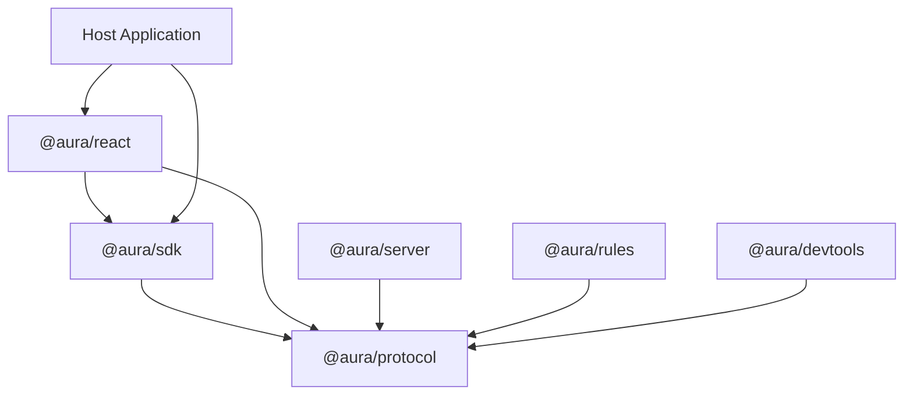
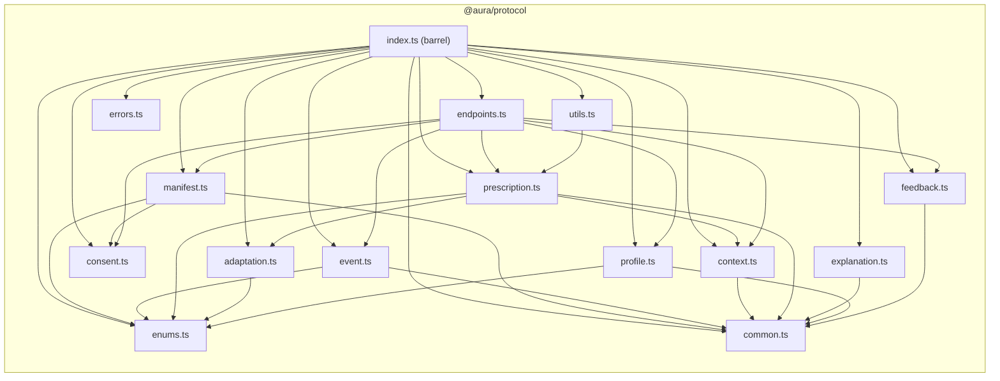

# Design Document: @aura/protocol

## Overview

`@aura/protocol` is the foundational npm package for the AURA TypeScript framework. It provides the single source of truth for all AUIP v0 types, Zod schemas, and validation contracts. Every other `@aura/*` package depends on it for both static TypeScript type inference and runtime validation.

The package is designed to be environment-agnostic — usable in browser SDKs, React bindings, Hono/Node server route handlers, Vitest test suites, and devtools panels without requiring polyfills or environment-specific imports. It achieves this by depending only on Zod (a zero-dependency, isomorphic schema library) and shipping dual CJS/ESM builds with TypeScript declarations.

### Design Goals

- **Single source of truth**: One import for all AUIP v0 types and schemas
- **Type-schema unification**: `z.infer<typeof Schema>` produces the canonical TypeScript type
- **Isomorphic**: No Node.js built-ins, no browser-only APIs
- **Acyclic module graph**: Flat dependency tree with no circular imports
- **Composable validation**: Schemas compose naturally for endpoint envelopes that reference core objects
- **Descriptive errors**: Structured validation errors with field paths and human-readable messages

### Key Design Decisions

| Decision | Rationale |
|----------|-----------|
| Zod as the schema library | Zero runtime dependencies, excellent TypeScript inference, widely adopted, isomorphic |
| Barrel re-export from single entry point | Simplifies consumer DX, enables tree-shaking via ESM |
| Schemas as source of truth, types derived via `z.infer` | Eliminates type/schema drift, provides runtime + compile-time safety from one definition |
| Discriminated unions for Adaptation and ProfileCorrection | Enables exhaustive pattern matching and precise validation per subtype |
| Flat module structure (no nested sub-paths) | Prevents circular imports, simplifies bundling |
| `tsup` for dual CJS/ESM build | Fast, zero-config bundler that produces both formats with declarations |

---

## Architecture

### Package Position in the AURA Ecosystem



`@aura/protocol` sits at the bottom of the dependency graph. It has no `@aura/*` dependencies itself. All other packages import types and schemas from it.

### Internal Module Architecture



The dependency flow is strictly top-down: enums/common → domain schemas → endpoint schemas → barrel. No cycles exist because:
1. `enums.ts` and `common.ts` have no internal imports
2. Domain schemas import only from enums/common and lower-level domain schemas
3. `endpoints.ts` imports from domain schemas only
4. `utils.ts` imports from prescription only
5. `index.ts` re-exports everything

---

## Components and Interfaces

### Module Breakdown

#### `enums.ts` — Enumerated Value Types

Exports Zod enums and their inferred types for:
- `RiskClass`: `"low" | "medium" | "high" | "critical"`
- `PrescriptionMode`: `"recommend" | "autoApply" | "askUser" | "observeOnly"`
- `NetworkQuality`: `"offline" | "slow" | "moderate" | "fast"`
- `LatencyClass`: `"immediate" | "fast" | "deliberate"`
- `LayoutStrategy`: `"none" | "reserve-space" | "skeleton" | "host-default"`
- `AdaptationType`: `"rank" | "componentVariant" | "layout" | "content" | "accessibility" | "filter"`
- `FeedbackAction`: `"accept" | "dismiss" | "override" | "undo" | "reject" | "error"`
- `ProfileProvenance`: `"explicit" | "inferred" | "imported"`
- `CorrectionAction`: `"remove" | "correct"`
- `DataClass`: all 12 recognized data class keys
- `AccessibilitySetting`: `"fontScale" | "contrast" | "motion" | "inputMode"`
- `LayoutType`: `"compact" | "expanded" | "step-by-step" | "accessible"`

#### `common.ts` — Shared Primitives and Refinements

Exports reusable schema building blocks:
- `NonEmptyString`: `z.string().min(1)`
- `ISOTimestamp`: a refined string schema validating ISO 8601 format
- `Confidence`: `z.number().min(0).max(1)`
- `ContextSequenceId`: `z.number().int().nonneg()`
- `SessionId`: alias for `NonEmptyString`

#### `manifest.ts` — CapabilityManifest Schemas

```typescript
export const LayoutStabilitySchema: z.ZodType<LayoutStability>
export const ManifestComponentSchema: z.ZodType<ManifestComponent>
export const ManifestSurfaceSchema: z.ZodType<ManifestSurface>
export const CapabilityManifestSchema: z.ZodType<CapabilityManifest>
```

Key validation rules:
- Components must declare at least one non-empty variant string
- `adaptableProps` is optional; when present, validated as a Zod schema descriptor
- `layoutStability.strategy` of `"reserve-space"` or `"skeleton"` requires `maxDecisionWaitMs`
- `maxDecisionWaitMs` must be a non-negative integer ≤ 5000
- Consent requirement references validated against `DataClass` enum
- `version` field is optional but when present must be non-empty

#### `event.ts` — AuraEvent Schema

```typescript
export const AuraEventSchema: z.ZodType<AuraEvent>
export const MinimumEventVocabulary: readonly string[]
```

Key validation rules:
- `type`: non-empty string (extensible, not restricted to vocabulary)
- `surfaceId`: non-empty string
- `timestamp`: valid ISO timestamp
- `payload`: any JSON-serializable object (open contract)
- Optional `dataClasses` array validated against `DataClass` enum

#### `context.ts` — ContextModel Schema

```typescript
export const ContextModelSchema: z.ZodType<ContextModel>
```

Key validation rules:
- `device`: non-empty string (required)
- `locale`: non-empty string, max 35 characters (BCP 47 tag, required)
- `viewport.width/height`: positive integers in [1, 32767] (optional)
- `networkQuality`: enum-constrained (optional)
- `sequenceId`: non-negative integer (optional)

#### `consent.ts` — ConsentProfile Schema

```typescript
export const DataClassSchema: z.ZodEnum<...>
export const ConsentProfileSchema: z.ZodType<ConsentProfile>
```

Key validation rules:
- Partial record of `DataClass` → `boolean`
- Empty object `{}` is valid
- Non-boolean values for recognized keys are rejected

#### `prescription.ts` — UIPrescription & ContextLock Schemas

```typescript
export const ContextLockSchema: z.ZodType<ContextLock>
export const AdaptationGroupSchema: z.ZodType<AdaptationGroup>
export const UIPrescriptionSchema: z.ZodType<UIPrescription>
```

Key validation rules:
- All required fields: `id`, `surfaceId`, `mode`, `latencyClass`, `contextLock`, `adaptations`, `constraints.expiresAt`, `manifestVersion`, `audit`
- `adaptations` must be non-empty array
- `mode` constrained to `PrescriptionMode` enum
- `latencyClass` constrained to `LatencyClass` enum
- `contextLock.sequenceId`: non-negative integer
- `contextLock.capturedAt`: valid ISO timestamp
- `manifestVersion`: non-empty string
- `constraints.expiresAt`: valid ISO timestamp
- `explanation.confidence`: value in [0, 1] when present
- `audit.dataClassesUsed`: validated against `DataClass` enum
- `adaptationGroups`: each with non-empty `groupId`, non-empty `adaptationIds`, boolean `atomic`

#### `adaptation.ts` — Adaptation Discriminated Union

```typescript
export const AdaptationSchema: z.ZodDiscriminatedUnion<"type", [...]>
```

Six members discriminated on `type`:
- `rank`: `orderedIds` (non-empty string[]), `reasonCode` (non-empty string)
- `componentVariant`: `slotId`, `componentId`, `variant`, `reasonCode` (all non-empty strings)
- `layout`: `layout` (enum: compact/expanded/step-by-step/accessible), `reasonCode` (non-empty string)
- `content`: `target`, `contentKey`, `content`, `reasonCode` (all non-empty strings)
- `accessibility`: `setting` (enum), `value` (string | number | boolean), `reasonCode` (non-empty string)
- `filter`: `target`, `reasonCode` (non-empty strings), `visibleFilters` (non-empty string[])

All variants require a non-empty `reasonCode` for auditability.

#### `explanation.ts` — ExplanationRecord Schema

```typescript
export const ExplanationRecordSchema: z.ZodType<ExplanationRecord>
```

Key validation rules:
- `id`: non-empty string
- `summary`: non-empty string
- `userVisible`: boolean
- `factors`: array of strings (empty array is valid)
- `confidence`: value in [0, 1]

#### `profile.ts` — ProfileAttribute & Correction Schemas

```typescript
export const ProfileAttributeSchema: z.ZodType<ProfileAttribute>
export const ProfileCorrectionSchema: z.ZodDiscriminatedUnion<"action", [...]>
```

ProfileAttribute rules:
- `id`, `key`, `value`, `provenance`, `confidence`, `dataClass` all required
- `provenance`/`source`: enum `"explicit" | "inferred" | "imported"`
- `confidence`: [0, 1]
- `dataClass`: validated against `DataClass` enum
- Optional `expiresAt`: valid ISO timestamp

ProfileCorrection (discriminated on `action`):
- `remove`: requires `attributeId` (non-empty), ignores `newValue`
- `correct`: requires `attributeId` (non-empty) and `newValue` (non-empty string)

#### `feedback.ts` — FeedbackEvent Schema

```typescript
export const FeedbackEventSchema: z.ZodType<FeedbackEvent>
```

Key validation rules:
- `prescriptionId`: non-empty string
- `action`: enum-constrained to 6 values
- `timestamp`: valid ISO timestamp
- Optional `reason`: non-empty string when present
- Optional `contextSequenceId`: non-negative integer (relevant for `stale-context` reason)

#### `endpoints.ts` — AUIP v0 Request/Response Envelopes

Exports 18 schemas (9 request + 9 response) following the naming convention `<EndpointName>RequestSchema` / `<EndpointName>ResponseSchema`:

| Endpoint | Request Schema | Response Schema |
|----------|---------------|-----------------|
| `/aura/session` | `SessionRequestSchema` | `SessionResponseSchema` |
| `/aura/events` | `EventsRequestSchema` | `EventsResponseSchema` |
| `/aura/context` | `ContextRequestSchema` | `ContextResponseSchema` |
| `/aura/prescriptions/stream` | `PrescriptionsStreamRequestSchema` | `PrescriptionsStreamResponseSchema` |
| `/aura/feedback` | `FeedbackRequestSchema` | `FeedbackResponseSchema` |
| `/aura/explain/:id` | `ExplainRequestSchema` | `ExplainResponseSchema` |
| `/aura/consent` | `ConsentRequestSchema` | `ConsentResponseSchema` |
| `/aura/profile` | `ProfileRequestSchema` | `ProfileResponseSchema` |
| `/aura/profile/correction` | `ProfileCorrectionRequestSchema` | `ProfileCorrectionResponseSchema` |

Each request schema composes core object schemas (e.g., `SessionRequestSchema` validates `sessionId`, `userId`, `manifest`, `consentProfile`, `context`).

#### `utils.ts` — Utility Functions

```typescript
export function isPrescriptionExpired(prescription: UIPrescription, now: Date): boolean
export function isPrescriptionContextStale(prescription: UIPrescription, currentContextSequenceId: number): boolean
```

`isPrescriptionExpired`:
- Returns `true` if `expiresAt` is before `now`
- Returns `true` if `expiresAt` is missing or invalid
- Monotone: once expired, stays expired for all later dates

`isPrescriptionContextStale`:
- Returns `true` if `contextLock.sequenceId ≠ currentContextSequenceId`
- Returns `true` if `currentContextSequenceId` is negative or not an integer

#### `errors.ts` — Structured Validation Error Type

```typescript
export interface ValidationErrorItem {
  path: (string | number)[]
  message: string
  code?: string
}

export interface ValidationResult<T> {
  success: true
  data: T
} | {
  success: false
  errors: ValidationErrorItem[]
}

export function parseSchema<T>(schema: z.ZodType<T>, value: unknown): ValidationResult<T>
```

Wraps Zod's `.safeParse()` to produce a structured error type with field paths and messages. All errors are collected (not fail-fast), and enum violations list allowed values.

#### `index.ts` — Barrel Entry Point

Re-exports all types, schemas, constants, and utility functions. This is the single `exports["."]` entry in `package.json`.

---

## Data Models

### Core AUIP v0 Object Type Definitions

```typescript
// === Enumerations ===

type RiskClass = "low" | "medium" | "high" | "critical"
type PrescriptionMode = "recommend" | "autoApply" | "askUser" | "observeOnly"
type NetworkQuality = "offline" | "slow" | "moderate" | "fast"
type LatencyClass = "immediate" | "fast" | "deliberate"
type AdaptationType = "rank" | "componentVariant" | "layout" | "content" | "accessibility" | "filter"
type FeedbackAction = "accept" | "dismiss" | "override" | "undo" | "reject" | "error"
type ProfileProvenance = "explicit" | "inferred" | "imported"
type CorrectionAction = "remove" | "correct"
type DataClass = "behavior" | "personalization" | "accessibility" | "approximateLocation"
             | "health" | "education" | "demographics" | "emotion"
             | "sensitiveInference" | "cloudModelUse" | "aggregation" | "retention"
type AccessibilitySetting = "fontScale" | "contrast" | "motion" | "inputMode"
type LayoutType = "compact" | "expanded" | "step-by-step" | "accessible"

// === CapabilityManifest ===

interface LayoutStability {
  strategy: "none" | "reserve-space" | "skeleton" | "host-default"
  maxDecisionWaitMs?: number  // required when strategy is reserve-space or skeleton; 0..5000
}

interface ManifestComponent {
  componentId: string
  variants: [string, ...string[]]  // at least one non-empty variant
  adaptableProps?: Record<string, unknown>  // optional constraint descriptor
  riskClass: RiskClass
  constraints?: {
    requiresConsent?: DataClass[]
    reversible?: boolean
  }
}

interface ManifestSurface {
  surfaceId: string
  components: ManifestComponent[]
  layoutStability?: LayoutStability
  consentRequirements?: DataClass[]
}

interface CapabilityManifest {
  version?: string  // non-empty when present
  surfaces: ManifestSurface[]
}

// === AuraEvent ===

interface AuraEvent {
  type: string        // non-empty
  surfaceId: string   // non-empty
  timestamp: string   // ISO 8601
  payload: Record<string, unknown>  // JSON-serializable object
  dataClasses?: DataClass[]
}

// === ContextModel ===

interface ContextModel {
  device: string       // non-empty
  locale: string       // BCP 47, max 35 chars
  viewport?: { width: number; height: number }  // [1, 32767]
  networkQuality?: NetworkQuality
  sequenceId?: number  // non-negative integer
  taskState?: Record<string, unknown>
  domain?: Record<string, unknown>
}

// === ContextLock ===

interface ContextLock {
  sequenceId: number   // non-negative integer
  capturedAt: string   // ISO 8601
}

// === ConsentProfile ===

type ConsentProfile = Partial<Record<DataClass, boolean>>

// === Adaptation (discriminated union) ===

type Adaptation =
  | { type: "rank"; orderedIds: [string, ...string[]]; reasonCode: string }
  | { type: "componentVariant"; slotId: string; componentId: string; variant: string; reasonCode: string }
  | { type: "layout"; layout: LayoutType; reasonCode: string }
  | { type: "content"; target: string; contentKey: string; content: string; reasonCode: string }
  | { type: "accessibility"; setting: AccessibilitySetting; value: string | number | boolean; reasonCode: string }
  | { type: "filter"; target: string; visibleFilters: [string, ...string[]]; reasonCode: string }

// === AdaptationGroup ===

interface AdaptationGroup {
  groupId: string       // non-empty
  adaptationIds: [string, ...string[]]  // non-empty
  atomic: boolean
}

// === ExplanationRecord ===

interface ExplanationRecord {
  id: string            // non-empty
  summary: string       // non-empty
  userVisible: boolean
  factors: string[]     // empty array is valid
  confidence: number    // [0, 1]
}

// === UIPrescription ===

interface UIPrescription {
  id: string
  surfaceId: string
  mode: PrescriptionMode
  latencyClass: LatencyClass
  contextLock: ContextLock
  adaptations: [Adaptation, ...Adaptation[]]  // non-empty
  constraints: {
    expiresAt: string   // ISO 8601
  }
  manifestVersion: string  // non-empty
  audit: {
    dataClassesUsed?: DataClass[]
    policyVersion?: string   // non-empty when present
    decisionSource?: string  // non-empty when present
  }
  explanation?: {
    confidence: number  // [0, 1]
    summary?: string
  }
  adaptationGroups?: AdaptationGroup[]
}

// === ProfileAttribute ===

interface ProfileAttribute {
  id: string
  key: string
  value: unknown
  provenance: ProfileProvenance
  confidence: number    // [0, 1]
  dataClass: DataClass
  expiresAt?: string    // ISO 8601
}

// === FeedbackEvent ===

interface FeedbackEvent {
  prescriptionId: string  // non-empty
  action: FeedbackAction
  timestamp: string       // ISO 8601
  reason?: string         // non-empty when present
  contextSequenceId?: number  // non-negative integer
}

// === ProfileCorrection (discriminated union) ===

type ProfileCorrection =
  | { action: "remove"; attributeId: string }
  | { action: "correct"; attributeId: string; newValue: string }
```

### Build & Package Configuration

```json
{
  "name": "@aura/protocol",
  "version": "0.1.0",
  "type": "module",
  "exports": {
    ".": {
      "import": "./dist/index.mjs",
      "require": "./dist/index.cjs",
      "types": "./dist/index.d.ts"
    }
  },
  "main": "./dist/index.cjs",
  "module": "./dist/index.mjs",
  "types": "./dist/index.d.ts",
  "files": ["dist"],
  "dependencies": {
    "zod": "^3.23.0"
  },
  "devDependencies": {
    "tsup": "^8.0.0",
    "typescript": "^5.4.0",
    "vitest": "^2.0.0",
    "fast-check": "^3.19.0"
  }
}
```

Build with `tsup`:
```typescript
// tsup.config.ts
import { defineConfig } from "tsup"

export default defineConfig({
  entry: ["src/index.ts"],
  format: ["cjs", "esm"],
  dts: true,
  clean: true,
  splitting: false,
})
```


---

## Correctness Properties

*A property is a characteristic or behavior that should hold true across all valid executions of a system — essentially, a formal statement about what the system should do. Properties serve as the bridge between human-readable specifications and machine-verifiable correctness guarantees.*

### Property 1: Round-Trip Serialization

*For any* valid AUIP v0 object (CapabilityManifest, AuraEvent, ContextModel, UIPrescription, FeedbackEvent, ConsentProfile, ProfileAttribute, ExplanationRecord, or any endpoint request/response payload), serializing it via `JSON.stringify()` and then parsing the resulting string back through the corresponding Zod schema SHALL produce a value deeply equal to the original.

**Validates: Requirements 3.7, 4.8, 5.11, 7.7, 13.1, 13.2, 13.3, 13.4, 13.5, 13.6, 13.7, 13.8**

### Property 2: Idempotent Parsing

*For any* valid AUIP v0 object, parsing it through the corresponding schema and then parsing the result a second time SHALL produce a value with identical field values to the first parse result.

**Validates: Requirements 2.8, 3.6, 4.7, 5.10, 6.9, 7.6, 8.5, 9.6, 10.6, 11.5, 12.11**

### Property 3: Valid Objects Parse Successfully

*For any* randomly generated object that conforms to the structural constraints of a given AUIP v0 schema (correct types, values within declared ranges, required fields present, enum fields set to allowed values), parsing through that schema SHALL succeed and return the typed value.

**Validates: Requirements 2.1, 3.1, 4.1, 5.1, 6.1, 7.1, 8.1, 9.1, 10.1, 11.1, 12.9**

### Property 4: Enum Field Rejection

*For any* schema field constrained to an enumeration (RiskClass, PrescriptionMode, NetworkQuality, LatencyClass, AdaptationType, FeedbackAction, ProfileProvenance, CorrectionAction, DataClass, AccessibilitySetting, LayoutType, LayoutStrategy), providing a string value not in the allowed set SHALL produce a validation failure.

**Validates: Requirements 2.3, 4.4, 5.6, 5.7, 6.8, 7.2, 8.4, 9.2, 9.5, 10.2**

### Property 5: Confidence Range Enforcement

*For any* schema field declared as `Confidence` (a number in [0, 1]), providing a value less than 0 or greater than 1 SHALL produce a validation failure identifying the field.

**Validates: Requirements 5.5, 9.3, 11.2**

### Property 6: ISO Timestamp Format Enforcement

*For any* schema field declared as an ISO timestamp, providing a string that does not conform to ISO 8601 format SHALL produce a validation failure identifying the field path.

**Validates: Requirements 3.4, 4.8, 5.4, 5.9, 9.4**

### Property 7: DataClass Key Validation

*For any* schema field or array requiring recognized `DataClass` values, providing a string not in the 12 recognized keys SHALL produce a validation failure.

**Validates: Requirements 2.12, 3.10, 5.13, 8.4, 9.5, 17.3**

### Property 8: Non-Empty String Enforcement

*For any* required string field declared as non-empty across all schemas (e.g., `type`, `surfaceId`, `prescriptionId`, `id`, `manifestVersion`, `reasonCode`, `attributeId`, `newValue`), providing an empty string `""` SHALL produce a validation failure.

**Validates: Requirements 2.7, 3.2, 5.12, 6.2, 6.3, 6.4, 6.5, 6.6, 6.7, 7.5, 10.5, 11.4, 14.3**

### Property 9: Adaptation Discriminated Union Correctness

*For any* valid `Adaptation` object with `type` set to one of the six recognized members, parsing through the `AdaptationSchema` SHALL succeed and the result SHALL contain exactly the fields required by that specific member type (e.g., `rank` adaptations have `orderedIds` and `reasonCode`; `componentVariant` adaptations have `slotId`, `componentId`, `variant`, and `reasonCode`).

**Validates: Requirements 6.1, 6.2, 6.3, 6.4, 6.5, 6.6, 6.7**

### Property 10: ProfileCorrection Discriminated Union Correctness

*For any* valid profile correction with `action: "correct"`, the `newValue` field SHALL be a non-empty string and parsing SHALL succeed. *For any* valid profile correction with `action: "remove"`, parsing SHALL succeed regardless of whether `newValue` is present or absent.

**Validates: Requirements 10.1, 10.3, 10.4**

### Property 11: Prescription Expiry Monotonicity

*For any* valid `UIPrescription` and *for any* two `Date` values `d1` and `d2` where `d1 < d2`, if `isPrescriptionExpired(prescription, d1)` returns `true`, then `isPrescriptionExpired(prescription, d2)` SHALL also return `true`. Conversely, if `isPrescriptionExpired(prescription, d2)` returns `false`, then `isPrescriptionExpired(prescription, d1)` SHALL also return `false`.

**Validates: Requirements 16.2, 16.3, 16.5, 16.6**

### Property 12: Context Staleness Correctness

*For any* valid `UIPrescription` with `contextLock.sequenceId = S`, `isPrescriptionContextStale(prescription, S)` SHALL return `false`, and `isPrescriptionContextStale(prescription, N)` SHALL return `true` for any non-negative integer `N ≠ S` or any negative/non-integer value of `N`.

**Validates: Requirements 16.8, 16.9, 16.10**

### Property 13: ConsentProfile Any-Subset Validity

*For any* subset of the 12 recognized `DataClass` keys, each mapped to a boolean value, parsing through `ConsentProfileSchema` SHALL succeed. This includes the empty subset (empty object `{}`).

**Validates: Requirements 8.1, 8.3, 8.6**

### Property 14: Validation Errors Are Structured and Descriptive

*For any* invalid input provided to any schema's parse function, the failure result SHALL contain an `errors` array where each item has a `path` property (identifying the field location) and a `message` property (human-readable description). For enum violations, the message SHALL list all allowed values.

**Validates: Requirements 14.1, 14.2, 14.3, 14.4, 14.5**

### Property 15: LayoutStability Conditional Requirement

*For any* `ManifestSurface` with `layoutStability.strategy` set to `"reserve-space"` or `"skeleton"`, parsing SHALL fail if `maxDecisionWaitMs` is absent. *For any* surface with strategy `"none"` or `"host-default"`, parsing SHALL succeed regardless of whether `maxDecisionWaitMs` is present.

**Validates: Requirements 2.9, 2.10**

### Property 16: FeedbackEvent Collects All Errors

*For any* `FeedbackEvent` with multiple invalid fields, the validation failure result SHALL contain error items for each invalid field (not fail-fast on the first error).

**Validates: Requirements 7.3**

### Property 17: Open Payload Contract

*For any* JSON-serializable object (non-primitive), providing it as the `payload` field of an otherwise-valid `AuraEvent` SHALL result in successful parsing. The schema does not constrain the shape of the payload object.

**Validates: Requirements 3.5, 3.9**


---

## Error Handling

### Validation Error Strategy

`@aura/protocol` uses a **structured, non-throwing** validation approach:

1. **No exceptions on invalid input**: All parse operations return a discriminated `ValidationResult<T>` union (`{ success: true; data: T }` or `{ success: false; errors: ValidationErrorItem[] }`).

2. **Collect-all semantics**: Zod's default behavior collects all validation errors in a single pass rather than failing fast on the first error. This ensures consumers see every problem in one round trip.

3. **Structured error items**: Each error item contains:
   - `path`: Array of strings/numbers identifying the JSON path to the problematic field (e.g., `["surfaces", 0, "components", 1, "riskClass"]`)
   - `message`: Human-readable description of the problem
   - `code`: Optional Zod error code for programmatic handling

4. **Enum error messages**: When a field violates an enum constraint, the error message explicitly lists all allowed values (e.g., `"Invalid enum value. Expected 'low' | 'medium' | 'high' | 'critical', received 'extreme'"`)

### Error Categories

| Category | Example | Error Behavior |
|----------|---------|----------------|
| Missing required field | `UIPrescription` without `id` | Path points to missing field, message says "Required" |
| Wrong type | `string` where `number` expected | Path + "Expected number, received string" |
| Enum violation | `riskClass: "extreme"` | Path + lists allowed values |
| Range violation | `confidence: 1.5` | Path + "Number must be less than or equal to 1" |
| Format violation | `timestamp: "not-a-date"` | Path + "Invalid ISO 8601 timestamp" |
| Refinement violation | `viewport.width: 0` | Path + "Number must be greater than or equal to 1" |
| Conditional requirement | `strategy: "skeleton"` without `maxDecisionWaitMs` | Path + "Required when strategy is 'reserve-space' or 'skeleton'" |

### The `parseSchema` Wrapper

```typescript
export function parseSchema<T>(schema: z.ZodType<T>, value: unknown): ValidationResult<T> {
  const result = schema.safeParse(value)
  if (result.success) {
    return { success: true, data: result.data }
  }
  return {
    success: false,
    errors: result.error.issues.map(issue => ({
      path: issue.path,
      message: issue.message,
      code: issue.code,
    })),
  }
}
```

Consumers can also call `schema.parse(value)` directly if they prefer exception-based control flow (Zod's default). The `parseSchema` wrapper is a convenience for structured error handling.

### Utility Function Error Handling

- `isPrescriptionExpired`: Never throws. Returns `true` for missing/invalid `expiresAt` (fail-safe: treat as expired).
- `isPrescriptionContextStale`: Never throws. Returns `true` for invalid `currentContextSequenceId` (fail-safe: treat as stale).


---

## Testing Strategy

### Overview

`@aura/protocol` uses a dual testing approach combining property-based tests (PBT) for universal correctness guarantees with example-based unit tests for specific scenarios and edge cases.

### Property-Based Testing

**Library**: `fast-check` (v3.19+) — the standard PBT library for TypeScript/JavaScript.

**Configuration**:
- Minimum **100 iterations** per property test
- Each property test references its design document property via tag comment
- Tag format: `// Feature: aura-protocol, Property {N}: {title}`

**Generators**: Custom `fast-check` arbitraries will be built for each AUIP v0 core object:
- `arbCapabilityManifest()` — generates valid manifests with random surfaces, components, constraints
- `arbAuraEvent()` — generates valid events with random types, surfaceIds, payloads
- `arbContextModel()` — generates valid context models with random viewport, network, locale
- `arbUIPrescription()` — generates valid prescriptions with random adaptations, context locks
- `arbAdaptation()` — generates valid adaptations from all 6 discriminated union members
- `arbFeedbackEvent()` — generates valid feedback events with random actions
- `arbConsentProfile()` — generates random subsets of DataClass → boolean
- `arbProfileAttribute()` — generates valid attributes with random provenance, confidence
- `arbExplanationRecord()` — generates valid records with random factors
- `arbProfileCorrection()` — generates valid corrections (both `remove` and `correct`)
- `arbEndpointRequest(endpoint)` — generates valid request payloads per endpoint
- `arbISOTimestamp()` — generates valid ISO 8601 timestamp strings
- `arbNonISOString()` — generates strings that are NOT valid ISO 8601
- `arbInvalidEnumValue(validSet)` — generates strings not in a given enum set

**Property Tests** (one test per property from the Correctness Properties section):

| Property | Test Description | Min Iterations |
|----------|-----------------|----------------|
| 1 | Round-trip: stringify → parse = identity for all schemas | 100 |
| 2 | Idempotent: parse(parse(x)) = parse(x) for all schemas | 100 |
| 3 | Valid objects always parse successfully | 100 |
| 4 | Invalid enum values always produce failures | 100 |
| 5 | Out-of-range confidence always produces failures | 100 |
| 6 | Non-ISO timestamps always produce failures | 100 |
| 7 | Invalid DataClass keys always produce failures | 100 |
| 8 | Empty strings in non-empty-string fields always produce failures | 100 |
| 9 | Adaptation discriminated union resolves to correct subtype | 100 |
| 10 | ProfileCorrection action discriminator enforces subtype rules | 100 |
| 11 | isPrescriptionExpired is monotone over time | 100 |
| 12 | isPrescriptionContextStale matches only on exact sequenceId | 100 |
| 13 | Any DataClass subset mapped to booleans parses as ConsentProfile | 100 |
| 14 | Invalid inputs produce structured errors with path and message | 100 |
| 15 | LayoutStability conditional maxDecisionWaitMs requirement | 100 |
| 16 | FeedbackEvent validation collects all errors | 100 |
| 17 | Any JSON object is accepted as AuraEvent payload | 100 |

### Example-Based Unit Tests

Specific scenarios and edge cases not suitable for PBT:

- Smoke tests for all exports (types, schemas, constants, functions exist)
- `MinimumEventVocabulary` contains exactly the 5 required event types
- Specific machine-readable reason strings (`stale-context`, `manifest-mismatch`, etc.)
- Empty object `{}` as ConsentProfile
- Missing `expiresAt` treated as expired
- `action: "remove"` ignores `newValue` field
- Components with exactly one variant (boundary)
- `maxDecisionWaitMs` at boundary values (0, 5000, 5001)
- Viewport at boundaries (1, 32767, 32768)
- Locale at max length (35 characters)

### Integration Tests

- Import from CJS context (`require("@aura/protocol")`)
- Import from ESM context (`import { ... } from "@aura/protocol"`)
- Verify no circular imports via `madge` static analysis
- Verify no Node.js built-in imports via `depcheck` or custom AST scan

### Test Runner

**Vitest** (v2.0+) with the `--run` flag for CI (non-watch mode). Fast-check integrates natively with Vitest's `test()` and `expect()` via `fc.assert(fc.property(...))`.

### Test File Organization

```
src/
├── __tests__/
│   ├── properties/
│   │   ├── round-trip.property.test.ts
│   │   ├── idempotent.property.test.ts
│   │   ├── valid-parse.property.test.ts
│   │   ├── enum-rejection.property.test.ts
│   │   ├── confidence-range.property.test.ts
│   │   ├── timestamp-format.property.test.ts
│   │   ├── dataclass-validation.property.test.ts
│   │   ├── non-empty-string.property.test.ts
│   │   ├── adaptation-union.property.test.ts
│   │   ├── correction-union.property.test.ts
│   │   ├── expiry-monotone.property.test.ts
│   │   ├── context-stale.property.test.ts
│   │   ├── consent-subset.property.test.ts
│   │   ├── error-structure.property.test.ts
│   │   ├── layout-stability.property.test.ts
│   │   ├── feedback-errors.property.test.ts
│   │   └── open-payload.property.test.ts
│   ├── arbitraries/
│   │   ├── manifest.arb.ts
│   │   ├── event.arb.ts
│   │   ├── context.arb.ts
│   │   ├── prescription.arb.ts
│   │   ├── adaptation.arb.ts
│   │   ├── feedback.arb.ts
│   │   ├── consent.arb.ts
│   │   ├── profile.arb.ts
│   │   ├── explanation.arb.ts
│   │   ├── correction.arb.ts
│   │   ├── endpoints.arb.ts
│   │   └── primitives.arb.ts
│   ├── unit/
│   │   ├── manifest.test.ts
│   │   ├── event.test.ts
│   │   ├── context.test.ts
│   │   ├── prescription.test.ts
│   │   ├── adaptation.test.ts
│   │   ├── feedback.test.ts
│   │   ├── consent.test.ts
│   │   ├── profile.test.ts
│   │   ├── explanation.test.ts
│   │   ├── correction.test.ts
│   │   ├── endpoints.test.ts
│   │   └── utils.test.ts
│   └── integration/
│       ├── cjs-import.test.ts
│       ├── esm-import.test.ts
│       └── no-circular.test.ts
```
