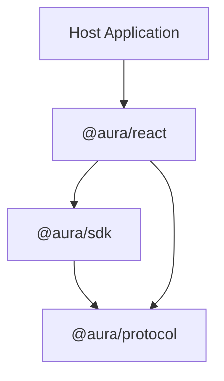
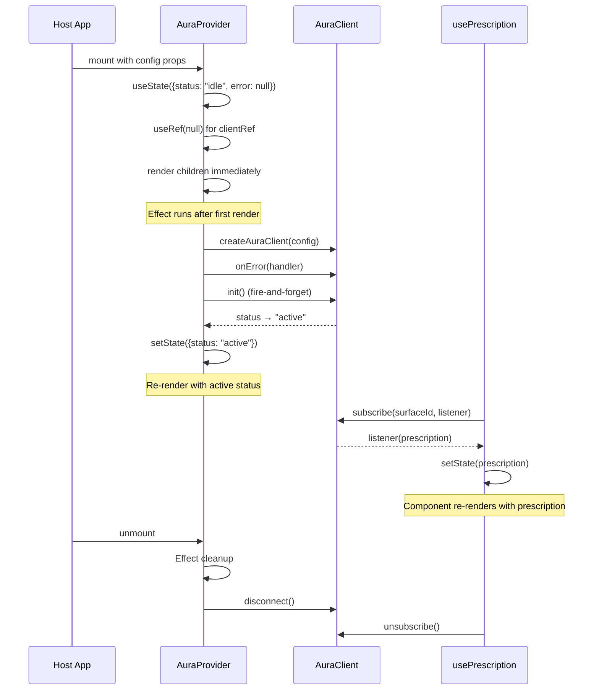
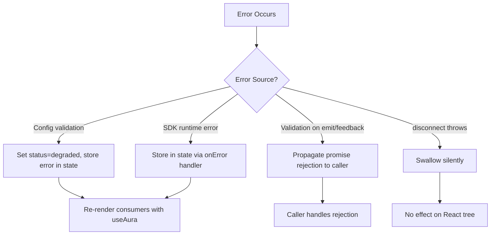

# Design Document: @aura/react

## Overview

`@aura/react` is the React adapter for the AURA TypeScript framework. It wraps `@aura/sdk` to provide idiomatic React bindings — a context provider and five hooks — that expose SDK capabilities to React component trees without taking over rendering. The package bridges the imperative `AuraClient` API with React's declarative, state-driven rendering model.

### Design Goals

- **Progressive enhancement**: AURA behavior is purely additive. Hooks return safe defaults when the SDK is unavailable, and host components always own their rendering decisions.
- **Render safety**: No hook or provider throws during the React render phase, regardless of SDK state, network conditions, or input validity.
- **Minimal re-renders**: Only components subscribed to changed data re-render. Surface-scoped subscriptions prevent cross-surface render cascading.
- **Stable references**: Functions returned by hooks maintain identity across re-renders to avoid unnecessary downstream effects.
- **Lifecycle alignment**: SDK init/disconnect are tied to `AuraProvider` mount/unmount via React effects, including correct behavior under Strict Mode double-invocation.

### Key Design Decisions

| Decision | Rationale |
|----------|-----------|
| Single context provider (`AuraProvider`) | One provider owns the `AuraClient` lifecycle; hooks derive from it. Avoids multiple competing contexts. |
| `useSyncExternalStore` for prescription subscriptions | Gives React control over subscription timing, avoids tearing, and integrates with concurrent features. |
| `useRef` for client instance storage | Prevents re-creation on re-render; the client is mutable infrastructure, not render state. |
| Separate `useState` for status/error | These are render-triggering values that components observe directly. |
| No-op fallbacks when context is missing | Hooks outside a provider tree return safe defaults instead of throwing. |
| SDK subscription as effect | Subscriptions start/stop with component mount/unmount, preventing leaks. |
| Memoized dispatch functions | `useCallback` with stable deps ensures emit/feedback functions maintain identity. |

---

## Architecture

### Package Position in the AURA Ecosystem



`@aura/react` sits directly above `@aura/sdk` in the dependency graph. It imports types from `@aura/protocol` for its public API signatures but delegates all networking, prescription management, and validation to the SDK.

### Internal Architecture

```mermaid
graph LR
    subgraph "@aura/react"
        PROVIDER["AuraProvider"]
        CTX["AuraContext (internal)"]
        USE_AURA["useAura"]
        USE_EMIT["useAuraEmit"]
        USE_RX["usePrescription"]
        USE_FB["useAuraFeedback"]
    end

    subgraph "@aura/sdk"
        CLIENT["AuraClient"]
        STORE["PrescriptionStore"]
    end

    PROVIDER -->|creates & manages| CLIENT
    PROVIDER -->|provides via| CTX
    USE_AURA -->|reads status/error from| CTX
    USE_EMIT -->|calls emit() on| CLIENT
    USE_RX -->|subscribes to| STORE
    USE_FB -->|calls feedback() on| CLIENT
    CTX -->|holds ref to| CLIENT
```

### Lifecycle Sequence



### Module Decomposition

| Module | Responsibility |
|--------|---------------|
| `AuraProvider.tsx` | Context provider component; creates/manages `AuraClient`, handles init/disconnect lifecycle, propagates status/error |
| `AuraContext.ts` | `React.createContext` definition with the internal context value type |
| `useAura.ts` | Hook reading `status` and `error` from context |
| `useAuraEmit.ts` | Hook returning a stable emit function |
| `usePrescription.ts` | Hook managing per-surface SDK subscription and returning current prescription |
| `useAuraFeedback.ts` | Hook returning a stable feedback function |
| `index.ts` | Barrel entry point re-exporting all public APIs and relevant types |

---

## Components and Interfaces

### Public API Surface

#### `AuraProvider`

```typescript
interface AuraProviderProps {
  endpoint: string;
  manifest: CapabilityManifest;
  userId: string;
  consentProfile: ConsentProfile;
  context: ContextModel;
  children?: React.ReactNode;
}

declare function AuraProvider(props: AuraProviderProps): React.JSX.Element;
```

**Behavior:**
- On mount: calls `createAuraClient(config)` wrapped in try/catch. On success, stores client in a ref, registers `onError` handler, calls `init()`. On config error, enters degraded mode (null client, status = "degraded", error = caught error).
- Renders children unconditionally and immediately (never blocks rendering).
- On unmount: cleanup effect calls `disconnect()` on the client ref. If `init()` is still in flight, cleanup awaits the init promise before disconnecting.
- Propagates `{ client, status, error }` through `AuraContext`.

#### `useAura`

```typescript
declare function useAura(): { status: SdkStatus; error: AuraClientError | null };
```

**Behavior:**
- Reads `status` and `error` from `AuraContext`.
- Outside provider: returns `{ status: "degraded", error: null }`.
- Never throws.

#### `useAuraEmit`

```typescript
declare function useAuraEmit(): (event: AuraEvent) => Promise<void>;
```

**Behavior:**
- Returns a stable function reference (memoized against client ref).
- Delegates to `client.emit(event)`.
- Outside provider: returns `async () => undefined`.
- Never throws during render.

#### `usePrescription`

```typescript
declare function usePrescription(surfaceId: string): UIPrescription | undefined;
```

**Behavior:**
- Subscribes to `client.subscribe(surfaceId, listener)` in an effect.
- On subscription callback: updates local state with the new prescription.
- Unsubscribes on unmount or `surfaceId` change.
- Returns `undefined` when outside provider, SDK degraded/idle, or no prescription.
- Never throws during render.

#### `useAuraFeedback`

```typescript
declare function useAuraFeedback(): (feedbackEvent: FeedbackEvent) => Promise<void>;
```

**Behavior:**
- Returns a stable function reference (memoized against client ref).
- Delegates to `client.feedback(feedbackEvent)`.
- Outside provider: returns `async () => undefined`.
- Never throws during render.

### Internal Components

#### `AuraContext` (not exported)

```typescript
interface AuraContextValue {
  client: AuraClient | null;
  status: SdkStatus;
  error: AuraClientError | null;
}

const AuraContext = React.createContext<AuraContextValue>({
  client: null,
  status: "degraded",
  error: null,
});
```

The default context value provides safe fallbacks when hooks are used outside a provider tree. `status: "degraded"` signals that no SDK is available, and `client: null` causes hooks to return no-op functions or `undefined`.

### Re-exported Types

From `@aura/sdk`:
- `AuraClientError`
- `AuraValidationError`
- `SdkStatus`

From `@aura/protocol`:
- `AuraEvent`
- `UIPrescription`
- `FeedbackEvent`
- `CapabilityManifest`
- `ConsentProfile`
- `ContextModel`

---

## Data Models

### Context Value Shape

```typescript
interface AuraContextValue {
  client: AuraClient | null;   // null when config invalid or not yet created
  status: SdkStatus;           // "idle" | "active" | "degraded"
  error: AuraClientError | null; // most recent SDK error, null if none
}
```

### Provider Internal State

```typescript
// Render-triggering state (useState)
interface ProviderState {
  status: SdkStatus;
  error: AuraClientError | null;
}

// Non-render infrastructure (useRef)
interface ProviderRefs {
  clientRef: React.MutableRefObject<AuraClient | null>;
  initPromiseRef: React.MutableRefObject<Promise<void> | null>;
  unmountedRef: React.MutableRefObject<boolean>;
  errorUnsubRef: React.MutableRefObject<(() => void) | null>;
}
```

### Hook Subscription State (usePrescription)

```typescript
// Per-hook-instance state
interface PrescriptionHookState {
  prescription: UIPrescription | undefined;
  unsubscribe: (() => void) | null;
}
```

### Package Configuration

```json
{
  "name": "@aura/react",
  "version": "0.1.0",
  "type": "module",
  "exports": {
    ".": {
      "import": "./dist/index.mjs",
      "require": "./dist/index.cjs",
      "types": "./dist/index.d.ts"
    }
  },
  "main": "./dist/index.cjs",
  "module": "./dist/index.mjs",
  "types": "./dist/index.d.ts",
  "files": ["dist"],
  "peerDependencies": {
    "react": "^18.0.0 || ^19.0.0",
    "@aura/sdk": "^0.1.0",
    "@aura/protocol": "^0.1.0"
  },
  "devDependencies": {
    "tsup": "^8.0.0",
    "typescript": "^5.4.0",
    "vitest": "^2.0.0",
    "fast-check": "^3.19.0",
    "@testing-library/react": "^16.0.0",
    "react": "^18.3.0",
    "react-dom": "^18.3.0"
  }
}
```

### Source File Layout

```
packages/aura-react/
├── src/
│   ├── index.ts                  # Barrel entry point
│   ├── AuraContext.ts            # React.createContext definition
│   ├── AuraProvider.tsx          # Provider component
│   ├── useAura.ts                # Status/error hook
│   ├── useAuraEmit.ts            # Event emission hook
│   ├── usePrescription.ts        # Per-surface prescription hook
│   └── useAuraFeedback.ts        # Feedback submission hook
├── __tests__/
│   ├── properties/               # Property-based tests
│   │   ├── config-forwarding.property.test.ts
│   │   ├── emit-forwarding.property.test.ts
│   │   ├── feedback-forwarding.property.test.ts
│   │   ├── prescription-delivery.property.test.ts
│   │   ├── surface-isolation.property.test.ts
│   │   ├── render-safety.property.test.ts
│   │   └── reference-stability.property.test.ts
│   ├── unit/                     # Example-based unit tests
│   │   ├── AuraProvider.test.tsx
│   │   ├── useAura.test.tsx
│   │   ├── useAuraEmit.test.tsx
│   │   ├── usePrescription.test.tsx
│   │   └── useAuraFeedback.test.tsx
│   └── arbitraries/             # fast-check generators
│       ├── config.arbitrary.ts
│       ├── event.arbitrary.ts
│       ├── prescription.arbitrary.ts
│       └── feedback.arbitrary.ts
├── tsup.config.ts
├── tsconfig.json
├── package.json
└── vitest.config.ts
```

---

## Correctness Properties

*A property is a characteristic or behavior that should hold true across all valid executions of a system — essentially, a formal statement about what the system should do. Properties serve as the bridge between human-readable specifications and machine-verifiable correctness guarantees.*

### Property 1: Config Forwarding Round-Trip

*For any* valid `AuraClientConfig` value `c` supplied as `AuraProvider` props, the config object received by `createAuraClient` inside the provider SHALL be structurally equal to `c` — no field may be added, removed, or mutated during forwarding.

**Validates: Requirements 1.9, 12.1**

### Property 2: Emit Forwarding

*For any* valid `AuraEvent` value `e` emitted via the function returned by `useAuraEmit()`, the `AuraEvent` received by `auraClient.emit` SHALL be structurally equal to `e`.

**Validates: Requirements 4.2, 12.2**

### Property 3: Feedback Forwarding

*For any* valid `FeedbackEvent` value `f` submitted via the function returned by `useAuraFeedback()`, the `FeedbackEvent` received by `auraClient.feedback` SHALL be structurally equal to `f`.

**Validates: Requirements 6.2, 6.8, 12.3**

### Property 4: Hook Function Reference Stability

*For any* sequence of re-renders of a component consuming `useAuraEmit()` or `useAuraFeedback()` where the `AuraProvider` instance has not remounted, the function reference returned by each hook SHALL be the same JavaScript object identity across all renders.

**Validates: Requirements 4.5, 6.5, 12.7, 12.8**

### Property 5: Surface Isolation

*For any* two distinct `surfaceId` values `s1` and `s2` consumed by independent `usePrescription` hook instances in separate components, a prescription delivered for `s1` SHALL NOT cause a re-render of the component consuming `usePrescription(s2)`, and SHALL NOT change the value returned by `usePrescription(s2)`.

**Validates: Requirements 5.10, 9.1, 9.2, 12.5**

### Property 6: Latest-Wins Prescription Delivery

*For any* `surfaceId` value `s` and *for any* sequence of prescriptions `p1, p2, ..., pn` delivered sequentially to surface `s` via the SDK subscription callback, the value returned by `usePrescription(s)` after each delivery `pk` SHALL equal `pk` if `pk` is not `undefined`, or `undefined` if the SDK delivers `undefined` (indicating expiry, staleness, or removal).

**Validates: Requirements 5.4, 5.11, 12.4**

### Property 7: Reject Clears Prescription

*For any* `surfaceId` value `s` and *for any* sequence of `n` valid prescriptions delivered to surface `s`, when the SDK subscription callback delivers `undefined` (triggered by a reject/undo feedback processed by the SDK), `usePrescription(s)` SHALL return `undefined` regardless of the prescription sequence that preceded it.

**Validates: Requirements 5.5, 12.9**

### Property 8: Total Render Safety

*For all* SDK status values in `{ "idle", "active", "degraded" }`, *for all* error states (null or any `AuraClientError`), and *for all* `surfaceId` inputs (including empty string), calling `useAura()`, `useAuraEmit()`, `usePrescription(surfaceId)`, and `useAuraFeedback()` SHALL return defined, non-throwing values and SHALL NOT cause a synchronous exception during the React render phase.

**Validates: Requirements 3.7, 4.7, 5.9, 6.7, 7.1, 7.7, 12.6**

### Property 9: Minimal Re-Render Guarantee

*For any* SDK status transition, components consuming only `useAuraEmit()` or `useAuraFeedback()` (and not `useAura()`) SHALL NOT re-render solely due to the status change. Only components consuming `useAura()` SHALL re-render in response to status or error state changes.

**Validates: Requirements 10.3**

### Property 10: No Subscription Leak After Unmount

*For any* `AuraProvider` instance that mounts, delivers `k` prescriptions across `k` distinct surfaces with `k` corresponding `usePrescription` subscriptions, and then unmounts, the total count of active SDK subscriptions registered by `@aura/react` SHALL return to zero after unmount completes.

**Validates: Requirements 5.6, 9.3, 9.5, 12.10**

---

## Error Handling

### Error Strategy

`@aura/react` follows a **never-throw-in-render** philosophy. All error conditions are channeled into observable state rather than exceptions:

| Error Source | Handling | User Observability |
|-------------|----------|-------------------|
| `AuraConfigError` from `createAuraClient` | Caught in provider effect; client set to `null`, status to `"degraded"` | `useAura().error` returns the config error |
| `AuraClientError` from SDK `onError` | Stored in state; delivered to context | `useAura().error` returns the latest error |
| `AuraValidationError` from `emit`/`feedback` | Propagated as promise rejection to caller | Caller's `.catch()` or try/catch in async handler |
| Hook called outside provider | Returns safe default (degraded status, undefined, no-op) | No error — graceful degradation |
| `disconnect()` throws | Suppressed silently in cleanup effect | Not observable — cleanup is best-effort |

### Error Flow



### Design Principles

1. **No render-phase exceptions**: Every hook wraps its logic defensively. If the client ref is null or context is missing, hooks return safe defaults.

2. **Errors are data, not control flow**: `useAura().error` is a state value that components can inspect and render conditionally. It never bubbles as an exception.

3. **Validation errors are the caller's responsibility**: When a caller passes an invalid `AuraEvent` or `FeedbackEvent`, the SDK rejects the promise. The hook doesn't swallow this — the caller should handle it.

4. **Cleanup failures are silent**: React effect cleanup (unmount) must never throw. If `disconnect()` or unsubscribe throws unexpectedly, the error is caught and swallowed.

5. **Progressive degradation**: Config errors at mount don't prevent the component tree from rendering. The provider enters degraded mode and all hooks return safe defaults. The application continues to function without AURA.

---

## Testing Strategy

### Overview

`@aura/react` uses a dual testing approach:
- **Property-based tests** (fast-check) verify universal invariants across generated inputs
- **Unit tests** (Vitest + React Testing Library) verify specific scenarios, edge cases, and lifecycle behavior

### Property-Based Testing

**Library**: [fast-check](https://github.com/dubzzz/fast-check) (v3.19+) integrated with Vitest.

**Configuration**:
- Minimum **100 iterations** per property test
- Each property test references its design document property via tag comment
- Tag format: `// Feature: aura-react, Property {N}: {property_text}`
- Custom arbitraries for `@aura/protocol` types (reused from `@aura/sdk` test suite where possible)

**Test Execution**: `vitest --run` (single execution, not watch mode)

### Property Test Coverage Matrix

| Property | Component Under Test | Pattern |
|----------|---------------------|---------|
| 1: Config forwarding | `AuraProvider` + `createAuraClient` | Round-trip |
| 2: Emit forwarding | `useAuraEmit` + `client.emit` | Round-trip |
| 3: Feedback forwarding | `useAuraFeedback` + `client.feedback` | Round-trip |
| 4: Function reference stability | `useAuraEmit`, `useAuraFeedback` | Idempotence |
| 5: Surface isolation | `usePrescription` (multiple instances) | Metamorphic |
| 6: Latest-wins delivery | `usePrescription` + SDK subscription | Invariant |
| 7: Reject clears prescription | `usePrescription` + feedback flow | Metamorphic |
| 8: Total render safety | All hooks + `AuraProvider` | Invariant |
| 9: Minimal re-render | `useAura` vs `useAuraEmit`/`useAuraFeedback` | Metamorphic |
| 10: No subscription leak | `usePrescription` + unmount lifecycle | Invariant |

### Unit Test Focus Areas

- **Lifecycle**: Mount/unmount/remount behavior, Strict Mode double-invocation
- **State transitions**: idle → active, idle → degraded, active → degraded
- **Error scenarios**: Config errors, SDK runtime errors, validation errors
- **Edge cases**: Empty surfaceId, hooks outside provider, nested providers, surfaceId change
- **Cleanup ordering**: onError unregistered before disconnect, subscriptions cancelled before disconnect

### Mocking Strategy

- **`@aura/sdk`**: Mock `createAuraClient` to return a mock `AuraClient` with controllable `status`, `emit`, `feedback`, `subscribe`, `disconnect`, `onError`, `init`
- **React Testing Library**: `renderHook` for isolated hook testing, `render` for component trees
- **`act()`**: Wrap state-triggering operations to flush React updates
- **Fake timers**: For testing subscription delivery timing and cleanup ordering

### Custom Arbitraries

```typescript
// Reuse protocol arbitraries from @aura/sdk test suite
import { arbAuraEvent } from '@aura/sdk/__tests__/arbitraries/aura-event.arbitrary';
import { arbUIPrescription } from '@aura/sdk/__tests__/arbitraries/prescription.arbitrary';
import { arbFeedbackEvent } from '@aura/sdk/__tests__/arbitraries/feedback.arbitrary';

// React-specific arbitraries
const arbSurfaceId = fc.string({ minLength: 1, maxLength: 50 });
const arbSdkStatus = fc.constantFrom("idle", "active", "degraded");
const arbAuraClientConfig = fc.record({
  endpoint: fc.webUrl(),
  manifest: arbCapabilityManifest,
  userId: fc.string({ minLength: 1 }),
  consentProfile: arbConsentProfile,
  context: arbContextModel,
});
```

### Test Organization

```
__tests__/
├── properties/                          # 10 property-based test files
│   ├── config-forwarding.property.test.ts
│   ├── emit-forwarding.property.test.ts
│   ├── feedback-forwarding.property.test.ts
│   ├── reference-stability.property.test.ts
│   ├── surface-isolation.property.test.ts
│   ├── latest-wins.property.test.ts
│   ├── reject-clears.property.test.ts
│   ├── render-safety.property.test.ts
│   ├── minimal-rerender.property.test.ts
│   └── subscription-leak.property.test.ts
├── unit/                                # Example-based unit tests
│   ├── AuraProvider.test.tsx
│   ├── useAura.test.tsx
│   ├── useAuraEmit.test.tsx
│   ├── usePrescription.test.tsx
│   └── useAuraFeedback.test.tsx
└── arbitraries/                         # fast-check generators
    ├── config.arbitrary.ts
    ├── event.arbitrary.ts
    ├── prescription.arbitrary.ts
    └── feedback.arbitrary.ts
```

