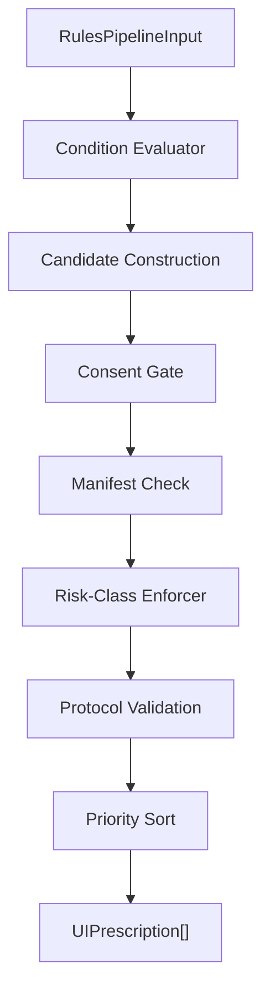
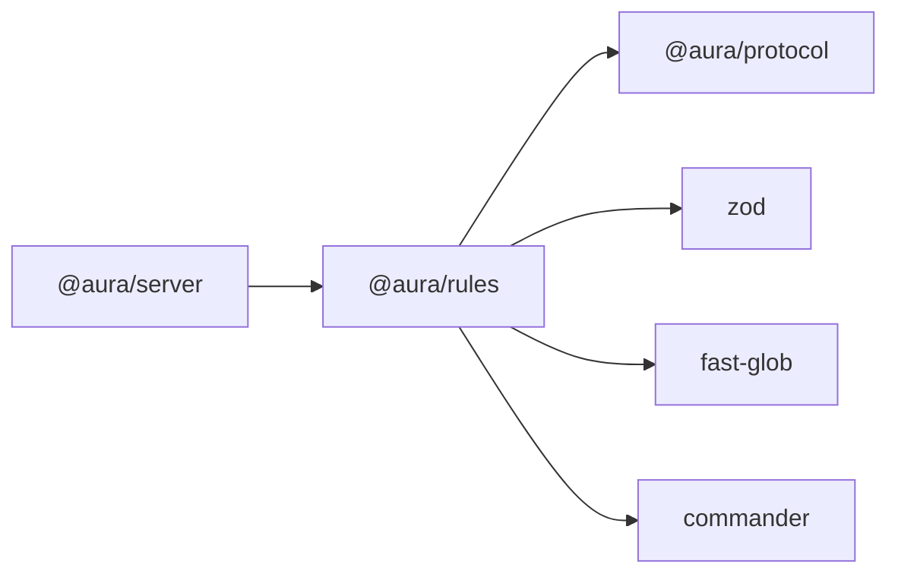

# Design Document — `@aura/rules`

## Overview

`@aura/rules` is the deterministic adaptation logic package for the AURA TypeScript framework. It provides a typed rules DSL, a condition evaluator, a multi-stage pipeline (consent gating, manifest checking, risk-class enforcement, priority ordering, protocol validation), a fixture-based test runner, and a CLI. The package is the sole producer of candidate `UIPrescription` objects within the `@aura/server` pipeline.

### Design Goals

1. **Determinism** — Same input always produces same output; no hidden randomness or external I/O.
2. **Safety** — Consent, manifest, and risk-class enforcement guarantee that invalid prescriptions never reach the SSE stream.
3. **Isolation** — One failing rule cannot crash the entire pipeline.
4. **Testability** — Injectable clock, fixture runner, and property-based tests make the evaluator fully verifiable.
5. **Extensibility** — Clear stage boundaries enable future insertion of SLM/LLM routing tiers without modifying core evaluation logic.

### Key Design Decisions

| Decision | Rationale |
|----------|-----------|
| Zod for schema validation | Already used in `@aura/protocol`; provides runtime + static type inference |
| Pipeline stages as composable functions | Each gate/filter is a pure function; easy to test in isolation and reorder |
| Injectable `ClockProvider` | Enables deterministic timestamps in tests without mocking `Date.now()` |
| Dot-path traversal for conditions | Flexible field access on nested input objects without requiring custom query languages |
| Stable `prescriptionId` via hashing | `ruleId + sessionId + eventBatchId` produces idempotent IDs across retries |

---

## Architecture

### High-Level Pipeline



### Package Structure

```
@aura/rules/
├── src/
│   ├── index.ts                 # Public API exports
│   ├── schema/
│   │   ├── rule.schema.ts       # RuleSchema, ConditionSchema, ActionSchema (Zod)
│   │   ├── fixture.schema.ts    # FixtureSchema, PrescriptionMatcher
│   │   └── types.ts             # Derived TypeScript types
│   ├── loader/
│   │   └── load-rules.ts        # loadRules(source) → RuleSet
│   ├── evaluator/
│   │   ├── pipeline.ts          # RulesPipeline (implements IRulesPipeline)
│   │   ├── condition.ts         # evaluateCondition(), resolvePath()
│   │   ├── construct.ts         # buildCandidatePrescription()
│   │   ├── consent-gate.ts      # filterByConsent()
│   │   ├── manifest-check.ts    # filterByManifest()
│   │   ├── risk-enforcer.ts     # enforceRiskClass()
│   │   ├── protocol-validate.ts # validatePrescription()
│   │   ├── priority-sort.ts     # sortByPriority()
│   │   └── clock.ts             # ClockProvider interface + default impl
│   ├── fixture/
│   │   ├── runner.ts            # FixtureRunner class
│   │   ├── matcher.ts           # prescription matching logic
│   │   └── diff.ts              # diff output for failures
│   ├── cli/
│   │   ├── index.ts             # CLI entry point (aura-rules)
│   │   └── commands/
│   │       └── test.ts          # aura-rules test <glob>
│   └── demo/
│       ├── rules.ts             # Demo_Rules for e-commerce surface
│       └── fixtures/            # Demo fixture files
├── package.json
├── tsconfig.json
└── vitest.config.ts
```

### Dependency Graph



`@aura/rules` depends only on `@aura/protocol` (for `UIPrescriptionSchema`, `IRulesPipeline`, shared types), `zod` (schema validation), `fast-glob` (fixture file resolution), and `commander` (CLI argument parsing). It has no network, database, or ML dependencies.

---

## Components and Interfaces

### Core Interfaces

```typescript
// IRulesPipeline — defined in @aura/server, implemented by @aura/rules
interface IRulesPipeline {
  evaluate(input: RulesPipelineInput): Promise<UIPrescription[]>;
}

// ClockProvider — injectable time source for determinism
interface ClockProvider {
  now(): ISO_Timestamp;
}

// RuleSource — input to the loader
type RuleSource =
  | { type: 'json'; data: unknown[] }
  | { type: 'module'; rules: Rule[] };

// RuleSet — loaded and validated collection of rules
interface RuleSet {
  readonly rules: ReadonlyArray<Rule>;
  readonly size: number;
  getRule(id: RuleId): Rule | undefined;
  getRuleIds(): ReadonlyArray<RuleId>;
}
```

### Pipeline Stage Signatures

Each pipeline stage is a pure function (except clock injection for timestamps):

```typescript
// Condition Evaluation
function evaluateConditions(
  conditions: Condition[],
  input: RulesPipelineInput
): boolean;

// Candidate Construction
function buildCandidatePrescription(
  rule: Rule,
  input: RulesPipelineInput,
  clock: ClockProvider
): CandidatePrescription;

// Consent Gating
function filterByConsent(
  candidates: CandidatePrescription[],
  consent: ConsentProfile
): CandidatePrescription[];

// Manifest Checking
function filterByManifest(
  candidates: CandidatePrescription[],
  manifest: CapabilityManifest
): CandidatePrescription[];

// Risk-Class Enforcement
function enforceRiskClass(
  candidates: CandidatePrescription[],
  manifest: CapabilityManifest
): CandidatePrescription[];

// Protocol Validation
function validatePrescriptions(
  candidates: CandidatePrescription[]
): UIPrescription[];

// Priority Sort
function sortByPriority(
  prescriptions: UIPrescription[]
): UIPrescription[];
```

### FixtureRunner Interface

```typescript
interface FixtureRunner {
  run(ruleSet: RuleSet, fixtures: Fixture[]): Promise<FixtureRunResult[]>;
}

interface FixtureRunResult {
  fixtureId: string;
  status: 'passed' | 'failed' | 'error';
  diff?: string;
  errorMessage?: string;
}

interface FixtureSummary {
  total: number;
  passed: number;
  failed: number;
  errors: number;
  results: FixtureRunResult[];
}

interface RunFixturesOptions {
  fixtureGlob: string;
  rulesSource: RuleSource;
  verbose?: boolean;
}
```

### Evaluator Pipeline Class

```typescript
class RulesPipeline implements IRulesPipeline {
  constructor(options: {
    ruleSet: RuleSet;
    clock?: ClockProvider;
    logger?: Logger;
  });

  async evaluate(input: RulesPipelineInput): Promise<UIPrescription[]>;
}
```

The `evaluate` method orchestrates the full pipeline:
1. For each rule, evaluate conditions (with error isolation via try/catch per rule)
2. For matching rules, construct candidate prescriptions
3. Filter through consent gate
4. Filter through manifest check
5. Enforce risk-class policy
6. Validate against `UIPrescriptionSchema`
7. Sort by priority (descending), with lexicographic tiebreaker on `ruleId`
8. Return validated `UIPrescription[]`

---

## Data Models

### Rule

```typescript
// Validated via RuleSchema (Zod)
interface Rule {
  id: RuleId;                    // non-empty string, unique within RuleSet
  priority: number;              // non-negative integer
  riskClass: RiskClass;          // 'low' | 'medium' | 'high' | 'critical'
  conditions: Condition[];       // non-empty array
  actions: Action[];             // non-empty array
  requiredConsent?: DataClass[]; // optional consent requirements
  metadata?: RuleMetadata;       // optional explanation/audit metadata
}

type RuleId = string;
type RiskClass = 'low' | 'medium' | 'high' | 'critical';
```

### Condition

```typescript
interface Condition {
  path: ConditionPath;           // dot-separated path into RulesPipelineInput
  operator: ConditionOperator;
  value?: unknown;               // optional when operator is 'exists'
}

type ConditionPath = string;     // e.g. "event.type", "context.device"
type ConditionOperator =
  | 'eq' | 'neq'
  | 'in' | 'notIn'
  | 'gt' | 'gte' | 'lt' | 'lte'
  | 'exists'
  | 'matches';
```

### Action

```typescript
interface Action {
  adaptationType: AdaptationType;
  surfaceId: string;             // non-empty
  slotId: string;                // non-empty
  payload: Record<string, unknown>; // shape varies by adaptationType
}

type AdaptationType =
  | 'rank'
  | 'componentVariant'
  | 'layout'
  | 'content'
  | 'accessibility'
  | 'filter';
```

### RuleMetadata

```typescript
interface RuleMetadata {
  explanationSummary?: string;
  explanationFactors?: string[];
  userVisible?: boolean;
  decisionSource?: DecisionSource;  // defaults to 'rules'
  latencyClass?: LatencyClass;
  justification?: string;           // required when decisionSource is 'llm'
}

type DecisionSource = 'rules' | 'recommender' | 'slm' | 'llm';
type LatencyClass = 'immediate' | 'fast' | 'deliberate';
```

### RulesPipelineInput

```typescript
interface RulesPipelineInput {
  events: AuraEvent[];
  context: Record<string, unknown>;
  contextSequenceId: string;
  profile: UserProfile;
  manifest: CapabilityManifest;
  consent: ConsentProfile;
  sessionId: string;
  eventBatchId: string;
  feedback?: FeedbackContext;
}

interface FeedbackContext {
  recentRejections: Array<{ ruleId: string; timestamp: ISO_Timestamp }>;
  recentUndos: Array<{ ruleId: string; timestamp: ISO_Timestamp }>;
}
```

### CandidatePrescription

```typescript
interface CandidatePrescription {
  prescriptionId: string;        // hash(ruleId + sessionId + eventBatchId)
  ruleId: RuleId;
  surfaceId: string;
  mode: PrescriptionMode;
  latencyClass: LatencyClass;
  adaptations: Adaptation[];
  constraints: {
    expiresAt: ISO_Timestamp;    // clock.now() + TTL (default 30s)
  };
  contextLock: {
    sequenceId: string;
    capturedAt: ISO_Timestamp;
  };
  manifestVersion: string;
  explanation?: ExplanationRecord;
  audit: {
    decisionSource: DecisionSource;
    dataClassesUsed: DataClass[];
  };
  riskClass: RiskClass;
  priority: number;
}

type PrescriptionMode = 'recommend' | 'autoApply' | 'askUser' | 'observeOnly';
```

### Fixture

```typescript
interface Fixture {
  id: string;                    // non-empty
  description: string;           // non-empty
  input: RulesPipelineInput;
  expected: PrescriptionMatcher[];
}

interface PrescriptionMatcher {
  surfaceId?: string;
  ruleId?: string;
  mode?: PrescriptionMode;
  adaptationType?: AdaptationType;
  count?: number;
}
```

### Key Mapping Tables

**Risk-Class → Default Mode:**

| RiskClass | Default Mode | Latency Class |
|-----------|-------------|---------------|
| `low` | `autoApply` | `immediate` |
| `medium` | `recommend` | `fast` |
| `high` | `askUser` | `fast` |
| `critical` | `observeOnly` | `fast` |

**Risk-Class Enforcement Rules:**

| RiskClass | Allowed Modes | Override Behavior |
|-----------|---------------|-------------------|
| `low` | `autoApply`, `recommend` | No override |
| `medium` | `recommend` (unless manifest `allowAutoApply: true`) | Downgrade `autoApply` → `recommend` |
| `high` | `askUser`, `observeOnly` | Force `askUser` |
| `critical` | `observeOnly` only | Force `observeOnly` |

### Condition Operator Semantics

| Operator | Semantics | Value Required |
|----------|-----------|----------------|
| `eq` | `resolved === value` (strict equality) | Yes |
| `neq` | `resolved !== value` | Yes |
| `in` | `value.includes(resolved)` where `value` is array | Yes (array) |
| `notIn` | `!value.includes(resolved)` | Yes (array) |
| `gt` | `resolved > value` (numeric) | Yes |
| `gte` | `resolved >= value` | Yes |
| `lt` | `resolved < value` | Yes |
| `lte` | `resolved <= value` | Yes |
| `exists` | `resolved !== undefined && resolved !== null` | No |
| `matches` | `new RegExp(value).test(resolved)` (string regex) | Yes (string) |

### Dot-Path Resolution Algorithm

```
resolvePath(input: object, path: string): unknown
  1. Split path by '.'
  2. If first segment is 'events', perform existential match:
     - For each event in input.events, resolve remaining path segments
     - Return first defined value found, or undefined
  3. Otherwise, traverse segments sequentially on the input object
  4. If any intermediate is undefined/null, return undefined
  5. Return the final resolved value
```


---

## Correctness Properties

*A property is a characteristic or behavior that should hold true across all valid executions of a system — essentially, a formal statement about what the system should do. Properties serve as the bridge between human-readable specifications and machine-verifiable correctness guarantees.*

### Property 1: Rule Schema Round-Trip

*For any* valid `Rule` value `r`, serializing `r` via `JSON.stringify(r)` and parsing the result back through `RuleSchema.parse(JSON.parse(...))` SHALL produce a value deeply equal to `r`.

**Validates: Requirements 1.10, 1.11, 18.1**

### Property 2: Evaluator Determinism

*For any* `RulesPipelineInput` value `i` and `RuleSet` value `rs`, calling `evaluate(i)` twice with the same `rs` and the same clock state SHALL return arrays that are deeply equal.

**Validates: Requirements 3.10, 11.1, 11.3, 18.2**

### Property 3: Condition Evaluation Metamorphic

*For any* `RulesPipelineInput` value `i` and `Rule` value `r` where all conditions in `r` evaluate to `true` against `i`, negating the resolved value of any single condition field in `i` SHALL cause `r` to evaluate as non-matching.

**Validates: Requirements 3.1, 3.2, 3.9**

### Property 4: Condition Operator Correctness

*For any* `Condition` `c` and `RulesPipelineInput` `i`:
- When `c.operator` is `eq`: the condition evaluates to `true` if and only if the resolved value at `c.path` strictly equals `c.value`.
- When `c.operator` is `in`: the condition evaluates to `true` if and only if the resolved value is contained in `c.value` (array).
- When `c.operator` is `exists`: the condition evaluates to `true` if and only if the resolved value is neither `undefined` nor `null`.
- When `c.operator` is `matches`: the condition evaluates to `true` if and only if the resolved value is a string matching the regex in `c.value`.

**Validates: Requirements 3.3, 3.4, 3.5, 3.6**

### Property 5: Missing Path Safety

*For any* `Condition` `c` whose `c.path` references a field that does not exist in the `RulesPipelineInput`, the condition SHALL evaluate to `false` without throwing an exception. When `c.path` traverses the `events` array, the condition SHALL perform existential matching across all events.

**Validates: Requirements 3.7, 3.8**

### Property 6: Candidate Construction Invariants

*For any* matching `Rule` `r` and `RulesPipelineInput` `i`:
- `prescriptionId` is deterministic: `hash(r.id + i.sessionId + i.eventBatchId)` produces the same value on repeated calls.
- `surfaceId` equals `r.actions[0].surfaceId`.
- `mode` equals the default for `r.riskClass` (`autoApply` for low, `recommend` for medium, `askUser` for high, `observeOnly` for critical).
- `adaptations.length` equals `r.actions.length`.
- `contextLock.sequenceId` equals `i.contextSequenceId`.
- `manifestVersion` equals `i.manifest.version` when present, or `"unversioned"` when absent.
- `audit.decisionSource` equals `r.metadata.decisionSource` when present, or `"rules"` otherwise.

**Validates: Requirements 4.1, 4.2, 4.3, 4.5, 4.8, 4.9, 4.10, 4.11**

### Property 7: Consent Safety

*For any* `RulesPipelineInput` value `i` and `Rule` `r` where `r.requiredConsent` includes a `DataClass` `dc` and `i.consent[dc]` is `false` or absent, the output of `evaluate(i)` SHALL contain no prescription produced by `r`.

**Validates: Requirements 5.1, 5.5, 18.4**

### Property 8: Manifest Boundary

*For any* `CandidatePrescription` `cp`:
- If `cp.surfaceId` is not declared in `manifest.surfaces`, the output SHALL NOT include `cp`.
- If `cp` contains a `componentVariant` adaptation whose `componentId` is not under the referenced surface, the output SHALL NOT include `cp`.
- If `cp` contains a `componentVariant` adaptation whose `variant` is not declared for that component, the output SHALL NOT include `cp`.
- If `cp` contains a `filter` adaptation whose target is not declared in the manifest, the output SHALL NOT include `cp`.
- If all references are declared in the manifest, the candidate SHALL NOT be discarded on manifest grounds.

**Validates: Requirements 6.1, 6.2, 6.3, 6.4, 6.5, 18.5**

### Property 9: Risk-Class Enforcement

*For any* output `UIPrescription` `p`:
- If `p.riskClass` is `low`, `p.mode` SHALL be `autoApply` (or `recommend` if rule explicitly sets it).
- If `p.riskClass` is `medium`, `p.mode` SHALL be `recommend` unless the manifest declares `allowAutoApply: true` for the referenced component.
- If `p.riskClass` is `high`, `p.mode` SHALL be `askUser` or `observeOnly`.
- If `p.riskClass` is `critical`, `p.mode` SHALL be `observeOnly`.

**Validates: Requirements 7.1, 7.2, 7.3, 7.4, 7.5, 7.6, 18.7, 18.8**

### Property 10: Priority Ordering Invariant

*For any* output `UIPrescription[]` array with more than one element, consecutive prescriptions SHALL have non-increasing priority values. When two consecutive prescriptions have equal priority, the first SHALL have a `ruleId` that is lexicographically less than or equal to the second.

**Validates: Requirements 8.1, 8.2, 8.5, 18.6**

### Property 11: Output Protocol Validity

*For any* `RulesPipelineInput` value `i`, every element in the output of `evaluate(i)` SHALL pass `UIPrescriptionSchema.safeParse()` without error.

**Validates: Requirements 9.3, 9.6, 18.3**

### Property 12: Error Isolation

*For any* `RulesPipelineInput` `i` and `RuleSet` `rs` containing at least one valid matching rule alongside one or more rules that throw runtime exceptions during evaluation, the output of `evaluate(i)` SHALL contain the prescription from the valid matching rule.

**Validates: Requirements 10.1, 10.2, 10.4**

### Property 13: Input Immutability

*For any* `RulesPipelineInput` value `i`, a deep-equal comparison of `i` before and after calling `evaluate(i)` SHALL find no differences. The evaluator SHALL NOT mutate its input.

**Validates: Requirements 11.4, 18.9**

### Property 14: Feedback Suppression

*For any* `RulesPipelineInput` `i` containing a recent rejection for rule `r` in `i.feedback.recentRejections`, the output of `evaluate(i)` SHALL contain no prescription produced by `r` for the current evaluation cycle.

**Validates: Requirements 17.1**

### Property 15: Fixture Determinism

*For any* `Fixture` `f` and `RuleSet` `rs`, calling the fixture runner with `f` and `rs` twice SHALL produce the same pass/fail result both times.

**Validates: Requirements 12.7, 18.10**

---

## Error Handling

### Strategy

The evaluator uses a **fail-open-per-rule, fail-closed-per-prescription** strategy:

1. **Per-rule isolation**: Each rule is evaluated inside a `try/catch`. If a rule's condition evaluation or action construction throws, the exception is caught, logged with the `ruleId` and error message, and that rule is skipped. Other rules continue evaluation.

2. **Per-prescription validation**: After construction, each candidate passes through consent, manifest, and protocol validation gates. Any candidate that fails a gate is discarded with a structured log entry. The pipeline continues with remaining candidates.

3. **Never throw from `evaluate()`**: The `evaluate()` method NEVER throws. If all rules fail, it returns an empty array. This guarantees the `@aura/server` pipeline never crashes due to rules evaluation.

### Error Categories

| Category | Behavior | Logged As |
|----------|----------|-----------|
| Condition evaluation throws | Skip rule, log warning | `{ level: 'warn', ruleId, error, phase: 'condition' }` |
| Action construction throws | Skip rule, log warning | `{ level: 'warn', ruleId, error, phase: 'construction' }` |
| Consent gate filters | Discard candidate, log info | `{ level: 'info', ruleId, reason: 'consent', missingConsent: [...] }` |
| Manifest check fails | Discard candidate, log warn | `{ level: 'warn', ruleId, reason: 'manifest', details: ... }` |
| Protocol validation fails | Discard candidate, log error | `{ level: 'error', ruleId, reason: 'protocol', errors: [...] }` |
| Rule loading validation fails | Reject entire loadRules call | Thrown as `RuleLoadError` with index and details |
| Fixture input invalid | Mark as 'error' (not 'failure') | Included in `FixtureRunResult.errorMessage` |

### Logger Interface

```typescript
interface RulesLogger {
  info(entry: LogEntry): void;
  warn(entry: LogEntry): void;
  error(entry: LogEntry): void;
}

interface LogEntry {
  ruleId?: RuleId;
  phase?: 'condition' | 'construction' | 'consent' | 'manifest' | 'protocol';
  reason?: string;
  error?: Error;
  details?: Record<string, unknown>;
}
```

The logger is injectable via the `RulesPipeline` constructor. The default implementation writes structured JSON to `stderr`. The `@aura/devtools` package can subscribe to log entries for real-time rule debugging.

---

## Testing Strategy

### Dual Testing Approach

`@aura/rules` uses a combination of property-based tests and example-based unit tests for comprehensive coverage:

| Test Type | Purpose | Framework |
|-----------|---------|-----------|
| Property-based tests | Verify universal invariants across generated inputs | `fast-check` |
| Unit tests | Verify specific examples, edge cases, integration points | `vitest` |
| Fixture tests | Verify demo rule behavior end-to-end | Built-in `FixtureRunner` |
| CLI integration tests | Verify CLI exit codes and output formatting | `vitest` + subprocess |

### Property-Based Testing Configuration

- **Library**: `fast-check` (TypeScript-native, excellent Zod integration via `@fast-check/zod`)
- **Minimum iterations**: 100 per property test
- **Tag format**: `Feature: aura-rules, Property {N}: {title}`
- **Each correctness property maps to exactly one `fast-check` test**

### Property Test Implementation Approach

Custom `Arbitrary` generators will be built for:
- `Rule` — valid rules with all field combinations
- `Condition` — conditions with all operator types
- `RulesPipelineInput` — complete evaluation inputs
- `CapabilityManifest` — manifests with varying surface/component declarations
- `ConsentProfile` — consent profiles with varying DataClass states

The `@fast-check/zod` bridge will generate valid `Rule` objects directly from `RuleSchema`, ensuring generators stay in sync with schema changes.

### Unit Test Coverage

Unit tests focus on:
- Schema validation edge cases (empty arrays, invalid enums, boundary values)
- Individual operator semantics (each operator tested with concrete examples)
- Demo rule fixture tests (specific event + consent + manifest combinations)
- CLI argument parsing and output formatting
- Loader behavior (JSON vs module source, duplicate detection)

### Test Organization

```
src/
├── __tests__/
│   ├── properties/
│   │   ├── schema-roundtrip.property.test.ts
│   │   ├── determinism.property.test.ts
│   │   ├── condition-metamorphic.property.test.ts
│   │   ├── condition-operators.property.test.ts
│   │   ├── candidate-construction.property.test.ts
│   │   ├── consent-safety.property.test.ts
│   │   ├── manifest-boundary.property.test.ts
│   │   ├── risk-enforcement.property.test.ts
│   │   ├── priority-ordering.property.test.ts
│   │   ├── output-validity.property.test.ts
│   │   ├── error-isolation.property.test.ts
│   │   ├── input-immutability.property.test.ts
│   │   ├── feedback-suppression.property.test.ts
│   │   └── fixture-determinism.property.test.ts
│   ├── unit/
│   │   ├── schema.test.ts
│   │   ├── loader.test.ts
│   │   ├── condition.test.ts
│   │   ├── construct.test.ts
│   │   ├── consent-gate.test.ts
│   │   ├── manifest-check.test.ts
│   │   ├── risk-enforcer.test.ts
│   │   ├── priority-sort.test.ts
│   │   ├── protocol-validate.test.ts
│   │   └── clock.test.ts
│   ├── fixtures/
│   │   ├── demo-filter-highlight.fixture.ts
│   │   ├── demo-product-card.fixture.ts
│   │   ├── demo-explanation.fixture.ts
│   │   └── demo-reject-suppress.fixture.ts
│   └── integration/
│       └── cli.test.ts
```

### Generator Strategy

```typescript
// Example: Rule arbitrary using fast-check/zod bridge
import { ZodFastCheck } from '@fast-check/zod';

const ruleArb = ZodFastCheck().inputOf(RuleSchema);

// Example: RulesPipelineInput with controlled consent
const inputWithConsent = (consent: Record<string, boolean>) =>
  fc.record({
    events: fc.array(auraEventArb, { minLength: 1 }),
    context: fc.dictionary(fc.string(), fc.jsonValue()),
    contextSequenceId: fc.uuid(),
    profile: userProfileArb,
    manifest: manifestArb,
    consent: fc.constant(consent),
    sessionId: fc.uuid(),
    eventBatchId: fc.uuid(),
  });
```

### CI Integration

- Property tests run as part of `vitest --run` in CI
- Fixture tests run via `aura-rules test 'src/__tests__/fixtures/**/*.fixture.ts'`
- CLI integration tests spawn the binary and assert exit codes
- All tests must pass before merge; property test failures include the shrunk counterexample for debugging
