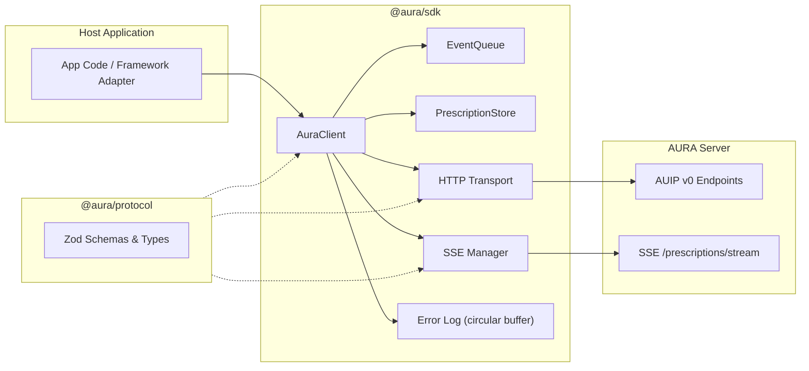
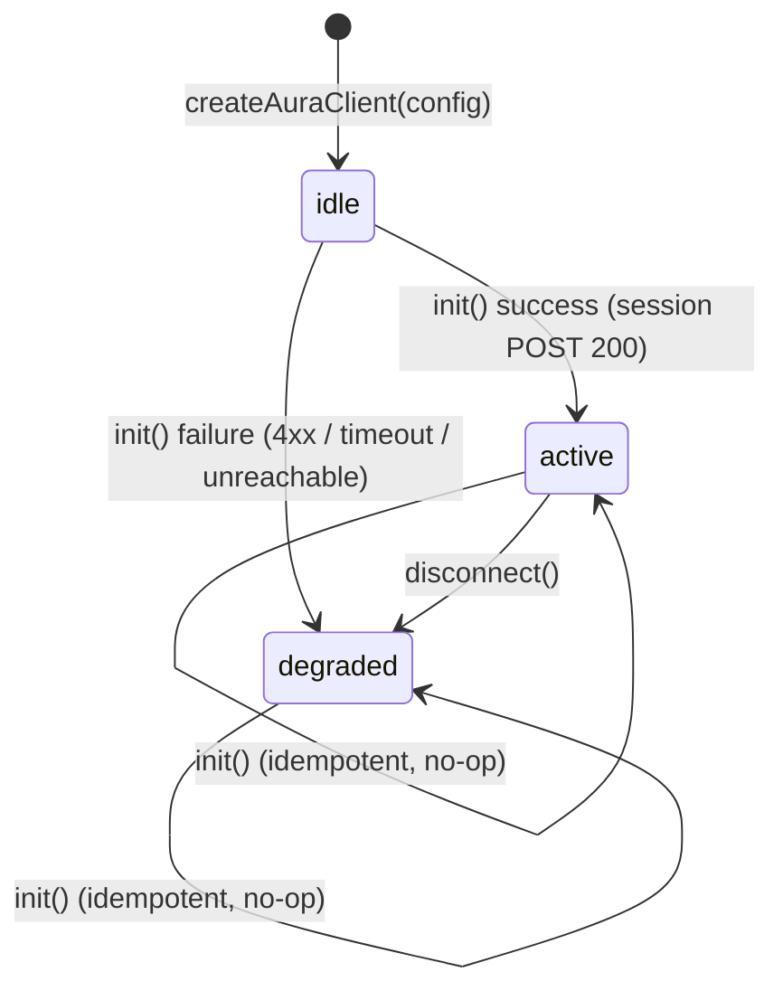
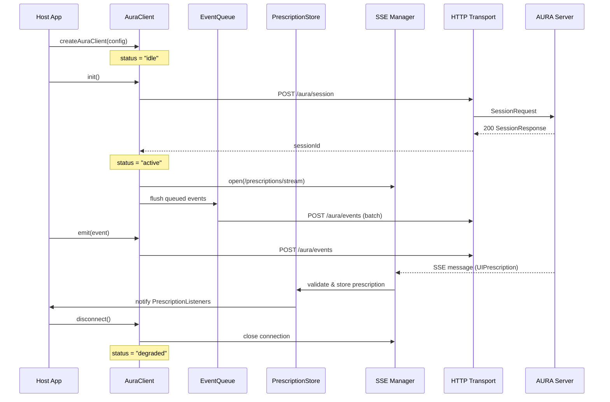
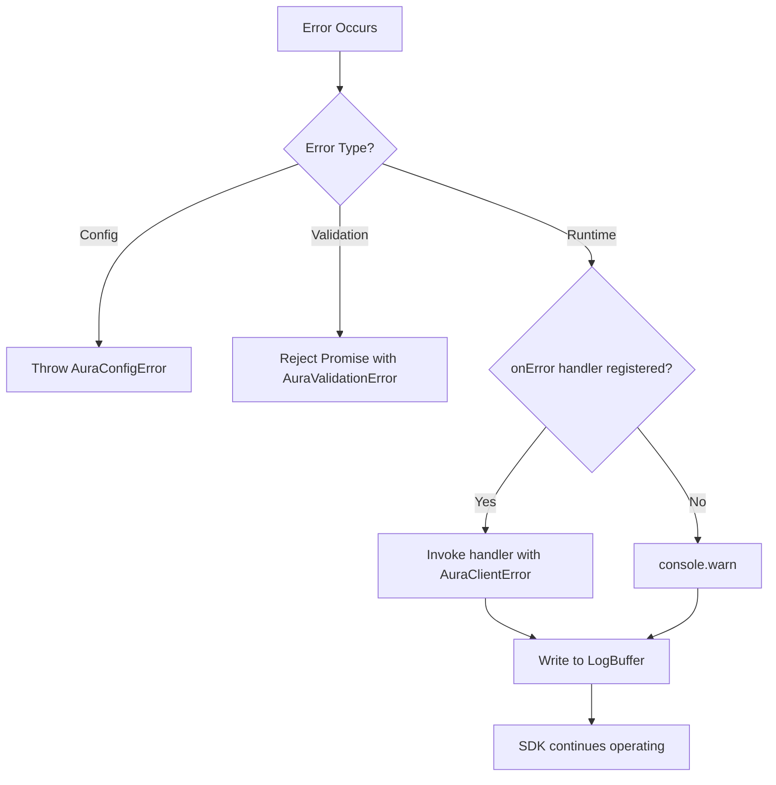

# Design Document: @aura/sdk

## Overview

`@aura/sdk` is a framework-neutral TypeScript client SDK for browser environments that implements the client side of the Adaptive UI Protocol (AUIP v0). It provides the sole transport layer between host applications and the AURA server, managing session lifecycle, SSE prescription streaming, event queuing, context tracking, feedback, consent, profile access, and explanations.

The SDK is designed as a single-instance-per-session object created via `createAuraClient(config)`. It operates as a state machine with three states (`idle`, `active`, `degraded`) and guarantees non-blocking behavior — no method call ever blocks the browser main thread or throws an unhandled exception.

### Key Design Decisions

1. **State machine architecture** — The SDK lifecycle is modeled as a finite state machine (`idle` → `active` | `degraded`). All public methods check state before acting, enabling graceful degradation without conditional logic in host code.

2. **In-memory only** — No localStorage, IndexedDB, or any persistent storage. The SDK is ephemeral per browser session. This simplifies privacy compliance and avoids stale state across sessions.

3. **Single dependency** — Only `@aura/protocol` is imported (for types and Zod schemas). No framework runtimes, no Node.js built-ins, no third-party HTTP clients.

4. **Validation at boundaries** — All inbound (SSE messages, HTTP responses) and outbound (request bodies) data is validated through `@aura/protocol` schemas. Malformed data never enters or leaves the SDK.

5. **Fire-and-forget with structured errors** — Network failures never reject public method promises (except validation errors). Errors are routed to `onError` handlers and an internal circular log buffer.

---

## Architecture

### System Context



### Internal Architecture



### Component Interaction



### Module Decomposition

| Module | Responsibility |
|--------|---------------|
| `client.ts` | `AuraClient` class, state machine, public API surface |
| `config.ts` | `AuraClientConfig` validation, `AuraConfigError` |
| `http-transport.ts` | Fetch-based HTTP client, request/response validation |
| `sse-manager.ts` | EventSource/fetch-stream management, reconnection backoff |
| `event-queue.ts` | Bounded FIFO queue with TTL eviction |
| `prescription-store.ts` | Per-surface prescription storage, expiry sweeps, listener dispatch |
| `errors.ts` | `AuraConfigError`, `AuraValidationError`, `AuraClientError` |
| `log-buffer.ts` | Circular buffer for structured log entries |
| `types.ts` | Re-exports from `@aura/protocol`, internal SDK types |

---

## Components and Interfaces

### Public API — `AuraClient`

```typescript
interface AuraClient {
  // Lifecycle
  readonly status: "idle" | "active" | "degraded";
  init(): Promise<void>;
  disconnect(): void;

  // Events
  emit(event: AuraEvent): Promise<void>;

  // Context
  updateContext(contextPatch: Partial<ContextModel>): Promise<void>;
  getContextSequenceId(): number;

  // Prescriptions
  subscribe(surfaceId: string, listener: PrescriptionListener): () => void;
  getPrescription(surfaceId: string): UIPrescription | undefined;

  // Feedback
  feedback(feedbackEvent: FeedbackEvent): Promise<void>;

  // Consent
  updateConsent(consentPatch: Partial<ConsentProfile>): Promise<void>;
  getConsent(): ConsentProfile;

  // Explanations
  explain(prescriptionId: string): Promise<ExplanationRecord | null>;

  // Profile
  getProfile(): Promise<ProfileSummary>;
  correctProfile(correction: ProfileCorrection): Promise<void>;

  // Observability
  onError(handler: (error: AuraClientError) => void): () => void;
  getLogs(): AuraLogEntry[];
}

type PrescriptionListener = (prescription: UIPrescription | undefined) => void;
```

### Factory Function

```typescript
function createAuraClient(config: AuraClientConfig): AuraClient;
```

- Validates config synchronously using `@aura/protocol` schemas
- Throws `AuraConfigError` on invalid config
- Returns `AuraClient` in `"idle"` status
- No network I/O at construction time

### Internal Components

#### EventQueue

```typescript
class EventQueue {
  constructor(options: { maxCapacity: number; queueTTL: number });

  enqueue(event: AuraEvent): void;
  flush(): AuraEvent[];      // Returns and removes all non-expired events in FIFO order
  size(): number;
  clear(): void;
}
```

- Bounded FIFO buffer (default capacity: 100)
- TTL-based eviction on flush (default: 60s)
- Oldest-first eviction when capacity exceeded
- In-memory only, no persistence

#### PrescriptionStore

```typescript
class PrescriptionStore {
  store(prescription: UIPrescription, currentSeqId: number, manifestVersion: string): boolean;
  get(surfaceId: string, currentSeqId: number): UIPrescription | undefined;
  remove(surfaceId: string): void;
  removeByPrescriptionId(prescriptionId: string): string | undefined; // returns surfaceId
  removeByDataClass(dataClass: string): string[]; // returns affected surfaceIds
  evictExpiredAndStale(currentSeqId: number): string[]; // returns evicted surfaceIds
  clear(): void;

  subscribe(surfaceId: string, listener: PrescriptionListener): () => void;
  notifyListeners(surfaceId: string, prescription: UIPrescription | undefined): void;
  clearListeners(): void;
}
```

- One prescription per surfaceId (latest-wins)
- Validates admission: schema, expiry, contextLock, manifestVersion
- Periodic eviction sweep (≤5s interval)
- Listener registry per surface with unsubscribe capability

#### SSEManager

```typescript
class SSEManager {
  constructor(options: {
    endpoint: string;
    sessionId: string;
    onMessage: (prescription: UIPrescription) => void;
    onError: (error: AuraClientError) => void;
  });

  connect(): void;
  disconnect(): void;
  isConnected(): boolean;
}
```

- Manages EventSource or fetch-based SSE stream
- Exponential backoff reconnection: 1s initial, doubles to 30s max
- Parses and validates messages through `UIPrescriptionSchema`
- Discards invalid messages, logs warnings
- Stops reconnection only on explicit `disconnect()`

#### HttpTransport

```typescript
class HttpTransport {
  constructor(endpoint: string);

  post<TReq, TRes>(
    path: string,
    body: TReq,
    requestSchema: ZodSchema<TReq>,
    responseSchema?: ZodSchema<TRes>,
    sessionId?: string
  ): Promise<TRes | null>;

  get<TRes>(
    path: string,
    responseSchema: ZodSchema<TRes>,
    sessionId?: string
  ): Promise<TRes | null>;
}
```

- Wraps browser `fetch` API
- Validates outbound requests against schema before sending
- Validates inbound responses against schema after receiving
- Returns `null` for 404 responses
- Throws `AuraValidationError` for schema failures on outbound
- Returns `null` and logs warning for schema failures on inbound

#### LogBuffer

```typescript
class LogBuffer {
  constructor(maxEntries: number); // default: 200

  log(entry: Omit<AuraLogEntry, 'timestamp'>): void;
  getAll(): AuraLogEntry[];
}

interface AuraLogEntry {
  level: "error" | "warn";
  timestamp: string; // ISO 8601
  code: string;
  message: string;
  context?: Record<string, unknown>;
}
```

- Circular buffer, oldest entries discarded when full
- Chronological order (oldest-first) on retrieval

---

## Data Models

### Configuration

```typescript
interface AuraClientConfig {
  endpoint: string;                    // Non-empty HTTPS URL (or HTTP for localhost)
  manifest: CapabilityManifest;        // From @aura/protocol
  userId: string;                      // Non-empty string
  consentProfile: ConsentProfile;      // From @aura/protocol
  context: ContextModel;               // From @aura/protocol
  options?: AuraClientOptions;
}

interface AuraClientOptions {
  queueCapacity?: number;       // Default: 100
  queueTTL?: number;            // Default: 60000 (ms)
  expiryCheckInterval?: number; // Default: 5000 (ms)
  requestTimeout?: number;      // Default: 10000 (ms)
}
```

### Session State

```typescript
interface SessionState {
  sessionId: string;
  manifestVersion: string;         // Pinned at init()
  contextSequenceId: number;       // Monotonically increasing
  consentProfile: ConsentProfile;  // Updated in-memory on consent changes
  status: "idle" | "active" | "degraded";
}
```

### Error Types

```typescript
class AuraConfigError extends Error {
  constructor(message: string, public readonly field: string);
}

class AuraValidationError extends Error {
  constructor(message: string, public readonly issues: ZodIssue[]);
}

class AuraClientError extends Error {
  constructor(
    message: string,
    public readonly code: string,
    public readonly context: Record<string, unknown>
  );
}
```

### Error Codes

| Code | Meaning |
|------|---------|
| `SESSION_INIT_FAILED` | POST /aura/session returned 4xx |
| `SESSION_UNREACHABLE` | Server unreachable during init |
| `SSE_CONNECTION_LOST` | SSE stream closed unexpectedly |
| `SSE_RECONNECT_FAILED` | Reconnection attempt failed |
| `STALE_CONTEXT_LOCK` | Prescription discarded (context mismatch) |
| `MANIFEST_VERSION_MISMATCH` | Prescription discarded (manifest mismatch) |
| `PRESCRIPTION_EXPIRED` | Prescription discarded (past expiresAt) |
| `PRESCRIPTION_INVALID` | Prescription failed schema validation |
| `REQUEST_FAILED` | HTTP request failed (transient) |
| `RESPONSE_INVALID` | Server response failed schema validation |
| `EVENT_QUEUE_OVERFLOW` | Oldest event dropped due to capacity |
| `EVENT_TTL_EXPIRED` | Queued event dropped due to age |

### Protocol Types (from `@aura/protocol`)

The SDK imports and uses these types without redefining them:

- `CapabilityManifest` / `CapabilityManifestSchema`
- `ConsentProfile` / `ConsentProfileSchema`
- `ContextModel` / `ContextModelSchema`
- `AuraEvent` / `AuraEventSchema`
- `UIPrescription` / `UIPrescriptionSchema`
- `FeedbackEvent` / `FeedbackEventSchema`
- `ExplanationRecord` / `ExplanationRecordSchema`
- `ProfileSummary` / `ProfileAttribute`
- `ProfileCorrection` / `ProfileCorrectionRequestSchema`
- `SessionRequest` / `SessionRequestSchema`
- `SessionResponse` / `SessionResponseSchema`
- `EventsRequest` / `EventsRequestSchema`
- `ContextRequest` / `ContextRequestSchema`
- `ConsentRequest` / `ConsentRequestSchema`
- `FeedbackRequest` / `FeedbackRequestSchema`


---

## Correctness Properties

*A property is a characteristic or behavior that should hold true across all valid executions of a system — essentially, a formal statement about what the system should do. Properties serve as the bridge between human-readable specifications and machine-verifiable correctness guarantees.*


### Property 1: Valid config produces idle client

*For any* valid `AuraClientConfig` value `c` (where all fields pass their respective `@aura/protocol` schemas), calling `createAuraClient(c)` SHALL return an `AuraClient` instance whose `status` property equals `"idle"` and no network I/O is performed.

**Validates: Requirements 1.10, 12.2**


### Property 2: Invalid config throws AuraConfigError

*For any* configuration object that fails validation (empty/missing `endpoint`, empty/missing `userId`, invalid `manifest` per `CapabilityManifestSchema`, invalid `consentProfile` per `ConsentProfileSchema`, or invalid `context` per `ContextModelSchema`), calling `createAuraClient` SHALL throw an `AuraConfigError` synchronously.

**Validates: Requirements 1.3, 1.4, 1.5, 1.6, 1.7**


### Property 3: Schema validation rejects invalid payloads

*For any* method that accepts user-provided data (`emit`, `updateContext`, `feedback`, `updateConsent`, `correctProfile`) and *for any* input that fails its corresponding `@aura/protocol` schema validation, the method SHALL reject with an `AuraValidationError` without performing any network call or state mutation.

**Validates: Requirements 3.3, 4.4, 6.2, 7.2, 9.4, 15.1**


### Property 4: Idempotent init

*For any* `AuraClient` whose status is `"active"` or `"degraded"`, calling `init()` SHALL resolve immediately without making any network request and without changing the client's status.

**Validates: Requirements 2.7, 2.8**


### Property 5: init never rejects

*For any* server response condition (4xx, 5xx, timeout, unreachable, malformed response), `init()` SHALL resolve its returned promise without throwing or rejecting. The client transitions to either `"active"` (on success) or `"degraded"` (on failure).

**Validates: Requirements 2.5, 2.6, 2.9**


### Property 6: EventQueue FIFO ordering

*For any* sequence of `n` valid `AuraEvent` values enqueued (where no event exceeds `queueTTL` and `n ≤ maxCapacity`), flushing the queue SHALL produce exactly those `n` events in the original enqueue order.

**Validates: Requirements 3.6, 13.1, 13.2, 13.6**


### Property 7: EventQueue capacity eviction preserves FIFO among retained

*For any* queue at maximum capacity `k` and *for any* new event `e` enqueued, the queue SHALL contain events `[2..k, e]` in FIFO order — the oldest event is dropped, and the relative order of all remaining events is preserved.

**Validates: Requirements 3.7, 13.3**


### Property 8: EventQueue TTL eviction

*For any* event in the queue whose age exceeds `queueTTL`, the event SHALL be removed from the queue and SHALL NOT appear in any subsequent flush result.

**Validates: Requirements 3.5, 13.4**


### Property 9: Context sequence monotonically increases

*For any* sequence of `updateContext(patch)` calls, the `contextSequenceId` SHALL increase by exactly 1 with each call, regardless of whether the SDK is active, idle, or degraded.

**Validates: Requirements 4.1, 4.3**


### Property 10: Prescription admission invariant

*For all* `UIPrescription` values admitted to the `PrescriptionStore`, the prescription SHALL satisfy ALL of: (a) passes `UIPrescriptionSchema` validation, (b) `constraints.expiresAt` is a valid ISO timestamp in the future at admission time, (c) `contextLock.sequenceId` equals the SDK's current `contextSequenceId`, and (d) `manifestVersion` equals the pinned session `ManifestVersion`.

**Validates: Requirements 5.2, 5.3, 5.4, 5.5, 5.12, 5.14, 14.1, 15.6**


### Property 11: Per-surface uniqueness and latest-wins

*For any* `surfaceId`, the `PrescriptionStore` SHALL hold at most one prescription. When a new valid prescription arrives for a surface that already has a stored prescription, the new one SHALL replace the old one (latest-wins).

**Validates: Requirements 5.13, 14.1, 14.3, 16.4**


### Property 12: Expiry safety

*For all* `surfaceId` values and *for all* times `t` at or after a stored prescription's `constraints.expiresAt`, calling `getPrescription(surfaceId)` SHALL return `undefined`.

**Validates: Requirements 5.6, 14.4, 14.6**


### Property 13: Unsubscribe stops delivery

*For any* listener registered via `subscribe(surfaceId, listener)`, after calling the returned unsubscribe function, the listener SHALL NOT receive any further prescription notifications regardless of subsequent prescription arrivals for that surface.

**Validates: Requirements 5.10, 5.11, 10.6**


### Property 14: Undo/reject removes prescription

*For any* feedback event with `action` equal to `"undo"` or `"reject"`, the prescription identified by `feedbackEvent.prescriptionId` SHALL be removed from the `PrescriptionStore` and affected listeners SHALL be notified with `undefined`.

**Validates: Requirements 6.6**


### Property 15: Consent revocation removes affected prescriptions

*For any* `DataClass` key set to `false` via `updateConsent(patch)`, all prescriptions in the `PrescriptionStore` whose `explanation.dataClasses` list contains that DataClass SHALL be removed, and affected listeners SHALL be notified with `undefined`.

**Validates: Requirements 7.4**


### Property 16: Consent state updated immediately

*For any* consent patch applied via `updateConsent(patch)`, calling `getConsent()` immediately after SHALL return a consent profile reflecting the patch, regardless of whether the network request succeeded or failed.

**Validates: Requirements 7.5, 7.6**


### Property 17: Degraded mode guarantees

*For any* `AuraClient` in `"degraded"` status, ALL of the following SHALL hold: (a) `emit()`, `updateContext()`, `feedback()`, `updateConsent()`, `correctProfile()`, and `disconnect()` resolve `Promise<void>` without throwing, (b) `explain()` resolves with `null`, (c) `getProfile()` resolves with `{ attributes: [] }`, (d) no network requests are initiated, (e) no SSE connection is open or attempted.

**Validates: Requirements 11.1, 11.2, 11.3, 3.2, 6.3, 7.3, 8.5, 9.2, 9.5**


### Property 18: No synchronous exceptions from public methods

*For all* SDK states (`"idle"`, `"active"`, `"degraded"`) and *for all* public methods on `AuraClient`, calling any method SHALL NOT cause a synchronous exception. All errors are communicated via rejected promises (for validation errors only) or through `onError` handlers.

**Validates: Requirements 11.5, 11.8, 10.5**


### Property 19: Error handler invocation

*For any* registered `onError` handler and *for any* internal runtime error (SSE drop, request failure, invalid server response), the SDK SHALL invoke the handler with an `AuraClientError` containing a non-empty `code`, `message`, and `context` object before logging.

**Validates: Requirements 11.6, 17.2**


### Property 20: Log buffer circularity and ordering

*For any* number of log entries `n` written to the log buffer, `getLogs()` SHALL return at most 200 entries in chronological order (oldest-first). When `n > 200`, the oldest entries are discarded and the returned array contains the 200 most recent entries.

**Validates: Requirements 17.3, 17.4, 17.5**


### Property 21: SSE reconnection exponential backoff

*For any* sequence of `n` consecutive SSE reconnection failures, the delay before attempt `i` SHALL be `min(2^(i-1) * 1000, 30000)` milliseconds (1s, 2s, 4s, 8s, 16s, 30s, 30s, ...).

**Validates: Requirements 5.7, 16.1, 16.2**


### Property 22: Single-event emission invariant

*For any* valid `AuraEvent` value `e` posted via a single `emit(e)` call when the SDK is `"active"`, the `events` array in the outgoing `EventsRequest` SHALL contain exactly one entry deeply equal to `e`.

**Validates: Requirements 3.10, 15.5**


### Property 23: Serialization round-trip

*For any* valid AUIP protocol object (AuraEvent, UIPrescription, FeedbackEvent, ConsentProfile, ExplanationRecord), serializing via `JSON.stringify` and parsing back through the corresponding `@aura/protocol` schema SHALL produce a value with all fields deeply equal to the original.

**Validates: Requirements 18.1, 18.2, 18.3, 18.4, 18.5**


### Property 24: ManifestVersion pinning invariant

*For any* `AuraClient` instance, after `init()` is called, the pinned `ManifestVersion` SHALL equal `config.manifest.version` (if present) or `"unversioned"` (if absent), and SHALL NOT change for the lifetime of the instance regardless of subsequent method calls.

**Validates: Requirements 2.11**


### Property 25: Disconnect prevents subsequent network calls

*For any* `AuraClient` after `disconnect()` is called, all subsequent calls to `emit()`, `updateContext()`, `feedback()`, `updateConsent()`, `correctProfile()`, `explain()`, and `getProfile()` SHALL NOT initiate any network requests.

**Validates: Requirements 10.3, 10.1**


---

## Error Handling

### Error Classification

| Category | Type | Communication | Recovery |
|----------|------|---------------|----------|
| Config errors | `AuraConfigError` | Thrown synchronously from `createAuraClient` | Caller fixes config |
| Validation errors | `AuraValidationError` | Promise rejection | Caller fixes input |
| Runtime errors | `AuraClientError` | `onError` handler + log buffer | SDK continues in degraded mode |

### Error Flow




### Error Handling Rules

1. **Never throw from public async methods** — All network failures, server errors, and unexpected conditions are caught internally. The promise resolves (or rejects only for validation errors).

2. **Never throw from `disconnect()`** — This is synchronous and void. All cleanup is best-effort.

3. **Config errors are synchronous throws** — This is the only case where a synchronous exception occurs, and it happens exclusively in `createAuraClient`, not on `AuraClient` instance methods.

4. **Structured error context** — Every `AuraClientError` includes machine-readable `code` and `context` fields so devtools and error handlers can classify problems without string parsing.

5. **Single notification** — Each error is delivered to either the `onError` handler OR `console.warn`, never both. The error is always written to the log buffer.

6. **No console.error** — The SDK uses `console.warn` as the fallback output. `console.error` is never used to avoid triggering error monitoring that treats console.error as critical.

### Transient Failure Strategy

| Operation | On Transient Failure |
|-----------|---------------------|
| `init()` → session POST | Transition to `"degraded"`, resolve promise |
| `emit()` → events POST | Re-enqueue event, resolve promise |
| `updateContext()` → context POST | Log warning, resolve (context is superseded by next update) |
| `feedback()` → feedback POST | Log warning, resolve (feedback loss acceptable in v0) |
| `updateConsent()` → consent POST | Update local consent anyway, log warning, resolve |
| `explain()` → GET | Resolve with `null` |
| `getProfile()` → GET | Resolve with `{ attributes: [] }` |
| `correctProfile()` → POST | Log warning, resolve |
| SSE connection drop | Reconnect with exponential backoff |

---

## Testing Strategy


### Dual Testing Approach

The SDK uses both unit tests and property-based tests for comprehensive coverage:

- **Unit tests** (Vitest): Specific examples, integration points with mocked fetch/EventSource, edge cases, error scenarios
- **Property-based tests** (fast-check via Vitest): Universal properties across generated inputs for the pure logic components

### Property-Based Testing Configuration

- **Library**: [fast-check](https://github.com/dubzzz/fast-check) integrated with Vitest
- **Minimum iterations**: 100 per property test
- **Tag format**: `Feature: aura-sdk, Property {N}: {property_text}`
- Each correctness property (1–25) maps to exactly one property-based test
- Custom arbitraries (generators) for `@aura/protocol` types (`AuraEvent`, `UIPrescription`, `ConsentProfile`, etc.)

### Test Organization

```
src/
├── __tests__/
│   ├── properties/           # Property-based tests
│   │   ├── event-queue.property.test.ts
│   │   ├── prescription-store.property.test.ts
│   │   ├── client-lifecycle.property.test.ts
│   │   ├── validation.property.test.ts
│   │   ├── serialization.property.test.ts
│   │   └── degraded-mode.property.test.ts
│   ├── unit/                 # Example-based unit tests
│   │   ├── client.test.ts
│   │   ├── config.test.ts
│   │   ├── http-transport.test.ts
│   │   ├── sse-manager.test.ts
│   │   ├── event-queue.test.ts
│   │   └── prescription-store.test.ts
│   └── arbitraries/          # fast-check generators
│       ├── aura-event.arbitrary.ts
│       ├── prescription.arbitrary.ts
│       ├── config.arbitrary.ts
│       └── consent.arbitrary.ts
```


### Property Test Coverage Matrix

| Property | Component Under Test | Pattern |
|----------|---------------------|---------|
| 1: Valid config → idle | `createAuraClient` | Invariant |
| 2: Invalid config → error | `createAuraClient` | Error condition |
| 3: Schema validation rejects | All methods | Error condition |
| 4: Idempotent init | `AuraClient.init()` | Idempotence |
| 5: Init never rejects | `AuraClient.init()` | Error condition |
| 6: Queue FIFO | `EventQueue` | Invariant |
| 7: Queue capacity eviction | `EventQueue` | Metamorphic |
| 8: Queue TTL eviction | `EventQueue` | Invariant |
| 9: Context sequence monotonic | `AuraClient.updateContext()` | Invariant |
| 10: Prescription admission | `PrescriptionStore` | Invariant |
| 11: Per-surface uniqueness | `PrescriptionStore` | Invariant |
| 12: Expiry safety | `PrescriptionStore` | Invariant |
| 13: Unsubscribe stops delivery | `PrescriptionStore` | Invariant |
| 14: Undo/reject removes | `AuraClient.feedback()` | Metamorphic |
| 15: Consent revocation removes | `AuraClient.updateConsent()` | Metamorphic |
| 16: Consent state immediate | `AuraClient.updateConsent()` | Round-trip |
| 17: Degraded mode guarantees | `AuraClient` (all methods) | Invariant |
| 18: No sync exceptions | `AuraClient` (all methods) | Invariant |
| 19: Error handler invocation | `AuraClient.onError()` | Invariant |
| 20: Log buffer circularity | `LogBuffer` | Invariant |
| 21: Backoff sequence | `SSEManager` | Metamorphic |
| 22: Single-event emission | `AuraClient.emit()` | Invariant |
| 23: Serialization round-trip | Protocol types | Round-trip |
| 24: ManifestVersion pinning | `AuraClient` | Invariant |
| 25: Disconnect prevents requests | `AuraClient.disconnect()` | Invariant |

### Unit Test Focus Areas

- **Integration scenarios**: Mock `fetch` and `EventSource` to test HTTP interactions
- **State machine transitions**: Verify `idle → active → degraded` transitions
- **SSE reconnection**: Simulate connection drops and verify backoff behavior
- **Concurrent operations**: Verify emit during flush, disconnect during request
- **Edge cases**: Empty queue flush, subscription during disconnect, double-unsubscribe

### Mocking Strategy

- **`fetch`**: Mock via `vi.stubGlobal('fetch', ...)` to test HTTP transport
- **`EventSource`**: Mock class to simulate SSE connections, messages, and errors
- **`Date.now()`**: Mock via `vi.useFakeTimers()` for TTL and expiry tests
- **`setTimeout`/`setInterval`**: Mock via fake timers for backoff and periodic eviction tests
- **`console.warn`**: Spy to verify fallback error reporting
