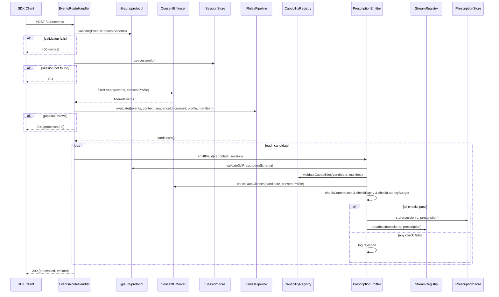
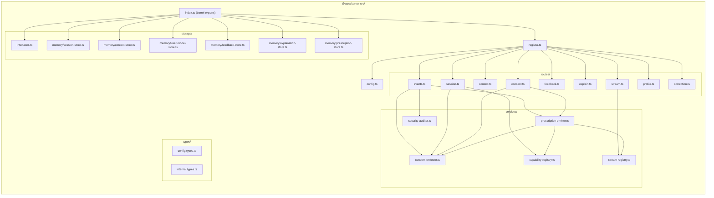

# Design Document: @aura/server

## Overview

`@aura/server` is the server-side backbone of the AURA TypeScript framework. It provides Hono/Node.js middleware and reference AUIP v0 route handlers that manage session state, enforce consent, validate prescriptions against capability manifests, integrate with the `@aura/rules` evaluation pipeline, and deliver validated prescriptions over SSE streams.

The package exposes a single `registerAuipRoutes` function that mounts all nine AUIP v0 endpoints onto a Hono application. All stateful concerns are managed through typed storage interfaces (`ISessionStore`, `IContextStore`, `IUserModelStore`, `IFeedbackStore`, `IExplanationStore`, `IPrescriptionStore`) with bundled in-memory adapters that can be swapped for production-grade persistence layers without modifying route handler logic.

### Design Goals

- **Single function integration**: One `registerAuipRoutes` call mounts all routes
- **Storage abstraction**: Typed interfaces enable persistence-agnostic route handlers
- **Consent-first**: Enforcement at every boundary — ingestion, pipeline input, emission, profile access
- **Progressive enhancement**: Failure yields no prescription, never degraded UI
- **Capability-bounded**: No prescription escapes manifest validation
- **Adversarial resilience**: All inputs treated as untrusted; replay, injection, and poisoning mitigated
- **Observable**: Structured logging and security audit records at every rejection point

### Key Design Decisions

| Decision | Rationale |
|----------|-----------|
| Hono as routing framework | Lightweight, TypeScript-native, works on Node.js/Cloudflare/Deno, aligns with progressive enhancement philosophy |
| Storage interfaces with async methods | Enables in-memory, Redis, PostgreSQL, Durable Objects adapters without route handler changes |
| In-process StreamRegistry (not store-backed) | SSE connections are ephemeral and node-local; distributed pub/sub is a deployment concern, not a library concern |
| Consent checked at 4 boundaries | Event ingestion, pipeline input, prescription emission, profile access — defense in depth |
| Atomic prescription rejection (default) | One invalid adaptation rejects the whole prescription unless `adaptationGroups` declares independence |
| Pipeline timeout with configurable budgets | Prevents slow model calls from blocking host rendering; aligns with `latencyClass` contracts |
| `@aura/protocol` as sole schema authority | Server never re-defines schemas; all validation delegates to protocol's Zod schemas |
| Security audit records as structured logs | Observable without coupling to specific monitoring infrastructure |

---

## Architecture

### High-Level Architecture

```mermaid
graph TD
    subgraph "Host Application"
        HONO["Hono App"]
    end

    subgraph "@aura/server"
        REG["registerAuipRoutes()"]
        
        subgraph "Route Handlers"
            R_SESSION["POST /aura/session"]
            R_EVENTS["POST /aura/events"]
            R_CONTEXT["POST /aura/context"]
            R_STREAM["GET /aura/prescriptions/stream"]
            R_FEEDBACK["POST /aura/feedback"]
            R_EXPLAIN["GET /aura/explain/:id"]
            R_CONSENT["POST /aura/consent"]
            R_PROFILE["GET /aura/profile"]
            R_CORRECTION["POST /aura/profile/correction"]
        end

        subgraph "Core Services"
            CAP_REG["CapabilityRegistry"]
            CONSENT_ENF["ConsentEnforcer"]
            STREAM_REG["StreamRegistry"]
            PRESC_EMIT["PrescriptionEmitter"]
            SEC_AUDIT["SecurityAuditor"]
        end

        subgraph "Storage Layer"
            I_SESSION["ISessionStore"]
            I_CONTEXT["IContextStore"]
            I_USER["IUserModelStore"]
            I_FEEDBACK["IFeedbackStore"]
            I_EXPLAIN["IExplanationStore"]
            I_PRESC["IPrescriptionStore"]
        end
    end

    subgraph "External"
        PROTO["@aura/protocol"]
        RULES["@aura/rules (IRulesPipeline)"]
    end

    HONO --> REG
    REG --> R_SESSION & R_EVENTS & R_CONTEXT & R_STREAM & R_FEEDBACK & R_EXPLAIN & R_CONSENT & R_PROFILE & R_CORRECTION

    R_SESSION --> CAP_REG & CONSENT_ENF & I_SESSION & I_CONTEXT
    R_EVENTS --> CONSENT_ENF & PRESC_EMIT & I_SESSION & SEC_AUDIT
    R_CONTEXT --> I_CONTEXT & I_SESSION
    R_STREAM --> STREAM_REG
    R_FEEDBACK --> I_FEEDBACK & I_SESSION
    R_EXPLAIN --> I_EXPLAIN & I_SESSION
    R_CONSENT --> CONSENT_ENF & I_SESSION & PRESC_EMIT
    R_PROFILE --> I_USER & I_SESSION & CONSENT_ENF
    R_CORRECTION --> I_USER & I_SESSION & SEC_AUDIT

    PRESC_EMIT --> CAP_REG & CONSENT_ENF & STREAM_REG & I_PRESC & I_EXPLAIN
    R_EVENTS --> RULES

    R_SESSION & R_EVENTS & R_CONTEXT & R_FEEDBACK & R_CONSENT & R_CORRECTION --> PROTO
```



### Request Flow — Event Processing (Critical Path)



### Low-Level Design — Internal Module Structure



---

## Components and Interfaces

### Public API Surface

#### `registerAuipRoutes(app, config)`

The primary integration point. Accepts a Hono application and a configuration object, mounts all 9 routes.

```typescript
import { Hono } from "hono"

export interface AuraServerConfig {
  // Required
  pipeline: IRulesPipeline

  // Optional storage adapters (defaults to in-memory)
  sessionStore?: ISessionStore
  contextStore?: IContextStore
  userModelStore?: IUserModelStore
  feedbackStore?: IFeedbackStore
  explanationStore?: IExplanationStore
  prescriptionStore?: IPrescriptionStore

  // Optional configuration
  pipelineTimeoutMs?: number              // default: 2000
  latencyBudgets?: LatencyBudgetConfig    // defaults per spec
  replayWindowMs?: number                 // default: 5000
  securityPolicy?: SecurityPolicyConfig
}

export interface LatencyBudgetConfig {
  immediateMs: number   // default: 50
  fastMs: number        // default: 200
  deliberateMs: number  // default: 2000
}

export interface SecurityPolicyConfig {
  promptInjectionPatterns?: RegExp[]
  protectedAttributes?: string[]
  enableDevtools?: boolean
}

export function registerAuipRoutes(app: Hono, config: AuraServerConfig): void
```

#### Storage Interface Exports

```typescript
// All exported from index.ts
export { ISessionStore } from "./storage/interfaces"
export { IContextStore } from "./storage/interfaces"
export { IUserModelStore } from "./storage/interfaces"
export { IFeedbackStore } from "./storage/interfaces"
export { IExplanationStore } from "./storage/interfaces"
export { IPrescriptionStore } from "./storage/interfaces"

// Factory functions for in-memory adapters
export { createInMemorySessionStore } from "./storage/memory/session-store"
export { createInMemoryContextStore } from "./storage/memory/context-store"
export { createInMemoryUserModelStore } from "./storage/memory/user-model-store"
export { createInMemoryFeedbackStore } from "./storage/memory/feedback-store"
export { createInMemoryExplanationStore } from "./storage/memory/explanation-store"
export { createInMemoryPrescriptionStore } from "./storage/memory/prescription-store"
```

### Storage Interfaces (Low-Level Design)

```typescript
// storage/interfaces.ts

import type {
  SessionRecord, ContextModel, ProfileAttribute,
  FeedbackEvent, ExplanationRecord, UIPrescription
} from "./types/internal.types"

export interface ISessionStore {
  create(record: SessionRecord): Promise<void>
  get(sessionId: string): Promise<SessionRecord | null>
  update(sessionId: string, patch: Partial<SessionRecord>): Promise<void>
  delete(sessionId: string): Promise<void>
}

export interface IContextStore {
  set(sessionId: string, context: ContextModel): Promise<void>
  get(sessionId: string): Promise<ContextModel | null>
}

export interface IUserModelStore {
  upsertAttribute(userId: string, attribute: ProfileAttribute): Promise<void>
  getAttributes(userId: string): Promise<ProfileAttribute[]>
  deleteAttribute(userId: string, attributeId: string): Promise<void>
  getAttribute(userId: string, attributeId: string): Promise<ProfileAttribute | null>
}

export interface IFeedbackStore {
  record(sessionId: string, event: FeedbackEvent): Promise<void>
  getByPrescriptionId(sessionId: string, prescriptionId: string): Promise<FeedbackEvent[]>
}

export interface IExplanationStore {
  store(prescriptionId: string, explanation: ExplanationRecord): Promise<void>
  get(prescriptionId: string): Promise<ExplanationRecord | null>
}

export interface IPrescriptionStore {
  store(sessionId: string, prescription: UIPrescription): Promise<void>
  get(sessionId: string, prescriptionId: string): Promise<UIPrescription | null>
  listActive(sessionId: string, asOf: string): Promise<UIPrescription[]>
}
```

### Core Services (Low-Level Design)

#### CapabilityRegistry

Per-session manifest validator. Created at session initialization, immutable thereafter.

```typescript
// services/capability-registry.ts

export interface ICapabilityRegistry {
  /** Register a manifest for a session (called once at session init) */
  register(sessionId: string, manifest: CapabilityManifest): void

  /** Validate a prescription candidate against the stored manifest */
  validate(sessionId: string, prescription: UIPrescription): CapabilityValidationResult

  /** Get the manifest version for a session */
  getManifestVersion(sessionId: string): string | null

  /** Remove a session's manifest (cleanup) */
  remove(sessionId: string): void
}

export interface CapabilityValidationResult {
  valid: boolean
  errors: CapabilityError[]
}

export interface CapabilityError {
  type: "undeclared-surface" | "undeclared-component" | "undeclared-variant" 
      | "invalid-props" | "manifest-version-mismatch"
  prescriptionId: string
  detail: string
}
```

Validation checks performed:
1. Every `adaptation.surfaceId` matches a declared `ManifestSurface.surfaceId`
2. Every `componentVariant` adaptation's `componentId` exists in the target surface
3. Every `componentVariant` adaptation's `variant` exists in the component's `variants` array
4. Every `propsPatch` (if present) validates against `adaptableProps` schema
5. `prescription.manifestVersion` equals the stored manifest version

#### ConsentEnforcer

Centralized consent checking applied at every data boundary.

```typescript
// services/consent-enforcer.ts

export interface IConsentEnforcer {
  /** Filter event payloads, stripping fields whose dataClass is revoked */
  filterEvents(events: AuraEvent[], consentProfile: ConsentProfile): AuraEvent[]

  /** Check if a prescription's dataClassesUsed are all permitted */
  isPrescriptionPermitted(prescription: UIPrescription, consentProfile: ConsentProfile): boolean

  /** Filter profile attributes to only consent-permitted, non-expired ones */
  filterProfileAttributes(
    attributes: ProfileAttribute[],
    consentProfile: ConsentProfile,
    asOf: string
  ): ProfileAttribute[]

  /** Build pipeline input filtering: remove revoked-class attributes */
  filterPipelineAttributes(
    attributes: ProfileAttribute[],
    consentProfile: ConsentProfile
  ): ProfileAttribute[]
}
```

#### StreamRegistry

In-process registry mapping session IDs to active SSE connections.

```typescript
// services/stream-registry.ts

export interface SSEConnection {
  id: string
  sessionId: string
  write(event: string, data: string, id?: string): void
  close(): void
}

export interface IStreamRegistry {
  /** Register an SSE connection for a session */
  register(sessionId: string, connection: SSEConnection): void

  /** Remove a specific connection */
  remove(connectionId: string): void

  /** Remove all connections for a session */
  removeAll(sessionId: string): void

  /** Broadcast a prescription to all connections for a session */
  broadcast(sessionId: string, prescription: UIPrescription): void

  /** Get count of active connections for a session */
  connectionCount(sessionId: string): number
}
```

#### PrescriptionEmitter

Orchestrates the multi-step validation gate before writing to SSE streams.

```typescript
// services/prescription-emitter.ts

export interface IPrescriptionEmitter {
  /**
   * Validate and emit a candidate prescription.
   * Runs: schema validation → capability validation → consent check →
   *       context-lock check → expiry check → latency budget check.
   * On success: stores prescription, stores explanation (if present), broadcasts to SSE.
   * On failure: logs structured rejection, does not emit.
   */
  emit(candidate: UIPrescription, session: SessionRecord, config: EmissionContext): Promise<EmitResult>
}

export interface EmissionContext {
  consentProfile: ConsentProfile
  currentContextSequenceId: number
  currentServerTime: string
  latencyBudgets: LatencyBudgetConfig
  evaluationStartTime: number  // performance.now() at pipeline invocation
}

export type EmitResult =
  | { emitted: true; prescriptionId: string }
  | { emitted: false; reason: RejectionReason; detail: string }

export type RejectionReason =
  | "schema-invalid"
  | "capability-invalid"
  | "consent-revoked"
  | "context-stale"
  | "expired"
  | "latency-exceeded"
  | "layout-stability-exceeded"
  | "manifest-version-mismatch"
```

#### SecurityAuditor

Records structured security audit events for adversarial-hardening observability.

```typescript
// services/security-auditor.ts

export interface ISecurityAuditor {
  /** Check events for prompt injection indicators */
  scanForInjection(events: AuraEvent[], sessionId: string): SecurityScanResult

  /** Detect replay attacks (duplicate event batches) */
  detectReplay(sessionId: string, eventIds: string[], timestamps: string[]): boolean

  /** Validate profile correction eligibility */
  isCorrectionEligible(attributeId: string, policy: SecurityPolicyConfig): boolean

  /** Record a security audit event */
  record(entry: SecurityAuditRecord): void
}

export interface SecurityScanResult {
  clean: boolean
  flaggedIndices: number[]
  indicators: string[]
}

export interface SecurityAuditRecord {
  timestamp: string
  sessionId: string
  type: "prompt-injection" | "replay-detected" | "correction-denied" 
      | "policy-violation" | "rate-limit" | "model-output-rejected"
  detail: string
  severity: "info" | "warn" | "critical"
}
```

### Route Handler Signatures (Low-Level Design)

Each route handler follows the same pattern:
1. Parse & validate request body/params via `@aura/protocol`
2. Look up session (for session-scoped routes)
3. Execute business logic via injected services
4. Return typed JSON response

```typescript
// Example: routes/events.ts (simplified signature)

import { Context } from "hono"

export function createEventsHandler(deps: {
  sessionStore: ISessionStore
  contextStore: IContextStore
  userModelStore: IUserModelStore
  pipeline: IRulesPipeline
  consentEnforcer: IConsentEnforcer
  prescriptionEmitter: IPrescriptionEmitter
  securityAuditor: ISecurityAuditor
  config: AuraServerConfig
}): (c: Context) => Promise<Response>
```

### IRulesPipeline Interface

```typescript
// types/config.types.ts

export interface RulesPipelineInput {
  events: AuraEvent[]
  context: ContextModel
  contextSequenceId: number
  consentProfile: ConsentProfile
  profileAttributes: ProfileAttribute[]
  manifest: CapabilityManifest
}

export interface IRulesPipeline {
  evaluate(input: RulesPipelineInput): Promise<UIPrescription[]>
}
```

---

## Data Models

### SessionRecord

```typescript
export interface SessionRecord {
  sessionId: string
  userId: string
  manifest: CapabilityManifest
  manifestVersion: string          // extracted or "unversioned"
  consentProfile: ConsentProfile
  contextSequenceId: number        // monotonically non-decreasing
  status: "active" | "terminated"
  createdAt: string                // ISO 8601
  updatedAt: string                // ISO 8601
}
```

### In-Memory Storage Implementation Pattern

All in-memory adapters follow the same structural pattern:

```typescript
// storage/memory/session-store.ts

export function createInMemorySessionStore(): ISessionStore {
  const sessions = new Map<string, SessionRecord>()

  return {
    async create(record) {
      if (sessions.has(record.sessionId)) {
        throw new Error(`Session ${record.sessionId} already exists`)
      }
      sessions.set(record.sessionId, structuredClone(record))
    },

    async get(sessionId) {
      const record = sessions.get(sessionId)
      return record ? structuredClone(record) : null
    },

    async update(sessionId, patch) {
      const existing = sessions.get(sessionId)
      if (!existing) {
        throw new Error(`Session ${sessionId} not found`)
      }
      sessions.set(sessionId, { ...existing, ...patch })
    },

    async delete(sessionId) {
      sessions.delete(sessionId)
    },
  }
}
```

Key implementation details for in-memory adapters:
- All reads return `structuredClone` copies to prevent aliasing
- `create` throws on duplicate keys (enabling 409 detection)
- `update` throws on missing keys (enabling 404 detection)
- All methods are async (returns Promises) for interface compatibility with async backends
- `IPrescriptionStore.listActive` filters by `expiresAt > asOf`
- `IFeedbackStore.record` appends (never overwrites) for multi-feedback support

### SSE Event Wire Format

```
id: <prescription.id>
event: prescription
data: <JSON.stringify(prescription)>

```

For manifest-mismatch refresh requests:
```
event: session-refresh
data: {"reason": "manifest-mismatch", "serverManifestVersion": "...", "prescriptionManifestVersion": "..."}

```

### Error Response Shapes

```typescript
// HTTP 400 — validation failure
interface ValidationErrorResponse {
  errors: Array<{
    field: string    // JSON path to invalid field
    message: string  // human-readable description
  }>
}

// HTTP 404 — resource not found
interface NotFoundResponse {
  message: string  // e.g., "Session not found"
}

// HTTP 409 — conflict
interface ConflictResponse {
  message: string  // e.g., "Session already exists"
}

// HTTP 422 — semantic validation failure (manifest)
interface UnprocessableResponse {
  errors: Array<{
    field: string
    message: string
  }>
}

// HTTP 500 — internal error
interface InternalErrorResponse {
  message: string  // sanitized, no stack traces
}
```

### Package Configuration

```json
{
  "name": "@aura/server",
  "version": "0.1.0",
  "type": "module",
  "exports": {
    ".": {
      "import": "./dist/index.mjs",
      "require": "./dist/index.cjs",
      "types": "./dist/index.d.ts"
    }
  },
  "main": "./dist/index.cjs",
  "module": "./dist/index.mjs",
  "types": "./dist/index.d.ts",
  "files": ["dist"],
  "dependencies": {
    "@aura/protocol": "workspace:*",
    "hono": "^4.4.0"
  },
  "peerDependencies": {
    "@aura/rules": "workspace:*"
  },
  "devDependencies": {
    "tsup": "^8.0.0",
    "typescript": "^5.4.0",
    "vitest": "^2.0.0",
    "fast-check": "^3.19.0"
  }
}
```

---


## Correctness Properties

*A property is a characteristic or behavior that should hold true across all valid executions of a system — essentially, a formal statement about what the system should do. Properties serve as the bridge between human-readable specifications and machine-verifiable correctness guarantees.*

### Property 1: Session Initialization Round-Trip

*For any* valid `SessionRequestSchema`-conforming payload, after a successful `POST /aura/session`, calling `ISessionStore.get(sessionId)` SHALL return a `SessionRecord` whose `sessionId`, `userId`, and `manifest` fields are deeply equal to the corresponding fields in the request, and re-validating the stored manifest through `CapabilityManifestSchema` SHALL succeed.

**Validates: Requirements 2.6, 2.7, 17.1**

### Property 2: Context Merge Correctness

*For any* valid `contextPatch` object applied to an existing session context, reading the context from `IContextStore` after the update SHALL return a value where every field present in the patch equals the corresponding patch value, and every field absent from the patch retains its previous value.

**Validates: Requirements 4.4, 4.5, 17.2**

### Property 3: Context Patch Confluence

*For any* two non-overlapping `contextPatch` objects applied to the same session context, applying them in either order SHALL produce the same final `ContextModel`.

**Validates: Requirements 4.6**

### Property 4: Context Sequence Monotonicity

*For any* sequence of valid context updates applied to an active session, the stored `contextSequenceId` SHALL be monotonically non-decreasing. Updates with a `contextSequenceId` lower than the current stored value SHALL not decrement the stored sequence.

**Validates: Requirements 4.7, 4.8**

### Property 5: Consent Enforcement Invariant

*For any* active session and *for any* `UIPrescription` written to the `SSE_Stream`, the set of `DataClass` values in `audit.dataClassesUsed` SHALL be a subset of the set of `DataClass` keys currently set to `true` in the session's `ConsentProfile`. No prescription declaring a revoked data class SHALL ever reach the stream.

**Validates: Requirements 8.7, 13.3, 13.6, 17.3**

### Property 6: Invalid Prescription Exclusion

*For any* candidate `UIPrescription` returned by the `RulesPipeline` that does not satisfy `UIPrescriptionSchema` validation, it SHALL NOT appear on any `SSE_Stream` connection. Equivalently, every prescription written to the stream SHALL parse successfully through `UIPrescriptionSchema`.

**Validates: Requirements 3.8, 14.2, 17.4**

### Property 7: Undeclared Capability Exclusion

*For any* candidate prescription whose `adaptations` array includes any entry referencing a surface ID, component ID, or variant not declared in the session manifest, the prescription SHALL NOT be written to the `SSE_Stream`.

**Validates: Requirements 11.1, 11.2, 11.3, 11.6, 17.5**

### Property 8: Expired Prescription Exclusion

*For any* `UIPrescription` whose `constraints.expiresAt` is earlier than or equal to the current server time at the moment of attempted emission, it SHALL NOT be written to any `SSE_Stream`. Additionally, `IPrescriptionStore.listActive(sessionId, asOf)` SHALL NOT return any prescription whose `expiresAt` is at or before `asOf`.

**Validates: Requirements 5.7, 16.2, 16.3, 16.4, 17.6**

### Property 9: Stale Context Exclusion

*For any* `UIPrescription` whose `contextLock.sequenceId` does not equal the session's current `contextSequenceId` at the time of attempted emission, it SHALL NOT be written to any `SSE_Stream`.

**Validates: Requirements 3.9, 5.9, 15.7, 17.6**

### Property 10: Feedback Round-Trip Storage

*For any* valid `FeedbackEvent` successfully stored via `POST /aura/feedback`, calling `IFeedbackStore.getByPrescriptionId(sessionId, prescriptionId)` SHALL return a list containing an element with field values deeply equal to the submitted event. Multiple submissions for the same prescriptionId SHALL all be individually retrievable without overwriting.

**Validates: Requirements 6.5, 6.6, 17.7**

### Property 11: Profile Correction Round-Trip

*For any* profile correction with `action: "correct"` and `newValue` string `v`, after the correction is applied, calling `IUserModelStore.getAttribute(userId, attributeId)` SHALL return a `ProfileAttribute` with `value` equal to `v`, provenance equal to `"explicit"`, and `confidence` equal to `1.0`.

**Validates: Requirements 10.5, 10.7, 17.8**

### Property 12: Profile Removal Invariant

*For any* profile correction with `action: "remove"`, after the correction is applied, calling `IUserModelStore.getAttribute(userId, attributeId)` SHALL return `null`, and the removed attribute SHALL NOT appear in the results of `getAttributes(userId)`.

**Validates: Requirements 10.4, 10.8, 17.9**

### Property 13: Consent-Gated Profile Visibility

*For any* call to `GET /aura/profile`, the response SHALL contain only `ProfileAttribute` objects whose `dataClass` is currently set to `true` in the session consent profile AND whose `expiresAt` (if present) is strictly after the current server time. No revoked-class or expired attribute SHALL appear in the response.

**Validates: Requirements 9.1, 9.3, 9.4, 13.5, 17.10**

### Property 14: Consent Merge Correctness

*For any* valid `consentPatch` applied to an active session, reading the `ConsentProfile` from the `SessionRecord` after the update SHALL return a profile where every `DataClass` key present in the patch equals the patch value.

**Validates: Requirements 8.1, 8.6**

### Property 15: Event Count Invariant Under Consent Filtering

*For any* valid batch of `AuraEvent` objects submitted to `POST /aura/events` for an active session, the count of events received by the `RulesPipeline` SHALL be less than or equal to the count of events in the request body. Consent filtering may reduce the count, but the pipeline SHALL never receive more events than were submitted.

**Validates: Requirements 3.7**

### Property 16: Rules Pipeline Consent Consistency

*For any* `RulesPipelineInput` constructed by the server, the `consentProfile` field SHALL match the `ConsentProfile` currently stored for the session at the time of invocation. No stale consent state SHALL be passed to the pipeline.

**Validates: Requirements 15.3, 15.5, 17.11**

### Property 17: Storage Interface Round-Trip

*For any* correct implementation of `ISessionStore`, a `SessionRecord` written via `create` SHALL be retrievable via `get` with deeply equal field values. The same round-trip property applies to `IContextStore` (set/get), `IFeedbackStore` (record/getByPrescriptionId), `IExplanationStore` (store/get), and `IPrescriptionStore` (store/get).

**Validates: Requirements 12.7, 12.8, 17.12**

### Property 18: Manifest Version Pinning

*For any* prescription emitted for a session whose manifest version is `v`, the prescription's `manifestVersion` SHALL equal `v`. Prescriptions with any other `manifestVersion` SHALL NOT be written to the `SSE_Stream`.

**Validates: Requirements 11.7, 17.13**

### Property 19: Atomic Prescription Validation

*For any* candidate prescription without independent `adaptationGroups`, if any single adaptation fails validation (schema, manifest, consent, context-lock, expiry, or layout-stability), no adaptation from that prescription SHALL be written to the `SSE_Stream`. The prescription is rejected as an atomic unit.

**Validates: Requirements 11.10, 17.14**

### Property 20: Validation Error Response Shape Consistency

*For any* invalid request body submitted to any AUIP POST endpoint, the HTTP 400 response SHALL contain a JSON body with a top-level `errors` array where each element has at minimum a `field` string and a `message` string. Non-JSON request bodies SHALL also produce this shape.

**Validates: Requirements 18.1, 18.4, 18.7**

### Property 21: Manifest Immutability

*For any* active session, after initialization, performing any combination of context updates, consent updates, event submissions, feedback recordings, and profile corrections SHALL NOT mutate the stored `CapabilityManifest`. The manifest read from the `CapabilityRegistry` after any sequence of operations SHALL be deeply equal to the manifest submitted at session creation.

**Validates: Requirements 2.8**

---

## Error Handling

### Philosophy: Progressive Enhancement Through Failure

The AURA server implements a "no prescription is better than a wrong prescription" philosophy. Every failure mode resolves to one of:
1. **Client-visible validation error** (400/404/409/422) — malformed or invalid requests
2. **Silent prescription suppression** — internal pipeline/validation failures logged, HTTP 200 returned
3. **Internal error** (500) — unexpected failures with sanitized response

### Error Categories and Handling Strategy

| Error Source | HTTP Response | Prescription Impact | Logging |
|-------------|--------------|---------------------|---------|
| Request body validation failure | 400 | N/A | Structured error in response |
| Session not found | 404 | N/A | None |
| Duplicate session | 409 | N/A | None |
| Invalid manifest in request | 422 | N/A | Structured error in response |
| `RulesPipeline` exception | 200 | Zero prescriptions emitted | Error with sessionId + batch info |
| `UIPrescriptionSchema` failure | 200 | Candidate dropped | Structured rejection record |
| Capability validation failure | 200 | Candidate dropped | Rejection with undeclared reference |
| Consent-revoked prescription | 200 | Candidate dropped | Rejection with revoked classes |
| Context-stale prescription | 200 | Candidate dropped | Rejection with sequenceId mismatch |
| Expired prescription | 200 | Candidate dropped | Expiry event |
| Latency budget exceeded | 200 | Candidate dropped | Late-prescription record |
| Manifest version mismatch | 200 | Candidate dropped, refresh event sent | Mismatch details |
| Pipeline timeout | 200 | Zero prescriptions | Timeout with elapsed time |
| Storage adapter error | 500 | N/A | Full error details server-side |
| Unhandled exception | 500 | N/A | Full error details, sanitized response |

### Structured Logging Format

All internal rejections and errors are logged as structured JSON:

```typescript
interface RejectionLog {
  timestamp: string
  sessionId: string
  prescriptionId?: string
  type: "schema-validation" | "capability-rejected" | "consent-revoked"
       | "context-stale" | "expired" | "latency-exceeded"
       | "manifest-mismatch" | "pipeline-error" | "pipeline-timeout"
  detail: string
  metadata?: Record<string, unknown>
}
```

### SSE Stream Error Recovery

- **Client disconnect**: Connection removed from `StreamRegistry`, resources freed
- **Reconnect with `Last-Event-ID`**: Only non-expired, context-current prescriptions replayed
- **Stream write failure**: Connection removed, no retry from server side (client reconnects)

### Consent Revocation Cascade

When a `DataClass` is revoked via `POST /aura/consent`:
1. Consent profile updated in `SessionStore`
2. All `ProfileAttribute` objects with matching `dataClass` have `expiresAt` set to current time
3. Any queued/in-flight prescriptions using that `DataClass` are cancelled
4. Future events with that `DataClass` are stripped before pipeline invocation
5. Future profile queries exclude those attributes

This cascade is atomic from the consent update perspective — no partial states are visible.

---

## Testing Strategy

### Overview

`@aura/server` uses a dual testing approach:
- **Property-based tests (PBT)**: Verify universal correctness properties (21 properties) across generated inputs
- **Example-based unit tests**: Cover specific scenarios, edge cases, integration points, and error paths
- **Integration tests**: Verify full request-response cycles through the Hono app

### Property-Based Testing

**Library**: `fast-check` (v3.19+)

**Configuration**:
- Minimum **100 iterations** per property test
- Each property test references its design document property via tag comment
- Tag format: `// Feature: aura-server, Property {N}: {title}`

**Generator Strategy**:

Custom `fast-check` arbitraries will be created for:
- `SessionRequestSchema`-conforming payloads (valid manifests, consent profiles, contexts)
- `AuraEvent` batches with configurable `DataClass` annotations
- `ContextModel` objects and `contextPatch` diffs
- `ConsentProfile` objects (subsets of DataClass keys → boolean)
- `UIPrescription` candidates (mix of valid and deliberately invalid)
- `FeedbackEvent` objects with all 6 action types
- `ProfileAttribute` objects with various expiry/visibility/dataClass states
- `ProfileCorrection` objects (remove and correct variants)
- `CapabilityManifest` objects with various surface/component declarations

**Property Test Organization**:

```
tests/
  properties/
    session-roundtrip.prop.test.ts       (Property 1)
    context-merge.prop.test.ts           (Properties 2, 3, 4)
    consent-enforcement.prop.test.ts     (Properties 5, 14)
    prescription-emission.prop.test.ts   (Properties 6, 7, 8, 9, 18, 19)
    feedback-roundtrip.prop.test.ts      (Property 10)
    profile-correction.prop.test.ts      (Properties 11, 12)
    profile-visibility.prop.test.ts      (Property 13)
    pipeline-consent.prop.test.ts        (Properties 15, 16)
    storage-roundtrip.prop.test.ts       (Property 17)
    error-shape.prop.test.ts             (Property 20)
    manifest-immutability.prop.test.ts   (Property 21)
  generators/
    session.gen.ts
    events.gen.ts
    context.gen.ts
    consent.gen.ts
    prescriptions.gen.ts
    feedback.gen.ts
    profile.gen.ts
    manifest.gen.ts
```

### Example-Based Unit Tests

Unit tests cover scenarios not suitable for PBT:

- **Session**: Duplicate sessionId conflict (409), unversioned manifest default
- **Events**: Pipeline exception handling (200 returned), minimum vocabulary acceptance
- **Stream**: Connection lifecycle (open/close/reconnect), multi-connection broadcast
- **Feedback**: All 6 action types accepted, 404 for missing session
- **Explain**: 403 for session mismatch, 404 for missing explanation
- **Consent**: Re-granting previously revoked class resumes collection
- **Profile**: Empty profile returns empty array
- **Correction**: 404 for missing attribute, 403 for protected attribute
- **Security**: Prompt injection detection, replay detection, protected attribute denial

### Integration Tests

Full HTTP round-trip tests using Hono's test client:

- Complete session lifecycle: init → events → prescriptions → feedback → terminate
- Consent revocation mid-session with in-flight prescription cancellation
- Context update with stale-sequence rejection
- Profile correction followed by profile fetch verification
- SSE stream subscription with real-time prescription delivery
- Error response shape verification across all endpoints

### Test Runner

**Vitest** with:
- `--run` flag for CI (no watch mode)
- `--reporter=verbose` for property test iteration visibility
- Coverage targets: >90% line coverage on route handlers and services
