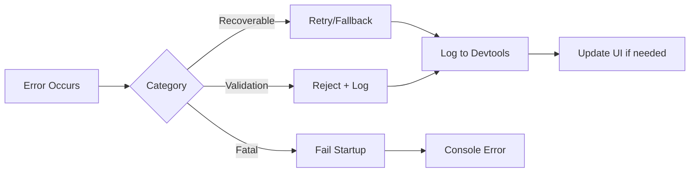

# Design Document: AURA E-Commerce Demo Application

## Overview

The AURA E-Commerce Demo is a Next.js 14+ application that serves as a reference implementation and live showcase of the AURA adaptive interface middleware. It demonstrates prescription-based UI adaptation across a product discovery experience with search, filtering, product cards, and layout configurations.

The application integrates with the existing `@aura/*` monorepo packages (`@aura/protocol`, `@aura/sdk`, `@aura/react`, `@aura/server`, `@aura/rules`, `@aura/devtools`) and provides:

- A static product catalog (100+ products across 7 categories) with client-side full-text search
- Four product card variants (standard, compact, comparison, image-lead) governed by AURA prescriptions
- Five demo modes (Rules Only, SLM, LLM, Demo Simulation, Developer) showcasing the tiered decision pipeline
- A devtools overlay for real-time introspection of events, prescriptions, user models, and context
- Risk-classified governance with consent controls, explanations, and undo capabilities
- Predefined adaptation scenarios for conference demonstrations

The application is structured as a new `apps/web` workspace within the existing pnpm monorepo, consuming the shared `packages/*` as workspace dependencies.

## Architecture

### High-Level Architecture

```mermaid
graph TB
    subgraph "Browser (Client)"
        UI[Next.js App Router UI]
        AP[AuraProvider]
        SDK[@aura/sdk Client]
        DT[Devtools Overlay]
        SI[Search Index<br/>MiniSearch]
    end

    subgraph "Next.js Server (API Routes)"
        SR[Session Route]
        ER[Events Route]
        PR[Prescriptions SSE Route]
        FR[Feedback Route]
        XR[Explain Route]
        CR[Consent Route]
        PRF[Profile Route]
    end

    subgraph "AURA Server Layer"
        AS[@aura/server<br/>Hono Middleware]
        RE[@aura/rules<br/>Rules Engine]
        MS[In-Memory Stores]
    end

    subgraph "AI Layer (Optional)"
        OR[OpenRouter API<br/>LLM]
        SLM[Transformers.js<br/>SLM]
    end

    subgraph "Data"
        PC[products.json<br/>Static Catalog]
        MF[aura.manifest.ts<br/>Capability Manifest]
        SIM[scenarios.ts<br/>Simulation Prescriptions]
    end

    UI --> AP
    AP --> SDK
    SDK -->|SSE| PR
    SDK -->|POST| ER
    SDK -->|POST| FR
    UI --> SI
    SI --> PC
    DT --> SDK

    SR --> AS
    ER --> AS
    PR --> AS
    FR --> AS
    XR --> AS
    CR --> AS
    PRF --> AS

    AS --> RE
    AS --> MS
    AS -->|when enabled| OR
    AS -->|when enabled| SLM
    AS --> MF
    AS --> SIM
```

### Layered Architecture

The application follows a three-layer architecture:

1. **Presentation Layer** (React Components + Hooks): Product cards, filter panel, search bar, explanation panel, devtools overlay. Uses `@aura/react` hooks (`useAura`, `usePrescription`, `useAuraEmit`, `useAuraFeedback`) to integrate with AURA.

2. **Application Layer** (Next.js API Routes + AURA Server): Handles session management, event ingestion, prescription streaming (SSE), feedback collection, and consent enforcement. Delegates to `@aura/server` Hono middleware for AUIP route handling.

3. **Domain Layer** (Rules Engine + AI + Data): The `@aura/rules` engine evaluates deterministic policies, with optional SLM/LLM tiers for classification and reasoning. Product catalog and search index live here.

### Key Design Decisions

| Decision | Choice | Rationale |
|----------|--------|-----------|
| Search engine | MiniSearch (client-side) | Faster than Fuse.js for structured data, supports fuzzy matching, zero server load |
| State management | In-memory stores via `@aura/server` | No external DB needed for demo; stores implement `I*Store` interfaces |
| Prescription delivery | Server-Sent Events (SSE) | Built into `@aura/server`; real-time, unidirectional, no WebSocket complexity |
| UI framework | Tailwind CSS + Shadcn/ui | Rapid prototyping, accessible by default, consistent with monorepo style |
| Monorepo placement | `apps/web` workspace | Follows pnpm workspace convention; consumes packages as `workspace:*` deps |
| AI integration | OpenRouter (LLM) + Transformers.js (SLM) | Single API for multiple LLM providers; browser-based SLM avoids server costs |
| Demo scenarios | Static prescription fixtures in code | Guarantees reproducible demos regardless of AI availability |

## Components and Interfaces

### Component Hierarchy

```mermaid
graph TD
    RootLayout[RootLayout<br/>app/layout.tsx]
    AuraProvider[AuraProvider<br/>@aura/react]
    ThemeProvider[ThemeProvider<br/>next-themes]
    Page[SearchPage<br/>app/page.tsx]
    
    Header[Header]
    DemoControls[DemoControls]
    SearchBar[SearchBar]
    FilterPanel[FilterPanel]
    ProductGrid[ProductGrid]
    ProductCard[ProductCard]
    ExplanationPanel[ExplanationPanel]
    ConsentControls[ConsentControls]
    DevtoolsOverlay[DevtoolsOverlay]

    RootLayout --> ThemeProvider
    ThemeProvider --> AuraProvider
    AuraProvider --> Page
    Page --> Header
    Header --> DemoControls
    Header --> SearchBar
    Page --> FilterPanel
    Page --> ProductGrid
    ProductGrid --> ProductCard
    Page --> ExplanationPanel
    Page --> ConsentControls
    Page --> DevtoolsOverlay
```

### Core Components

#### SearchBar
- Debounced text input (300ms after final keystroke)
- Emits `search.submitted` event via `useAuraEmit`
- Max 200 character query
- Retains query text on error

#### ProductCard
- Accepts `variant` prop: `"standard" | "compact" | "comparison" | "image-lead"`
- Uses `usePrescription` hook to receive variant, badge, and visibility prescriptions
- Falls back to "standard" on unrecognized variant
- Displays badge (max 24 chars) when prescribed
- Shows adaptation indicator (colored border) for 3+ seconds

#### FilterPanel
- Multi-select filters: categories, price range, ratings, brands
- OR logic within groups, AND logic across groups
- Collapsible (default: expanded ≥768px, collapsed <768px)
- Accepts `highlightedFilterIds` (max 3) and `collapsed` from prescriptions
- Emits `interaction.clicked` on filter selection

#### ProductGrid
- Renders product list with prescribed ordering
- Supports layout density: compact (4 cols), standard (3 cols), expanded (2 cols)
- "Load More" pagination (20 products per page)
- Applies CSS transitions (200–500ms) on adaptation changes

#### ExplanationPanel
- Displays plain-language explanation (≤200 chars, sentences ≤30 words)
- Shows confidence percentage and contributing factors
- Hidden when `ENABLE_EXPLANATIONS=false`
- Fallback message when explanation unavailable

#### DevtoolsOverlay
- Toggleable via header button, persists state while hidden
- Panels: Session Info, Event Log (500 max), Prescriptions, User Model, Context Model, Decision Pipeline, Explanations, Feedback History, Manifest Viewer
- Updates within 500ms of state changes
- New entries visually distinguished for 2 seconds

#### ConsentControls
- Independent toggles for "behavior" and "personalization" consent
- Revoking personalization reverts all adaptations within 500ms
- Hidden when `ENABLE_CONSENT=false`

#### DemoControls
- Demo mode selector (5 modes)
- Scenario trigger buttons
- Reset profile button
- Context switcher (mobile, tablet, desktop, accessibility)
- Visual mode indicator

### API Route Interfaces

All routes are mounted under `/api/aura/` and delegate to `@aura/server`'s `registerAuipRoutes`:

| Route | Method | Purpose |
|-------|--------|---------|
| `/api/aura/session` | POST/GET | Create/retrieve session |
| `/api/aura/events` | POST | Ingest events from client |
| `/api/aura/prescriptions/stream` | GET (SSE) | Stream prescriptions to client |
| `/api/aura/feedback` | POST | Collect user feedback |
| `/api/aura/explain` | GET | Retrieve explanation for prescription |
| `/api/aura/consent` | POST/GET | Manage consent profile |
| `/api/aura/profile` | GET/PATCH | View/correct user model |

### Hook Interfaces

```typescript
// Custom hooks wrapping @aura/react
interface UseProductSearch {
  query: string;
  setQuery: (q: string) => void;
  results: Product[];
  isLoading: boolean;
  error: string | null;
  hasMore: boolean;
  loadMore: () => void;
  sort: SortOption;
  setSort: (s: SortOption) => void;
}

interface UseFilters {
  filters: FilterState;
  setFilter: (group: string, values: string[]) => void;
  clearAll: () => void;
  activeCount: number;
}

interface UseDemoMode {
  mode: DemoMode;
  setMode: (m: DemoMode) => void;
  triggerScenario: (scenarioId: string) => void;
  resetProfile: () => void;
}
```

### Simulation Engine Interface

```typescript
interface SimulationEngine {
  /** Returns a preset prescription for the given scenario */
  getScenarioPrescription(scenarioId: ScenarioId): UIPrescription;
  
  /** Checks if current flags allow simulation */
  isSimulationActive(): boolean;
  
  /** Maps trigger events to scenario IDs */
  matchTrigger(event: AuraEvent): ScenarioId | null;
}

type ScenarioId = 
  | "search-intent-detection"
  | "price-sensitive-user"
  | "brand-preference"
  | "cold-start"
  | "mobile-context"
  | "accessibility-preference";
```

## Data Models

### Product Schema

```typescript
interface Product {
  id: string;                    // Unique identifier, e.g. "prod_001"
  name: string;                  // Max 100 chars
  description: string;           // Max 500 chars
  price: number;                 // 0.01 – 9999.99
  category: ProductCategory;     // One of 7 categories
  brand: string;                 // Max 50 chars
  rating: number;                // 1.0 – 5.0, increments of 0.1
  reviews: number;               // 0 – 99999
  imageUrl: string;              // Valid URL
  specs: Record<string, string>; // At least 3 key-value pairs
  tags: string[];                // 2–10 lowercase keywords
  discount: number;              // 0 – 70 (percentage)
}

type ProductCategory = 
  | "Laptops" | "Headphones" | "Smartphones" 
  | "Accessories" | "Wearables" | "Tablets" | "Monitors";
```

### Filter State

```typescript
interface FilterState {
  categories: ProductCategory[];
  priceRange: { min: number; max: number } | null;
  ratings: number[];           // Selected star ratings (1-5)
  brands: string[];
}
```

### AURA Manifest (Application-Specific)

```typescript
// apps/web/manifest/aura.manifest.ts
const manifest: CapabilityManifest = {
  version: "1.0.0",
  surfaces: [
    {
      surfaceId: "search.results",
      components: [
        {
          componentId: "product-card",
          variants: ["standard", "compact", "comparison", "image-lead"],
          riskClass: "low",
          adaptableProps: {
            variant: "enum:standard,compact,comparison,image-lead",
            showPrice: "boolean",
            showRating: "boolean",
            badgeLabel: "string:max24",
          },
          constraints: {
            requiresConsent: ["personalization"],
            reversible: true,
          },
        },
      ],
      layoutStability: {
        strategy: "reserve-space",
        maxDecisionWaitMs: 150,
      },
    },
    {
      surfaceId: "filter.panel",
      components: [
        {
          componentId: "filter-panel",
          variants: ["default"],
          riskClass: "medium",
          adaptableProps: {
            highlightedFilterIds: "array:string:max3",
            collapsed: "boolean",
          },
          constraints: {
            reversible: true,
          },
        },
      ],
    },
  ],
};
```

### Demo Mode Configuration

```typescript
type DemoMode = 
  | "rules-only" 
  | "slm-enabled" 
  | "llm-enabled" 
  | "demo-simulation" 
  | "developer";

interface DemoModeConfig {
  useRules: boolean;
  useSLM: boolean;
  useLLM: boolean;
  simulate: boolean;
  showDevtools: boolean;
}

const DEMO_MODE_CONFIGS: Record<DemoMode, DemoModeConfig> = {
  "rules-only":       { useRules: true,  useSLM: false, useLLM: false, simulate: false, showDevtools: false },
  "slm-enabled":      { useRules: true,  useSLM: true,  useLLM: false, simulate: false, showDevtools: false },
  "llm-enabled":      { useRules: true,  useSLM: true,  useLLM: true,  simulate: false, showDevtools: false },
  "demo-simulation":  { useRules: true,  useSLM: false, useLLM: false, simulate: true,  showDevtools: false },
  "developer":        { useRules: true,  useSLM: false, useLLM: false, simulate: false, showDevtools: true  },
};
```

### Simulation Flags (Environment Variables)

```typescript
interface SimulationFlags {
  USE_REAL_LLM: boolean;
  USE_REAL_SLM: boolean;
  SIMULATE_ADAPTATIONS: boolean;
  SHOW_DEVTOOLS: boolean;
  ENABLE_EXPLANATIONS: boolean;
  ENABLE_CONSENT: boolean;
}
```

### Event Buffer

```typescript
interface EventBuffer {
  events: AuraEvent[];           // Max 100 buffered events
  isConnected: boolean;
  flush(): Promise<void>;        // Retry delivery
  add(event: AuraEvent): void;   // Buffers if disconnected
}
```

### Prescription Application State

```typescript
interface PrescriptionState {
  activePrescriptions: Map<string, AppliedPrescription>;
  history: PrescriptionHistoryEntry[];  // For undo support
}

interface AppliedPrescription {
  prescription: UIPrescription;
  appliedAt: string;              // ISO 8601
  previousState: unknown;         // For undo/revert
  status: "active" | "undone" | "expired";
}
```


## Correctness Properties

*A property is a characteristic or behavior that should hold true across all valid executions of a system — essentially, a formal statement about what the system should do. Properties serve as the bridge between human-readable specifications and machine-verifiable correctness guarantees.*

### Property 1: Search Result Pagination Invariant

*For any* product catalog and any search query, the number of products returned in a single page SHALL never exceed 20.

**Validates: Requirements 1.3, 1.6**

### Property 2: Sort Ordering Correctness

*For any* list of products and any selected sort option (price-low-to-high, price-high-to-low, rating), the resulting list SHALL be ordered according to the specified comparator — i.e., for price-low-to-high, each product's price SHALL be less than or equal to the next product's price.

**Validates: Requirements 1.4**

### Property 3: Product Card Variant Rendering Completeness

*For any* product, when rendered in "standard" variant the output SHALL contain title, price, rating, a description truncated to at most 120 characters, and an add-to-cart control; when rendered in "compact" variant the output SHALL contain title, price, rating, and add-to-cart but SHALL NOT contain a description; when rendered in "comparison" variant the output SHALL display at most 5 specification highlights from the product's specs.

**Validates: Requirements 2.2, 2.3, 2.4**

### Property 4: Unrecognized Variant Fallback

*For any* string value that is not one of "standard", "compact", "comparison", or "image-lead", when used as a variant prescription the Product Card SHALL render using the "standard" variant.

**Validates: Requirements 2.8**

### Property 5: Badge Label Length Constraint

*For any* prescribed badge label string, the displayed badge text SHALL contain at most 24 characters.

**Validates: Requirements 2.6**

### Property 6: Filter Logic Correctness

*For any* product catalog and any combination of filter selections, every product in the filtered results SHALL satisfy at least one selected option in each active filter group (OR within group, AND across groups), and no product satisfying all active filter criteria SHALL be excluded from the results.

**Validates: Requirements 3.1**

### Property 7: Filter Highlight Maximum

*For any* prescription specifying highlighted filter identifiers, at most 3 filters SHALL be visually highlighted in the Filter Panel at any time.

**Validates: Requirements 3.5, 6.3**

### Property 8: Clear-All Filter Reset

*For any* filter state with one or more active selections, invoking the clear-all action SHALL result in a state where all filter groups have zero selections and the displayed results match the unfiltered catalog.

**Validates: Requirements 3.7**

### Property 9: Manifest Validation Rejects Invalid Configurations

*For any* manifest object missing a required field (surfaceId, componentId, variants, riskClass) or containing a value outside its permitted range, the manifest validation function SHALL return an error indicating the specific validation failure.

**Validates: Requirements 4.7**

### Property 10: Event Metadata Invariant

*For any* event emitted by the application, regardless of event type, the event object SHALL contain a non-empty session identifier and a valid ISO 8601 timestamp.

**Validates: Requirements 5.7**

### Property 11: Event Buffer Capacity

*For any* sequence of events emitted while the AURA middleware is unreachable, the buffer SHALL retain at most 100 events, discarding the oldest when the limit is exceeded.

**Validates: Requirements 5.8**

### Property 12: Search Query Truncation in Events

*For any* search query string submitted by the user, the `search.submitted` event payload SHALL contain the query text truncated to at most 256 characters.

**Validates: Requirements 5.2**

### Property 13: Ranking Prescription Preserves Non-Referenced Order

*For any* product list and any ranking prescription specifying an ordered subset of product IDs, the products referenced in the prescription SHALL appear in the prescribed order, and all products NOT referenced in the prescription SHALL maintain their original relative order among themselves.

**Validates: Requirements 6.1**

### Property 14: Prescription Rejection for Undeclared Components

*For any* prescription that references a component ID or variant value not declared in the application manifest, the prescription SHALL be rejected (not applied) and a validation error SHALL be logged.

**Validates: Requirements 6.7**

### Property 15: Sequential Prescription Application

*For any* set of prescriptions arriving simultaneously for the same surface, the prescriptions SHALL be applied in ascending order of their sequence IDs, resulting in a final state equivalent to sequential application in that order.

**Validates: Requirements 6.8**

### Property 16: Risk-Class Governance Behavior

*For any* prescription with risk class "low", the adaptation SHALL be auto-applied without user interaction; *for any* prescription with risk class "medium", the adaptation SHALL NOT be applied until the user dismisses the explanation overlay or 10 seconds elapse; *for any* prescription with risk class "high", the adaptation SHALL NOT be applied until the user explicitly confirms via the dialog.

**Validates: Requirements 9.1, 9.2, 9.3**

### Property 17: Consent Revocation Reverts All Adaptations

*For any* set of active personalized adaptations, when the user revokes personalization consent, all adapted UI elements SHALL revert to their default non-adapted presentation, resulting in a state indistinguishable from the initial non-adapted state.

**Validates: Requirements 9.5**

### Property 18: Undo Restores Pre-Adaptation State

*For any* applied adaptation, invoking the undo action SHALL restore the affected UI elements to the exact state they were in immediately before that adaptation was applied (round-trip property: apply then undo = identity).

**Validates: Requirements 9.6, 12.7**

### Property 19: Explanation Validation Constraints

*For any* generated explanation: (a) the total text length SHALL NOT exceed 200 characters, (b) no individual sentence SHALL exceed 30 words, (c) the confidence score SHALL be a percentage in the range [0, 100], and (d) at least one contributing factor with a category label SHALL be present.

**Validates: Requirements 10.2, 10.3, 10.4**

### Property 20: AI Isolation When Flags Disabled

*For any* event processing when both USE_REAL_LLM and USE_REAL_SLM flags are false, the application SHALL NOT issue any HTTP requests to external AI services, and all adaptation decisions SHALL be produced by the rules engine alone.

**Validates: Requirements 11.2**

### Property 21: Product Schema Validation

*For any* product in the catalog: id SHALL be a non-empty unique string, name SHALL be ≤100 characters, description SHALL be ≤500 characters, price SHALL be in [0.01, 9999.99], rating SHALL be in [1.0, 5.0] in 0.1 increments, reviews SHALL be in [0, 99999], tags SHALL have 2–10 entries, and discount SHALL be in [0, 70].

**Validates: Requirements 13.2**

### Property 22: Search Fuzzy Matching

*For any* product name in the catalog and any query string within edit distance 1 of that name (or a case-insensitive partial match), the search function SHALL include that product in the results.

**Validates: Requirements 13.3**

### Property 23: AI Prompt/Response Display Truncation

*For any* AI prompt or response displayed in the Devtools Overlay, the displayed text SHALL be truncated to at most 2000 characters, with a control available to expand the full content.

**Validates: Requirements 15.4**

### Property 24: Search Input Length Constraint

*For any* text entered in the search input field, the input SHALL accept at most 200 characters; characters beyond position 200 SHALL be rejected or truncated.

**Validates: Requirements 1.1**


## Error Handling

### Error Categories and Strategies

| Category | Trigger | Strategy | User Impact |
|----------|---------|----------|-------------|
| Search Index Failure | MiniSearch initialization or query error | Display "search temporarily unavailable" message, retain query text in input | Graceful degradation |
| Invalid Prescription | Prescription references undeclared component/variant | Reject silently, log to Devtools event stream | None — previous state preserved |
| AI Service Timeout | LLM >10s or SLM >3s | Fall back to rules-based adaptation within 2s of failure detection | Seamless — may get less sophisticated adaptation |
| AI Service Auth Error | Missing/invalid API key | Fall back to rules, display notification in Devtools | None for end user; developer sees notification |
| Manifest Validation Error | Missing required field or invalid value | Fail startup with descriptive error | Application does not start (development-time error) |
| SSE Connection Loss | Network interruption | Buffer events (max 100), auto-reconnect, flush on restore | Brief delay in adaptations |
| Invalid Event Emission | Malformed event payload | Validate locally before emit, reject invalid events with console warning | None — invalid events not sent |
| Consent Enforcement | Personalization revoked mid-session | Immediate revert of all adaptations within 500ms | UI returns to default state |
| High-Risk Dialog Timeout | User doesn't respond within 30s | Dismiss dialog, do not apply adaptation, log audit entry | No adaptation applied |
| Memory Pressure | >100 buffered events or session exceeds 100MB | Drop oldest events from buffer; log warning | Possible loss of oldest buffered events |

### Error Propagation Flow



### Fallback Chain for Decision Pipeline

```
LLM (if enabled + available)
  → timeout/error → SLM (if enabled + available)
    → timeout/error → Rules Engine (always available)
      → emit prescription with decisionSource: "rules"
```

When fallback occurs:
- The `decisionSource` field in the prescription audit indicates which tier produced the decision
- Devtools shows the fallback path taken
- User sees adaptation (from rules) without knowing fallback occurred


## Testing Strategy

### Test Framework and Tools

| Tool | Purpose |
|------|---------|
| Vitest | Unit and property-based test runner (already in monorepo) |
| fast-check | Property-based testing library (already in monorepo devDeps) |
| React Testing Library | Component rendering and interaction tests |
| MSW (Mock Service Worker) | Mocking API routes and AI services |
| Playwright | End-to-end tests for demo scenarios and responsive behavior |

### Dual Testing Approach

#### Unit Tests (Example-Based)

Focus areas:
- Component rendering for each variant (smoke: does it render without error?)
- Specific demo scenario triggers and expected adaptations
- Devtools panel data display verification
- Dark/light mode toggle behavior
- Responsive breakpoint behavior (collapsed/expanded filter panel)
- Flag-controlled visibility (SHOW_DEVTOOLS, ENABLE_CONSENT, ENABLE_EXPLANATIONS)
- Default states on initial load (rules-only mode, standard variant)
- Error states (AI unavailable notification, search error message)

#### Property-Based Tests

Each correctness property above maps to one property-based test using `fast-check`.

Configuration:
- Minimum 100 iterations per property test
- Each test tagged with: **Feature: ecommerce-demo, Property {N}: {title}**

Key generators needed:
- `arbProduct`: Generate valid products conforming to schema constraints
- `arbProductCatalog`: Generate catalogs with 1–200 products across categories
- `arbSearchQuery`: Generate strings of varying length (0–300 chars)
- `arbFilterState`: Generate random filter combinations
- `arbPrescription`: Generate valid and invalid prescriptions
- `arbBadgeLabel`: Generate strings of varying length for badge testing
- `arbExplanation`: Generate explanation objects with varying text lengths
- `arbVariant`: Generate both valid and invalid variant strings
- `arbRankingPrescription`: Generate ordered ID subsets from a product list

Priority properties for initial implementation:
1. Property 6 (Filter Logic) — core business logic, most complex
2. Property 13 (Ranking Preservation) — algorithmic correctness
3. Property 18 (Undo Round Trip) — state management integrity
4. Property 9 (Manifest Validation) — leverages existing Zod schemas from @aura/protocol
5. Property 21 (Product Schema) — data integrity

#### Integration Tests

- Demo scenario end-to-end flows (trigger → prescription → UI update → explanation)
- SSE prescription streaming from server to client
- Session lifecycle (create → emit events → receive prescriptions → feedback)
- AI service integration with mocked OpenRouter responses
- Mode switching (rules → SLM → LLM) behavior verification

#### Smoke Tests

- Manifest structure valid against `CapabilityManifestSchema`
- Product catalog loads from JSON without errors
- All 7 categories present with minimum product counts
- Application starts with `npm run dev`
- Production build completes with `npm run build`
- Environment variable loading for simulation flags

### Test Organization

```
apps/web/
├── __tests__/
│   ├── unit/
│   │   ├── components/        # Component rendering tests
│   │   ├── hooks/             # Hook behavior tests
│   │   └── lib/               # Utility function tests
│   ├── properties/
│   │   ├── filter-logic.property.test.ts
│   │   ├── ranking.property.test.ts
│   │   ├── undo-roundtrip.property.test.ts
│   │   ├── manifest-validation.property.test.ts
│   │   ├── product-schema.property.test.ts
│   │   ├── search.property.test.ts
│   │   ├── event-metadata.property.test.ts
│   │   ├── explanation.property.test.ts
│   │   ├── governance.property.test.ts
│   │   └── generators/        # Shared fast-check arbitraries
│   │       ├── product.arb.ts
│   │       ├── prescription.arb.ts
│   │       ├── filter.arb.ts
│   │       └── event.arb.ts
│   ├── integration/
│   │   ├── scenarios.test.ts
│   │   ├── sse-streaming.test.ts
│   │   └── ai-fallback.test.ts
│   └── e2e/
│       ├── demo-walkthrough.spec.ts
│       └── responsive.spec.ts
```

