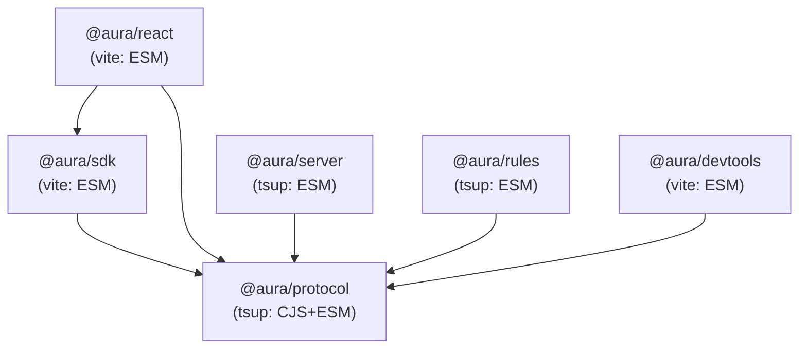
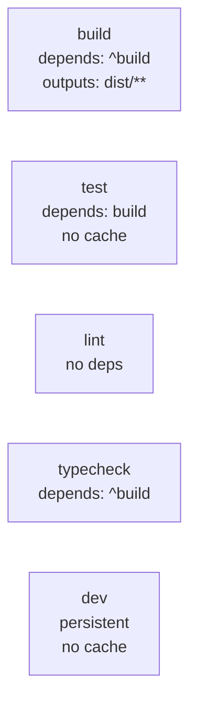

# Design Document: Monorepo Setup

## Overview

This design describes the file structure, configuration files, and scaffolding for the AURA TypeScript monorepo. The monorepo is initialized in the current workspace directory using Turborepo, pnpm workspaces, TypeScript project references, Vitest workspace configuration, and per-package build tooling (tsup for library packages, Vite for browser-facing packages).

### Design Goals

- **Zero-friction setup**: `pnpm install` followed by `turbo build` produces all package artifacts
- **Correct dependency ordering**: Turborepo's topological `^build` ensures protocol builds before dependents
- **Incremental type checking**: TypeScript composite project references enable fast incremental builds
- **Consistent tooling**: Shared Vitest + fast-check config across all packages
- **Publishable packages**: Each package has correct `exports`, `types`, and `files` fields

### Key Design Decisions

| Decision | Rationale |
|----------|-----------|
| pnpm workspaces with `workspace:*` | Native monorepo linking, hoisted devDeps, strict dependency isolation |
| Turborepo 2.x | Incremental builds, remote caching capability, task graph parallelization |
| Root tsconfig with package extends | Single source of truth for compiler options, per-package overrides where needed |
| tsup for protocol/server/rules | Fast TS→JS bundling with declarations, CJS/ESM dual output for protocol |
| Vite library mode for sdk/react/devtools | Tree-shakeable ESM output, React JSX support via plugin |
| vitest.workspace.ts at root | Unified test discovery, per-package config for environment differences |
| fast-check as root devDependency | Available to all packages without per-package installation |

---

## Architecture

### Directory Structure

```
/ (workspace root)
├── package.json              # Root: private, workspaces, scripts, shared devDeps
├── pnpm-workspace.yaml       # pnpm workspace declaration
├── pnpm-lock.yaml            # Generated lockfile
├── turbo.json                # Turborepo pipeline config
├── tsconfig.json             # Root TS config with project references
├── vitest.workspace.ts       # Vitest workspace config
├── .npmrc                    # pnpm settings
├── packages/
│   ├── protocol/             # @aura/protocol
│   │   ├── package.json
│   │   ├── tsconfig.json
│   │   ├── tsup.config.ts
│   │   ├── vitest.config.ts
│   │   └── src/
│   │       └── index.ts
│   ├── sdk/                  # @aura/sdk
│   │   ├── package.json
│   │   ├── tsconfig.json
│   │   ├── vite.config.ts
│   │   ├── vitest.config.ts
│   │   └── src/
│   │       └── index.ts
│   ├── react/                # @aura/react
│   │   ├── package.json
│   │   ├── tsconfig.json
│   │   ├── vite.config.ts
│   │   ├── vitest.config.ts
│   │   └── src/
│   │       └── index.ts
│   ├── server/               # @aura/server
│   │   ├── package.json
│   │   ├── tsconfig.json
│   │   ├── tsup.config.ts
│   │   ├── vitest.config.ts
│   │   └── src/
│   │       └── index.ts
│   ├── rules/                # @aura/rules
│   │   ├── package.json
│   │   ├── tsconfig.json
│   │   ├── tsup.config.ts
│   │   ├── vitest.config.ts
│   │   └── src/
│   │       └── index.ts
│   └── devtools/             # @aura/devtools
│       ├── package.json
│       ├── tsconfig.json
│       ├── vite.config.ts
│       ├── vitest.config.ts
│       └── src/
│           └── index.ts
```

### Dependency Graph



### Build Pipeline (turbo.json)



---

## Components and Interfaces

### Component Overview

| Component | Type | Responsibility |
|-----------|------|---------------|
| Root Config Layer | Configuration | pnpm workspace, Turborepo pipeline, root tsconfig, Vitest workspace |
| @aura/protocol | Library (tsup) | Zero-dependency protocol definitions, Zod schemas, dual CJS/ESM |
| @aura/sdk | Library (Vite) | Framework-neutral browser SDK, depends on protocol |
| @aura/react | Library (Vite) | React adapter with hooks/components, depends on sdk + protocol |
| @aura/server | Library (tsup) | Hono HTTP server implementing AUIP v0, depends on protocol |
| @aura/rules | Library (tsup) | Deterministic rules DSL and evaluator, depends on protocol |
| @aura/devtools | Library (Vite) | React-based inspector panel, depends on protocol |

### Interfaces

Each package exposes its public API through a single `src/index.ts` entry point compiled to `dist/`. Cross-package communication occurs exclusively through TypeScript imports resolved via pnpm `workspace:*` linking and TypeScript project references.

**Package Resolution Interface:**
- Internal packages are resolved via `workspace:*` protocol in pnpm
- TypeScript project references enable cross-package type checking
- Each package's `exports` field defines the public contract for consumers

**Build Interface (Turborepo):**
- `turbo run build` — Topological build of all packages
- `turbo run test` — Run tests after build
- `turbo run typecheck` — Type-check with `tsc --noEmit`
- `turbo run lint` — Parallel linting (no deps)
- `turbo run dev` — Persistent watch mode

---

## Data Models

This feature is primarily a monorepo infrastructure setup and does not define runtime data models. The "data" managed by this feature consists of configuration files (JSON, TypeScript config, YAML) that describe the monorepo structure.

### Configuration Data Structures

| File | Format | Purpose |
|------|--------|---------|
| `package.json` (root) | JSON | Workspace declaration, shared devDeps, scripts |
| `pnpm-workspace.yaml` | YAML | Package glob patterns |
| `turbo.json` | JSON | Task pipeline graph, caching rules |
| `tsconfig.json` (root) | JSON | Shared compiler options, project references |
| `tsconfig.json` (per-package) | JSON | Package-specific overrides, local references |
| `vitest.workspace.ts` | TypeScript | Test workspace package list |
| `package.json` (per-package) | JSON | Name, exports, dependencies, scripts |

### Dependency Graph Model

The internal dependency relationships form a directed acyclic graph (DAG):

```
protocol (root node, zero @aura/* deps)
├── sdk
│   └── react
├── server
├── rules
└── devtools
```

---

## Component Design

### 1. Root package.json

```jsonc
{
  "name": "aura-monorepo",
  "private": true,
  "packageManager": "pnpm@9.15.4",
  "scripts": {
    "build": "turbo run build",
    "test": "turbo run test",
    "lint": "turbo run lint",
    "typecheck": "turbo run typecheck",
    "dev": "turbo run dev"
  },
  "devDependencies": {
    "turbo": "^2.5.0",
    "typescript": "^5.8.3",
    "vitest": "^3.2.1",
    "fast-check": "^4.1.1",
    "eslint": "^9.28.0"
  }
}
```

### 2. turbo.json

```jsonc
{
  "$schema": "https://turbo.build/schema.json",
  "tasks": {
    "build": {
      "dependsOn": ["^build"],
      "outputs": ["dist/**"]
    },
    "test": {
      "dependsOn": ["build"],
      "outputs": []
    },
    "lint": {
      "outputs": []
    },
    "typecheck": {
      "dependsOn": ["^build"],
      "outputs": []
    },
    "dev": {
      "persistent": true,
      "cache": false
    }
  }
}
```

### 3. Root tsconfig.json

```jsonc
{
  "compilerOptions": {
    "strict": true,
    "target": "ES2022",
    "module": "ESNext",
    "moduleResolution": "bundler",
    "declaration": true,
    "declarationMap": true,
    "sourceMap": true,
    "composite": true,
    "skipLibCheck": true,
    "esModuleInterop": true,
    "forceConsistentCasingInFileNames": true,
    "isolatedModules": true,
    "resolveJsonModule": true
  },
  "references": [
    { "path": "packages/protocol" },
    { "path": "packages/sdk" },
    { "path": "packages/react" },
    { "path": "packages/server" },
    { "path": "packages/rules" },
    { "path": "packages/devtools" }
  ]
}
```

### 4. vitest.workspace.ts

```typescript
import { defineWorkspace } from 'vitest/config';

export default defineWorkspace([
  'packages/protocol',
  'packages/sdk',
  'packages/react',
  'packages/server',
  'packages/rules',
  'packages/devtools',
]);
```

### 5. Package-Level Configuration Patterns

#### tsup-based packages (protocol, server, rules)

```typescript
// tsup.config.ts for @aura/protocol (dual CJS/ESM)
import { defineConfig } from 'tsup';

export default defineConfig({
  entry: ['src/index.ts'],
  format: ['cjs', 'esm'],
  dts: true,
  clean: true,
  sourcemap: true,
});
```

```typescript
// tsup.config.ts for server/rules (ESM only)
import { defineConfig } from 'tsup';

export default defineConfig({
  entry: ['src/index.ts'],
  format: ['esm'],
  dts: true,
  clean: true,
  sourcemap: true,
});
```

#### Vite-based packages (sdk, react, devtools)

```typescript
// vite.config.ts for @aura/sdk
import { defineConfig } from 'vite';

export default defineConfig({
  build: {
    lib: {
      entry: 'src/index.ts',
      formats: ['es'],
      fileName: 'index',
    },
    rollupOptions: {
      external: ['@aura/protocol'],
    },
  },
});
```

```typescript
// vite.config.ts for @aura/react
import { defineConfig } from 'vite';
import react from '@vitejs/plugin-react';

export default defineConfig({
  plugins: [react()],
  build: {
    lib: {
      entry: 'src/index.ts',
      formats: ['es'],
      fileName: 'index',
    },
    rollupOptions: {
      external: ['react', 'react-dom', '@aura/protocol', '@aura/sdk'],
    },
  },
});
```

#### Per-package vitest.config.ts

```typescript
// vitest.config.ts (standard for Node packages)
import { defineConfig } from 'vitest/config';

export default defineConfig({
  test: {
    globals: true,
  },
});
```

```typescript
// vitest.config.ts (for React packages: react, devtools)
import { defineConfig } from 'vitest/config';

export default defineConfig({
  test: {
    globals: true,
    environment: 'jsdom',
  },
});
```

### 6. Package.json Patterns

#### @aura/protocol

```jsonc
{
  "name": "@aura/protocol",
  "version": "0.0.0",
  "type": "module",
  "exports": {
    ".": {
      "import": "./dist/index.js",
      "require": "./dist/index.cjs",
      "types": "./dist/index.d.ts"
    }
  },
  "main": "./dist/index.cjs",
  "module": "./dist/index.js",
  "types": "./dist/index.d.ts",
  "files": ["dist", "package.json"],
  "scripts": {
    "build": "tsup",
    "test": "vitest run",
    "typecheck": "tsc --noEmit",
    "dev": "tsup --watch"
  },
  "dependencies": {
    "zod": "^3.25.1"
  },
  "devDependencies": {
    "tsup": "^8.5.0"
  }
}
```

#### @aura/sdk (Vite library pattern)

```jsonc
{
  "name": "@aura/sdk",
  "version": "0.0.0",
  "type": "module",
  "exports": {
    ".": {
      "import": "./dist/index.js",
      "types": "./dist/index.d.ts"
    }
  },
  "module": "./dist/index.js",
  "types": "./dist/index.d.ts",
  "files": ["dist", "package.json"],
  "scripts": {
    "build": "vite build && tsc --emitDeclarationOnly",
    "test": "vitest run",
    "typecheck": "tsc --noEmit",
    "dev": "vite build --watch"
  },
  "dependencies": {
    "@aura/protocol": "workspace:*"
  },
  "devDependencies": {
    "vite": "^6.3.5"
  }
}
```

#### @aura/react (Vite + React pattern)

```jsonc
{
  "name": "@aura/react",
  "version": "0.0.0",
  "type": "module",
  "exports": {
    ".": {
      "import": "./dist/index.js",
      "types": "./dist/index.d.ts"
    }
  },
  "module": "./dist/index.js",
  "types": "./dist/index.d.ts",
  "files": ["dist", "package.json"],
  "scripts": {
    "build": "vite build && tsc --emitDeclarationOnly",
    "test": "vitest run",
    "typecheck": "tsc --noEmit",
    "dev": "vite build --watch"
  },
  "dependencies": {
    "@aura/protocol": "workspace:*",
    "@aura/sdk": "workspace:*"
  },
  "peerDependencies": {
    "react": "^18.0.0 || ^19.0.0",
    "react-dom": "^18.0.0 || ^19.0.0"
  },
  "devDependencies": {
    "@vitejs/plugin-react": "^4.4.1",
    "vite": "^6.3.5",
    "react": "^19.1.0",
    "react-dom": "^19.1.0",
    "@types/react": "^19.1.6",
    "@types/react-dom": "^19.1.6"
  }
}
```

#### @aura/server (tsup ESM pattern)

```jsonc
{
  "name": "@aura/server",
  "version": "0.0.0",
  "type": "module",
  "exports": {
    ".": {
      "import": "./dist/index.js",
      "types": "./dist/index.d.ts"
    }
  },
  "module": "./dist/index.js",
  "types": "./dist/index.d.ts",
  "files": ["dist", "package.json"],
  "scripts": {
    "build": "tsup",
    "test": "vitest run",
    "typecheck": "tsc --noEmit",
    "dev": "tsup --watch"
  },
  "dependencies": {
    "@aura/protocol": "workspace:*",
    "hono": "^4.7.10"
  },
  "devDependencies": {
    "tsup": "^8.5.0"
  }
}
```

---

## Correctness Properties

### Property 1: Dependency Graph Acyclicity

*For any* set of packages in the monorepo, the transitive closure of internal `@aura/*` dependencies contains no cycles. The dependency graph forms a DAG with `@aura/protocol` as the sole root.

**Validates: Requirements 11.1, 11.2, 11.3, 11.4, 11.5, 11.6, 11.7**

### Property 2: Workspace Protocol Consistency

*For any* internal `@aura/*` dependency declared in any package, the version specifier is exactly `workspace:*`.

**Validates: Requirements 6.2, 7.2, 8.2, 9.2, 10.2**

### Property 3: Build Pipeline Topological Correctness

*For any* package P with internal dependencies D, Turborepo's `^build` dependency ensures D.build completes before P.build begins. The `turbo.json` build task declares `dependsOn: ["^build"]`.

**Validates: Requirements 2.2, 11.7**

### Property 4: TypeScript Strict Mode Universality

*For any* package P in the monorepo, the effective TypeScript configuration has `strict: true` either directly or via the `extends` chain from the root tsconfig.

**Validates: Requirements 3.1, 3.6**

### Property 5: Package Exports Completeness

*For any* package P in the monorepo, `package.json` declares an `exports["."]` field with at least an `import` condition and a `types` condition, and a top-level `types` field pointing to a `.d.ts` file path within `dist/`.

**Validates: Requirements 13.1, 13.2, 13.3**

### Property 6: Test Infrastructure Availability

*For any* package P listed in `vitest.workspace.ts`, a `vitest.config.ts` file exists in the package directory, and `vitest` and `fast-check` are resolvable from the package (via root devDependencies hoisting).

**Validates: Requirements 4.1, 4.2, 4.3, 4.4**

---

## Error Handling

Since this feature is a monorepo scaffolding setup (configuration files and directory structure), runtime error handling is not directly applicable. However, the following failure modes are addressed by the design:

| Failure Mode | Mitigation |
|-------------|-----------|
| `pnpm install` fails due to missing workspace packages | `pnpm-workspace.yaml` declares `packages/*` glob; all packages exist with valid `package.json` |
| `turbo build` fails due to incorrect dependency order | `^build` in `turbo.json` enforces topological ordering |
| TypeScript compilation errors from cross-package imports | Project references in each `tsconfig.json` ensure type resolution |
| Vitest cannot find test files | `vitest.workspace.ts` enumerates all packages; each has a `vitest.config.ts` |
| Circular dependency between packages | Dependency graph is a DAG enforced by design (protocol is the only root) |
| Version mismatch between shared tools | All tooling versions pinned in root `devDependencies` |

---

## Testing Strategy

### Approach

This monorepo setup is primarily configuration and scaffolding. Testing focuses on structural validation rather than runtime behavior.

**Unit Tests (Example-Based):**
- Validate each `package.json` has required fields (`name`, `exports`, `types`, `files`)
- Verify `tsconfig.json` files extend the root and declare correct project references
- Confirm `turbo.json` pipeline tasks have correct dependency declarations
- Check `vitest.workspace.ts` lists all six packages

**Property-Based Tests (fast-check):**
- Dependency graph acyclicity: generate permutations of the dependency declarations and verify DAG property holds
- Workspace protocol consistency: for any `@aura/*` dependency found, assert `workspace:*` protocol
- Export field completeness: for any package, verify required export conditions exist
- TypeScript strict inheritance: for any package tsconfig, resolve extends chain and verify strict mode

**Integration Tests:**
- `pnpm install` completes without errors
- `turbo build` compiles all packages in correct order
- `turbo test` runs Vitest across all packages with zero test failures (placeholder tests pass)
- `tsc --noEmit` type-checks the entire project via root tsconfig references

**Property-Based Testing Library:** fast-check (already declared as root devDependency)

**Configuration:**
- Minimum 100 iterations per property test
- Each property test tagged with: `Feature: monorepo-setup, Property {N}: {description}`
