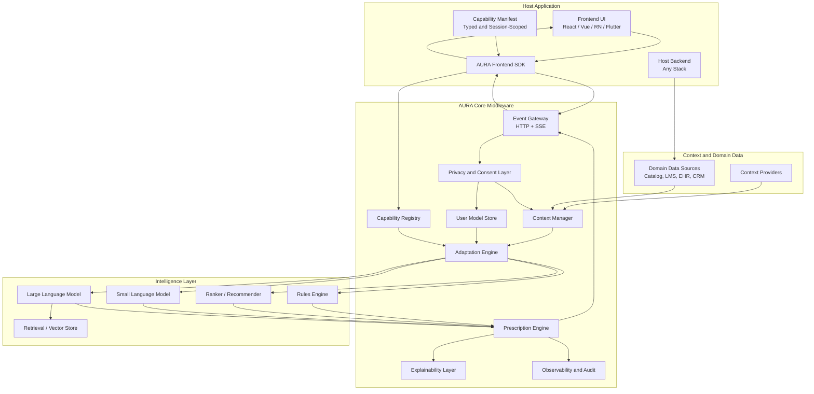
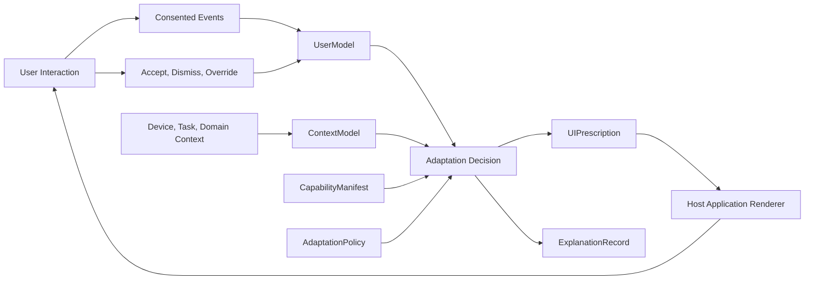
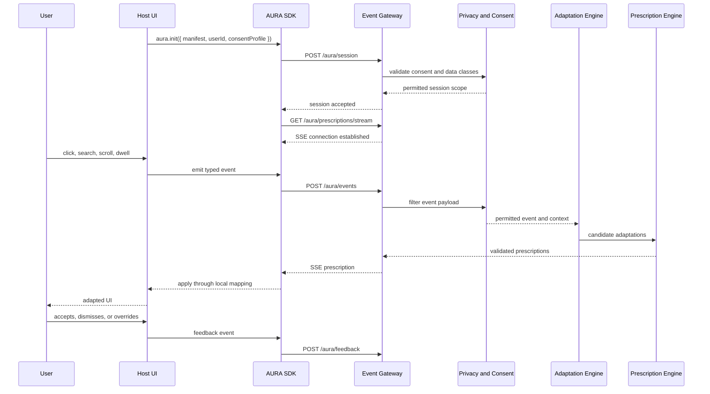
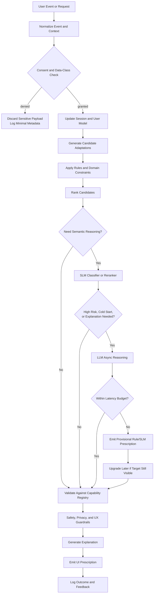

# AURA: A Reference Architecture for Governed Adaptive User Interface Middleware

**Author:** Festus Yeboah · 2026

## Abstract

Adaptive user interface research has produced useful domain systems, guidelines, recommender methods, and LLM-enabled interface concepts, but modern production applications still lack a general middleware architecture for adding adaptive behavior safely to existing frontends. This paper proposes AURA, the Adaptive UI Runtime Architecture, as a reference architecture for governed adaptive user interface middleware. AURA's core principle is prescription rather than generation: the host application retains rendering authority, while AURA observes consented events, maintains user and context models, reasons over adaptation candidates, validates decisions against a typed capability manifest, and emits bounded UI prescriptions. The architecture contributes a typed capability boundary, AUIP frontend protocol, tiered rules/SLM/LLM decision pipeline, risk-aware governance model, explanation model, failure-handling strategy, and developer integration path. It is positioned conceptually against personalization and experimentation platforms, recommender systems, goal-driven LLM interfaces, and direct LLM UI generation. This paper is an architectural proposal, not an empirical validation. Implementation, prototypes, and evaluation are reserved for subsequent papers in the research program.

## Keywords

Adaptive user interfaces; reference architecture; middleware; capability manifest; UI prescriptions; frontend SDK; large language models; small language models; explainable AI; governance; privacy; personalization.

## 1. Introduction

Adaptive user interfaces (AUIs) promise software that can adjust presentation, navigation, content, ranking, explanation, assistance, and accessibility behavior to users and context. Prior research across education, healthcare, e-commerce, adaptive hypermedia, context-aware systems, intelligent user interfaces, recommender systems, and explainable AI shows both the value and the difficulty of adaptation. The challenge in production software is not simply that adaptive algorithms are missing. It is that adaptive behavior is difficult to integrate safely into existing applications.

Most product teams already have frontend frameworks, design systems, analytics, domain APIs, authorization rules, accessibility requirements, and release processes. They cannot hand unrestricted rendering control to a model. They also cannot rewrite each application around a domain-specific AUI engine. A practical architecture must support existing web and mobile applications, preserve host application authority, make adaptation observable and reversible, respect consent, and operate under domain-specific risk constraints.

AURA, the Adaptive UI Runtime Architecture, is proposed as a reference architecture for this gap. AURA is stateful middleware between host applications, frontend SDKs, event streams, user and context models, rules, recommenders, SLMs, LLMs, policies, and observability systems. Its defining claim is that adaptive UI should be mediated through typed prescriptions against declared capabilities rather than through unrestricted DOM manipulation, direct model-generated UI, or hidden personalization logic. AURA is progressive enhancement: if the middleware, manifest, policy, network, or model layer fails, the host application renders its default UI.

This paper makes six contributions:

1. It defines AURA's architectural boundary: the host application owns rendering, business logic, routing, and final application state; AURA owns adaptive reasoning over consented events and declared capabilities.
2. It proposes a typed capability manifest as the action-space boundary for adaptation.
3. It defines AUIP, a frontend protocol for sessions, events, context updates, prescriptions, feedback, consent, explanations, and profile correction.
4. It specifies a tiered decision pipeline combining deterministic rules, recommenders, SLMs, and LLMs under latency and risk constraints.
5. It provides a governance and explanation model for privacy, consent, profile correction, risk classes, auditability, and human oversight.
6. It addresses practical adoption concerns: comparison to adjacent systems, developer experience, complexity, failure modes, and graceful degradation.

### Research Program

This paper is the second paper in a four-paper research program:

1. Literature review of adaptive user interfaces in the LLM era.
2. AURA reference architecture for governed adaptive UI middleware.
3. Implementation and prototype paper for the AURA framework.
4. Testing and evaluation paper for AURA prototypes.

The present paper proposes the architecture and its design rationale. It does not claim empirical validation of AURA.

## 2. Problem Statement

Existing adaptive UI work lacks a production-oriented middleware layer with clear frontend boundaries. Domain systems often prove that adaptation can work in a specific context, but they rarely provide reusable contracts that product teams can add to existing applications. Recommender and personalization systems can rank items or run experiments, but they usually do not model component-level UI capabilities, user-visible profile correction, risk-specific explanation, or host-rendered prescription application. LLM-based UI generation can produce novel interfaces, but unrestricted generation is difficult to govern, test, audit, and integrate with design systems.

A production adaptive UI architecture must satisfy the following requirements:

- integrate with existing web and mobile frontends without a full rewrite;
- preserve host application authority over rendering, business logic, accessibility implementation, and state;
- declare adaptable components, surfaces, slots, variants, props, constraints, and risk classes explicitly;
- support event ingestion, user modeling, context modeling, consent, policy, adaptation, prescription validation, explanation, and observability;
- use rules, recommenders, SLMs, and LLMs according to latency, risk, and decision complexity;
- degrade gracefully when middleware, models, network, or manifests fail;
- make profile attributes visible, correctable, expirable, and auditable where appropriate;
- provide enough developer experience to justify adoption.

These requirements imply that adaptive UI should be an architectural capability, not only an algorithmic feature.

## 3. Contribution Claim

AURA's contribution is the combination of five architectural choices.

First, AURA uses prescription-based adaptation rather than UI generation. A prescription states what bounded change is recommended, why, for which surface, under which constraints, and with which audit metadata. The host application decides how a valid prescription maps to rendered components.

Second, AURA uses a typed capability manifest as the adaptation boundary. The host app declares the components, slots, variants, props, events, risk classes, and consent requirements AURA may influence. AURA cannot prescribe changes outside that declared boundary.

Third, AURA defines AUIP, a frontend protocol for adaptive sessions, events, context synchronization, prescription streaming, feedback, explanations, consent, and profile correction.

Fourth, AURA uses a tiered decision pipeline. Rules handle hard constraints and low-latency cases; recommenders handle ranking; SLMs handle fast semantic classification and reranking; LLMs support cold-start reasoning, explanation generation, and semantic mapping when justified. All model output is validated before reaching the frontend.

Fifth, AURA treats governance as part of the architecture. Consent, data minimization, profile correction, risk classes, explanation, human confirmation, audit logs, and fallback behavior are not optional application polish; they are runtime responsibilities.

## 4. Comparison to Adjacent Systems

The comparison below is conceptual. It compares capability categories rather than making unsupported claims about specific product internals.

| System category | Primary strength | Typical limitation for governed AUI | AURA distinction |
|---|---|---|---|
| Personalization and experimentation platforms, such as Adobe Target, Dynamic Yield, and Google Optimize-style testing | Audience targeting, variants, experiments, optimization | Often centered on campaigns, segments, experiments, or content variants rather than typed component capability boundaries and adaptive profile correction | Runtime UI prescriptions validated against app-declared capabilities, consent, risk classes, and explanations |
| Recommender systems | Ranking items, lessons, products, documents, or media at scale | Usually optimize ranking rather than full UI behavior, frontend protocol, explanation mode, or governance boundary | Treats ranking as one adaptation type alongside layout, content, assistance, accessibility, navigation, and workflow |
| Analytics-driven feature flag systems | Controlled rollout, A/B tests, segmentation, operational safety | Segment rules are usually coarse and not a live user/context adaptive UI model | Uses live user/context models and feedback loops while preserving app-controlled rendering |
| Goal-driven LLM interfaces, such as component orchestration systems | Maps natural language goals to UI components | May focus on dynamic assembly or simplification more than production policy, consent, fallback, and audit | Allows semantic mapping only within a typed manifest and prescription validator |
| Direct LLM UI generation | Flexible generation from natural language or context | Hard to test, govern, secure, align with design systems, and audit in high-risk domains | Rejects unrestricted UI generation; LLMs advise, prescriptions constrain, host app renders |

AURA is not a replacement for recommender systems, experimentation platforms, or design systems. It is a middleware layer that can use them while adding typed UI boundaries, governance, profile controls, and prescription delivery.

## 5. Reference Architecture

AURA is organized into four layers: host application, AURA core middleware, intelligence layer, and data/context infrastructure.



### 5.1 Host Application

The host application owns the product experience. It defines routes, renders components, enforces business logic, handles authorization, implements accessibility, and resolves conflicts with application state. AURA does not bypass the host frontend.

### 5.2 Frontend SDK

The SDK initializes sessions, sends the manifest, emits events, subscribes to prescription streams, applies local prescription mappings, records feedback, updates consent, and fetches explanations or profile summaries. If AURA is unavailable, the SDK becomes inert and the default UI remains usable.

### 5.3 Capability Registry

The registry stores the session manifest and validates every prescription. It prevents invalid component IDs, unsupported variants, invalid props, risk-class violations, expired prescriptions, and manifest mismatches from reaching application code.

### 5.4 Adaptation and Prescription Engines

The adaptation engine generates candidate interventions from rules, recommenders, SLMs, LLMs, and domain heuristics. The prescription engine converts approved candidates into typed UI prescriptions, attaches explanations and audit metadata, and applies final validation.

### 5.5 Privacy, Consent, Explainability, and Observability

The privacy layer gates data collection, profile updates, model invocation, sensitive inference, retention, and prescription modes. Explainability produces user-facing, developer-facing, and auditor-facing records. Observability tracks latency, acceptance, dismissal, override, reversion, model cost, failures, policy versions, and data classes used.

### 5.6 Operational Assumptions

AURA's latency classes are architectural budgets rather than measured results. `immediate` adaptations should be handled by local rules, edge logic, or in-memory state and must not block first render. `fast` adaptations may use rankers or private SLMs when the surface can tolerate near-real-time updates. `deliberate` adaptations, such as cold-start reasoning or explanation drafting, may use LLMs asynchronously and must have fallback behavior.

Operational cost is also part of the architecture. AURA introduces session storage, profile storage, audit logs, policy maintenance, model routing, and observability overhead. Cloud LLM calls are the most variable cost and should be reserved for decisions whose semantic complexity justifies the latency, privacy, and audit burden. Lower-cost rules, rankers, and SLMs are preferred whenever they satisfy the decision need.

## 6. Conceptual Model

AURA's core objects are:

- `UserModel`: explicit and inferred preferences, expertise, goals, accessibility needs, recent behavior, confidence, provenance, expiry, and consent state.
- `ContextModel`: device, viewport, input modality, network quality, locale, time, task state, domain context, and risk level.
- `CapabilityManifest`: typed declaration of surfaces, components, slots, variants, props, events, constraints, and risk classes.
- `AdaptationPolicy`: domain rules, privacy constraints, safety thresholds, user preferences, experiment settings, and risk-class behavior.
- `UIPrescription`: bounded recommendation to alter ranking, component variant, layout, content, filter visibility, explanation, accessibility setting, notification, or interaction mode.
- `ExplanationRecord`: audience-specific rationale attached to prescriptions.

A conceptual `UserModel` stores attributes rather than a single opaque profile:

```typescript
type UserModel = {
  userId: string;
  attributes: Array<{
    key: string;
    value: unknown;
    source: "explicit" | "inferred" | "imported";
    confidence: number;
    dataClass: string;
    provenance: string[];
    visibleToUser: boolean;
    expiresAt?: string;
  }>;
  consent: Record<string, boolean>;
  updatedAt: string;
};
```

A conceptual `ContextModel` captures volatile state used to decide whether a prescription is still valid:

```typescript
type ContextModel = {
  surfaceId: string;
  contextSequenceId: number;
  device: string;
  viewport?: { width: number; height: number };
  inputModality?: "touch" | "mouse" | "keyboard" | "voice" | "assistive";
  networkQuality?: "offline" | "slow" | "moderate" | "fast";
  locale: string;
  taskState?: Record<string, unknown>;
  domainContext?: Record<string, unknown>;
  riskLevel?: "low" | "medium" | "high" | "critical";
};
```



The model separates decision authority from rendering authority. AURA decides what may be useful within declared bounds. The host application decides whether and how that prescription can be applied in the current UI state.

## 7. AUIP: Adaptive UI Protocol

AUIP is a thin JSON-over-HTTP protocol with server-sent events (SSE) for prescription delivery. SSE is the default because prescriptions are primarily server-pushed, one-way, and non-blocking. WebSocket support can be added for mobile offline queues or high-frequency bidirectional updates, but it is not required for the core architecture.

AUIP messages are evaluated against the host application's current context, not only against the user's long-term profile. Each session therefore carries a context version, such as a monotonic `contextSequenceId` maintained by the SDK or host application. Events and context updates advance this version. Prescriptions echo the context version or context lock used during decision-making so the SDK can reject stale adaptations before they reach component mappings.

| Endpoint | Method | Purpose |
|---|---|---|
| `/aura/session` | `POST` | Start session, send manifest, declare consent, provide initial context |
| `/aura/events` | `POST` | Emit batched interaction, behavioral, task, feedback, and domain events |
| `/aura/context` | `POST` | Push updated device, environment, or domain context |
| `/aura/prescriptions/stream` | `GET` | Subscribe to real-time prescriptions using SSE |
| `/aura/feedback` | `POST` | Send accept, dismiss, override, undo, or error feedback |
| `/aura/explain/:id` | `GET` | Fetch explanation for a prescription |
| `/aura/consent` | `POST` | Update collection, inference, retention, and model-use permissions |
| `/aura/profile` | `GET` | Fetch user-visible adaptive profile summary |
| `/aura/profile/correction` | `POST` | Correct or remove inferred profile attributes |

AUIP requires a stable event envelope rather than a universal event taxonomy. The minimum useful event vocabulary includes `surface.viewed`, `interaction.clicked`, `interaction.dismissed`, `feedback.submitted`, and `context.changed`. Domain events are optional and application-specific, such as `search.submitted`, `item.compared`, `lesson.started`, `alert.viewed`, or `workflow.completed`. All events carry a surface ID, timestamp, consent-relevant payload classes, and enough context to support replay and audit.



## 8. Capability Manifest and UI Prescription

The capability manifest is the primary safety boundary. It declares the action space available to AURA.

The manifest also declares user-experience constraints for adaptive surfaces. Some surfaces can tolerate asynchronous adaptation after the default UI renders; others require stable layout slots, reserved space, skeleton placeholders, or a maximum decision wait before falling back to the host default. These constraints prevent adaptation from creating excessive visual stutter, cumulative layout shift, or late changes that undermine user control.

```typescript
import { defineManifest } from "@aura-ui/core";
import { z } from "zod";

export const manifest = defineManifest({
  surfaces: {
    "search.results": {
      riskClass: "low",
      slots: ["results", "filters", "explanation"],
      layoutStability: {
        strategy: "reserve-space",
        maxDecisionWaitMs: 150
      }
    }
  },
  components: {
    "product-card": {
      description: "Product card shown in search result lists",
      variants: ["standard", "compact", "comparison"],
      riskClass: "low",
      adaptableProps: z.object({
        variant: z.enum(["standard", "compact", "comparison"]),
        showRating: z.boolean(),
        badgeLabel: z.string().max(24).optional()
      }),
      constraints: {
        requiresConsent: ["personalization"]
      }
    },
    "filter-panel": {
      description: "Search filters for refining results",
      riskClass: "medium",
      adaptableProps: z.object({
        highlightedFilterIds: z.array(z.string()).max(3),
        collapsed: z.boolean()
      }),
      constraints: {
        reversible: true
      }
    }
  }
});
```

A minimal prescription type is:

```typescript
type UIPrescription = {
  id: string;
  surfaceId: string;
  manifestVersion: string;
  contextLock: {
    sequenceId: number;
    capturedAt: string;
  };
  latencyClass: "immediate" | "fast" | "deliberate";
  mode: "recommend" | "autoApply" | "askUser" | "observeOnly";
  adaptations: Array<
    | { type: "rank"; target: string; orderedIds: string[]; reasonCode: string }
    | { type: "componentVariant"; slotId: string; componentId: string; variant: string; propsPatch?: Record<string, unknown>; reasonCode: string }
    | { type: "layout"; slotId: string; layout: "compact" | "expanded" | "step-by-step" | "accessible"; reasonCode: string }
    | { type: "content"; target: string; contentKey: string; content: string; reasonCode: string }
    | { type: "accessibility"; setting: "fontScale" | "contrast" | "motion" | "inputMode"; value: string | number | boolean; reasonCode: string }
    | { type: "filter"; target: string; visibleFilters: string[]; highlightedFilter?: string; reasonCode: string }
  >;
  constraints: {
    expiresAt: string;
    reversible: boolean;
    requiresUserConfirmation: boolean;
  };
  explanation: {
    id: string;
    summary: string;
    userVisible: boolean;
    factors: string[];
    confidence: number;
  };
  audit: {
    policyVersion: string;
    modelVersions: string[];
    dataClassesUsed: string[];
  };
};
```

The `contextLock` is a temporal validity guard. If the host application's current context sequence has advanced beyond the prescription's lock, the SDK or host adapter rejects the prescription as stale. This is especially important for asynchronous SLM and LLM decisions, provisional prescription upgrades, route transitions, tab changes, inventory changes, or any surface where a user can move faster than the adaptation pipeline.

Prescription validation is atomic by default. If any adaptation inside a prescription fails schema validation, manifest validation, consent gating, risk policy, context-lock checking, or expiry checking, AURA rejects the whole prescription and leaves the current UI unchanged. Partial application is allowed only when a prescription explicitly separates independent adaptation groups, and each group carries its own explanation and audit metadata.

Manifests are session-scoped and version-pinned. The SDK sends the manifest at session initialization; the capability registry validates prescriptions against that session manifest version. If a prescription references a different manifest version, AURA rejects it, requests session refresh or manifest reconciliation, and the host continues rendering defaults. Mid-session manifest mutation is treated as a new session concern rather than an implicit live schema migration.

### Minimal Prescription Application

```typescript
function ProductCardSlot({ product, prescription }: ProductCardSlotProps) {
  const variant =
    prescription?.type === "componentVariant" &&
    prescription.componentId === "product-card"
      ? prescription.variant
      : "standard";

  return (
    <ProductCard
      product={product}
      variant={variant}
      onUndo={() => aura.feedback({ prescriptionId: prescription.id, action: "undo" })}
    />
  );
}
```

The host application may reject a prescription if local state has changed, the context lock is stale, the component is no longer visible, the user has overridden the behavior, or a business rule conflicts with the proposed adaptation.

## 9. Decision Pipeline

AURA uses a tiered decision pipeline. Cheap and auditable methods run first; expensive or opaque methods run later and only when justified.



Rules handle hard constraints, explicit preferences, risk-class gating, accessibility requirements, and common fast cases. Recommenders rank items, lessons, products, tasks, documents, or alerts. SLMs handle intent classification, friction detection, session summarization, layout hints, and low-latency reranking. LLMs are reserved for cold-start onboarding, grounded explanation generation, semantic mapping between user goals and registered components, and complex adaptation proposals.

LLMs are not on the hot path for routine returning-user adaptation. If a model exceeds its latency budget, AURA emits no prescription or emits a provisional rules/SLM prescription. A later LLM result may replace it only if the target surface is still visible, the context lock still matches, and validation still passes.

Model routing follows explicit criteria. Rules are used for hard policy, known preferences, accessibility defaults, consent constraints, and low-latency common cases. Recommenders are used when the output is primarily ordering among known items. SLMs are used for bounded semantic tasks such as intent classification, friction detection, session summarization, and reranking where privacy or latency matters. LLMs are justified only for sparse cold-start situations, open-ended semantic mapping to declared capabilities, complex multi-factor explanation drafting, or cross-domain reasoning. LLM output is advisory and must still pass schema validation, manifest validation, consent gates, risk policy, context-lock checks, and audit logging.

## 10. App/AURA Boundary and Conflict Handling

The boundary is strict:

- AURA may observe consented events and context.
- AURA may maintain adaptive user and context models.
- AURA may propose bounded prescriptions against the manifest.
- AURA may explain, audit, and learn from feedback.
- The host app owns rendering, authorization, routing, business rules, accessibility implementation, and final state.

Conflict handling follows this order:

1. User explicit preference or override.
2. Host application business rule or authorization rule.
3. Domain safety policy.
4. Manifest capability and schema validation.
5. AURA prescription priority.
6. Model or recommender confidence.

If a prescription conflicts with app state or arrives after the local context has advanced, the host rejects it and reports feedback:

```typescript
aura.feedback({
  prescriptionId: prescription.id,
  action: "reject",
  reason: "stale-context",
  localStateVersion: currentState.version,
  contextSequenceId: currentContext.sequenceId
});
```

This feedback is part of the adaptive loop. A high rejection rate indicates stale context, weak capability modeling, overly aggressive policies, or poor timing.

## 11. Governance and Explanation

Risk classes determine default behavior:

| Risk class | Examples | Default behavior |
|---|---|---|
| `low` | Product card variant, filter order, badge label | Auto-apply with passive explanation and undo |
| `medium` | Navigation simplification, content hiding, workflow reordering | Visible explanation, easy undo, conservative frequency |
| `high` | Assessment content, financial defaults, clinical information emphasis | Ask user or responsible human before applying |
| `critical` | Medication, diagnosis, safety alerts, regulated workflow changes | Human approval path, strict audit, no autonomous application |

Explanation has audience and display-mode dimensions.

| Audience | Explanation content |
|---|---|
| End user | Plain-language reason, factors, controls, undo path |
| Developer | Trigger, context, scores, rejected candidates, model and policy versions |
| Auditor | Consent state, data classes, retention policy, risk class, policy version, model hashes |

| Display mode | Use case |
|---|---|
| Passive | Low-risk adaptation, explanation on demand |
| Active | Medium-risk adaptation, brief inline rationale |
| Confirmation | High-risk adaptation, user or professional approves first |
| Dashboard | User-initiated profile review, correction, reset, or export |

Consent is scoped by data class, such as behavior, personalization, accessibility, approximate location, health, education, demographics, emotion, sensitive inference, model use, retention, and aggregation. Explicit preferences override inferred behavior. Sensitive data should not be sent to cloud LLMs by default.

Security and adversarial behavior are governance concerns. AURA must assume that event payloads, domain content, retrieval results, and model prompts can be manipulated. Prompt injection, profile poisoning, malicious event replay, users gaming adaptation rules, and model-output manipulation are mitigated through typed event schemas, consent and data-class filtering, retrieval allowlists, rate limits, anomaly logging, capability validation, and human approval for high and critical risk classes. Sensitive raw data should not be sent to cloud LLMs by default; structured summaries, private SLMs, or on-device inference are preferred where possible.

Risk classes are interpreted through domain policy, not only through generic labels.

| Domain | Low-risk examples | Higher-risk policy |
|---|---|---|
| E-commerce | Product-card density, filter highlighting, comparison layout | Ranking and recommendation changes should be reversible, expire, preserve access to full results, and avoid manipulative narrowing |
| Education | Resource panel ordering, hint visibility, dashboard density | Assessment difficulty, remediation sequence, and special education interventions require educator constraints and stronger explanation |
| Healthcare | Terminology simplification, reminder density, accessibility settings | Clinical information emphasis, safety alerts, medication, diagnosis, and regulated workflow changes require clinician confirmation, PHI restrictions, and strict audit |

## 12. Failure Modes and Degradation

AURA is progressive enhancement. The host application must remain usable without adaptive behavior.

| Failure mode | Degradation strategy |
|---|---|
| AURA unavailable | SDK no-ops; host renders default UI; events may be queued only if consent permits |
| Invalid prescription | Drop prescription, log validation error, keep current UI |
| Partially invalid prescription | Reject the whole prescription unless independent adaptation groups are explicitly declared |
| Manifest mismatch | Reject prescription, request session refresh, use default UI until manifest is reconciled |
| Invalid manifest | Reject or disable the AURA session; host renders default UI |
| Consent revoked | Stop collection for revoked data classes, expire affected profile attributes, cancel dependent prescriptions |
| Model timeout | Use rules/SLM fallback or emit no prescription; never block rendering |
| Stale context lock | SDK or host rejects prescription, reports stale-context feedback, and keeps current UI |
| Stale profile | Lower confidence, prefer explicit preferences, ask user where appropriate |
| Conflicting app state | Host rejects prescription and reports reason |
| Late layout-changing prescription | Respect manifest layout-stability constraints, use reserved slots or default UI, and avoid disruptive reflow |
| SSE interruption | Reconnect with last event ID; do not replay expired prescriptions |
| Profile deletion | Remove long-term attributes and retain only required audit metadata |
| Policy violation | Block prescription, record audit event, alert developer or compliance channel for high-risk classes |

Failure behavior is part of the architecture because adaptation changes user experience. A broken adaptive layer must not break the product.

## 13. Complexity and Adoption

AURA is not justified for every application. It is most appropriate when:

- users have meaningfully different goals, expertise, abilities, or roles;
- context changes frequently across device, task, environment, or risk;
- information overload harms task performance;
- mistakes are costly enough to require governed adaptation;
- repeated tasks create enough signal for learning over time;
- the product already has multiple variants or domain logic that could be adapted.

A minimum viable adoption should start with:

- one low-risk surface;
- two or three declared components;
- a small event vocabulary;
- explicit consent for personalization;
- deterministic rules before model-based decisions;
- passive explanations and undo;
- observability for acceptance, rejection, override, latency, and errors.

Examples of low-risk first surfaces include e-commerce search filter highlighting, learning-resource recommendation panels under teacher constraints, enterprise dashboard density toggles, and accessibility preference suggestions. High-risk healthcare, financial, assessment, or regulated workflow changes should wait until implementation and evaluation evidence exists.

## 14. Developer Experience

A developer's first integration should be small. A typical starting sequence is:

1. Install the SDK and framework adapter.
2. Define a manifest for one surface.
3. Initialize AURA with consent and context.
4. Emit a few typed events.
5. Map prescriptions to existing component props.
6. Record feedback when users undo, dismiss, or accept adaptations.

Minimal event example:

```typescript
aura.emit({
  type: "search.submitted",
  surfaceId: "search.results",
  timestamp: new Date().toISOString(),
  payload: {
    query: "lightweight laptop for travel",
    resultCount: 84
  }
});
```

Minimal initialization example:

```typescript
const aura = createAuraClient({
  endpoint: "https://aura.example.com",
  manifest,
  userId: currentUser.id,
  consentProfile: {
    behavior: true,
    personalization: true,
    sensitiveInference: false,
    cloudModelUse: false
  },
  context: {
    device: "mobile",
    locale: "en",
    surfaceId: "search.results"
  }
});
```

The developer experience should include manifest validation, local simulation, prescription replay, a devtools inspector, policy test fixtures, layout-stability checks, context-lock debugging, and clear errors when prescriptions are rejected.

## 15. Future Work

This paper does not report an implementation or empirical validation. Future work is split into two explicit systems papers.

Paper 3 should implement AURA as a concrete framework and prototype suite. It should include a TypeScript SDK, at least one frontend adapter, a reference server, capability manifest validation, AUIP endpoints, prescription streaming, context-lock rejection, layout-stability constraints, a rules engine, profile storage, consent handling, devtools, and at least one low-risk demonstration surface.

Paper 4 should evaluate AURA prototypes. Evaluation should measure task completion, usability, trust, perceived control, explanation comprehension, override rate, reversion rate, latency, model cost, accessibility impact, and safety incidents. It should compare baseline UI, rules-only adaptation, SLM-assisted adaptation, and LLM-assisted adaptation where appropriate.

Additional future work includes WebSocket/offline queues, multi-user and shared-device scenarios, adversarial robustness testing, policy packs for domains, benchmark tasks, cross-framework conformance tests, and federated manifests for applications composed from independently deployed micro-frontends. In a federated manifest model, the root application would own the AURA session while child surfaces dynamically register scoped capabilities; this is an extension to the core architecture rather than a requirement for initial adoption.

## 16. Conclusion

AURA frames adaptive UI as governed middleware. The host application declares what can change. AURA observes consented events and context, maintains user and context models, reasons with rules, recommenders, SLMs, and LLMs, validates every decision against a capability manifest, emits bounded prescriptions, explains consequential changes, and learns from feedback. The host app remains the renderer and final authority.

The architecture directly addresses the production problems that limit adaptive UI adoption: vague app/model boundaries, unrestricted generation, weak comparison to adjacent systems, missing failure modes, unclear developer experience, and excessive complexity. AURA is intentionally not presented as validated. Its value in this paper is architectural: it defines a bounded, testable, and governable way to connect decades of adaptive interface research with modern frontend systems and AI-enabled middleware.

## References

Alnanih, R., Ormandjieva, O., and Radhakrishnan, T. (2013). *Context-based and rule-based adaptation of mobile user interfaces in mHealth*. Procedia Computer Science, 21, 390-397. https://doi.org/10.1016/j.procs.2013.09.051

Cordioli, L., and Matera, M. (2026). *From navigation to intention: Reframing the web experience through goal-driven interfaces*. Proceedings of the ACM Web Conference 2026. https://doi.org/10.1145/3774904.3792479

De Andres, J., Fernandez-Lanvin, D., Gonzalez-Rodriguez, M., and Pariente-Martinez, B. (2026). *AI models for demographic prediction in e-commerce: Age and gender from initial user interactions*. PeerJ Computer Science. https://doi.org/10.7717/peerj-cs.3563

Fouad, S., Hakobyan, L., Ihongbe, I. E., Kavakli-Thorne, M., Atkins, S., and Bhatia, B. (2026). *Human-centered user interface design for explainable AI in chest radiology: A multi-phase co-design approach*. IEEE Access, 14, 12498-12513. https://doi.org/10.1109/ACCESS.2026.3653233

Hadyaoui, I., and Cheniti-Belcadhi, L. (2025). *A generative AI-based framework for adaptive assessment*. International Journal of Educational Technology in Higher Education. https://doi.org/10.1186/s40561-025-00426-w

Hu, J., and Lee, E. T. (2026). *The impact of integrated AI and AR in e-commerce: The roles of personalization, immersion, and trust in influencing continued use*. Journal of Theoretical and Applied Electronic Commerce Research, 21(1), Article 33. https://doi.org/10.3390/jtaer21010033

Kim, S. H., Kim, E. H., Yang, H., Lee, J., and Lim, H. (2026). *Clarifying or complicating?: Understanding older adults' engagement with real-world XAI in e-commerce*. Proceedings of the ACM Web Conference 2026. https://doi.org/10.1145/3772318.3791908

Pieriboni, G., Buzzi, M., and Leporini, B. (2025). *STEM education and ICT-enhanced tools for students with disabilities: A five-year review*. Universal Access in the Information Society. https://doi.org/10.1007/s10209-025-01282-8

Wang, W., Grundy, J., Khalajzadeh, H., Madugalla, A., and Obie, H. O. (2025). *Designing adaptive user interfaces for mHealth applications targeting chronic disease: A user-centered approach*. ACM Transactions on Software Engineering and Methodology. https://doi.org/10.1145/3731750

Wang, W., Khalajzadeh, H., Grundy, J., Madugalla, A., McIntosh, J., and Obie, H. O. (2023). *Adaptive user interfaces in systems targeting chronic disease: A systematic literature review*. User Modeling and User-Adapted Interaction. https://doi.org/10.1007/s11257-023-09384-9

Wang, W., Khalajzadeh, H., Grundy, J., Madugalla, A., and Obie, H. O. (2024). *Adaptive user interfaces for software supporting chronic disease*. CHI EA '24: Extended Abstracts of the CHI Conference on Human Factors in Computing Systems. https://doi.org/10.1145/3639475.3640104
