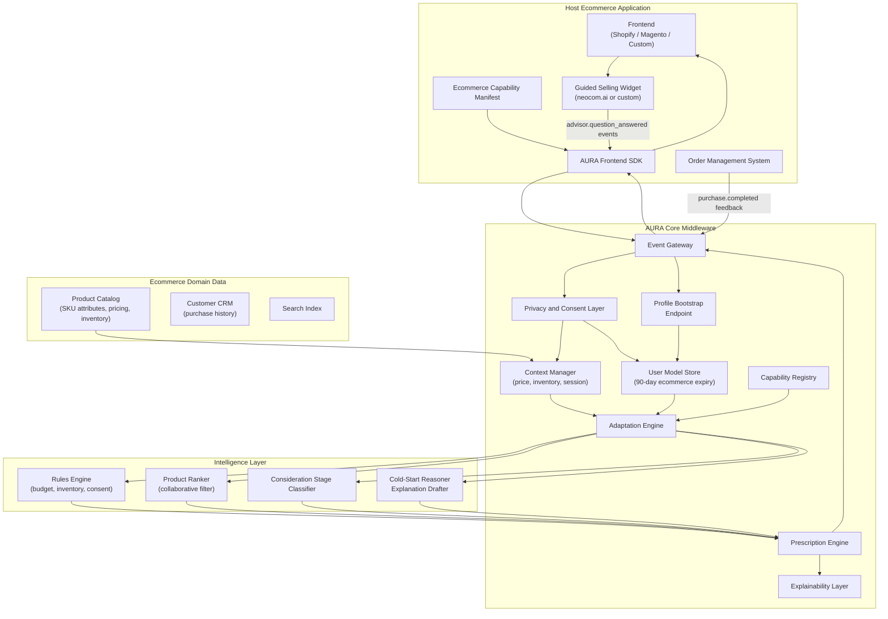

# AURA in AI-Advisory Ecommerce: Architecture, Mapping, and Gaps

## Abstract

Guided selling platforms such as neocom.ai demonstrate that conversational AI advisors substantially improve conversion rates and average order value in high-consideration ecommerce categories. Four published case studies — covering baby products, lighting, premium home appliances, and e-bikes — show consistent results: 2–2.5× conversion improvements and 19–26.5% AOV lifts when a discrete AI advisor widget replaces traditional filter-and-browse navigation. These results appear to derive from point-solution advisor interactions: the case studies describe no adaptation of the surrounding product listing pages, product detail pages, category navigation, search results, or cart after the advisor session ends, and neocom.ai's product positioning — "guided selling widget," "product finder," "shop agent" — is scoped to the advisor touchpoint rather than to full-store personalization middleware. This paper maps the AURA reference architecture (Adaptive UI Runtime Architecture) to AI-advisory ecommerce, showing concretely how AURA's prescription-based middleware would extend advisor-derived user models across the full shopping journey. It identifies twelve gaps between AURA's current specification and the requirements of production ecommerce AI advisory deployment, and organises them into two tiers: seven core framework gaps that would appear in any domain deployment (cross-session persistence, primary outcome feedback, profile bootstrap, anti-manipulation governance, experimentation coordination, multi-channel federation, data portability) and five domain extension points that are ecommerce-specific by nature and resolved by implementing a stable domain extension contract rather than modifying AURA core. This two-tier framing establishes how AURA achieves wide adoption across domains — education, health IT, financial services — without requiring per-domain framework rewrites.

## Keywords

Guided selling; ecommerce adaptive interfaces; AI advisor; AURA middleware; capability manifest; user model; ecommerce personalization; conversion optimization; governed adaptation.

## 1. Introduction

High-consideration ecommerce presents a structural challenge. Products such as lighting systems, premium appliances, electric bicycles, and baby safety equipment require expert knowledge to match correctly to individual customer needs. Traditional ecommerce solves this with filters and search: expose all products, let the customer narrow. This approach breaks down when the customer does not have the domain expertise to specify what they need. A lighting customer who knows they want "something for the living room" but does not know lumens, colour temperature, or beam angles cannot meaningfully use twenty filter dimensions. The result is choice overload, abandonment, and — in sensitive product categories such as infant safety — erosion of trust.

AI-advisory platforms address this by reversing the interface model. Instead of asking customers to specify product attributes, the advisor asks about goals, situations, constraints, and preferences in plain language, then maps the answers to product recommendations. Neocom.ai's case studies across four brands show that this approach consistently doubles conversion rates and expands average order value, with the strongest effects in complex and sensitive categories.

These results reveal genuine demand for intelligent product guidance in ecommerce. They also point toward an architectural limitation that the case studies do not address: whether the insight captured during a guided selling interaction flows into the rest of the experience. None of the four case studies describes post-advisor adaptation of the product listing, product detail pages, category navigation, or search results. A user who told the advisor they have a budget under €800 and need an energy-efficient washing machine may still encounter the same default sort order, the same twenty filters, and the same generic product cards as a user who just arrived with no context — if the host store has no mechanism to consume and act on the advisor-derived profile.

AURA (the Adaptive UI Runtime Architecture, Authored et al.) is a reference architecture for governed adaptive UI middleware that addresses exactly this class of problem. AURA's defining principle is prescription rather than generation: the host application declares what can change; AURA observes consented events, maintains user and context models, reasons over adaptation candidates, validates decisions against a typed capability manifest, and emits bounded UI prescriptions. The host application remains the renderer and the final authority.

This paper makes three contributions. First, it analyses neocom.ai's guided selling case studies as evidence of the demand pattern AURA should address in ecommerce. Second, it maps AURA's architecture — surfaces, user model, event taxonomy, decision pipeline, and governance — to the AI-advisory ecommerce domain with concrete examples. Third, it identifies twelve gaps between AURA's current specification and the requirements for full production deployment in this domain, providing an implementation agenda for future work.

### Research Program

This paper is a domain application paper produced alongside the AURA research programme:

1. Literature review of adaptive user interfaces in the LLM era.
2. AURA reference architecture for governed adaptive UI middleware.
3. Implementation and prototype paper for the AURA framework.
4. Testing and evaluation paper for AURA prototypes.

This paper analyses a production deployment domain to inform Papers 3 and 4. It does not report empirical findings.

## 2. Case Study Analysis: The Guided Selling Pattern

### 2.1 Evidence Base

Neocom.ai publishes case studies for four brands operating across different high-consideration product categories. The case studies are industry reports, not peer-reviewed empirical studies; they are treated here as evidence of a consistent deployment pattern rather than as controlled experimental results.

| Brand | Category | Key results | Core narrative |
|---|---|---|---|
| Emma & Noah | Baby and maternity products | 2× conversion rate | Trust-building over product features; expert guidance for sensitive categories |
| Paulmann Licht | Lighting systems | +26.5% average order value | 20 filters reduced to 8 guided questions; replaces specification overload |
| Miele | Premium home appliances | +76% conversion, +19% AOV, +266 monthly advisors | Premium in-store expertise lost in digital translation; AI product-line consultant |
| Rebike | Electric bicycles | 250% conversion improvement, advisor becomes customer-insight hub | Technical complexity replaced by intelligent recommendation; advisor generates strategic customer preference data |

### 2.2 Cross-Cutting Pattern

All four cases share structural features:

**Complex product domains requiring expert mapping.** None of these categories admits a simple specification. A Miele customer who needs a washing machine must navigate product lines, capacity, spin speed, energy class, connectivity, and installation type. A Rebike customer selecting an e-bike must reconcile frame geometry, motor position, battery range, terrain, and budget. The advisor collapses this complexity into a guided question sequence.

**Guided selling replaces filter overload.** The Paulmann case articulates the design hypothesis most directly: "20 filters → 8 questions." Traditional product filters require customers to specify in the system's vocabulary. Guided questions allow customers to describe their situation, and the AI performs the vocabulary translation.

**The advisor operates as a bounded, isolated interaction.** In all four cases, the advisor is described as a widget — a quiz modal, a conversational panel, a product finder — that runs to completion and delivers results. None of the case studies describes post-advisor adaptation of the surrounding product listing, product detail pages, navigation, or search. This absence of claim is consistent with neocom.ai's product positioning as a guided selling tool rather than full-store personalization middleware, though it does not conclusively establish that no broader adaptation occurs.

**The advisor interaction produces a structured user profile.** The guided question answers create an explicit, structured representation of the customer's needs: budget range, primary use case, technical constraints, and preferences. Rebike's case study makes this explicit — the CMO notes that the advisor surfaced customer segment insights that informed broader business strategy, identifying the advisor data as a strategic asset beyond its immediate conversion function.

### 2.3 The Guided Selling Gap

The architectural gap this paper addresses is the absence of any described mechanism for extending advisor-derived user profiles into the surrounding shopping experience. Whether or not a specific platform implements such extension, the case studies make no claims for it — and neocom.ai's product positioning does not suggest it. In a store without such a mechanism, an Emma & Noah customer who identifies their newborn safety priority sees the same product listing as an unauthenticated first-time visitor. A Paulmann customer who specifies "warm light for a living room dining area" encounters the same category navigation. A Miele session that establishes an €800 maximum produces no change in search result ordering. Rebike's advisor, having established a customer's terrain and commute preferences, has no pathway to surface those preferences on the product detail page.

This is not a neocom.ai deficiency; it reflects the architectural scope of a bounded advisor widget. A guided selling widget cannot govern multi-surface adaptation without becoming full adaptive middleware. AURA is that middleware.

A secondary gap concerns data ownership. Rebike's CMO identifies the advisor-generated preference data as strategically valuable. In a point-solution model, that data resides with the advisor vendor. AURA's explicit, auditable, user-correctable UserModel would make advisor-derived preference data a retailer-owned asset, portable and actionable outside the advisor widget.

## 3. AURA Mapped to AI-Advisory Ecommerce

### 3.1 Ecommerce Surface Declarations

AURA requires the host application to declare adaptable surfaces, components, and slots in a typed capability manifest. For an AI-advisory ecommerce platform, the relevant surfaces are:

```typescript
import { defineManifest } from "@aura-ui/core";
import { z } from "zod";

export const ecommerceManifest = defineManifest({
  surfaces: {
    "advisor.widget": {
      riskClass: "medium",
      slots: ["question-flow", "recommendation-results"],
      layoutStability: { strategy: "modal", maxDecisionWaitMs: 200 }
    },
    "product.listing": {
      riskClass: "low",
      slots: ["product-grid", "filters", "sort-controls"],
      layoutStability: { strategy: "reserve-space", maxDecisionWaitMs: 150 }
    },
    "product.detail": {
      riskClass: "low",
      slots: ["spec-highlights", "variant-selector", "recommendation-panel"],
      layoutStability: { strategy: "async-update", maxDecisionWaitMs: 300 }
    },
    "product.comparison": {
      riskClass: "low",
      slots: ["feature-table", "highlighted-attributes"],
      layoutStability: { strategy: "reserve-space", maxDecisionWaitMs: 200 }
    },
    "navigation.productLines": {
      riskClass: "medium",
      slots: ["primary-categories", "featured-line"],
      layoutStability: { strategy: "stable", maxDecisionWaitMs: 100 }
    },
    "cart.suggestions": {
      riskClass: "low",
      slots: ["accessory-rail", "bundle-offer"],
      layoutStability: { strategy: "async-update", maxDecisionWaitMs: 400 }
    },
    "search.results": {
      riskClass: "low",
      slots: ["result-grid", "filter-sidebar", "sort-controls"],
      layoutStability: { strategy: "reserve-space", maxDecisionWaitMs: 150 }
    }
  },
  components: {
    "product-card": {
      description: "Product card in listing and search surfaces",
      variants: ["standard", "compact", "comparison", "specification-led"],
      riskClass: "low",
      adaptableProps: z.object({
        variant: z.enum(["standard", "compact", "comparison", "specification-led"]),
        highlightedSpecKeys: z.array(z.string()).max(5).optional(),
        badgeLabel: z.string().max(24).optional(),
        sortPriority: z.number().optional()
      }),
      constraints: { requiresConsent: ["personalization"] }
    },
    "filter-panel": {
      description: "Product filter sidebar",
      riskClass: "medium",
      adaptableProps: z.object({
        highlightedFilterIds: z.array(z.string()).max(3),
        prePopulatedValues: z.record(z.string(), z.unknown()).optional(),
        collapsed: z.boolean()
      }),
      constraints: { reversible: true, requiresConsent: ["personalization"] }
    },
    "category-nav": {
      description: "Top-level product category navigation",
      riskClass: "medium",
      adaptableProps: z.object({
        prominentCategoryIds: z.array(z.string()).max(2),
        suppressedCategoryIds: z.array(z.string()).max(0)
      }),
      constraints: {
        reversible: true,
        requiresConsent: ["personalization"],
        note: "suppression not permitted; only prominence adjustment allowed"
      }
    }
  }
});
```

The `navigation.productLines` surface deserves special attention given the Miele case study. The quote — "now people can go on Miele.de and start actually in the right product line" — identifies category entry-point adaptation as the primary value driver for complex product portfolios. AURA's manifest explicitly forbids category suppression (`suppressedCategoryIds: z.array(z.string()).max(0)`) but allows prominence adjustment, preserving user access to the full catalog while guiding initial attention. This is the governance distinction between helpful adaptation and manipulative narrowing.

### 3.2 UserModel for Ecommerce

AURA's `UserModel` stores attributes with confidence, provenance, expiry, and consent metadata. For ecommerce AI advisory, the domain-specific attributes are:

```typescript
const ecommerceUserModel: UserModel = {
  userId: "session-or-authenticated-id",
  attributes: [
    {
      key: "budget_range",
      value: { min: 0, max: 800, currency: "EUR" },
      source: "explicit",
      confidence: 1.0,
      dataClass: "personalization",
      provenance: ["advisor.session:2024-11-15"],
      visibleToUser: true,
      expiresAt: "2025-02-15T00:00:00Z" // 90-day expiry for purchase-cycle alignment
    },
    {
      key: "primary_use_case",
      value: "family-laundry-large-household",
      source: "explicit",
      confidence: 0.95,
      dataClass: "personalization",
      provenance: ["advisor.session:2024-11-15"],
      visibleToUser: true,
      expiresAt: "2025-02-15T00:00:00Z"
    },
    {
      key: "expertise_level",
      value: "novice",
      source: "inferred",
      confidence: 0.72,
      dataClass: "behavior",
      provenance: ["product.viewed:5", "spec-tab.ignored:3"],
      visibleToUser: false,
      expiresAt: "2024-12-15T00:00:00Z"
    },
    {
      key: "consideration_stage",
      value: "comparing",
      source: "inferred",
      confidence: 0.81,
      dataClass: "behavior",
      provenance: ["product.compared:2", "advisor.recommendation_rejected:1"],
      visibleToUser: false,
      expiresAt: "2024-11-22T00:00:00Z" // Short expiry: stage changes quickly
    },
    {
      key: "brand_affinity",
      value: ["Miele", "Bosch"],
      source: "inferred",
      confidence: 0.60,
      dataClass: "behavior",
      provenance: ["product.viewed:brand-filtered"],
      visibleToUser: true,
      expiresAt: "2025-01-15T00:00:00Z"
    }
  ],
  consent: {
    behavior: true,
    personalization: true,
    sensitiveInference: false,
    cloudModelUse: false
  },
  updatedAt: "2024-11-15T14:32:00Z"
};
```

The 90-day expiry on advisor-sourced explicit attributes reflects ecommerce purchase cycle reality: a customer researching a washing machine may take weeks to decide. A 7-day expiry (suitable for session-level behavioral inference) would make the profile stale before the purchase completes.

### 3.3 Ecommerce Event Taxonomy

AURA's minimal event vocabulary (`surface.viewed`, `interaction.clicked`, `feedback.submitted`, `context.changed`) must be extended for ecommerce. The additional events carry payload schemas that inform the UserModel:

```typescript
// Advisor events — bootstrap the explicit user model
{ type: "advisor.question_answered",
  surfaceId: "advisor.widget",
  payload: { questionId: "q3-budget", answer: "under-800", answerDisplay: "Under €800" },
  consentClasses: ["personalization"] }

{ type: "advisor.recommendation_shown",
  surfaceId: "advisor.widget",
  payload: { recommendedProductIds: ["WER962", "WFG241"] },
  consentClasses: ["behavior"] }

{ type: "advisor.recommendation_accepted",
  surfaceId: "advisor.widget",
  payload: { productId: "WER962", acceptedAt: "product.detail" },
  consentClasses: ["behavior", "personalization"] }

// Product interaction events — infer consideration stage and expertise
{ type: "product.compared",
  surfaceId: "product.comparison",
  payload: { productIds: ["WER962", "WFG241"], specTabViewed: true },
  consentClasses: ["behavior"] }

{ type: "product.added_to_cart",
  surfaceId: "cart.suggestions",
  payload: { productId: "WER962", price: 749, category: "washing-machines" },
  consentClasses: ["behavior"] }

// Transactional feedback — the strongest ecommerce signal
{ type: "purchase.completed",
  surfaceId: "checkout",
  payload: { orderId: "ORD-4821", productIds: ["WER962"], totalValue: 749 },
  consentClasses: ["behavior", "personalization"] }
```

The `purchase.completed` event is architecturally distinct from AURA's current feedback vocabulary (`accept`/`dismiss`/`override`/`undo`). It is a transactional event from the order management system rather than a UI interaction event. Its handling is discussed in Section 5.4.

### 3.4 Decision Pipeline for Ecommerce

AURA's tiered pipeline (Rules → Recommender → SLM → LLM) applies naturally to ecommerce:

**Rules** handle hard constraints that must not be violated regardless of profile: price range ceiling from advisor answer (never show products above stated budget in prominently ranked positions), inventory exclusion (out-of-stock products must not be ranked first), consent enforcement (no personalization without consent), and explicit brand preferences expressed in the advisor.

**Recommender** handles product ranking within advisor-derived category constraints. Given `primary_use_case: "family-laundry-large-household"` and `budget_range: max 800 EUR`, a collaborative filter ranks products that similar users with similar explicit needs found satisfactory.

**SLM** handles consideration-stage inference and intent classification. A fast semantic classifier operating on browsing patterns (time on spec tab, number of products compared, return visit frequency) infers whether the current session is exploratory, comparative, or transactional. This classification determines adaptation aggressiveness: a user in exploratory mode should receive broader category guidance; a user in transactional mode should receive price and availability emphasis.

**LLM** handles two cases: cold-start (no advisor session, no behavioral history — the LLM reasons over the product catalog and the session's first few events to generate an initial profile hypothesis); and explanation drafting for medium-risk adaptations (generating a plain-language rationale for a category navigation adaptation that meets AURA's explanation standard). LLMs are not on the hot path; the SLM handles routine returning-user decisions.

### 3.5 Governance for Ecommerce

AURA's risk class system requires domain-specific calibration:

| Risk class | Ecommerce examples | Default behavior |
|---|---|---|
| `low` | Product-card sort order, filter pre-population, density, spec highlighting | Auto-apply with passive explanation and undo |
| `medium` | Category navigation prominence, advisor-driven ranking, pre-populated filters | Visible brief explanation, easy undo, conservative frequency |
| `high` | Urgency signals ("3 left in stock"), social proof injection, price anchoring, recommendation on high-AOV products | Requires explicit policy declaration; user-visible rationale required; undo always present |
| `critical` | Safety-rated product substitution in baby/medical categories, clinical recommendation in health devices | No autonomous application; human or editorial approval path |

The Emma & Noah case — baby products — is the ecommerce case where governance matters most. An advisor recommending infant safety equipment is operating in a domain where a wrong recommendation has non-reversible consequences. AURA's `critical` risk class, which requires human approval before application, should apply to any adaptation that affects which safety-critical products are presented prominently. This is not a limitation; it is the governance guarantee that makes AURA deployable in sensitive categories.

## 4. Integration Architecture



The integration has three phases from the user's perspective:

1. **Advisor interaction**: The guided selling widget (neocom.ai or equivalent) runs its question flow. Each answer fires an `advisor.question_answered` event through the AURA SDK into the event gateway. On advisor completion, a `profile.bootstrap` call imports the full structured advisor profile into the UserModel with `source: "explicit"` provenance.

2. **Post-advisor store adaptation**: Once the UserModel is bootstrapped, AURA begins emitting prescriptions to the surrounding store surfaces. The product listing re-sorts, relevant filters pre-populate, and the category navigation adjusts prominence — all within the constraints declared in the capability manifest.

3. **Continuous learning**: Subsequent behavioral events (`product.viewed`, `product.compared`, `product.added_to_cart`) refine the inferred attributes. The eventual `purchase.completed` event from the OMS provides the strongest feedback signal, updating confidence on the `primary_use_case` and `budget_range` attributes and feeding the recommender's collaborative signal.

## 5. Gaps and Missing Pieces

The ecommerce AI advisory domain surfaces twelve gaps in AURA's current specification. A careful reading reveals that these split into two structurally different tiers, and the distinction matters for how AURA achieves wide adoption.

**Tier 1 — Core framework gaps** are not ecommerce-specific. Seven of the twelve gaps would appear in any production AURA deployment, whether in education, health IT, financial services, or ecommerce. They are gaps in AURA's base specification that should be resolved in Paper 3 as first-class framework additions. A product team adopting AURA in any domain should inherit these from the core, not build them per deployment.

**Tier 2 — Domain extension points** are genuinely domain-specific by nature. Five gaps require ecommerce knowledge to implement: a product catalog adapter, volatile pricing context, platform-specific shims, a high-stakes governance calibration, and ecommerce surface type presets. These are not framework deficiencies — they are the expected output of domain extension work. Every domain deployment involves an equivalent set (education needs an LMS catalog adapter; health IT needs a FHIR adapter; ecommerce needs Shopify/Magento). The framework's responsibility is to define a stable **domain extension contract** against which domain packages implement these points in isolation, so that adopters install a package rather than write bespoke integrations.

The domain extension contract is three TypeScript interfaces:

```typescript
// Every domain package (@aura/domain-ecommerce, @aura/domain-education, etc.)
// implements these three interfaces and registers them with the AURA core.

interface AuraDomainDataSource<TEntity = unknown> {
  resolveEntities(ids: string[]): Promise<TEntity[]>;
  subscribeToCatalogChanges(handler: (change: CatalogChange<TEntity>) => void): Unsubscribe;
  searchEntities(query: DomainQuery): Promise<TEntity[]>;
}

interface AuraDomainEventVocabulary {
  events: Record<string, z.ZodSchema>;   // domain event types extending AURA base
  outcomeEvents: string[];               // events equivalent to "purchase.completed"
  bootstrapSources: string[];            // recognized external profile sources
}

interface AuraDomainSurfacePreset {
  surfaces: ManifestSurfaces;            // pre-declared surface definitions for this domain
  defaultRiskCalibration: RiskCalibration;
}
```

A product team adopting AURA installs `@aura/domain-ecommerce` (which implements these three interfaces) alongside `@aura/shopify-adapter` (which handles platform-specific API mapping). They write a capability manifest for their store. They do not modify AURA core.

### 5.1 Tier 1: Core Framework Gaps

These seven gaps belong in AURA's base specification. Addressing them in Paper 3 removes them from the adoption cost of every subsequent domain deployment.

#### 5.1.1 Cross-Session UserModel Persistence

AURA's session model is primarily within-session. Many real-world decision cycles span days or weeks: a customer researching a Miele washing machine may visit four times over three weeks; a learner working through a professional certification course returns over months; a patient managing a chronic condition interacts across many appointments. In all cases the UserModel must persist across sessions with attribute expiry calibrated to the domain's decision cycle length, not to the browser session.

Additionally, many users initiate interactions anonymously before authenticating later. AURA needs a defined profile merging strategy: when an anonymous session's UserModel is linked to an authenticated identity (via login event), inferred attributes transfer with appropriate confidence decay.

The current AUIP specification has no session continuity or profile merge endpoints. A `POST /aura/session/merge` endpoint is needed, along with explicit cross-session retention policy tied to the consent model.

#### 5.1.2 Primary Domain Outcome as Feedback Signal

AURA's feedback model (`accept`/`dismiss`/`override`/`undo`) covers UI-level interactions. In any consequential domain, the most important feedback signal is a transactional outcome from an external system, not a UI interaction — and it arrives with significant delay after the adaptation that influenced it. In ecommerce: `purchase.completed` from the OMS. In education: `assessment.passed` or `lesson.completed` from the LMS. In health: `care-plan.adhered` from the EHR.

These signals are qualitatively different from UI feedback: they are delayed (minutes to days), come from external systems, carry strong UserModel update authority, and raise an attribution problem (which of several concurrent prescriptions contributed to the outcome?).

AURA needs a generalised `transactional.completed` event type that any domain can parameterise:

```typescript
// General pattern — ecommerce instance shown
{ type: "transactional.completed",
  prescriptionIds: ["pres-7821"],
  outcome: { entityIds: ["WER962"], value: 749, currency: "EUR" },
  delayMs: 86400000,
  consentClasses: ["behavior", "personalization"] }
```

The domain extension contract's `outcomeEvents` field names which event types should be treated with transactional feedback authority for a given domain.

#### 5.1.3 External Profile Bootstrap Endpoint

Any domain that uses an onboarding flow — a guided selling advisor, a learning-needs assessment, a patient intake form, an LMS enrolment profile — produces a structured user profile before the main application is reached. AURA currently has no mechanism to import this profile in bulk. The AUIP protocol's `/aura/events` endpoint handles individual events; it does not support a structured import that declares provenance, confidence, and expiry for multiple attributes simultaneously.

A `POST /aura/profile/bootstrap` endpoint is needed:

```typescript
POST /aura/profile/bootstrap
{
  sessionId: "sess-4921",
  source: "guided-selling-advisor",  // or "lms-enrolment", "patient-intake", etc.
  attributes: [
    {
      key: "budget_range",
      value: { max: 800, currency: "EUR" },
      source: "explicit",
      confidence: 1.0,
      provenance: ["advisor.session:sess-4921"],
      expiresAt: "2025-02-15T00:00:00Z"
    }
  ]
}
```

The domain extension contract's `bootstrapSources` field enumerates which source identifiers AURA trusts for high-confidence explicit attribute bootstrapping in a given domain.

#### 5.1.4 Anti-Manipulation Governance Policy

AURA's governance model addresses adaptation quality and safety via risk classes, but does not define a policy class for **intent**: whether an adaptation supports rational decision-making or attempts to override it. This gap is not limited to ecommerce — engagement-maximizing adaptations in education can exploit compulsion loops; nudges in health IT can steer patients toward profitable rather than appropriate treatments.

A policy intent classification should be added to the AURA governance layer, supplementing risk classes:

```typescript
type AdaptationPolicy = {
  // ... existing risk class fields
  intentClass: "assistive" | "informative" | "persuasive" | "manipulative";
  // "manipulative": blocked by default; requires explicit override with audit trail
}
```

Genuine low-stock notifications are `informative`. Artificial urgency signals ("only 3 left!") when stock is not actually low are `manipulative`. An LMS that increases notification frequency to drive re-engagement regardless of user preference is `manipulative`. The distinction requires a declared `intentClass` in the manifest — it is not derivable from the adaptation type alone.

#### 5.1.5 Experimentation Coordination

Any product team running A/B tests faces the same conflict: AURA's adaptation pipeline and the experimentation platform both want to control the same surfaces. If a user is assigned to a "price-sorted listing" experiment, AURA independently altering product ranking corrupts the treatment assignment. This is not an ecommerce-specific concern — it applies wherever a product team uses both AURA and any experimentation platform (Optimizely, LaunchDarkly, home-built).

A manifest-level `experimentGating` constraint is needed:

```typescript
"product.listing": {
  constraints: {
    experimentGating: {
      checkEndpoint: "/experiments/check-assignment",
      blockedWhenAssigned: ["plp-sort-experiment", "filter-position-test"]
    }
  }
}
```

When a user is in an active experiment covering a surface, AURA should observe-only rather than emit prescriptions for that surface.

#### 5.1.6 Multi-Channel Surface Federation

Real deployments operate across multiple channel surfaces sharing a common user model: web, mobile app, in-store digital display, email, progressive web app. AURA Paper 2 identifies federated manifests as future work; the ecommerce case (web + mobile + in-store) and the education case (web + mobile + native LMS) both make this requirement concrete.

A Miele customer who completes an advisor session on the desktop website should receive consistent adaptation on the Miele mobile app. A learner's assessed skill level should inform adaptation on the course mobile app as well as the web platform. Cross-channel UserModel access requires:

- A shared persistent UserModel store accessible across independently deployed channel manifests
- Cross-channel consent management (consent given on web does not automatically extend to in-store displays)
- Federated manifest reconciliation: each channel declares its own surfaces; the AURA session manager coordinates without requiring a single monolithic manifest

#### 5.1.7 User Preference Data Portability

The UserModel accumulates structured user attributes with explicit provenance and consent metadata. AURA already specifies `/aura/profile` (fetch) and `/aura/profile/correction` (correct or remove). GDPR Article 20 and CCPA require that users can export their data in a portable, machine-readable format. This requirement applies to any AURA deployment — it is not domain-specific.

The base AUIP spec should add:
- **`GET /aura/profile/export`**: full structured export of user attributes in a portable format
- **Analytics aggregation endpoint**: a consented, anonymised aggregation pathway that lets deployers understand aggregate preference distributions without accessing individual-level data (individual-level flows require personalization consent; aggregated analytics flows require only behavior consent — AURA's data-class scoping already supports this distinction but the endpoint is not specified)

### 5.2 Tier 2: Domain Extension Points

These five gaps are domain-specific by nature. They are resolved by implementing the domain extension contract defined above, not by modifying AURA core. Each has a structural equivalent in other domains.

#### 5.2.1 Domain Data Source Adapter

AURA's architecture references "Domain Data Sources" without specifying an integration contract. Every domain has a catalog of entities the adaptation engine reasons over: products (ecommerce), courses and modules (education), procedures and medications (health IT). The adaptation engine needs to query this catalog, and the catalog changes in ways that can invalidate active prescriptions.

The `AuraDomainDataSource` interface defined above is the required contract. For ecommerce, the implementation connects to the product catalog:

- **Batch entity resolution**: given a set of product SKUs, return full attribute records
- **Change subscriptions**: price changes, stock depletions, and promotional activations trigger catalog change events that the context manager processes
- **Domain query support**: the adaptation engine can search the catalog with domain-specific filters (e.g., `budget_range`, `category`) without AURA core knowing ecommerce semantics

The equivalent in education: a Canvas or Moodle course catalog adapter. In health: an Epic FHIR medication and procedure catalog adapter. The interface is the same; the implementation is domain-specific.

#### 5.2.2 Volatile Domain Context

AURA's `ContextModel` captures device, viewport, locale, and task state. It does not support real-time context that changes independently of user interaction. In ecommerce, price and inventory are volatile: a product within budget yesterday may be out of stock or repriced today. In education, course availability and cohort capacity change. In health, appointment slot availability changes in real time.

A typed `domainContext` extension to `ContextModel` is needed, with domain-specific fields injected by the domain data source adapter:

```typescript
// Ecommerce domainContext — injected by @aura/domain-ecommerce
domainContext: {
  priceContext: {
    activeCurrency: "EUR",
    promotionalPeriod: boolean,
    sessionPriceSnapshot: Record<string, number>
  },
  inventoryContext: {
    lowStockThresholdUnits: 3,
    outOfStockBehavior: "suppress-from-recommendations"
  }
}
```

Prescriptions that reference domain entities must carry entity-validity checks, and context-lock rejection must account for domain context changes since the prescription was generated.

#### 5.2.3 Platform Adapters

AURA's SDK is framework-agnostic. Production deployments use platforms with specific APIs for entity data, user identity, interaction events, and transactional outcomes. Without platform adapters, every deployment writes custom integration code.

The adapter pattern maps platform-specific events and data structures to AURA's typed event envelope. For ecommerce:
- `@aura/shopify-adapter` — Storefront API for catalog, Customer API for identity, Cart API for cart events, Webhooks for purchase.completed
- `@aura/magento-adapter` — GraphQL catalog, customer token mapping, order webhooks

The structural equivalent for education: `@aura/canvas-adapter`, `@aura/moodle-adapter`. For health: `@aura/epic-adapter` (FHIR R4). The adapter interfaces are defined by the domain extension contract; platform packages implement them.

#### 5.2.4 Stake-Level Governance Calibration

AURA's risk class framework (low/medium/high/critical) is defined at the framework level without domain-specific stake calibration. High-consideration product decisions — Miele appliances (€500–€2,000), Rebike e-bikes (€2,000–€5,000), course enrollments with significant tuition fees, clinical care pathway recommendations — carry consequences that warrant more conservative adaptation behavior than low-stakes decisions of the same technical risk class.

The `defaultRiskCalibration` field in the `AuraDomainSurfacePreset` interface allows domain packages to declare stake-adjusted defaults:

- **Conservative frequency**: limit how often high-stakes surface prescriptions are re-applied within a session
- **Mandatory explanation threshold**: surface-specific price or stakes threshold above which an explanation is mandatory rather than passive
- **Undo prominence**: undo controls for high-stakes adaptations must be visually prominent, not a passive passive link

This is domain configuration, not a framework change. Each domain package ships a sensible default calibration; individual deployers can override.

#### 5.2.5 Domain-Specific Surface Type Presets

AURA's capability manifest supports arbitrary surface declarations. Each domain has characteristic surface types that recur across deployments and whose governance constraints are well-understood. Shipping these as preset surface types in the domain package — rather than requiring each deployer to rediscover the right risk classes and constraints — reduces adoption friction.

For ecommerce: `navigation.productLines` (medium risk, no-suppression constraint, session-scoped expiry), `advisor.widget` (medium risk, modal strategy), `cart.suggestions` (low risk, async-update strategy).

The structural equivalent in education: `curriculum.pathway` (medium risk, no-module-suppression constraint), `assessment.surface` (high risk, human-approval path for scoring adaptations). In health: `care-plan.recommendations` (critical risk, mandatory human approval).

These presets do not limit what deployers can declare — they accelerate the common case and encode governance best practice as defaults rather than requiring each team to derive them independently.

## 6. Implementation Roadmap

An ecommerce team adopting AURA alongside an existing guided selling platform should follow a phased sequence that builds from low-risk, high-confidence adaptations toward the full capability set.

**Phase 1 — Minimum Viable AURA (weeks 1–8)**
Declare the `product.listing` surface only. Emit `advisor.question_answered` events. Implement the `profile.bootstrap` call on advisor completion. Deploy a rules-only pipeline: `budget_range: max 800 EUR` → pre-sort by price ascending; `primary_use_case: family-laundry` → pre-populate capacity and energy-class filters. No LLM; no recommender. Passive explanations and undo. Measure acceptance rate, undo rate, and conversion lift against the non-adapted baseline.

**Phase 2 — Advisor Integration and Consideration Stage (weeks 9–20)**
Add the SLM-based consideration-stage classifier. Extend manifest to `product.detail` surface (spec highlighting based on `primary_use_case`). Add the recommender pipeline for returning users with purchase history. Integrate `purchase.completed` from the OMS as a transactional feedback signal. Implement cross-session UserModel persistence for a 90-day window.

**Phase 3 — Full Pipeline and Platform Adapter (weeks 21–40)**
Deploy LLM for cold-start sessions (no advisor, no prior history). Implement the ecommerce platform adapter for the host's platform (Shopify or Magento). Add catalog ingestion with price and inventory context. Declare the `navigation.productLines` surface with no-suppression constraints. Implement the anti-manipulation policy class in the prescription engine. Introduce `experimentGating` constraints for any surfaces covered by active A/B tests.

## 7. Conclusion

The neocom.ai case studies demonstrate consistent, substantial value from AI advisory in high-consideration ecommerce. Across baby products, lighting, appliances, and e-bikes, guided selling interactions produce conversion improvements of 2–2.5× and AOV lifts of 19–26.5%. The data is industry-reported rather than experimentally controlled, but the consistency across four structurally different product categories establishes a credible pattern.

The architectural limitation of these deployments is that value is localised to the advisor widget interaction. The rest of the shopping experience — product listing, product detail, category navigation, search results, cart — remains static after the advisor completes. AURA addresses this limitation directly: it is the middleware layer that extends advisor-derived user models into governed, multi-surface adaptation across the full shopping journey.

The mapping in Section 3 shows that AURA's core constructs — capability manifest, UserModel, AUIP protocol, tiered decision pipeline, governance framework — apply naturally to ecommerce with domain-specific parameterisation. The ecommerce surface map, UserModel attribute schema, event taxonomy extension, and governance calibration are concrete rather than speculative; they are derivable from the case study patterns and the existing AURA specification.

Section 5 identifies twelve gaps and organises them into two tiers. Seven are core framework gaps — cross-session persistence, primary outcome feedback, external profile bootstrap, anti-manipulation governance, experimentation coordination, multi-channel federation, and data portability — that would appear in any production AURA deployment regardless of domain. These belong in AURA's base specification and should be resolved in Paper 3. Five are domain extension points — data source adapter, volatile domain context, platform adapters, stake-level governance calibration, and surface type presets — that are domain-specific by nature and expected of any production deployment. The framework's responsibility for these is not to eliminate them but to define a stable domain extension contract (three TypeScript interfaces: `AuraDomainDataSource`, `AuraDomainEventVocabulary`, `AuraDomainSurfacePreset`) against which domain packages implement them in isolation.

This architecture supports wide adoption. A product team adopting AURA in education, health IT, or financial services inherits the seven core additions from the base framework, then installs a domain package (`@aura/domain-education`, `@aura/domain-health`) that implements the extension contract for their domain. They write a capability manifest for their specific application. They do not modify AURA core and they do not re-derive the governance defaults that the domain package encodes. The ecommerce analysis demonstrates that this pattern is tractable; it also establishes the extension contract as the mechanism by which AURA achieves domain breadth without framework bloat.

## References

Emma & Noah case study. (2024). *How emma & noah doubled their conversion rate with guided selling solution*. Neocom.ai. https://neocom.ai/case-stories/emmah-noah

Miele case study. (2024). *How Miele transformed their online store into an AI sales advisor*. Neocom.ai. https://neocom.ai/case-stories/miele

Paulmann Licht case study. (2024). *From 20 filters to 8 questions: How Paulmann Licht achieved 26.5% AOV uplift*. Neocom.ai. https://neocom.ai/case-stories/paulmann-licht

Rebike case study. (2024). *From which bike? to This bike! How personalised guidance transforms Rebike's conversion rates*. Neocom.ai. https://neocom.ai/case-stories/rebike

[AURA Paper 1] — *Adaptive User Interfaces in the LLM Era: State of the Art, Limitations, and Research Opportunities*. (Adaptive Interfaces Use Cases research programme, Paper 1.)

[AURA Paper 2] — *AURA: A Reference Architecture for Governed Adaptive User Interface Middleware*. (Adaptive Interfaces Use Cases research programme, Paper 2.)

Hu, J., and Lee, E. T. (2026). *The impact of integrated AI and AR in e-commerce: The roles of personalization, immersion, and trust in influencing continued use*. Journal of Theoretical and Applied Electronic Commerce Research, 21(1), Article 33. https://doi.org/10.3390/jtaer21010033

Kim, S. H., Kim, E. H., Yang, H., Lee, J., and Lim, H. (2026). *Clarifying or complicating?: Understanding older adults' engagement with real-world XAI in e-commerce*. Proceedings of the ACM Web Conference 2026. https://doi.org/10.1145/3772318.3791908

De Andres, J., Fernandez-Lanvin, D., Gonzalez-Rodriguez, M., and Pariente-Martinez, B. (2026). *AI models for demographic prediction in e-commerce: Age and gender from initial user interactions*. PeerJ Computer Science. https://doi.org/10.7717/peerj-cs.3563
