# AURA Architecture Deep Dive — Interview Prep

> **Purpose:** Comprehensive visual breakdown of the AURA (Adaptive UI Runtime Architecture) reference architecture for interview presentation. Each section expands a layer or sub-system with annotated Mermaid diagrams.

---

## Table of Contents

1. [The Big Picture — Four Layers](#1-the-big-picture)
2. [Host Application Layer](#2-host-application-layer)
3. [Frontend SDK & AUIP Protocol](#3-frontend-sdk--auip-protocol)
4. [Capability Manifest — The Safety Boundary](#4-capability-manifest)
5. [AURA Core Middleware — Component Map](#5-aura-core-middleware)
6. [User Model & Context Model](#6-user-model--context-model)
7. [Decision Pipeline — Tiered Intelligence](#7-decision-pipeline)
8. [UIPrescription Lifecycle](#8-uiprescription-lifecycle)
9. [Governance, Risk Classes & Explanation](#9-governance-risk-classes--explanation)
10. [Consent & Privacy Model](#10-consent--privacy-model)
11. [Failure Modes & Graceful Degradation](#11-failure-modes--graceful-degradation)
12. [App / AURA Boundary & Conflict Resolution](#12-app--aura-boundary--conflict-resolution)
13. [End-to-End Adaptive Loop](#13-end-to-end-adaptive-loop)
14. [Adoption Journey](#14-adoption-journey)

---

## 1. The Big Picture

AURA is **middleware**. It sits between a host application (which owns rendering) and intelligence backends (which reason about what to change). The core claim: adaptation happens through **typed prescriptions against declared capabilities**, never through unrestricted DOM manipulation or model-generated UI.

### 1.1 Four-Layer Stack

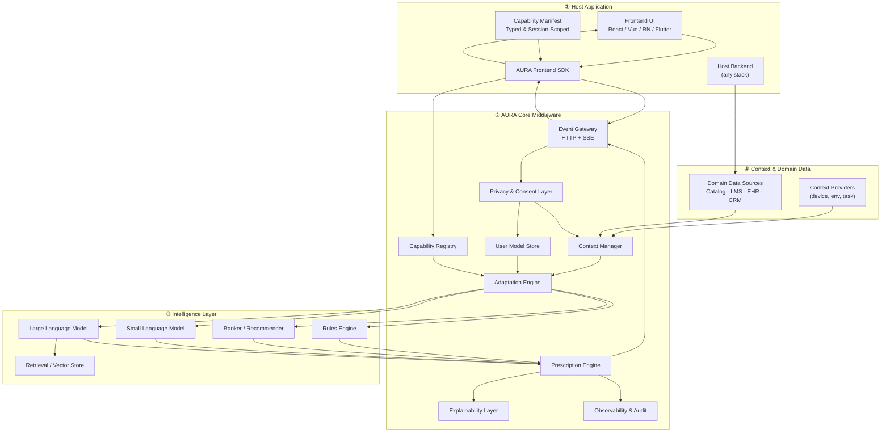

### 1.2 Authority Split — Who Owns What

```mermaid
graph LR
  subgraph AURA_OWNS["AURA Owns"]
    A1["Adaptive reasoning\nover consented events"]
    A2["User & Context Models"]
    A3["Prescription generation\n& validation"]
    A4["Explanation records"]
    A5["Consent enforcement\n& audit logs"]
    A6["Feedback loop learning"]
  end

  subgraph HOST_OWNS["Host App Owns"]
    H1["Rendering &\ncomponent state"]
    H2["Business logic &\nauthorization"]
    H3["Routing & navigation"]
    H4["Accessibility\nimplementation"]
    H5["Final UI state\n& conflict resolution"]
    H6["Design system &\ncomponent library"]
  end

  AURA_OWNS -- "bounded prescriptions\nonly" --> HOST_OWNS
  HOST_OWNS -- "consented events\n& feedback" --> AURA_OWNS
```

---

## 2. Host Application Layer

The host application is the product. AURA augments it without owning it.

### 2.1 Host Responsibilities

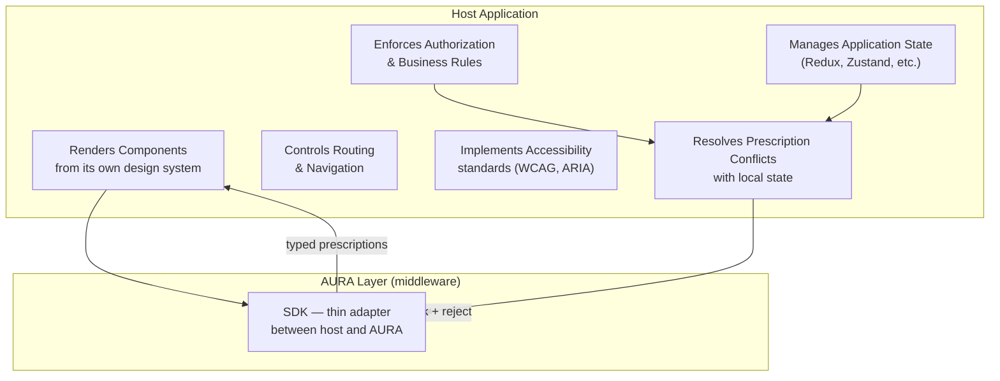

### 2.2 Frontend SDK Responsibilities

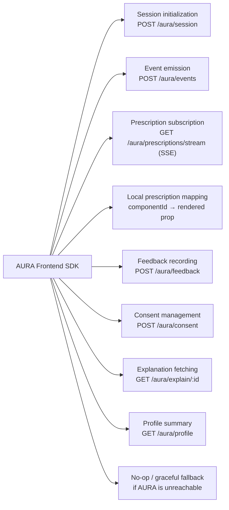

---

## 3. Frontend SDK & AUIP Protocol

AUIP is a thin JSON-over-HTTP protocol. Prescriptions are delivered via Server-Sent Events (SSE) because adaptation is primarily server-pushed, one-directional, and non-blocking.

### 3.1 AUIP Endpoint Map

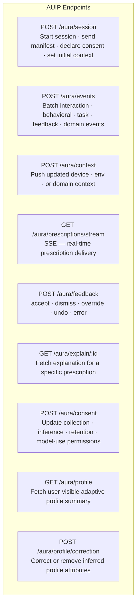

### 3.2 Session Lifecycle — Sequence Diagram

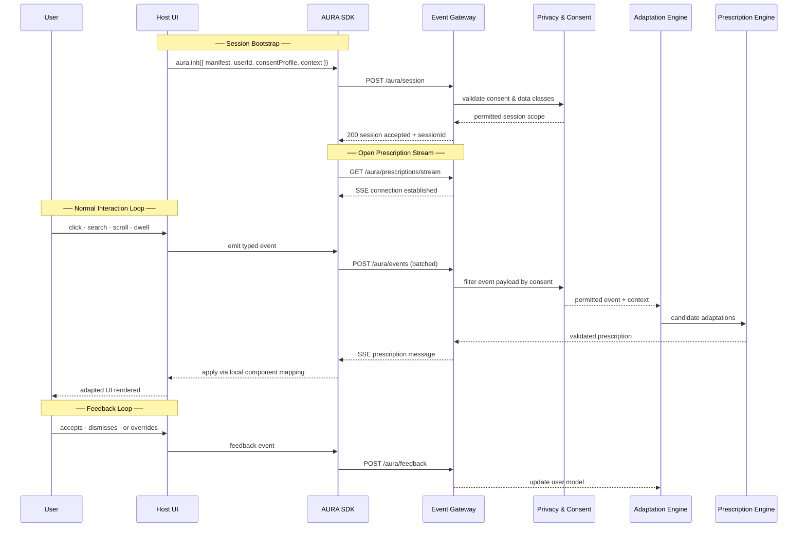

### 3.3 Context Version Guard — contextSequenceId

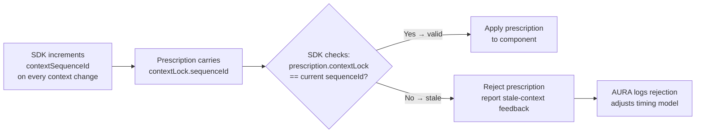

---

## 4. Capability Manifest

The manifest is the **primary safety boundary**. AURA cannot prescribe changes to anything not declared here.

### 4.1 Manifest Structure

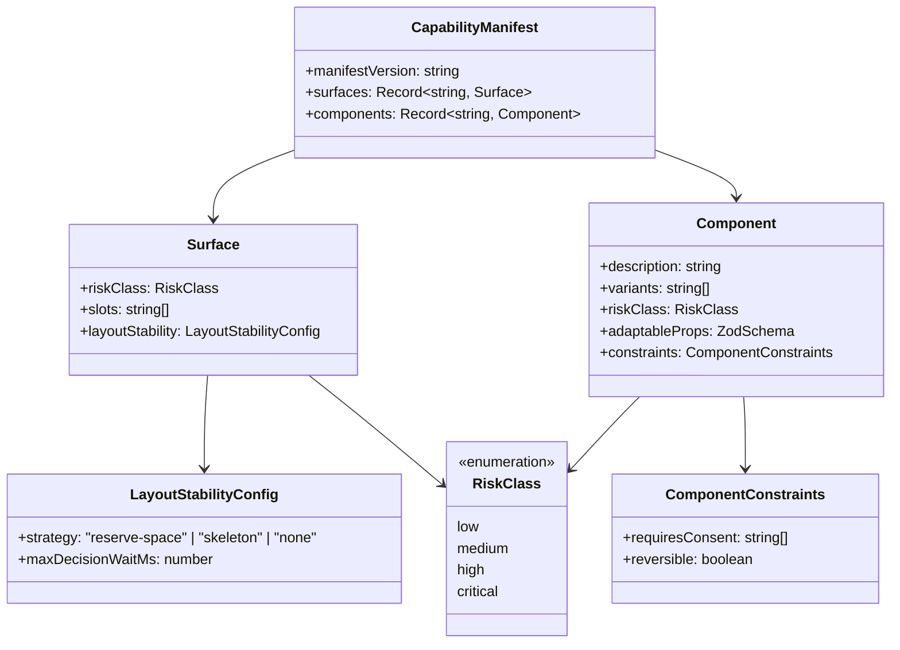

### 4.2 Manifest as Action-Space Boundary

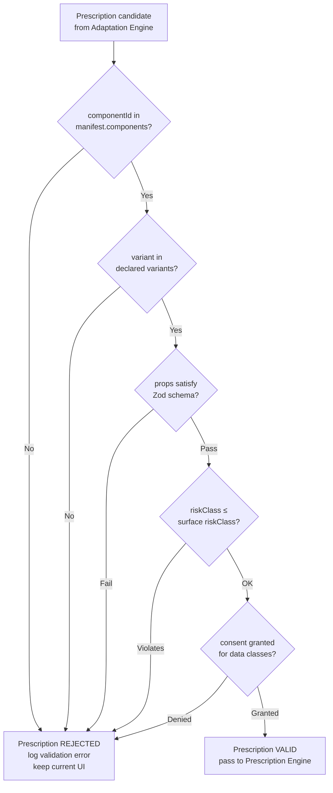

### 4.3 Manifest Versioning & Session Scoping

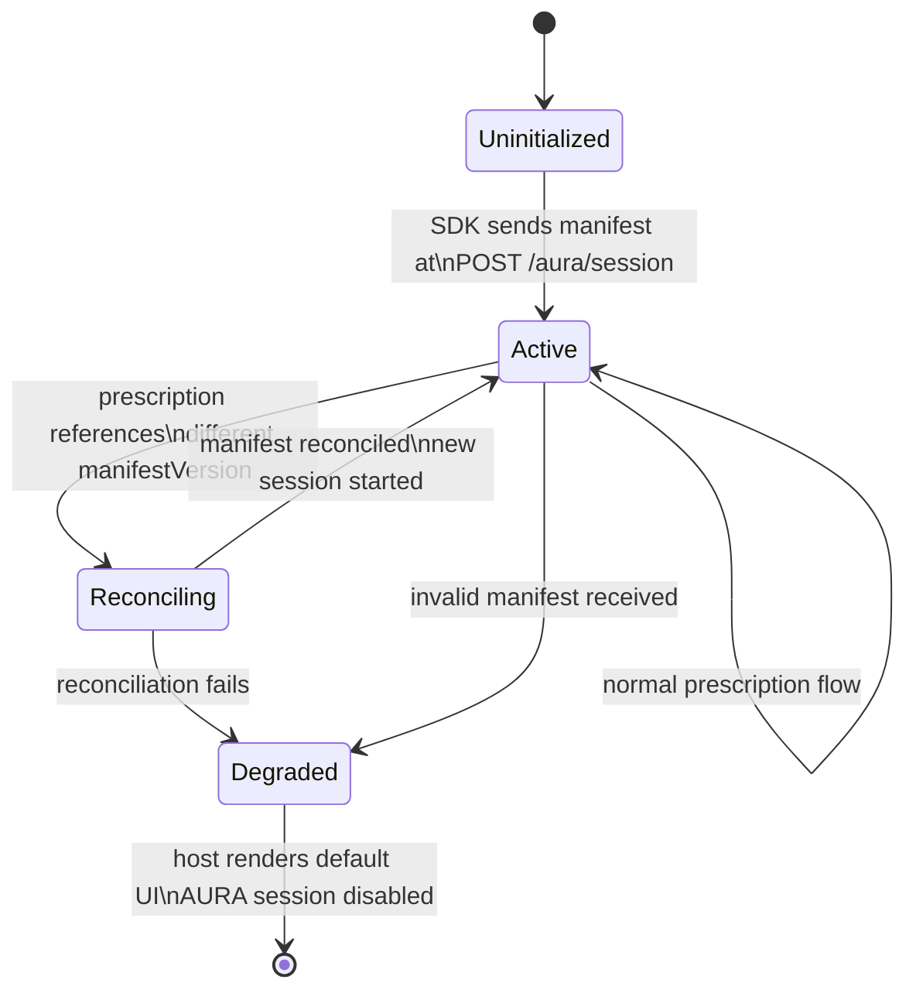

---

## 5. AURA Core Middleware

### 5.1 Component Interaction Map

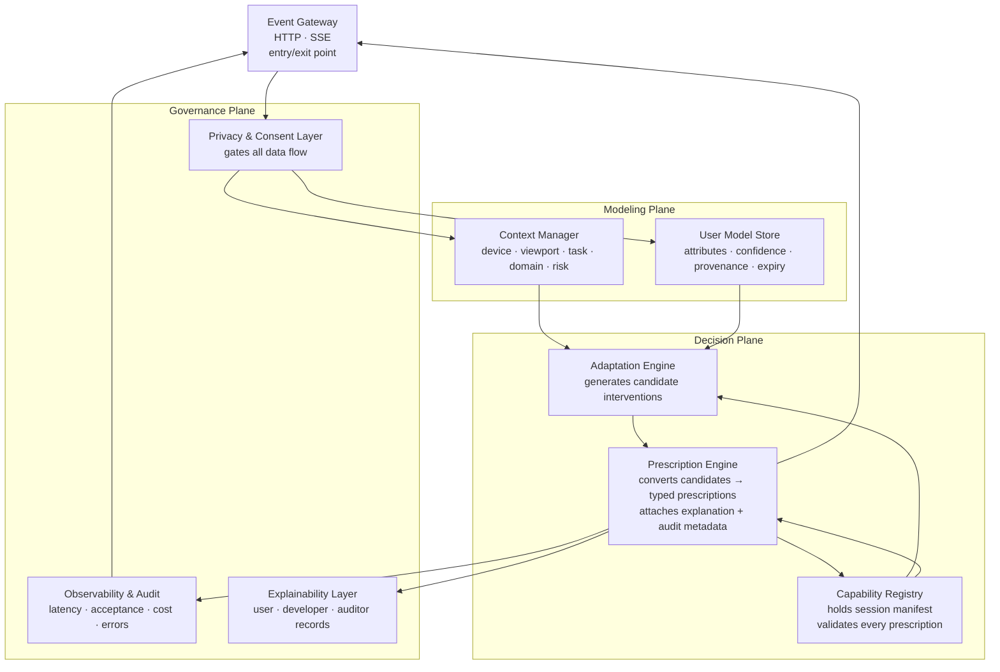

### 5.2 Event Gateway Detail

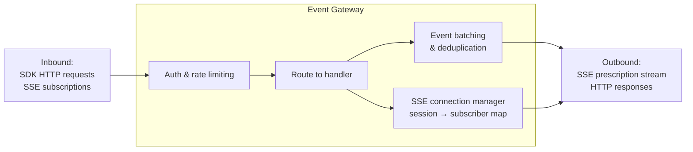

### 5.3 Capability Registry Detail

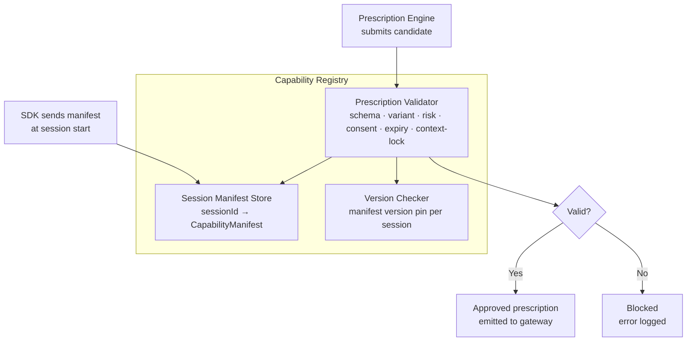

---

## 6. User Model & Context Model

### 6.1 UserModel Entity

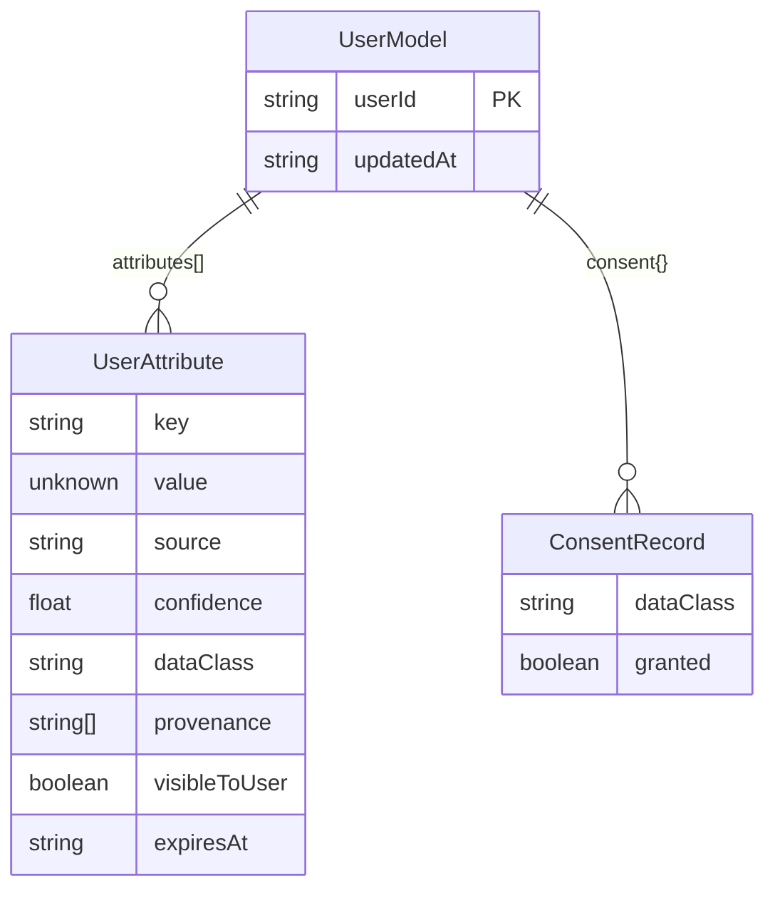

### 6.2 Attribute Sources & Lifecycle

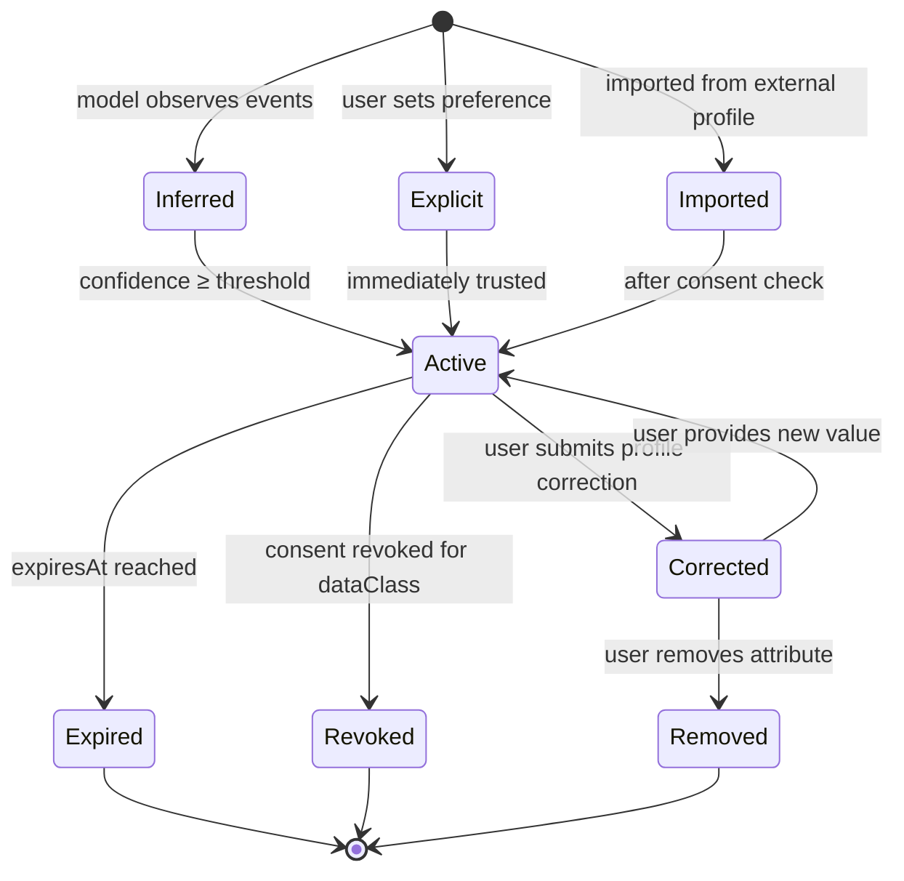

### 6.3 ContextModel Structure

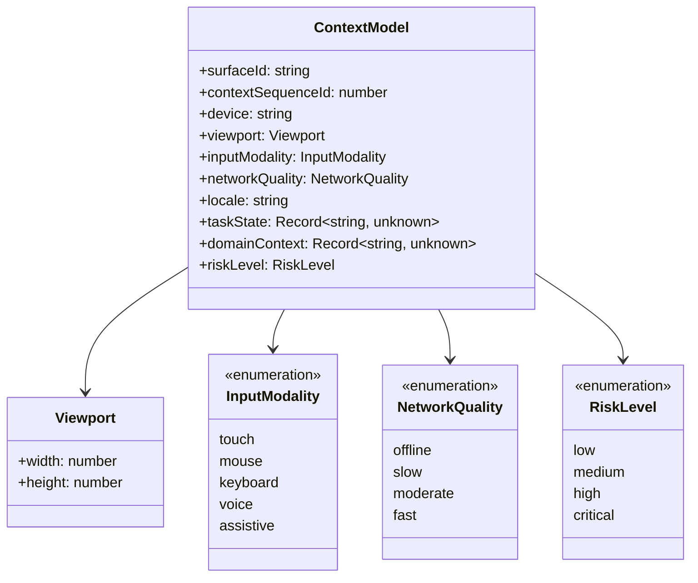

### 6.4 How Models Feed the Decision

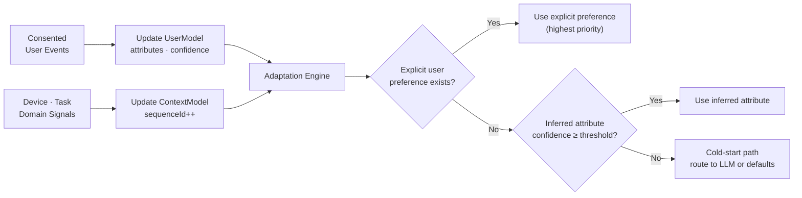

---

## 7. Decision Pipeline

The pipeline is **tiered**: cheap and auditable methods run first, expensive or opaque methods run only when justified.

### 7.1 Full Decision Flowchart

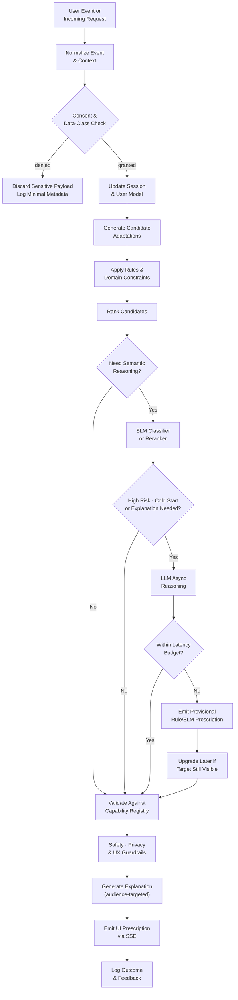

### 7.2 Intelligence Tier Responsibilities

```mermaid
graph TD
  subgraph T1["Tier 1 — Rules Engine"]
    R1["Hard policy constraints"]
    R2["Explicit user preferences"]
    R3["Risk-class gating"]
    R4["Accessibility defaults"]
    R5["Low-latency common cases"]
    LATENCY1["Latency: immediate\n< 10ms"]
  end

  subgraph T2["Tier 2 — Ranker / Recommender"]
    R6["Item / lesson / product ranking"]
    R7["Candidate ordering\nby signal weight"]
    R8["Collaborative filtering\ncontent-based signals"]
    LATENCY2["Latency: fast\n10–150ms"]
  end

  subgraph T3["Tier 3 — Small Language Model"]
    R9["Intent classification"]
    R10["Friction detection"]
    R11["Session summarization"]
    R12["Layout hint generation"]
    R13["Low-latency semantic reranking"]
    R14["Private / on-device inference\n(preferred for sensitive data)"]
    LATENCY3["Latency: fast\n50–300ms"]
  end

  subgraph T4["Tier 4 — Large Language Model"]
    R15["Cold-start onboarding reasoning"]
    R16["Grounded explanation drafting"]
    R17["Semantic mapping:\nuser goal → manifest component"]
    R18["Complex multi-factor decisions"]
    R19["NOT on hot path\nfor returning users"]
    LATENCY4["Latency: deliberate\nasync · 300ms–3s+"]
  end

  T1 -->|"only if insufficient"| T2
  T2 -->|"only if insufficient"| T3
  T3 -->|"only if justified"| T4
```

### 7.3 Latency Classes & Rendering Strategy

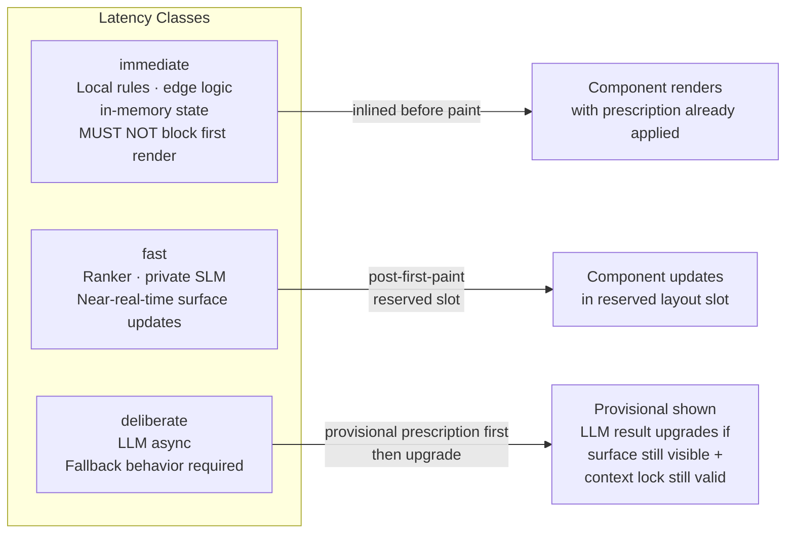

---

## 8. UIPrescription Lifecycle

### 8.1 Prescription Type Taxonomy

```mermaid
graph TD
  PRESC["UIPrescription"]

  PRESC --> RANK["rank\nReorder items within a slot\norderedIds[]"]
  PRESC --> VARIANT["componentVariant\nSwap component variant\n+ optional propsPatch"]
  PRESC --> LAYOUT["layout\ncompact · expanded\nstep-by-step · accessible"]
  PRESC --> CONTENT["content\nSwap content key/value\nfor a target slot"]
  PRESC --> A11Y["accessibility\nfontScale · contrast\nmotion · inputMode"]
  PRESC --> FILTER["filter\nvisibleFilters[]\nhighlightedFilter"]
```

### 8.2 Prescription Metadata Structure

```mermaid
classDiagram
  class UIPrescription {
    +id: string
    +surfaceId: string
    +manifestVersion: string
    +latencyClass: LatencyClass
    +mode: PrescriptionMode
    +adaptations: Adaptation[]
    +constraints: PrescriptionConstraints
    +explanation: ExplanationSummary
    +audit: AuditMetadata
  }

  class ContextLock {
    +sequenceId: number
    +capturedAt: string
  }

  class PrescriptionConstraints {
    +expiresAt: string
    +reversible: boolean
    +requiresUserConfirmation: boolean
  }

  class ExplanationSummary {
    +id: string
    +summary: string
    +userVisible: boolean
    +factors: string[]
    +confidence: number
  }

  class AuditMetadata {
    +policyVersion: string
    +modelVersions: string[]
    +dataClassesUsed: string[]
  }

  class PrescriptionMode {
    <<enumeration>>
    recommend
    autoApply
    askUser
    observeOnly
  }

  class LatencyClass {
    <<enumeration>>
    immediate
    fast
    deliberate
  }

  UIPrescription --> ContextLock : contextLock
  UIPrescription --> PrescriptionConstraints : constraints
  UIPrescription --> ExplanationSummary : explanation
  UIPrescription --> AuditMetadata : audit
  UIPrescription --> PrescriptionMode
  UIPrescription --> LatencyClass
```

### 8.3 Prescription Application — State Machine

```mermaid
stateDiagram-v2
  [*] --> Received : SSE delivers prescription to SDK
  Received --> ContextCheck : SDK checks contextLock
  ContextCheck --> Expired : lock stale or prescription expired
  ContextCheck --> ConsentCheck : lock valid
  ConsentCheck --> Rejected : consent gate fails
  ConsentCheck --> ManifestCheck : consent OK
  ManifestCheck --> Rejected : component/variant not in manifest
  ManifestCheck --> ModeCheck : manifest validates
  ModeCheck --> Applied : mode = autoApply
  ModeCheck --> Offered : mode = recommend
  ModeCheck --> Prompted : mode = askUser
  ModeCheck --> Observed : mode = observeOnly
  Offered --> Applied : user accepts
  Offered --> Dismissed : user dismisses
  Prompted --> Applied : user or professional confirms
  Prompted --> Dismissed : user declines
  Applied --> Undone : user triggers undo
  Applied --> [*] : feedback logged
  Dismissed --> [*] : feedback logged
  Undone --> [*] : reversion feedback logged
  Rejected --> [*] : reject feedback + error log
  Expired --> [*] : stale-context feedback
```

### 8.4 Prescription Validation — Atomicity Rule

```mermaid
flowchart TD
  PRESC_IN["Incoming Prescription\nwith N adaptations"]

  subgraph DEFAULT["Default: Atomic"]
    VA["Validate adaptation 1"]
    VB["Validate adaptation 2"]
    VC["Validate adaptation N"]
    ALL{"All valid?"}
    VA --> ALL
    VB --> ALL
    VC --> ALL
    ALL -- "Yes" --> APPLY_ALL["Apply ALL\nadaptations"]
    ALL -- "Any fail" --> REJECT_ALL["Reject ENTIRE\nprescription\nkeep current UI"]
  end

  subgraph PARTIAL["Exception: Explicit Groups"]
    G1["Group A\n(independent adaptations)"]
    G2["Group B\n(independent adaptations)"]
    G1 --> APPLY_G1["Apply Group A\nif valid"]
    G2 --> APPLY_G2["Apply Group B\nif valid"]
  end

  PRESC_IN --> DEFAULT
  PRESC_IN -->|"only if prescription\nexplicitly separates groups"| PARTIAL
```

---

## 9. Governance, Risk Classes & Explanation

### 9.1 Risk Class Decision Matrix

```mermaid
graph TD
  INPUT["Prescription Candidate"] --> RC{"Risk Class?"}

  RC -- "low" --> LOW["Auto-apply\nPassive explanation on demand\nUndo available"]
  RC -- "medium" --> MED["Apply with visible explanation\nEasy undo\nConservative frequency limits"]
  RC -- "high" --> HIGH["Ask user or responsible human\nbefore applying\nStrong audit trail"]
  RC -- "critical" --> CRIT["Human approval path required\nStrict audit\nNo autonomous application\nCompliance logging"]

  LOW --> LOW_EX["Example: product card variant\nfilter order · badge label"]
  MED --> MED_EX["Example: navigation simplification\ncontent hiding · workflow reordering"]
  HIGH --> HIGH_EX["Example: assessment content\nfinancial defaults\nclinical info emphasis"]
  CRIT --> CRIT_EX["Example: medication · diagnosis\nsafety alerts\nregulated workflow changes"]
```

### 9.2 Explanation Model — Audience & Display Mode

```mermaid
graph TD
  subgraph AUDIENCES["Explanation Audiences"]
    EU["End User\nPlain-language reason\nfactors · controls · undo path"]
    DEV["Developer\nTrigger · context · scores\nrejected candidates\nmodel & policy versions"]
    AUD["Auditor\nConsent state · data classes\nretention policy · risk class\npolicy version · model hashes"]
  end

  subgraph DISPLAY["Display Modes"]
    PASS["Passive\nLow-risk · on demand only"]
    ACT["Active\nMedium-risk · brief inline rationale"]
    CONF["Confirmation\nHigh-risk · approve before applying"]
    DASH["Dashboard\nUser-initiated profile review\ncorrection · reset · export"]
  end

  EU --> PASS
  EU --> ACT
  EU --> CONF
  EU --> DASH
  DEV --> PASS
  DEV --> ACT
  AUD --> DASH
```

### 9.3 Domain Risk Policy Comparison

```mermaid
graph LR
  subgraph ECOMM["E-Commerce"]
    EC_LOW["Low: product density\nfilter highlighting\ncomparison layout"]
    EC_HIGH["Higher: ranking & recommendation\nmust be reversible · expire\npreserve access to full results\navoid manipulative narrowing"]
  end

  subgraph EDU["Education"]
    ED_LOW["Low: resource panel ordering\nhint visibility · dashboard density"]
    ED_HIGH["Higher: assessment difficulty\nremediation sequence\nspecial-ed interventions\nrequire educator constraints"]
  end

  subgraph HEALTH["Healthcare"]
    H_LOW["Low: terminology simplification\nreminder density\naccessibility settings"]
    H_HIGH["Higher: clinical info emphasis\nsafety alerts · medication · diagnosis\nrequire clinician confirmation\nPHI restrictions · strict audit"]
  end
```

---

## 10. Consent & Privacy Model

### 10.1 Consent Scope by Data Class

```mermaid
graph TD
  CONSENT["User Consent Profile"]

  CONSENT --> B["behavior\nclicks · scrolls · dwells"]
  CONSENT --> P["personalization\npreferences · rankings"]
  CONSENT --> AC["accessibility\nfont · contrast · motion"]
  CONSENT --> LOC["approximate location\ntime zone · region"]
  CONSENT --> H["health (PHI)\nclinical context"]
  CONSENT --> EDU["education\nlearning progress"]
  CONSENT --> DEM["demographics\nage group · role"]
  CONSENT --> EM["emotion / sentiment\ninferred affect"]
  CONSENT --> SI["sensitive inference\nhealth · financial · political"]
  CONSENT --> MU["cloud model use\nallow LLM processing"]
  CONSENT --> RET["retention\nlong-term profile storage"]
  CONSENT --> AGG["aggregation\nanonymized analytics"]
```

### 10.2 Privacy Layer — Data Flow Gates

```mermaid
flowchart TD
  RAW_EVENT["Raw Event from SDK"] --> PL["Privacy & Consent Layer"]

  PL --> Q1{"Consent granted\nfor event's dataClass?"}
  Q1 -- "No" --> DROP["Discard payload\nlog minimal metadata only"]
  Q1 -- "Yes" --> Q2{"Sensitive inference\nallowed?"}
  Q2 -- "No" --> STRIP["Strip sensitive fields\nbefore model routing"]
  Q2 -- "Yes" --> Q3{"Cloud model use\nconsented?"}
  Q3 -- "No" --> LOCAL["Route to local rules\nor on-device SLM only"]
  Q3 -- "Yes" --> CLOUD["Allow cloud LLM routing\nwith structured summary\n(not raw PII)"]

  STRIP --> LOCAL
  LOCAL --> MODEL_OUT["Model output → Adaptation Engine"]
  CLOUD --> MODEL_OUT
```

### 10.3 Profile Correction Flow

```mermaid
sequenceDiagram
  participant User
  participant HostUI as Host UI
  participant SDK as AURA SDK
  participant GW as Gateway
  participant UM as User Model Store

  User->>HostUI: opens adaptive profile dashboard
  HostUI->>SDK: request profile summary
  SDK->>GW: GET /aura/profile
  GW->>UM: fetch visibleToUser attributes
  UM-->>GW: attribute list with source & confidence
  GW-->>SDK: profile summary
  SDK-->>HostUI: render profile attributes

  User->>HostUI: corrects or removes an attribute
  HostUI->>SDK: submit correction
  SDK->>GW: POST /aura/profile/correction
  GW->>UM: update or remove attribute
  UM-->>GW: confirmation
  GW-->>SDK: correction accepted
  SDK-->>HostUI: profile updated

  Note over UM: Audit log records correction\nwith timestamp & user ID
```

---

## 11. Failure Modes & Graceful Degradation

AURA is **progressive enhancement**: the host application must remain fully usable without any adaptive behavior.

### 11.1 Failure Mode Map

```mermaid
graph TD
  subgraph FAILURES["Failure Scenarios → Degradation Strategies"]
    F1["AURA unavailable"] --> D1["SDK no-ops\nhost renders default UI\nevents queued only if consent permits"]
    F2["Invalid prescription"] --> D2["Drop prescription\nlog validation error\nkeep current UI"]
    F3["Partially invalid prescription"] --> D3["Reject WHOLE prescription\nunless independent groups declared"]
    F4["Manifest mismatch"] --> D4["Reject prescription\nrequest session refresh\nuse default until reconciled"]
    F5["Invalid manifest"] --> D5["Disable AURA session\nhost renders default UI"]
    F6["Consent revoked"] --> D6["Stop collection for revoked classes\nexpire affected attributes\ncancel dependent prescriptions"]
    F7["Model timeout"] --> D7["Use rules/SLM fallback\nor emit no prescription\nNEVER block rendering"]
    F8["Stale context lock"] --> D8["SDK rejects\nstale-context feedback\nkeep current UI"]
    F9["Stale profile"] --> D9["Lower confidence\nprefer explicit preferences\nask user if appropriate"]
    F10["Conflicting app state"] --> D10["Host rejects prescription\nreports reason via feedback API"]
    F11["Late layout prescription"] --> D11["Respect layout-stability constraints\nuse reserved slots or default\navoid disruptive reflow"]
    F12["SSE interruption"] --> D12["Reconnect with last event ID\ndo not replay expired prescriptions"]
    F13["Profile deletion"] --> D13["Remove long-term attributes\nretain only required audit metadata"]
    F14["Policy violation"] --> D14["Block prescription\nrecord audit event\nalert developer/compliance for high-risk"]
  end
```

### 11.2 SDK Failure Cascade

```mermaid
flowchart LR
  AURA_UP{"AURA\nreachable?"}
  AURA_UP -- "Yes" --> NORMAL["Normal prescription\ndelivery via SSE"]
  AURA_UP -- "No" --> NOOP["SDK enters no-op mode"]
  NOOP --> DEFAULT_UI["Host renders\ndefault UI unaffected"]
  NOOP --> QUEUE{"Consent permits\nqueue?"}
  QUEUE -- "Yes" --> EVENT_QUEUE["Events queued locally\nfor replay on reconnect"]
  QUEUE -- "No" --> DISCARD["Events discarded"]
  AURA_UP -- "Reconnects" --> RESUME["Resume SSE\ndo not replay expired prescriptions"]
```

---

## 12. App / AURA Boundary & Conflict Resolution

### 12.1 Conflict Resolution Priority Order

```mermaid
flowchart TD
  CONFLICT["Prescription vs. App State Conflict"]

  CONFLICT --> P1["1️⃣  User explicit preference\nor override\n(always wins)"]
  P1 --> P2["2️⃣  Host app business rule\nor authorization rule"]
  P2 --> P3["3️⃣  Domain safety policy"]
  P3 --> P4["4️⃣  Manifest capability\n& schema validation"]
  P4 --> P5["5️⃣  AURA prescription priority\n(latencyClass · confidence)"]
  P5 --> P6["6️⃣  Model or recommender\nconfidence score"]
```

### 12.2 High Rejection Rate — Diagnostic Signals

```mermaid
graph TD
  HIGH_REJECT["High Prescription\nRejection Rate"] --> D1{"Rejection reason?"}

  D1 -- "stale-context" --> FIX1["Reduce LLM latency\nor improve provisional prescription timing"]
  D1 -- "manifest-mismatch" --> FIX2["Audit session lifecycle\ncheck manifest versioning"]
  D1 -- "conflicting-app-state" --> FIX3["Review capability declarations\nnarrow adaptation scope"]
  D1 -- "consent-denied" --> FIX4["Review what data classes\nare required per surface\nlighten consent requirements"]
  D1 -- "policy-violation" --> FIX5["Audit risk-class assignments\nin manifest declarations"]
```

### 12.3 Feedback as Adaptive Signal

```mermaid
flowchart LR
  USER_ACTION["User Action on\nPrescrition"] --> FB_TYPE{"Feedback Type"}

  FB_TYPE -- "accept" --> POS["Positive signal\nreinforce user model attributes\nboost candidate confidence"]
  FB_TYPE -- "dismiss" --> NEG["Negative signal\nreduce candidate confidence\nlog for policy tuning"]
  FB_TYPE -- "override" --> OVER["Strong negative signal\nrecord explicit preference\ndo not prescribe again without reset"]
  FB_TYPE -- "undo" --> UNDO["Reversion signal\nmark prescription reversible=true respected\nlog UX friction metric"]
  FB_TYPE -- "reject (stale)" --> STALE["Timing signal\nmodel latency vs. user pace\nadjust contextLock thresholds"]

  POS --> UM2["Update UserModel"]
  NEG --> UM2
  OVER --> UM2
  UNDO --> OBS2["Observability & Audit"]
  STALE --> OBS2
```

---

## 13. End-to-End Adaptive Loop

This diagram shows the full lifecycle from user action to adapted UI and back.

```mermaid
flowchart TD
  subgraph USER_SPACE["User Space"]
    U_ACT["User interacts\nwith Host UI"]
    U_SEE["User sees\nadapted UI"]
    U_FB["User accepts ·\ndismisses · overrides"]
  end

  subgraph HOST_SPACE["Host Application"]
    H_EMIT["Host emits\ntyped event via SDK"]
    H_APPLY["Host applies\nprescription to component"]
    H_MAP["SDK maps\nprescription → component props"]
  end

  subgraph AURA_SPACE["AURA Middleware"]
    A_GATE["Privacy & Consent Gate"]
    A_MODEL["Update UserModel\n& ContextModel"]
    A_DECIDE["Adaptation Engine\n(Rules → Ranker → SLM → LLM)"]
    A_PRESCRIBE["Prescription Engine\nvalidate + attach explanation"]
    A_SSE["Deliver via SSE"]
    A_LOG["Log outcome\nto Observability & Audit"]
  end

  U_ACT --> H_EMIT --> A_GATE
  A_GATE --> A_MODEL
  A_MODEL --> A_DECIDE
  A_DECIDE --> A_PRESCRIBE
  A_PRESCRIBE --> A_SSE
  A_SSE --> H_MAP
  H_MAP --> H_APPLY
  H_APPLY --> U_SEE
  U_SEE --> U_FB
  U_FB --> H_EMIT
  H_EMIT --> A_LOG
  A_LOG --> A_MODEL
```

---

## 14. Adoption Journey

### 14.1 Minimum Viable Adoption Checklist

```mermaid
graph TD
  START["Start Here"] --> S1["1. Pick ONE low-risk surface\ne.g. search filters · resource panel"]
  S1 --> S2["2. Declare 2–3 components\nin the capability manifest"]
  S2 --> S3["3. Define a small event vocabulary\nsurface.viewed · interaction.clicked · etc."]
  S3 --> S4["4. Get explicit consent\nfor personalization data class"]
  S4 --> S5["5. Write deterministic rules\nBEFORE adding model-based decisions"]
  S5 --> S6["6. Add passive explanations\nand undo support"]
  S6 --> S7["7. Wire observability:\nacceptance · rejection · override · latency · errors"]
  S7 --> DONE["MVP AURA integration live"]
```

### 14.2 Readiness Gate — Is AURA Justified?

```mermaid
flowchart TD
  Q1{"Do users have meaningfully\ndifferent goals · expertise · roles?"}
  Q1 -- "No" --> SKIP["AURA probably not\nworth the overhead"]
  Q1 -- "Yes" --> Q2{"Does context change frequently\nacross device · task · environment?"}
  Q2 -- "No" --> SKIP
  Q2 -- "Yes" --> Q3{"Does information overload\nharm task performance?"}
  Q3 -- "Yes" --> Q4{"Are mistakes costly enough\nto require governed adaptation?"}
  Q4 -- "Yes" --> Q5{"Does the product have\nenough repeat-use signal for learning?"}
  Q5 -- "Yes" --> JUSTIFIED["AURA is justified\nbegin minimum viable adoption"]
  Q5 -- "No" --> MAYBE["Consider later;\ncollect signal first"]
  Q3 -- "No" --> Q4
  Q4 -- "No" --> MAYBE
```

### 14.3 Evolution Path — From Rules to LLM-Assisted Adaptation

```mermaid
graph LR
  PHASE1["Phase 1\nDeterministic Rules\nonly\n(zero model cost)"]
  PHASE2["Phase 2\nAdd Ranker /\nRecommender\n(known items)"]
  PHASE3["Phase 3\nAdd SLM\n(intent classification\nfriction detection)"]
  PHASE4["Phase 4\nAdd LLM\n(cold-start · explanations\ncomplex reasoning)"]
  PHASE5["Phase 5\nFull adaptive loop\nfeedback · profile correction\ncontinuous learning"]

  PHASE1 -->|"sufficient signal\n& low-latency OK"| PHASE2
  PHASE2 -->|"semantic complexity\nexceeds rules"| PHASE3
  PHASE3 -->|"cold-start or\nexplanation quality needed"| PHASE4
  PHASE4 -->|"observability validates\ntrust & accuracy"| PHASE5
```

---

## Key Talking Points Summary

| Topic | One-line answer |
|---|---|
| **What is AURA?** | Middleware that governs adaptive UI through typed prescriptions against declared capabilities — never unrestricted generation |
| **Who owns rendering?** | Always the host application; AURA only proposes bounded changes |
| **What is the Capability Manifest?** | The action-space boundary: AURA cannot prescribe a change to anything not declared in it |
| **What is AUIP?** | JSON-over-HTTP + SSE protocol for sessions, events, context, prescriptions, feedback, consent, explanations |
| **What is a UIPrescription?** | A bounded, typed, versioned, expiring recommendation with attached explanation and audit metadata |
| **How does AURA decide?** | Tiered pipeline — Rules → Ranker → SLM → LLM, cheapest first, LLM only when justified |
| **How does AURA handle failure?** | Progressive enhancement: SDK no-ops, host renders default UI, broken adaptation never breaks the product |
| **How does governance work?** | Risk classes (low → critical) determine automation level; consent gates every data class; explanations target users, developers, and auditors separately |
| **What is the contextSequenceId?** | A monotonic version on the context; prescriptions carry a contextLock; stale prescriptions are rejected before reaching component code |
| **When is AURA NOT appropriate?** | Single user type, static context, no repeat use, no meaningful variant space — the overhead is not justified |
