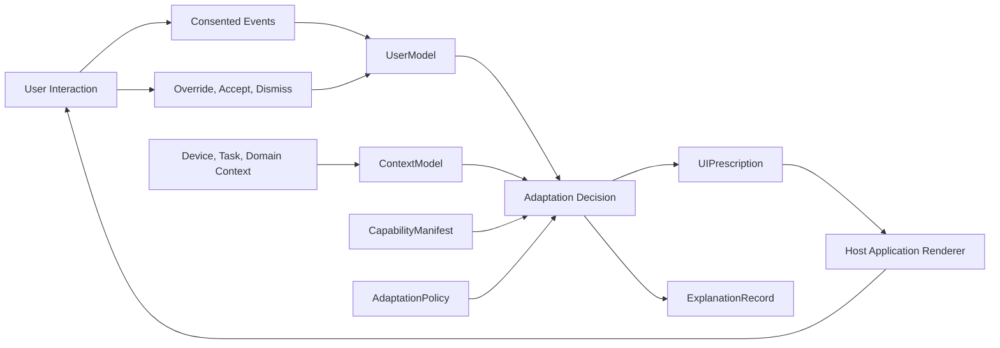
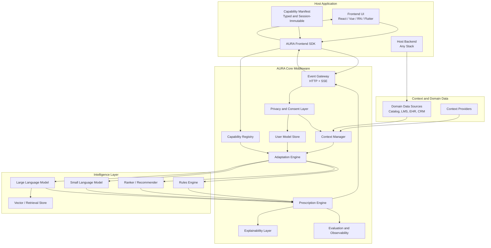
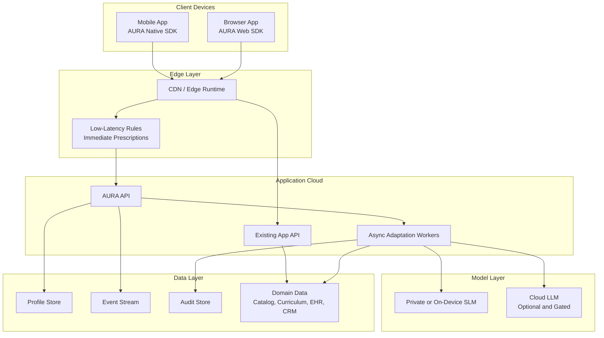
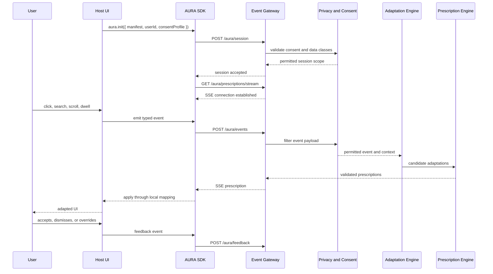
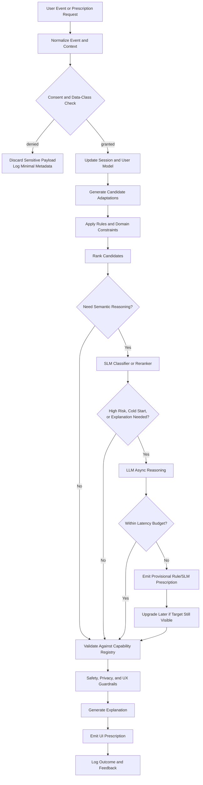
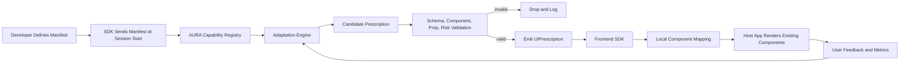
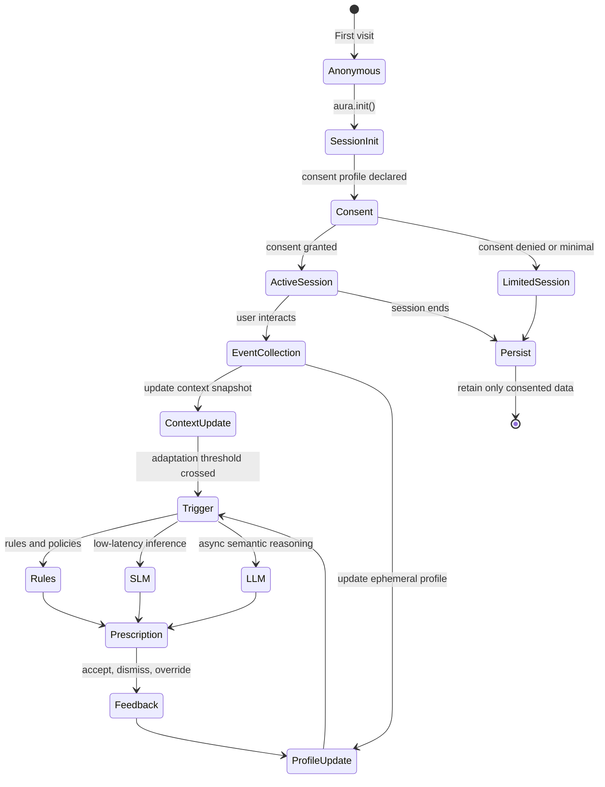
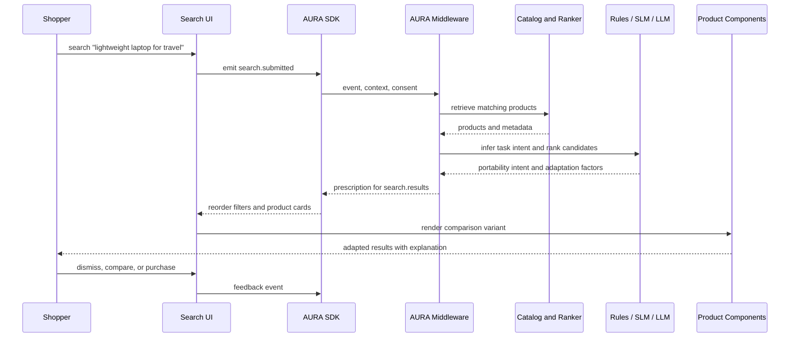
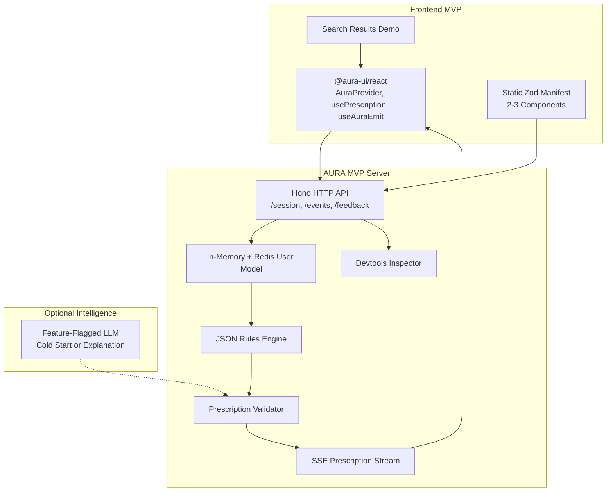

# AURA: A Reference Architecture for Adaptive User Interfaces in LLM-Enabled Web and Mobile Applications

## Abstract

Adaptive user interfaces (AUIs) have been studied for decades across adaptive hypermedia, user modeling, context-aware systems, intelligent tutoring systems, recommender systems, accessibility, mobile health, and intelligent user interfaces. The central promise is stable: software should adjust presentation, navigation, content, interaction style, and assistance to the goals, knowledge, abilities, preferences, and context of individual users. Yet modern production applications still rarely expose adaptive behavior as a general architectural capability. Existing work is often domain-specific, tied to a single application, focused on recommendation rather than interface adaptation, or insufficiently explicit about safety, consent, explainability, and frontend integration.

This paper introduces AURA, the Adaptive UI Runtime Architecture, as a reference architecture and framework for integrating adaptive interface capabilities into existing web and mobile applications. AURA is proposed as stateful middleware between host applications, user and context data sources, adaptation policies, recommender systems, small language models (SLMs), large language models (LLMs), and frontend frameworks. Its defining principle is prescription rather than replacement: the host application retains rendering authority, while AURA observes consented events, maintains user and context models, reasons over adaptation candidates, validates decisions against a typed capability manifest, and emits bounded UI prescriptions. The architecture is grounded in a corpus of 37 papers across e-commerce, education, and healthcare, together with broader adaptive interface concepts such as user modeling, context modeling, adaptive hypermedia, XAI, recommender systems, and human-centered design. We describe AURA's conceptual model, Adaptive UI Protocol (AUIP), decision pipeline, component registry, profile lifecycle, privacy and governance model, domain applications, MVP implementation path, and evaluation strategy. We argue that LLMs should support semantic interpretation, explanation, and cold-start reasoning, but should not be treated as the primary control mechanism for adaptive interfaces. AURA instead treats adaptation as a governed software architecture problem.

## Keywords

Adaptive user interfaces; user modeling; context-aware systems; intelligent user interfaces; adaptive hypermedia; personalization; recommender systems; large language models; small language models; explainable AI; frontend middleware; human-computer interaction.

## 1. Introduction

Most applications still present a largely uniform interface to users with different goals, abilities, expertise levels, devices, tasks, environments, and constraints. A novice learner, an expert clinician, an older adult shopper, an analyst under time pressure, and a user relying on assistive technology may all encounter the same information density, layout, terminology, navigation, ranking, notification strategy, and explanation style. This mismatch is not a new problem. Adaptive hypermedia systems, intelligent tutoring systems, adaptive mobile interfaces, recommender systems, and intelligent user interfaces have long attempted to personalize content, navigation, and presentation to user and context models (Brusilovsky, 2012; Vasilyeva et al., n.d.; Alnanih et al., 2013).

The problem has become more urgent in contemporary software. Web and mobile applications are richer, more data-intensive, and more domain-specific than earlier hypermedia systems. Users also interact across devices, modalities, and contexts. Digital health systems must support patients, caregivers, nurses, and clinicians. Learning platforms must support students with different knowledge states, accessibility needs, and learning contexts. E-commerce and search systems must support exploratory, goal-driven, and trust-sensitive discovery. Enterprise dashboards must reduce information overload without hiding critical signals. These are exactly the conditions under which adaptive interfaces provide value: heterogeneous users, changing context, information overload, costly mistakes, and repeated tasks over time.

At the same time, the technical substrate has changed. LLMs and SLMs can classify intent, summarize context, generate explanations, map natural language goals to interface capabilities, and support semantic reasoning over domain data. Recommender systems can rank content, products, lessons, or tasks at scale. Edge runtimes and mobile devices can run lightweight models. Typed frontend frameworks can expose component contracts. Event streams and analytics systems can capture behavioral signals. However, these capabilities do not automatically produce safe or usable adaptive interfaces. A model that can generate HTML or propose a layout is not, by itself, an architecture for adaptation. Production systems need explicit contracts, consent handling, risk calibration, validation, fallback behavior, user override, and explainability.

This paper proposes AURA, the Adaptive UI Runtime Architecture, as a reference architecture for adaptive UI middleware. AURA is designed to be integrated into existing products without requiring a full rewrite. It is framework-agnostic at the frontend layer, TypeScript-first for developer experience, backend-agnostic at the application layer, and compatible with web and mobile applications. AURA's core claim is that adaptive UI should be mediated through typed prescriptions against declared capabilities, not through unrestricted DOM manipulation or unbounded model output.

The paper makes five contributions:

1. It synthesizes research themes from e-commerce, education, healthcare, adaptive hypermedia, context-aware systems, recommender systems, and explainable AI into a general adaptive UI middleware architecture.
2. It defines AURA's conceptual model: user models, context models, capability manifests, adaptation policies, UI prescriptions, and explanation records.
3. It proposes AUIP, an Adaptive UI Protocol for frontend-to-middleware integration using session initialization, event ingestion, context synchronization, server-sent prescription delivery, feedback, consent, explanation, and profile correction.
4. It specifies a layered decision pipeline that combines rules, recommenders, SLMs, and LLMs while validating all output against a component capability registry.
5. It outlines privacy, consent, security, explainability, risk classes, evaluation criteria, and an MVP implementation path for practical adoption.

AURA is not presented here as an empirically validated system. It is a reference architecture grounded in prior empirical and conceptual work. The next step is implementation and controlled evaluation across representative domains.

## 2. Research Background and Related Work

### 2.1 Adaptive Hypermedia, User Modeling, and Intelligent Interfaces

Adaptive user interfaces derive from several overlapping research traditions. Adaptive hypermedia emphasized the construction of user models containing goals, preferences, and knowledge, then used those models to adapt content, links, navigation, or presentation (Brusilovsky, 2012). Educational hypermedia became one of the strongest early domains because learning naturally depends on a learner's current knowledge, goals, pace, and preferred forms of support. These systems established core concepts that remain central: user modeling, domain modeling, adaptation rules, feedback loops, and individualized presentation.

Intelligent user interfaces expanded the scope from hypermedia to interactive systems that modify task allocation, assistance, explanation, and interaction strategy. Martin's work on adaptive intelligent user interfaces for crowdsourced human computation emphasizes dynamic task allocation, scalability, explainability, gamification, and human-AI collaboration (Martin, n.d.). These themes map closely to modern adaptive interfaces: the system must not only personalize content, but also coordinate work between users and intelligent systems while maintaining transparency and trust.

Context-aware systems contribute another important lineage. In mobile and ubiquitous computing, context includes device, location, time, environment, activity, input modality, and user state. Alnanih et al. (2013) proposed context-based and rule-based adaptation of mobile user interfaces in mHealth, showing that adaptation can be structured around explicit context categories and rules. This is especially relevant to contemporary web and mobile applications because adaptive decisions often depend as much on device and task context as on long-term user preference.

### 2.2 Education: Learner Models, Adaptive Content, and Teacher Orchestration

Education remains one of the clearest domains for adaptive UI research. Brusilovsky (2012) describes adaptive educational hypermedia as a setting where learner knowledge, goals, and preferences can guide navigation and content. Umapathy's work on open educational content combines teacher assignment, active feedback, and passive usage signals to surface relevant learning resources for concepts (Umapathy, n.d.). This illustrates a recurring AUI pattern: domain experts provide structure, learners generate interaction data, and the system adapts resource presentation based on both.

Recent education papers extend this pattern with AI-enabled personalization. Khalil et al. (n.d.) discuss adaptive course content and intelligent tutoring systems as a path toward individualized learning experiences. Hernandez-Herrera et al. (2026) propose an AI-based approach that positions custom GPT and retrieval-augmented generation as teacher-led orchestration tools, rather than replacements for instruction. This distinction matters for AURA: in high-impact domains, adaptation should augment responsible human roles rather than silently automate consequential decisions.

Education research also warns against simplistic personalization. Tulak et al. (n.d.) show that adaptive AI platforms can create barriers for atypical or slower-paced learners, including a frustration-disengagement loop and a representational divide between visual and symbolic understanding. Pieriboni et al. (2025) emphasize inclusive STEM education, disability support, Universal Design for Learning, and co-design with stakeholders. SpectrumSphere, an AI-driven LMS for autistic students, highlights fragmented data, longitudinal monitoring, teacher adoption, and institutional support as practical barriers (Gadzhimusieva et al., 2025). SOFIA, a service-oriented adaptive assessment framework, illustrates the value of modular service architecture for integrating adaptive feedback into existing LMS platforms (Hadyaoui and Cheniti-Belcadhi, 2025).

Together, these works suggest that an adaptive UI framework should support learner and knowledge models, explicit educator control, accessibility, feedback loops, and modular integration with existing learning platforms. It should avoid reducing adaptation to naive "learning style" classification or model-generated content without oversight.

### 2.3 Healthcare: Context, Safety, Chronic Disease, and Transparency

Healthcare is another high-value AUI domain because users differ substantially in roles, abilities, literacy, conditions, emotional state, and task criticality. Patients, clinicians, caregivers, and administrators need different information density, terminology, workflows, and explanations. Mistakes can be costly.

Alnanih et al. (2013) demonstrate context-based and rule-based mobile UI adaptation for healthcare professionals. Shakshuki et al. (2015) propose a multi-agent healthcare system that tracks patient data and uses reinforcement learning to adapt interfaces over time. Vasilyeva et al. (n.d.) describe eHealth as a domain where heterogeneous abilities, interests, and needs require adaptive information delivery.

Chronic disease research provides especially useful design constraints. Wang et al. (2023, 2024) review adaptive user interfaces for chronic disease systems and develop user-centered guidelines for mHealth applications. Their work emphasizes variable capabilities, disease severity, long-term adherence, user overload, and the need to preserve critical functionality. This directly supports AURA's risk-class model: the same adaptation that is acceptable in e-commerce may be unsafe in a healthcare workflow if it hides, reorders, or simplifies critical clinical information.

Recent work on LLM-powered healthcare interfaces shows both opportunity and risk. Ghosh et al. (2023) propose an LLM-powered adaptive interface framework for culturally sensitive virtual healthcare applications, using sensors and interaction data to adapt to diverse patient needs. Ghosh et al. (n.d.) later examine LLMs for real-time healthcare UI enhancement and HTML content adjustment. These papers motivate semantic and cultural adaptation, but also raise a safety question: how can systems ensure that model-generated recommendations remain bounded, auditable, and clinically appropriate?

Explainability is central to healthcare adoption. Fouad et al. (n.d.) use human-centered co-design for explainable AI in chest radiology, showing that UI design affects the usability of explanations such as Grad-CAM and LIME. Islam et al. (n.d.) argue that transparency supports cognitive, emotional, and social trust in healthcare AI. Njei et al. (2025) review healthcare AI agents and identify a rapidly growing but fragmented field in which technical innovation is outpacing governance and real-world validation. AURA therefore treats transparency, auditability, and human override as architectural primitives, not optional interface polish.

### 2.4 E-Commerce, Search, Recommendation, Trust, and Explainability

E-commerce has long deployed personalization through recommendations, ranking, promotions, and recently viewed products. The corpus shows a movement from static recommendation toward semantic, explainable, multimodal, and goal-driven adaptation.

Pan et al. (2026) propose adaptive semantic ID learning for multimodal recommendation at industrial scale, showing how representation quality affects retrieval and ranking. Gunda and Komati (n.d.) combine GPT and neural models for personalized and transparent product recommendation, using semantic annotation and natural language explanation. Hu and Lee (2026) study AI and AR in e-commerce, linking personalization to perceived usefulness, immersion, trust, and continued use. These works reinforce that adaptive interfaces are not merely layout changes; they often sit on top of semantic item representations, ranking models, and trust-sensitive explanations.

Goal-driven interfaces are particularly relevant to AURA. Cordioli and Matera (n.d.) introduce Mirage, where developers declare application functions as semantically described components and an LLM maps user goals to relevant GUI components. AURA shares the idea that components must be declared and semantically interpretable, but it adds a stricter production boundary: the model can only prescribe changes to registered capabilities and cannot own rendering.

E-commerce explainability research reveals user trust risks. Kim et al. (n.d.) study older adults using real-world XAI features in NAVER Shopping. They find that explanation features may be unnoticed, mistaken for advertisements, or create tensions between empowerment and surveillance when exposed through user-model dashboards. This suggests that explanations must be local, contextual, and sensitive to the user's mental model. AURA's explanation design therefore separates audience and display mode: low-risk adaptations may offer passive explanations on demand, while higher-risk adaptations require active explanation or confirmation.

The corpus also includes cautionary work on demographic inference. De Andres et al. (n.d.) show that early interaction patterns can infer age and gender in e-commerce contexts. Such techniques may improve cold-start adaptation, but they also create privacy and fairness risks. AURA treats sensitive inference as consent-gated, probabilistic, user-visible, correctable, and avoidable by default.

### 2.5 Cross-Domain Synthesis

Across the corpus, the recurring technical pattern is clear: adaptive systems collect signals, model users and context, reason over possible interventions, alter presentation or ranking, and evaluate response. The recurring failure modes are equally clear: opacity, over-personalization, incorrect inference, poor accessibility, lack of user control, unsafe automation in high-risk domains, and difficulty integrating with existing products. AURA is designed to preserve the useful pattern while constraining the failure modes.

### 2.6 Design Implications from the Corpus

The corpus does not point toward a single adaptation algorithm. It points toward an architectural pattern. Education papers emphasize learner and knowledge models; healthcare papers emphasize context, safety, transparency, and professional oversight; e-commerce papers emphasize ranking, recommendation, trust, and scalable semantic representation. These concerns cannot be collapsed into a single personalization model without losing important domain constraints. AURA therefore treats adaptation as a coordinated system of models, policies, schemas, and user controls.

Five design implications follow. First, adaptation must be domain-aware. A ranked product list, a sequence of learning activities, and a clinician-facing alert list are all ordered interfaces, but the cost of reordering differs radically. The architecture must let the same generic prescription type be governed by different domain policies.

Second, adaptation must be component-aware. Goal-driven interface work shows that LLMs can reason about declared UI components, but production systems need stricter contracts than semantic descriptions alone. AURA's capability manifest turns application UI into a bounded action space for adaptation.

Third, adaptation must be profile-aware but not profile-deterministic. User models are useful only when they remain uncertain, correctable, and subordinate to explicit choices. This is especially important for demographic inference, accessibility inference, and health or education contexts where wrong assumptions can be harmful.

Fourth, adaptation must be explainable at the right level. The literature does not support constant global explanation. Older-adult e-commerce XAI findings and healthcare transparency work both suggest that explanation must be situated, audience-aware, and proportional to risk.

Fifth, adaptation must be operationally optional. A host application should not fail when adaptive middleware is unavailable. Adaptive UI should be progressive enhancement, not a dependency that can break the base interface.

## 3. Problem Statement and Design Requirements

The practical gap is not the absence of adaptive UI ideas. It is the absence of a general architecture that development teams can add to existing products without handing rendering control to a model, rewriting the application, or building a domain-specific adaptation engine from scratch.

The target architecture must satisfy the following requirements:

- Framework-agnostic frontend integration across React, Vue, Angular, Svelte, Solid, vanilla web components, React Native, and Flutter.
- TypeScript-first developer experience while remaining backend-agnostic.
- Compatibility with existing application UIs, not only greenfield systems.
- Support for web and mobile runtime constraints, including latency, offline behavior, and hydration.
- Explicit registration of adaptable UI capabilities, components, slots, events, domain context, and constraints.
- User modeling, context modeling, adaptation policy, rules, recommenders, SLMs, LLMs, privacy controls, explainability, and observability.
- Bounded UI prescriptions rather than unbounded UI generation.
- Privacy, consent, security, auditability, profile correction, and domain risk calibration.
- Evaluation methods that account for usability, trust, learning outcomes, health safety, task performance, latency, and user override.

These requirements imply that adaptive UI should be a middleware capability. It should communicate with frontend applications through a clear protocol, but it should not replace the application frontend. It should use AI models, but models should not bypass typed contracts or policy gates.

## 4. AURA Conceptual Model

AURA is stateful middleware that observes user interaction and context signals, maintains models, reasons over adaptation candidates, and prescribes bounded UI changes back to the application. The host application remains responsible for rendering, business logic, routing, accessibility implementation, and final user experience.

The conceptual model includes six core objects:

- `UserModel`: explicit and inferred preferences, expertise, goals, accessibility needs, recent behavior, confidence scores, provenance, and consent state.
- `ContextModel`: device, viewport, input modality, network quality, locale, time, task state, domain context, and risk level.
- `CapabilityManifest`: a typed, session-immutable declaration of components, surfaces, slots, variants, props, constraints, and risk classes that AURA may influence.
- `AdaptationPolicy`: domain rules, privacy constraints, user preferences, safety thresholds, experiment settings, and risk-class behavior.
- `UIPrescription`: a typed recommendation to alter ranking, component variant, layout, content, filter visibility, explanation, notification, accessibility setting, or interaction mode.
- `ExplanationRecord`: user-facing, developer-facing, and auditor-facing rationale attached to prescriptions.



This model intentionally separates decision authority from rendering authority. AURA decides what may be beneficial; the host application decides how a valid prescription maps to concrete UI components.

## 5. Reference Architecture

AURA is organized into four layers: the host application, AURA core middleware, the intelligence layer, and infrastructure/data sources. The host application includes the frontend, frontend SDK, capability manifest, and backend. AURA core includes event ingestion, context management, user modeling, capability validation, adaptation reasoning, prescription validation, explainability, privacy, and observability. The intelligence layer includes deterministic rules, recommenders, SLMs, LLMs, and retrieval or vector stores. Infrastructure includes domain data sources and context providers.



### 5.1 Frontend SDK

The frontend SDK is the primary developer integration point. It initializes sessions, registers the capability manifest, emits batched events, subscribes to prescription streams, exposes hooks or bindings for component adaptation, records user feedback, and synchronizes consent changes. The SDK must degrade gracefully: if AURA is unavailable, the application renders its default UI.

### 5.2 Capability Registry

The Capability Registry stores the manifest for the current session and validates every prescription against it. This is the primary safety boundary. It prevents hallucinated component IDs, invalid props, unsupported variants, prohibited layout changes, and risk-class violations from reaching the frontend.

### 5.3 Adaptation and Prescription Engines

The Adaptation Engine generates candidate adaptations using rules, recommenders, SLMs, LLMs, and domain heuristics. The Prescription Engine converts those candidates into typed `UIPrescription` objects, validates them, attaches explanations, applies risk gates, and emits them to the SDK.

### 5.4 Privacy, Consent, and Observability

The Privacy and Consent Layer gates data collection, profile updates, model invocation, and prescription modes. Evaluation and Observability track latency, accepted prescriptions, overrides, reversion, model cost, data classes used, policy versions, and outcome metrics.

### 5.5 Deployment Topology

AURA can be deployed as a managed service, self-hosted middleware, edge-embedded runtime, or private model deployment. The right topology depends on domain risk. Low-risk e-commerce experiments may use a managed cloud service. Education platforms serving minors may require stronger data minimization and institution-controlled storage. Healthcare deployments should prefer self-hosted or private-cloud operation, private SLMs, and strict separation between protected health information and model providers.



The topology clarifies latency placement. Immediate adaptations should be evaluated at the edge or in memory. Fast adaptations may use private SLMs or precomputed rankers. Deliberate adaptations, such as explanation generation or cold-start onboarding, may run asynchronously. Host defaults remain available in every topology.

Deployment should also preserve organizational boundaries. In enterprise, education, and healthcare settings, AURA should support tenant isolation, configurable retention, data export, and audit logs. In consumer settings, a managed deployment may be acceptable, but users should still receive profile controls and reset mechanisms.

## 6. Adaptive UI Protocol and Frontend Integration

AURA communicates with host applications through AUIP, the Adaptive UI Protocol. AUIP is a thin JSON-over-HTTP protocol with server-sent events (SSE) for prescription delivery. SSE is a reasonable default because prescriptions are server-pushed, mostly one-way, and non-blocking. WebSocket support can be added for mobile offline queues or high-frequency bidirectional updates.

The core AUIP endpoints are:

| Endpoint | Method | Purpose |
|---|---|---|
| `/aura/session` | `POST` | Start a session, send manifest, declare consent, provide initial context |
| `/aura/events` | `POST` | Emit interaction, behavioral, task, feedback, and domain events |
| `/aura/context` | `POST` | Push updated device, environment, or domain context |
| `/aura/prescriptions/stream` | `GET` | Subscribe to real-time prescription delivery using SSE |
| `/aura/feedback` | `POST` | Send user response to a prescription |
| `/aura/explain/:id` | `GET` | Fetch explanation for a prescription |
| `/aura/consent` | `POST` | Update data collection and inference permissions |
| `/aura/profile` | `GET` | Fetch user-visible profile summary |
| `/aura/profile/correction` | `POST` | Correct an inferred profile attribute |

A minimal prescription type is:

```typescript
type UIPrescription = {
  id: string;
  surfaceId: string;
  version: string;
  latencyClass: "immediate" | "fast" | "deliberate";
  priority: "low" | "normal" | "high" | "critical";
  mode: "recommend" | "autoApply" | "askUser" | "observeOnly";
  provisional?: boolean;
  adaptations: Array<
    | { type: "rank"; target: string; orderedIds: string[]; reasonCode: string }
    | { type: "componentVariant"; slotId: string; componentId: string; variant: string; propsPatch?: Record<string, unknown>; reasonCode: string }
    | { type: "layout"; slotId: string; layout: "compact" | "expanded" | "step-by-step" | "accessible"; reasonCode: string }
    | { type: "content"; target: string; contentKey: string; content: string; reasonCode: string }
    | { type: "accessibility"; setting: "fontScale" | "contrast" | "motion" | "inputMode"; value: string | number | boolean; reasonCode: string }
    | { type: "filter"; target: string; visibleFilters: string[]; highlightedFilter?: string; reasonCode: string }
  >;
  constraints: {
    expiresAt: string;
    reversible: boolean;
    requiresUserConfirmation: boolean;
    maxSessionApplications?: number;
  };
  explanation: {
    id: string;
    summary: string;
    userVisible: boolean;
    factors: string[];
    confidence: number;
  };
  audit: {
    policyVersion: string;
    modelVersions: string[];
    dataClassesUsed: string[];
  };
};
```



AUIP is intentionally separate from model tool protocols. AURA's internal services should use direct typed service calls for user profiles, context snapshots, domain data, capability registries, and policy checks. This keeps the operational topology simpler and makes privacy, observability, and latency behavior easier to audit.

## 7. Decision Pipeline

AURA uses a tiered decision pipeline. Cheap deterministic methods run first; expensive or opaque methods run later and only when justified. Explicit user preferences and domain safety constraints always override model output.



The rules engine handles hard constraints, accessibility requirements, explicit preferences, risk-class gating, and fast common cases. Recommenders handle item, content, lesson, alert, or task ranking. SLMs handle intent classification, friction detection, session summarization, layout hints, and low-latency reranking. LLMs are reserved for cold-start onboarding, explanation generation from structured factors, semantic mapping between user goals and registered components, and complex cross-modal adaptation proposals.

The LLM is not on the hot path for routine returning-user adaptation. If the LLM exceeds its latency budget, AURA emits a provisional prescription from the best rule or SLM result. A later LLM result may replace the provisional prescription only if the target surface is still visible and the replacement passes the same validation and risk gates.

## 8. Component Registry and UI Prescription Model

AURA rejects unrestricted UI generation. The frontend declares what may be adapted through a typed capability manifest. The manifest includes component IDs, semantic descriptions, slots, variants, adaptable props, risk classes, constraints, and required consent classes.

```typescript
import { defineManifest } from "@aura-ui/core";
import { z } from "zod";

export const manifest = defineManifest({
  components: {
    "search-result-card": {
      description: "Product card shown in search result lists",
      variants: ["standard", "compact", "expanded", "image-lead"],
      riskClass: "low",
      adaptableProps: z.object({
        variant: z.enum(["standard", "compact", "expanded", "image-lead"]),
        showPrice: z.boolean(),
        showRating: z.boolean(),
        badgeLabel: z.string().max(20).optional()
      }),
      constraints: { requiresConsent: ["personalization"] }
    },
    "nav-header": {
      description: "Top navigation bar",
      riskClass: "medium",
      adaptableProps: z.object({
        simplified: z.boolean(),
        pinnedCategoryId: z.string().optional()
      }),
      constraints: { requiresUserConfirmation: true }
    }
  }
});
```

Risk classes determine prescription behavior:

| Risk class | Examples | Default behavior |
|---|---|---|
| `low` | Product card variant, filter order, badge label | Auto-apply with passive explanation |
| `medium` | Navigation simplification, content hiding, workflow reordering | Visible explanation, easy undo |
| `high` | Assessment content, clinical information emphasis, financial defaults | Ask user or responsible human before applying |
| `critical` | Medication, diagnosis, safety alerts, regulated workflow changes | Human approval path and full audit |



This design allows LLMs to reason over semantic component descriptions without granting them rendering authority. A model may suggest "use the expanded product card variant for comparison-oriented users," but the host app determines what `expanded` means in code.

## 9. User, Context, and Profile Lifecycle

AURA separates the user model into layers to support privacy, temporal relevance, and user control:

| Layer | Scope | Default retention | Consent |
|---|---|---|---|
| Ephemeral | Current session, recent events, active filters, immediate task | 24 hours | Behavioral tracking |
| Short-term | Recent interaction patterns and inferred preferences | 30 days | Behavioral tracking |
| Long-term | Explicit preferences, saved settings, accessibility needs, expertise | User-controlled | Personalization |
| Cohort | Non-identifying aggregate patterns | Indefinite | Anonymized aggregation |
| Consent | What may be collected, inferred, retained, and used | User-controlled | User-managed |

Each inferred profile attribute should include provenance, confidence, expiry, visibility, and editability:

```typescript
type ProfileAttribute<T> = {
  value: T;
  source: "explicit" | "observed" | "inferred" | "imported";
  confidence: number;
  updatedAt: string;
  expiresAt?: string;
  visibleToUser: boolean;
  userEditable: boolean;
};
```



Context sources include user context, device context, environment context, domain context, and consent-gated social or emotional context. AURA should avoid storing sensitive inference by default. For example, interaction timing may predict demographic signals (De Andres et al., n.d.), but such inference should remain disabled unless explicit consent and a legitimate product need exist.

### 9.1 Adaptation Taxonomy

The profile lifecycle exists to support concrete adaptation types. AURA should distinguish at least eight categories:

| Category | Examples | Typical risk |
|---|---|---|
| Presentation | Density, typography, contrast, component variant | Low to medium |
| Navigation | Menu simplification, route shortcuts, progressive disclosure | Medium |
| Ranking | Product, lesson, task, document, or alert order | Low to critical |
| Content | Explanation level, terminology, summary, modality | Medium to high |
| Assistance | Hints, onboarding, interventions, reminders | Medium to high |
| Accessibility | Font scale, motion reduction, input mode, contrast | Medium |
| Notification | Timing, channel, urgency, batching | Medium to high |
| Workflow | Step order, required confirmation, task allocation | High to critical |

This taxonomy prevents a common error in adaptive UI design: treating all adaptation as equivalent. Changing product-card density and changing the order of medical alerts are both interface adaptations, but they require different default modes, explanations, and governance. AURA's prescription model can express both, but domain policy determines whether they are allowed.

## 10. Privacy, Consent, Explainability, and Governance

Privacy and governance are central because adaptive interfaces can reshape what users see, how they navigate, and what they believe the system knows about them. The corpus repeatedly shows that trust is fragile. Healthcare transparency research emphasizes autonomy, reliability, and anxiety reduction (Islam et al., n.d.; Fouad et al., n.d.). E-commerce XAI research shows that explanations can be missed, misinterpreted, or experienced as surveillance (Kim et al., n.d.).

AURA therefore applies the following principles:

- Consent is established before behavioral collection.
- Consent is scoped by data class, including behavior, personalization, accessibility, location class, health, education, demographics, emotion, and sensitive inference.
- Data minimization is the default: only collect data needed for the active adaptation purpose.
- Explicit preferences override observed or inferred behavior.
- Users can view, correct, reset, or erase profile attributes.
- All medium, high, and critical risk prescriptions carry explanations and audit metadata.
- Sensitive data should not be sent to cloud LLMs; use summaries, private SLMs, or on-device inference where necessary.
- High-risk domains require human approval paths, stronger audit, and domain-specific policy.

Explainability has two dimensions: audience and display mode.

| Audience | Explanation content |
|---|---|
| End user | Plain-language reason and available control |
| Developer | Trigger, factors, model versions, policy checks, scores, rejected candidates |
| Auditor | Data classes, consent state, retention policy, risk class, policy version, model hashes |

| Display mode | Use case |
|---|---|
| Passive | Low-risk adaptation, explanation on demand |
| Active | Medium-risk adaptation, brief inline label |
| Confirmation | High-risk adaptation, user or professional approves first |
| Dashboard | User-initiated profile review and correction |

This structure avoids a one-size-fits-all approach to explanation. A product card variant does not need the same explanation burden as a clinical information layout change.

## 11. Domain Applications

### 11.1 E-Commerce Search and Discovery

In e-commerce, AURA can adapt ranking, product-card density, filter order, trust signals, recommendation strips, explanation labels, accessibility settings, and comparison modes. The architecture draws from recommender systems, goal-driven interfaces, XAI, and trust research.



Example prescriptions include highlighting weight and battery filters, changing product cards to a comparison variant, explaining ranking factors, and preserving reset controls. AURA should not infer income, gender, health, or age from behavior unless explicitly permitted.

### 11.2 Education and Learning Systems

In education, AURA can adapt learning paths, resource recommendations, difficulty, quiz order, hint timing, modality, dashboard views, and intervention prompts. However, teacher control and learner agency are critical. AURA should represent knowledge state and concept relationships explicitly, support educator-authored constraints, and avoid simplistic assumptions about learning styles. High-impact adaptations such as assessment difficulty, remediation pathways, or special education interventions should be high risk or critical depending on context.

The education corpus also suggests that accessibility must be designed, not inferred casually. Adaptive systems should support Universal Design for Learning, co-design with educators and learners, and careful treatment of neurodiverse users.

### 11.3 Healthcare and Mobile Health

In healthcare, AURA can adapt terminology complexity, reminder density, patient education content, accessibility settings, culturally sensitive explanation style, and clinician dashboard density. It should not alter clinical recommendations, medication information, safety alerts, or diagnostic workflows without domain certification and human oversight.

Healthcare deployments should prefer self-hosted or private deployments, on-device or private SLMs, no PHI in cloud LLM prompts, strict audit logs, and role-specific risk policies. Clinical explainability should be co-designed with professionals and patients, following the research pattern shown in radiology XAI interface work.

### 11.4 Enterprise Dashboards, Search, and Accessibility

Enterprise dashboards and search systems face information overload. AURA can prioritize alerts, adjust information density by role, surface relevant documents, adapt facets, and support progressive disclosure. However, stability matters: expert users develop spatial memory and workflow habits. Adaptations should be gradual, reversible, and explainable.

Accessibility is not merely a domain but a cross-cutting requirement. AURA may suggest font scale, contrast, motion reduction, simplified layout, voice input, or alternative interaction modes, but explicit OS, browser, and user preferences must take precedence over inference.

## 12. Implementation and MVP Path

The MVP should prove the core adaptive loop for a narrow, inspectable use case. A reasonable first implementation is an e-commerce search page with a TypeScript SDK, React adapter, Hono-based server, Redis-backed session profile, static Zod capability manifest, JSON rules engine, SSE prescription stream, and devtools inspector.



MVP scope should include session start, event ingestion, profile update, rule-based prescriptions, manifest validation, React hooks, feedback events, passive explanations, and a local inspector. It should exclude federated learning, broad multi-framework support, healthcare high-risk workflows, and autonomous LLM UI generation.

## 13. Evaluation Strategy

AURA should be evaluated as both an HCI system and a software architecture. Technical metrics alone are insufficient. Recommended evaluation dimensions include:

- Task completion time and success rate.
- Cognitive load and perceived usability.
- Trust, perceived control, and perceived transparency.
- Prescription acceptance, dismissal, override, and reversion rates.
- Latency by adaptation tier.
- Model cost and failure rate.
- Accessibility impact with assistive technology users.
- Learning outcomes in education, such as retention, engagement, and concept mastery.
- Health outcomes or adherence proxies in mHealth, without conflating UI adaptation with clinical efficacy.
- Safety incidents, hidden-content incidents, and audit findings.

The corpus suggests several methods: controlled user studies, think-aloud usability sessions, surveys, quasi-experimental pilots, longitudinal monitoring, A/B tests, systematic review mapping, and practitioner evaluation. AURA's evaluation should include cold-start users, returning users, users with assistive technologies, older adults, domain experts, novices, and shared-device scenarios.

One useful system-level metric is override rate. Frequent user overrides indicate poor adaptation, poor timing, insufficient explanation, or misaligned user modeling. Another is reversion rate: users may initially accept an adaptation but later restore defaults. In high-risk domains, safety review and human oversight should precede any live adaptation that changes content visibility or workflow.

### 13.1 Study Designs

For e-commerce, an initial evaluation can compare a baseline search/discovery page with an AURA-enabled page using product-finding tasks, search refinement tasks, and comparison tasks. Measures should include completion time, conversion proxy, perceived usefulness, explanation comprehension, reset-control use, and trust. Because commercial optimization can conflict with user autonomy, the study should also measure whether users feel manipulated or narrowed by adaptive ranking.

For education, evaluation should combine short-term usability measures with learning measures. A controlled study might compare fixed sequencing, rule-based adaptive sequencing, and AURA-assisted adaptive sequencing over a concept module. Outcome measures should include concept mastery, retention, frustration signals, learner confidence, teacher trust, and frequency of teacher override. The evaluation should explicitly include learners who need accessibility support or slower pacing.

For healthcare, early evaluation should avoid clinical claims and focus on usability, comprehension, workload, and trust. A simulated chronic disease management application could compare terminology adaptation, reminder-density adaptation, and accessibility adaptation under clinician review. Any study involving patient data or clinical workflow should use institutional review, strict audit, and explicit separation between UI adaptation and medical recommendation.

### 13.2 Architectural Evaluation

The architecture itself should be tested through integration and failure scenarios. Required tests include invalid component IDs, expired prescriptions, malformed events, consent revocation, profile deletion, SSE interruption, LLM timeout, stale context, and user override persistence. The host UI must remain usable in every failure case. A benchmark suite should report P95 latency for rules, rankers, SLM inference, LLM fallback, prescription validation, and frontend application.

Replay is especially important. AURA should make each prescription reconstructable from a profile snapshot, context snapshot, manifest version, policy version, model version, and event sequence. Without replay, developers cannot debug erroneous adaptation, researchers cannot compare algorithms reliably, and auditors cannot inspect high-risk prescriptions after the fact.

### 13.3 Threats to Validity

Several threats must be acknowledged. First, adaptation effects are domain-specific; a successful e-commerce deployment does not validate healthcare use. Second, novelty effects may temporarily inflate trust or engagement. Third, user models may encode historical bias or mistaken preferences. Fourth, adaptive behavior can be difficult to reproduce unless event logs, profile snapshots, policies, and model versions are captured. Fifth, users may not notice adaptation, which complicates measurement of perceived control and explanation value.

These threats reinforce the need for multi-method evaluation. AURA should not be judged only by click-through rate or engagement. A valid evaluation must include user agency, harm prevention, accessibility, trust calibration, and the cost of wrong adaptation.

## 14. Discussion

AURA's main tradeoff is between adaptivity and control. A system that adapts too little adds little value; a system that adapts too aggressively disrupts user agency and mental models. The architecture resolves this by making adaptation bounded, reversible, explainable, and validated against application-declared capabilities.

Another tradeoff is between generality and domain specificity. AURA is general at the protocol, SDK, and prescription layers, but domain risk policies must be specific. E-commerce ranking, educational remediation, and clinical alert presentation cannot share the same default behavior. The reference architecture therefore separates generic infrastructure from domain-specific policy.

LLMs create a third tradeoff. They are useful for semantic mapping, natural language explanation, cold-start support, and complex reasoning over context. They are also costly, slower, harder to audit, and prone to invalid output. AURA treats LLMs as advisors whose output must pass through schema validation, policy gates, risk checks, and frontend component mappings.

Explainability presents a fourth tradeoff. Too little explanation reduces trust; too much can feel like surveillance or clutter. AURA's passive, active, confirmation, and dashboard modes are intended to match explanation burden to risk and user intent.

Finally, personalization can reduce exploration. E-commerce and search systems may create filter bubbles; education systems may overfit learners to easy content; healthcare systems may simplify information excessively. AURA should preserve reset controls, serendipity, and access to full functionality.

## 15. Limitations and Future Work

This paper proposes a reference architecture; it does not report a completed implementation or empirical evaluation of AURA itself. The architecture depends on host applications instrumenting events, declaring capabilities, and respecting prescriptions. Poor manifests, poor event schemas, or weak domain policies would degrade adaptation quality. Cross-framework component capability standards may also be difficult to design without becoming either too generic or too burdensome.

Profile quality is another limitation. Cold-start adaptation is difficult, and inferred attributes can be wrong or harmful. AURA mitigates this through confidence, provenance, expiry, correction, and consent, but empirical work is needed to determine how users understand and manage adaptive profiles.

Future work should include:

- A formal AUIP specification and conformance tests.
- Open-source TypeScript SDK, React adapter, and Hono reference server.
- Benchmark tasks for e-commerce, education, healthcare, enterprise dashboards, and search.
- Longitudinal user studies measuring trust, agency, and adaptation fatigue.
- Controlled studies comparing rules-only, SLM-assisted, and LLM-assisted adaptation.
- Accessibility-first evaluation with assistive technology users.
- Domain policy packs for education, healthcare, e-commerce, and enterprise.
- Tooling for manifest design, prescription simulation, profile inspection, and policy testing.

An additional research direction is standardization. If adaptive UI capabilities are expressed only in application-specific ways, cross-framework adoption will remain slow. AURA's manifest and prescription model could become a practical interoperability layer between frontend frameworks, design systems, recommender services, analytics platforms, and model providers. Standardization should proceed cautiously: too little structure prevents portability, but too much structure would make real product teams avoid the framework. A successful standard should specify the minimal contract for surfaces, components, risks, events, prescriptions, feedback, explanations, and profile controls while leaving rendering and design-system implementation to host applications.

## 16. Conclusion

Adaptive user interfaces remain a compelling but under-realized direction for human-computer interaction. The research corpus shows strong evidence of value in education, healthcare, e-commerce, accessibility, search, and information-intensive systems. It also shows recurring risks: opacity, incorrect inference, poor trust calibration, unsafe automation, user overload, and integration difficulty.

AURA addresses these challenges by treating adaptive UI as governed middleware. The host application declares what can change. The middleware observes consented events and context. User and context models are updated with provenance and control. Rules, recommenders, SLMs, and LLMs generate candidate adaptations. A prescription engine validates every decision against typed capabilities, risk classes, policies, and consent. The frontend renders only through local component mappings. Users can understand, override, correct, and reset adaptation.

The result is not autonomous UI generation. It is a practical reference architecture for adding adaptive behavior to modern applications while preserving developer control, user agency, domain safety, and explainability. AURA provides a bridge between decades of adaptive interface research and the current software environment of typed frontend systems, event-driven middleware, recommender models, SLMs, and LLMs.

## References

Adaptive Interfaces Use Cases. (2026). *AURA - Adaptive UI Runtime Architecture: Synthesized Reference Framework*. File: `aura-synthesis/AURA-Synthesis.md`.

Alnanih, R., Ormandjieva, O., and Radhakrishnan, T. (2013). *Context-based and Rule-based Adaptation of Mobile User Interfaces in mHealth*. File: `HealthCare/1-s2.0-S1877050913008442-main.pdf`.

Anggraeni, E., Maryani, I., Galuhwardani, C., and Fitriana, S. (2025). *Implementation of Design Thinking Method in Designing Consultation Booking Features on Education Platforms*. File: `Education/1804-Article Text-15001-1-10-20251229.pdf`.

Brusilovsky, P. (2012). *Adaptive Hypermedia for Education and Training*. File: `Education/13321_ARI_2012.pdf`.

Chanamalla, B., Murali, V. N., Suresh, B., Deepak, M. S., Zakriya, M., Yadav, D. B., and Saravanan, M. (n.d.). *AI-Driven Multi-Agent Shopping System through E-Commerce System*. File: `Ecommerce/4_AI-Driven+Multi-Agent+Shopping+System+through+E-Commerce+System.pdf`.

Chopra, S., Jain, D., Jain, A., Mehta, K., and Garg, M. (n.d.). *One Stop Shop E-Commerce Website*. File: `Ecommerce/One_Stop_Shop_E_commerce_Website.pdf`.

Cordioli, L., and Matera, M. (n.d.). *From Navigation to Intention: Reframing the Web Experience through Goal-Driven Interfaces*. File: `Ecommerce/3774904.3792479.pdf`.

De Andres, J., Fernandez-Lanvin, D., Gonzalez-Rodriguez, M., and Pariente-Martinez, B. (n.d.). *AI Models for Demographic Prediction in E-Commerce: Age and Gender from Initial User Interactions*. File: `Ecommerce/peerj-cs-3563.pdf`.

Deshmukh, P., Karmore, B., Ingole, M., and Upreti, K. (n.d.). *Designing Emotionally Adaptive Chatbots for Diverse Users: A User-Centered Human-AI Interface Framework*. File: `HealthCare/10.31127-tuje.1715271-4940182.pdf`.

Dong, Y. (2026). *Navigating Trust in Cross-Border E-Commerce: A Systematic Review of Cultural and Consumer Dynamics*. File: `Ecommerce/s41599-026-06579-4_reference.pdf`.

Fouad, S., Hakobyan, L., Ihongbe, I. E., Kavakli-Thorne, M., Atkins, S., and Bhatia, B. (n.d.). *Human-Centered User Interface Design for Explainable AI in Chest Radiology: A Multi-Phase Co-Design Approach*. File: `HealthCare/Human-Centered_User_Interface_Design_for_Explainable_AI_in_Chest_Radiology_A_Multi-Phase_Co-Design_Approach.pdf`.

Gadzhimusieva, D., Melia, S., Lorenzo Lledo, G., and Nasabeh, S. S. (2025). *Development and Pilot Evaluation of an AI-Driven Learning Management System for Personalized Education for Autistic Students*. File: `Education/s10639-025-13888-9.pdf`.

Ghosh, A., Yan, Y., and Lin, W. (2023). *Adaptive User Interface Framework Powered by a Large Language Model for Culturally Sensitive Virtual Healthcare Applications*. File: `HealthCare/2023-AdaptiveUserInterfaceFrameworkPoweredbyaLargeLanguageModelforCulturallySensitiveVirtualHealthcareApplications_.pdf`.

Ghosh, A., Huang, B., Yan, Y., and Lin, W. (n.d.). *Enhancing Healthcare User Interfaces Through Large Language Models Within the Adaptive User Interface Framework*. File: `HealthCare/EnhancingHealthcareUserInterfacesThroughLargeLanguageModelsWithintheAdaptiveUserInterfaceFramework.pdf`.

Golden, S. A. R. (n.d.). *AI-Driven Global Commerce: Transforming Digital Banking, Fintech, and E-Commerce*. File: `Ecommerce/ssrn-6305738.pdf`.

Gunda, P., and Komati, T. R. (n.d.). *Hybrid GPT and Neural Models for Personalized E-Commerce: A Novel Framework for Adaptive and Transparent Product Recommendations*. File: `Ecommerce/itegam,+2874+Final+Article-corrigido+ok_pagenumber.pdf`.

Hadyaoui, A., and Cheniti-Belcadhi, L. (2025). *Scalable Adaptive Assessment Framework for Collaborative eLearning: A Service-Oriented AI Approach*. File: `Education/s40561-025-00426-w.pdf`.

Hernandez-Herrera, J. R., Ortiz-Bejar, J., and Ortiz-Bejar, J. (2026). *Adaptive and Personalized Learning in Higher Education: An Artificial Intelligence-Based Approach*. File: `Education/education-16-00109.pdf`.

Hien, N. N., Luu, D. X., Ghi, T. N., and Nguyen, T. N. (2026). *Determinants of AI-Integrated E-Commerce Acceptance: The Roles of Personal Innovativeness, Self-Efficacy, Compatibility, and Curiosity*. File: `Ecommerce/Human Behavior and Emerging Technologies - 2026 - Hien - Determinants of AI-Integrated E-Commerce Acceptance The Roles of.pdf`.

Hu, J., and Lee, E. T. (2026). *The Impact of Integrated AI and AR in E-Commerce: The Roles of Personalization, Immersion, and Trust in Influencing Continued Use*. File: `Ecommerce/jtaer-21-00033.pdf`.

Islam, N., Ezcurra, V., Rader, J., Margondai, A., Willox, S., Von Ahlefeldt, C., and Mouloua, M. (n.d.). *Transparency for Trust: Enhancing Acceptance and System Integration of Intelligent AI in Healthcare*. File: `HealthCare/TransparencyforTrust-EnhancingAcceptanceandSystemIntegrationofIntelligentAIinHealthcare.pdf`.

Khalil, S. A., Mahmood, M., Ali, Z., and Alam, I. (n.d.). *AI for Personalized Learning Experiences: Adaptive Course Content and Intelligent Tutoring Systems*. File: `Education/AI-for-Personalized-Learning-Experiences_-Adaptive-Course-Content-and-Intelligent-Tutoring-Systems.pdf`.

Kim, S. H., Kim, E. H., Yang, H., Lee, J., and Lim, H. (n.d.). *Clarifying or Complicating?: Understanding Older Adults' Engagement with Real-World XAI in E-Commerce*. File: `Ecommerce/3772318.3791908.pdf`.

Martin, R. J. (n.d.). *Optimizing Crowdsourced Human Computation with Adaptive Intelligent User Interfaces for Scalability and Explainability*. File: `Education/articulo4.pdf`.

Njei, B., Al-Ajlouni, Y. A., Kanmounye, U. S., Boateng, S., Nguefang, G. L., Njei, N., Hamouri, S., and Al-Ajlouni, A. A. (2025). *Artificial Intelligence Agents in Healthcare Research: A Scoping Review*. File: `HealthCare/journal.pone.0342182.pdf`.

Olaniyi, O. M., Adebiyi, O. O., Ejoh, C. I., Afolabi, O. O., and Ejiofor, V. O. (n.d.). *Conversational AI-Powered Fraud Prevention in Augmented Reality E-Commerce: A Natural Language Processing Framework for Real-Time Transaction Security*. File: `Ecommerce/ConversationalAI-poweredfraudpreventioninaugmentedrealitye-commerce-Anaturallanguageprocessingframeworkforreal-timetransactionsecurity.pdf`.

Pan, Y., Chen, Y., Hu, Z., Yuan, X., Wang, D., Yin, Y., Ni, S., Wang, H., Wang, J., Ren, F., and Ou, W. (2026). *Beyond Static Collision Handling: Adaptive Semantic ID Learning for Multimodal Recommendation at Industrial Scale*. File: `Ecommerce/2604.23522v1.pdf`.

Pieriboni, G., Buzzy, M., and Leporini, B. (2025). *STEM Education and ICT-Enhanced Tools for Students with Disabilities: A Five-Year Review*. File: `Education/s10209-025-01282-8.pdf`.

Prayitno, G., and Danomira, Y. Y. (n.d.). *Implementation of Prototype Method in a Web-Based Educational Word Guessing Game with Melodic Elements*. File: `Education/[6].+Jurnal+Yuspina+-+Implementation+of+Prototype+Method+in+a+Web-Based+Educational+Word+Guessing+Game+with+Melodic+Elements.pdf`.

Shakshuki, E. M., Reid, M., and Sheltami, T. R. (2015). *An Adaptive User Interface in Healthcare*. File: `HealthCare/1-s2.0-S1877050915016634-main.pdf`.

Tiwari, A., Singh, P., and Waoo, A. A. (n.d.). *Reinforcement Techniques for Dynamic Adaptive Learning*. File: `Education/finalReview+Paper+on+Dynamic+Adaptive+Learning_Final_Updated1.pdf`.

Tulak, T., Kaharuddin, A., and Tulak, H. (n.d.). *The Representational Divide: A Qualitative Usability Analysis of an Adaptive AI for Atypical Learners*. File: `Education/IJIET-V16N3-2533.pdf`.

Umapathy, V. (n.d.). *An Adaptive User Interface for Open Educational Content*. File: `Education/757176343-MIT (1).pdf`.

Vasilyeva, E., Pechenizkiy, M., and Puuronen, S. (n.d.). *Towards the Framework of Adaptive User Interfaces for eHealth*. File: `HealthCare/Towards_the_Framework_of_Adaptive_User_I.pdf`.

Wang, W., Khalajzadeh, H., Grundy, J., Madugalla, A., McIntosh, J., and Obie, H. O. (2023). *Adaptive User Interfaces in Systems Targeting Chronic Disease: A Systematic Literature Review*. File: `HealthCare/s11257-023-09384-9.pdf`.

Wang, W., Khalajzadeh, H., Grundy, J., Madugalla, A., and Obie, H. O. (2024). *Adaptive User Interfaces for Software Supporting Chronic Disease*. File: `HealthCare/3639475.3640104.pdf`.

Wang, W., Grundy, J., Khalajzadeh, H., Madugalla, A., and Obie, H. O. (n.d.-a). *Designing Adaptive User Interfaces for mHealth Applications Targeting Chronic Disease: A User-Centered Approach*. File: `HealthCare/3731750.pdf`.

Wang, W., Grundy, J., Khalajzadeh, H., Madugalla, A., and Obie, H. O. (n.d.-b). *Designing Adaptive User Interfaces for mHealth Applications Targeting Chronic Disease: A User-Centered Approach (Open Access Version)*. File: `HealthCare/762063293-oa.pdf`.
