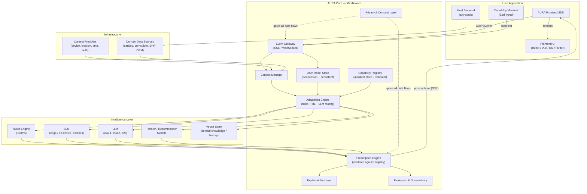
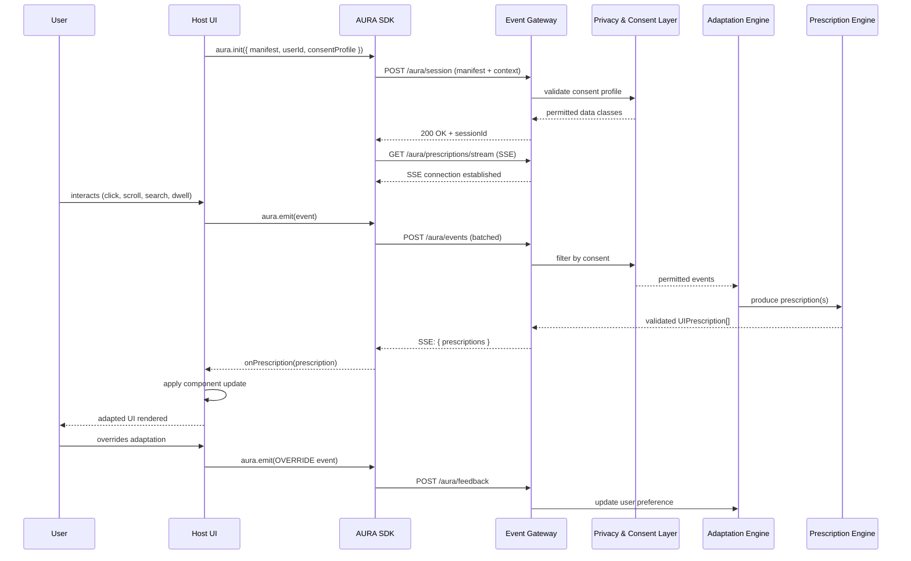
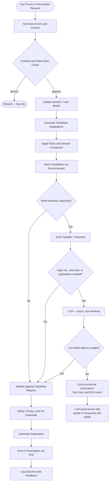
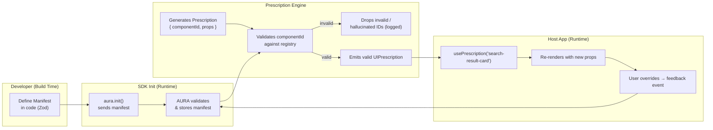
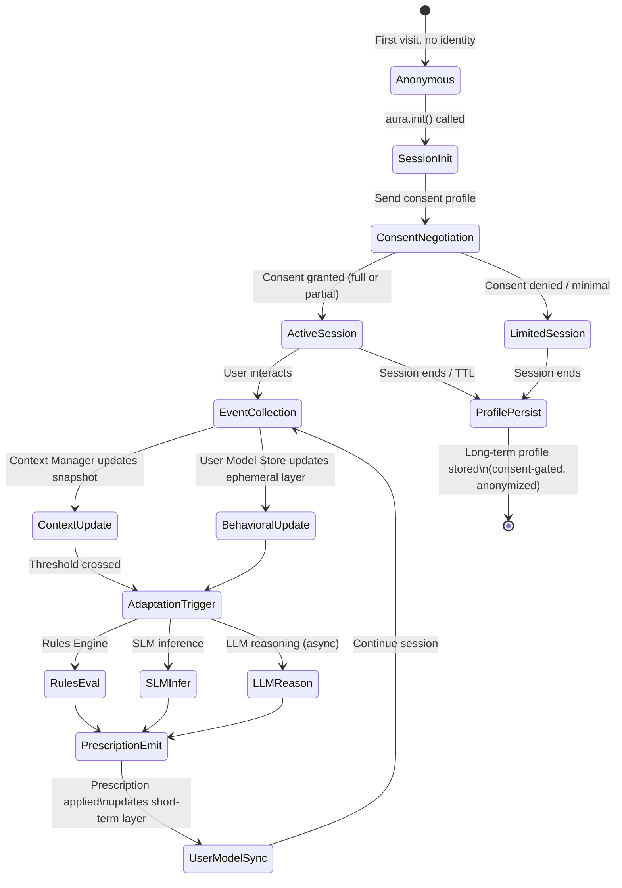
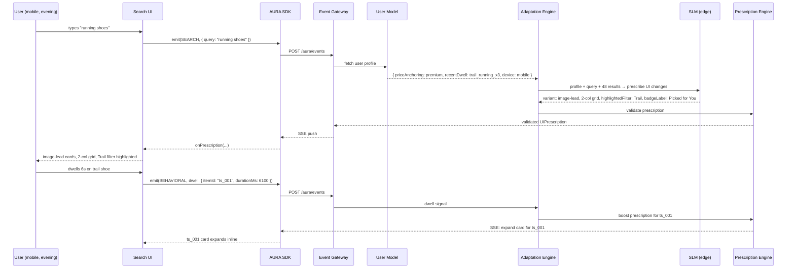
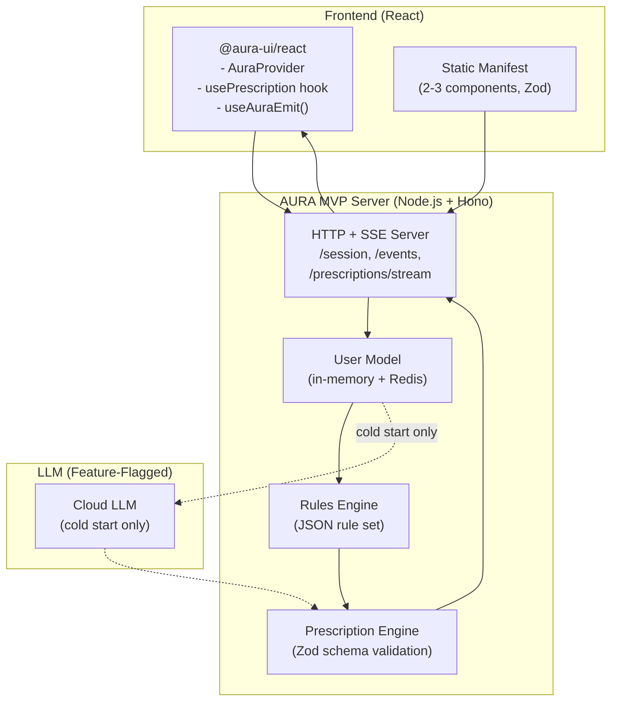
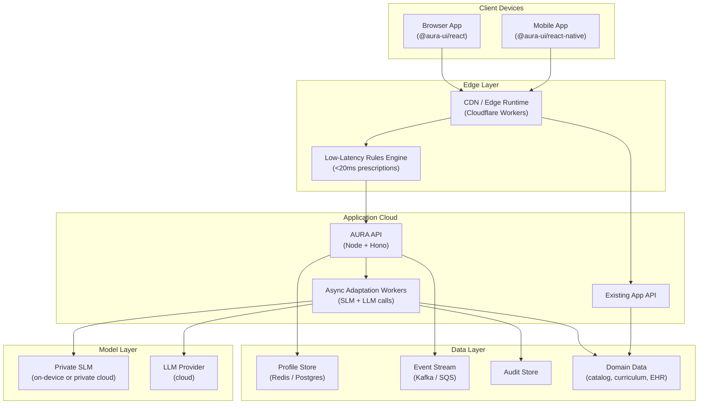

# AURA — Adaptive UI Runtime Architecture
### Synthesized Reference Framework

> **Version**: 1.0  
> **Date**: 2026-06-20  
> **Status**: Synthesized from GPT and Claude proposals  
> **Note**: MCP references removed throughout; internal tool access is handled via direct service calls.

---

## Table of Contents

1. [Vision and Conceptual Model](#1-vision-and-conceptual-model)
2. [Main Architectural Components](#2-main-architectural-components)
3. [Frontend Communication and the Adaptive UI Protocol](#3-frontend-communication-and-the-adaptive-ui-protocol)
4. [Decision Pipeline](#4-decision-pipeline)
5. [Component Registry and UI Prescription](#5-component-registry-and-ui-prescription)
6. [LLM and SLM Usage — Safety, Efficiency, Latency](#6-llm-and-slm-usage--safety-efficiency-latency)
7. [User Profiles and Context Models](#7-user-profiles-and-context-models)
8. [Privacy, Security, Consent, and Explainability](#8-privacy-security-consent-and-explainability)
9. [TypeScript Developer Experience](#9-typescript-developer-experience)
10. [Domain Examples](#10-domain-examples)
11. [Minimal MVP Architecture](#11-minimal-mvp-architecture)
12. [Deployment Topology](#12-deployment-topology)
13. [Usability Design Principles](#13-usability-design-principles)
14. [Gaps Filled by This Synthesis](#14-gaps-filled-by-this-synthesis)
15. [Roadmap](#15-roadmap)
16. [Risks and Open Questions](#16-risks-and-open-questions)

---

## Synthesis Notes

Both proposals converged on the same name (AURA), the same core principle (prescription-based, not DOM-rewrite), and the same three-tier reasoning model (rules → SLM → LLM). Key differences and resolutions:

| Topic | GPT Proposal | Claude Proposal | Synthesis Decision |
|---|---|---|---|
| Protocol name | AUP (Adaptive UI Protocol) | AUIP (Adaptive UI Protocol) | **AUIP** — more precise acronym |
| Transport | REST + WebSocket + SSE + offline queues | SSE-first with HTTP fallback | **SSE-first**, WebSocket for mobile offline queues |
| MCP role | Internal tool-access layer | Internal tool-access layer | **Removed entirely** — direct service calls instead |
| Component manifest | Typed registry, runtime-mutable | Zod-typed manifest, session-immutable | **Session-immutable Zod manifest** with hot-reload in dev |
| Profile layers | 5 layers (ephemeral, long-term, cohort, domain, consent) | 4 layers (ephemeral, short-term, long-term, social) | **5-layer model** combining both |
| Explanation tiers | 3 (user, developer, auditor) | 3 (passive, active, dashboard) | **Both dimensions** — audience × display mode matrix |
| Usability depth | Light | Moderate | **Expanded significantly** in Section 13 |
| MVP tech stack | Node, unspecified | Node + Hono + Redis + Cloudflare | **Claude's stack** adopted |
| Deployment | 4-tier diagram | 3-tier diagram | **GPT's 4-tier topology** |

---

## 1. Vision and Conceptual Model

### Vision

Modern applications still deliver the same interface to every user regardless of who they are, what device they are on, what they are trying to accomplish, or how their needs change over time. This is a fundamental mismatch.

A decade of research — from Brusilovsky's adaptive hypermedia systems (2012) to Wang et al.'s AUI guidelines for chronic disease management (2024) to Ghosh et al.'s LLM-powered framework for culturally sensitive healthcare (2023) — has demonstrated that adaptive interfaces produce measurable improvements in task completion, engagement, accessibility, and user trust.

What has been missing is practical, general-purpose middleware that any development team can adopt without rebuilding their application.

**AURA is that layer.**

### Conceptual Model

AURA is a **stateful middleware** that sits between a host application and its users. It:

- **Observes** user events, context signals, and domain data from the host app
- **Builds** a live user model and context model per session
- **Reasons** using rules, SLMs, or LLMs to produce adaptation decisions
- **Prescribes** specific, bounded UI changes back to the frontend via a registered component vocabulary
- **Explains** its decisions on request, preserving user trust and autonomy

The host application retains full rendering authority. AURA only prescribes *what* should change and *why* — it never replaces or owns the UI. This separation is the defining architectural principle.

The adaptation model is additive and ambient — it integrates into existing products at the SDK level without requiring chatbot-style conversational UI or full UI rewrites.

### Core Objects

| Object | Purpose |
|---|---|
| `UserModel` | Stable and session-level traits: preferences, expertise, goals, accessibility needs, inferred interests, consent state |
| `ContextModel` | Device, viewport, locale, time, task state, risk level, connectivity, environment, domain context |
| `CapabilityManifest` | Typed, session-immutable catalog of components, slots, props, variants, and constraints the app allows AURA to influence |
| `AdaptationPolicy` | Rules, guards, privacy constraints, safety thresholds, domain limits |
| `UIPrescription` | Typed recommendation to alter layout, content, ranking, labels, explanations, interaction mode, or accessibility settings |
| `ExplanationRecord` | User-facing and developer-facing reasons for an adaptation, with confidence scores |

### Scope

AURA targets:

- Web apps (React, Vue, Angular, Svelte, Solid, vanilla JS)
- Mobile apps (React Native, Flutter)
- Enterprise dashboards, search and discovery experiences
- Any domain: e-commerce, education, healthcare, productivity, IIoT, automotive

---

## 2. Main Architectural Components

AURA is modular middleware organized into three layers: the **Host Layer**, the **AURA Core**, and the **Intelligence Layer**.



### Component Descriptions

**AURA Frontend SDK** — A thin TypeScript library with official bindings for React, Vue, Svelte, React Native, and Flutter. Handles event emission, SSE subscription to prescriptions, manifest registration, and consent negotiation. The only surface developers directly interact with.

**Capability Manifest / Registry** — A structured, Zod-typed declaration of every UI component the host app allows AURA to influence. Components have a stable ID, semantic description, typed props schema, variants, and constraints. AURA can only prescribe changes to registered components. This is the primary safety boundary. Manifests are session-immutable at runtime; hot-reload is supported in development mode only.

**Event Gateway** — Receives AUIP event payloads from the frontend SDK over SSE or WebSocket. Validates, normalizes, and routes events to the Context Manager and User Model Store. Also serves as the outbound channel for prescription delivery.

**Context Manager** — Aggregates signals: device capabilities, network quality, time, location (if consented), session state, domain context from the host backend, and behavioral signals (dwell time, scroll patterns, error rates).

**User Model Store** — Multi-layered user model (see Section 7). Maintains ephemeral, short-term, long-term, cohort, and consent layers per user.

**Adaptation Engine** — Decision core. Routes requests to the appropriate reasoning backend based on latency requirements and decision complexity.

**Prescription Engine** — Takes raw reasoning output and validates it against the Capability Registry before emitting. No hallucinated component IDs can reach the frontend. Outputs typed `UIPrescription` objects.

**Explainability Layer** — Attaches human-readable rationale to prescriptions. Audience-aware (end-user plain language vs. developer technical detail vs. auditor compliance detail).

**Privacy & Consent Layer** — Cross-cutting gate on all data flows. Enforces consent decisions, data minimization policies, retention limits, and domain-specific safety classes.

**Evaluation & Observability** — Measures outcomes, drift, latency, reversions, harmful adaptations, and user trust over time.


---

## 3. Frontend Communication and the Adaptive UI Protocol

### Design Principles

1. **The frontend initiates.** AURA is reactive, not intrusive. The SDK emits events; AURA responds with prescriptions.
2. **Prescriptions are non-blocking.** If AURA is unavailable, the host app renders normally. AURA is progressive enhancement.
3. **The contract is the Capability Manifest.** AURA cannot prescribe anything the host has not explicitly registered.
4. **Latency tiers.** Prescriptions carry a latency class: immediate (<50ms, rule-based), fast (<300ms, SLM), deliberate (<2s, LLM async).
5. **Reversibility by default.** Every prescription can be rolled back by the user. User overrides are persisted back to the User Model.

### Why Not MCP

MCP (Model Context Protocol) was considered by both source proposals as a frontend-to-middleware channel. It was rejected for this role for the same reasons in both:

- MCP is pull-only; AURA needs server-push (SSE) to deliver prescriptions proactively.
- MCP has no concept of component manifest registration or session-immutable capability contracts.
- MCP has no latency budget or streaming semantics for UI prescription delivery.
- MCP has no privacy/consent negotiation at session start.
- MCP has no frontend framework adapter layer.

MCP is also removed from AURA's **internal** tooling in this synthesis. The Intelligence Layer accesses user model data, context snapshots, domain data sources, and the Capability Registry through direct typed service calls rather than through an MCP host. This simplifies the operational topology, removes an additional runtime dependency, and keeps the data flow fully observable without an intermediary protocol layer.

### The Adaptive UI Protocol (AUIP)

AUIP is a thin JSON-over-HTTP protocol with SSE for server push. It runs on any HTTP server.

**Key endpoints:**

| Endpoint | Method | Purpose |
|---|---|---|
| `/aura/session` | POST | Start session, send manifest, declare consent profile |
| `/aura/events` | POST | Emit interaction, behavioral, task, and domain events (batched) |
| `/aura/context` | POST | Push updated context snapshot (device, environment, domain) |
| `/aura/prescriptions/stream` | GET (SSE) | Subscribe to real-time prescription push |
| `/aura/feedback` | POST | Send explicit user response to a prescription |
| `/aura/explain/:id` | GET | Fetch explanation for a specific prescription |
| `/aura/consent` | POST | Update personalization and inference permissions |
| `/aura/profile` | GET | Fetch user-visible profile summary |
| `/aura/profile/correction` | POST | User corrects an inferred attribute |

### Session Start

```json
POST /aura/session

{
  "userId": "u_abc123",
  "sessionId": "s_xyz",
  "consentProfile": {
    "behavioralTracking": true,
    "personalization": true,
    "sensitiveInference": false,
    "dataRetentionDays": 30,
    "explainability": true
  },
  "context": {
    "deviceType": "mobile",
    "os": "iOS",
    "viewport": { "width": 390, "height": 844 },
    "locale": "en-US",
    "timezone": "America/New_York",
    "networkQuality": "4g"
  },
  "manifest": {
    "schemaVersion": "1.0",
    "components": [
      {
        "id": "search-result-card",
        "description": "Product card shown in search results",
        "variants": ["standard", "compact", "expanded", "image-lead"],
        "adaptableProps": {
          "variant": { "type": "string", "enum": ["standard", "compact", "expanded", "image-lead"] },
          "showPrice": { "type": "boolean" },
          "showRating": { "type": "boolean" },
          "badgeLabel": { "type": "string", "maxLength": 20 }
        },
        "constraints": { "requiresConsent": ["personalization"] },
        "riskClass": "low"
      }
    ]
  }
}
```

### Event Schema

```json
POST /aura/events

{
  "sessionId": "s_xyz",
  "events": [
    {
      "type": "USER_INTERACTION",
      "name": "search",
      "payload": { "query": "running shoes", "resultCount": 48 },
      "ts": 1750420800000
    },
    {
      "type": "BEHAVIORAL",
      "name": "dwell",
      "payload": { "componentId": "search-result-card", "itemId": "prod_999", "durationMs": 4200 },
      "ts": 1750420804200
    }
  ]
}
```

### UI Prescription Schema

```typescript
type UIPrescription = {
  id: string;
  surfaceId: string;
  version: string;
  latencyClass: "immediate" | "fast" | "deliberate";
  priority: "low" | "normal" | "high" | "critical";
  mode: "recommend" | "autoApply" | "askUser" | "observeOnly";
  provisional?: boolean;           // true if LLM timed out, rule/SLM result used
  adaptations: Array<
    | { type: "rank"; target: string; orderedIds: string[]; reasonCode: string }
    | { type: "componentVariant"; slotId: string; componentId: string; variant: string; propsPatch?: Record<string, unknown>; reasonCode: string }
    | { type: "layout"; slotId: string; layout: "compact" | "expanded" | "step-by-step" | "accessible"; reasonCode: string }
    | { type: "content"; target: string; contentKey: string; content: string; reasonCode: string }
    | { type: "accessibility"; setting: "fontScale" | "contrast" | "motion" | "inputMode"; value: string | number | boolean; reasonCode: string }
    | { type: "filter"; target: string; visibleFilters: string[]; highlightedFilter?: string; reasonCode: string }
  >;
  constraints: {
    expiresAt: string;
    reversible: boolean;
    requiresUserConfirmation: boolean;
    maxSessionApplications?: number;
  };
  explanation: {
    id: string;
    summary: string;
    userVisible: boolean;
    factors: string[];
    confidence: number;
  };
  audit: {
    policyVersion: string;
    modelVersions: string[];
    dataClassesUsed: string[];
  };
};
```

### Frontend Integration Sequence




---

## 4. Decision Pipeline

The pipeline is layered. Cheap, deterministic steps run first. LLMs are only invoked when semantic reasoning or explanation quality justifies the cost and latency.



### Data Flow Narrative

1. A user interacts with the application.
2. The SDK emits a typed event with local context.
3. The Privacy & Consent Layer filters or blocks data classes.
4. The User Model Store updates short-term and session models.
5. Candidate adaptations are generated from rules, recommenders, and domain heuristics.
6. SLMs classify intent, friction, task stage, or layout needs where latency permits.
7. LLMs are invoked only for complex semantic mapping, cold-start profiling, explanation generation, or novel component composition within declared capabilities. LLM calls are always asynchronous and non-blocking.
8. If an LLM call exceeds its latency budget, the best available rule/SLM result is emitted as a `provisional` prescription. When the LLM result arrives, it replaces the provisional prescription if the target component is still in view.
9. The Prescription Engine removes invalid or unauthorized candidates before emission.
10. The frontend applies prescriptions through local component mappings and reports outcomes.

### Latency Budget

| Path | Target P95 | Mechanism |
|---|---|---|
| Rules Engine | < 20ms | In-memory rule evaluation |
| Recommender / Ranker | < 80ms | Precomputed embeddings or lightweight model |
| SLM (edge / on-device) | < 150ms | WASM or Cloudflare AI |
| SLM (remote) | < 300ms | Dedicated inference endpoint |
| LLM (cloud, async) | < 2000ms | Streamed, non-blocking, provisional fallback |
| Timeout fallback | Host defaults | SDK degrades gracefully |

---

## 5. Component Registry and UI Prescription

Applications must never give AURA arbitrary DOM access. The Capability Manifest is the explicit contract between the host app and AURA: only registered components can receive prescriptions.

### Manifest Definition (TypeScript / Zod)

```typescript
// aura-manifest.ts — declared once, shared between frontend and backend
import { defineManifest } from '@aura-ui/core'
import { z } from 'zod'

export const manifest = defineManifest({
  components: {
    'search-result-card': {
      description: 'Product card shown in search result lists',
      variants: ['standard', 'compact', 'expanded', 'image-lead'],
      riskClass: 'low',
      adaptableProps: z.object({
        variant: z.enum(['standard', 'compact', 'expanded', 'image-lead']),
        showPrice: z.boolean(),
        showRating: z.boolean(),
        badgeLabel: z.string().max(20).optional(),
      }),
      constraints: { requiresConsent: ['personalization'] },
    },
    'filter-panel': {
      description: 'Sidebar filter panel for search results',
      riskClass: 'low',
      adaptableProps: z.object({
        collapsed: z.boolean(),
        visibleFilters: z.array(z.string()).max(5),
        highlightedFilter: z.string().optional(),
      }),
    },
    'nav-header': {
      description: 'Top navigation bar',
      riskClass: 'medium',
      adaptableProps: z.object({
        simplified: z.boolean(),
        pinnedCategoryId: z.string().optional(),
      }),
      constraints: { requiresUserConfirmation: true },
    },
    'recommendation-strip': {
      description: 'Horizontal strip of recommended products',
      riskClass: 'low',
      adaptableProps: z.object({
        title: z.string().max(40),
        algorithm: z.enum(['similar', 'trending', 'personalized', 'complementary']),
        itemCount: z.number().int().min(2).max(8),
      }),
    },
  },
})
```

### Risk Classes

| Risk Class | Examples | Behavior |
|---|---|---|
| `low` | Product card variant, filter order, badge label | Auto-applied, explanation on demand |
| `medium` | Navigation simplification, content removal | Auto-applied with visible explanation label |
| `high` | Clinical information, assessment content, financial defaults | Requires user confirmation before apply |
| `critical` | Anything in regulated workflow | Requires human approval path; full audit |

### Component Registry and Prescription Flow



### Prescription Lifecycle

1. **Registration** — manifest sent at `aura.init()`. Session-immutable.
2. **Prescription issued** — Prescription Engine emits a `UIPrescription` with a TTL.
3. **Application** — SDK passes props to host component via hook/callback.
4. **Expiry** — After TTL, SDK reverts to host defaults unless a new prescription arrives.
5. **Override** — User can always override; override is persisted back to User Model as an explicit preference.
6. **Provisional upgrade** — If the initial prescription was `provisional`, the arriving LLM result may replace it while the component is still in the viewport.


---

## 6. LLM and SLM Usage — Safety, Efficiency, Latency

### Three-Tier Reasoning Model

AURA never routes all decisions to an LLM. A tiered approach prevents runaway cost, opaque behavior, and degraded latency.

| Tier | Model Type | When Used | P95 Latency | Cost |
|---|---|---|---|---|
| Rules | Deterministic engine | Hard constraints, user-set prefs, accessibility requirements | < 20ms | ~$0 |
| SLM | Small, on-device or edge model | Reranking, layout hints, tone adjustment, intent classification | < 300ms | Very low |
| LLM | Cloud model | Cold-start onboarding, explanation generation, novel adaptation hypotheses, cross-modal decisions | < 2s (async) | Moderate |

The LLM is never on the hot path for returning users with established profiles.

**LLM is used for:**
- First-session onboarding (cold-start profiling)
- Generating natural-language explanations from structured factors
- Hypothesis generation for new adaptation rules
- Complex cross-modal decisions (layout + content + notification together)
- Interpreting ambiguous or novel user intent

**SLM handles:**
- Intent classification
- Friction detection
- Accessibility preference prediction
- Ranking and reranking
- Session summarization
- On-device adaptation when privacy or latency requires it

**Rules handle:**
- Hard domain constraints (clinical, regulatory, accessibility)
- Explicit user preferences (always win over model output)
- Safety gates

### Safety Constraints on Model Output

All LLM and SLM outputs pass through the Prescription Engine validator before reaching the frontend:

1. **Schema validation** — output parsed against Zod schema derived from the Capability Registry. Invalid shapes are dropped.
2. **Component ID check** — referenced component IDs must exist in the manifest. Hallucinated IDs are silently dropped with a warning log.
3. **Prop constraint check** — prop values must satisfy the component's schema (e.g., `variant` must be one of the declared enum values).
4. **Risk class gate** — `high` and `critical` risk components require confirmation or human approval regardless of model output.
5. **Rate limiting** — maximum one LLM call per session per 30-second window to prevent runaway inference cost.
6. **Fallback** — if LLM/SLM path fails, Rules Engine result or host defaults are used.

### Prompt Engineering Principles

- Prompts include the full component manifest as structured context.
- User model data is summarized, not raw-dumped, to reduce token overhead.
- System prompts emphasize: "Only reference component IDs from the provided manifest."
- Chain-of-thought reasoning is used internally for explanation generation but stripped before sending decisions to the Prescription Engine.
- LLM outputs are requested in strict JSON matching the Prescription schema.
- Raw PII, health records, or session text is never included in cloud LLM prompts. User data is anonymized or summarized before inclusion.

### Guardrails Summary

- No unreviewed LLM-generated executable UI code
- No sensitive attribute inference (health, demographics, emotion) unless explicit consent and legal basis exist
- No hidden high-risk adaptation without explanation and override mechanism
- Log model versions, data classes used, and confidence scores with every prescription
- On-device SLM inference available for regulated domains (healthcare, education for minors)

### On-Device and Federated Learning

For privacy-sensitive domains:

- **On-device SLM inference** — prescription decisions never leave the user's device for basic personalization tasks
- **Federated SLM fine-tuning** — local model updates trained on-device; gradients aggregated without raw data leaving the device

---

## 7. User Profiles and Context Models

AURA separates the user model into five layers to minimize privacy risk and allow granular consent.

### Profile Layers

| Layer | Scope | Retention | Consent Required |
|---|---|---|---|
| Ephemeral | Current session: task, recent events, active filters, short-term intent | 24 hours | Behavioral tracking |
| Short-term | Last 30 days of interaction patterns | 30 days (configurable) | Behavioral tracking |
| Long-term | Explicit choices, saved settings, accessibility prefs, domain expertise | Indefinite (user-controlled) | Personalization |
| Cohort | Non-identifying aggregate patterns from population | Indefinite | None (anonymized) |
| Consent | What may be collected, inferred, retained, and used | Indefinite | User-managed |

### User Profile TypeScript Interface

```typescript
type ProfileAttribute<T> = {
  value: T;
  source: 'explicit' | 'observed' | 'inferred' | 'imported';
  confidence: number;       // 0–1
  updatedAt: string;
  expiresAt?: string;
  visibleToUser: boolean;
  userEditable: boolean;
};

interface UserProfile {
  id: string;
  anonymousId: string;

  // Stable long-term preferences (explicit)
  preferences: {
    accessibilityNeeds: AccessibilityProfile;
    preferredLocale: string;
    layoutDensity: ProfileAttribute<'compact' | 'comfortable' | 'spacious'>;
    darkMode: boolean;
    explainabilityLevel: 'off' | 'minimal' | 'detailed';
  };

  // Inferred from behavior (implicit, with confidence scores)
  behavioral: {
    domainExpertise: ProfileAttribute<number>;          // 0–1, domain-specific
    attentionSpan: ProfileAttribute<'short' | 'medium' | 'long'>;
    priceAnchoring: ProfileAttribute<'low' | 'mid' | 'premium'>;
    preferredContentFormats: ProfileAttribute<('text' | 'image' | 'video')[]>;
    typicalSessionDuration: ProfileAttribute<number>;   // minutes
  };

  // Session-level ephemeral state
  session: {
    currentGoal: string | null;
    recentItems: string[];
    frustrationSignals: number;
    successSignals: number;
    dwellHeatmap: Record<string, number>;
  };

  // Context inferred from environment
  context: ContextSnapshot;
}

interface ContextSnapshot {
  deviceType: 'mobile' | 'tablet' | 'desktop';
  networkQuality: 'slow-2g' | '3g' | '4g' | 'wifi';
  timeOfDay: 'morning' | 'afternoon' | 'evening' | 'night';
  locale: string;
  accessibilityOverrides: AccessibilityProfile;
  emotionalSignals?: EmotionalSignal;   // consent-gated
}
```

### Profile Lifecycle



### Context Sources

Context signals are organized following Alnanih et al.'s (2013) context-based MUI adaptation framework:

- **User context** — behavioral history, explicit preferences, cognitive load signals (error rate, retry count)
- **Device context** — viewport, input modality, network quality, battery level
- **Environment context** — time, locale, ambient noise (mobile only, consent required)
- **Domain context** — injected by host backend (cart state, enrollment status, patient condition severity, incident state)
- **Social/emotional context** — dwell time patterns, interaction pace, frustration signals (consent-gated)

### Demographic Inference Note

Interaction patterns can reveal demographic signals (age, motor ability) with moderate accuracy. AURA may use such signals for cold-start profiling only if:

1. Inferred demographics are treated as probabilistic hints with explicit confidence scores, not as facts.
2. Inferred demographics are never stored without explicit consent.
3. Users can view and correct any inferred profile attribute.


---

## 8. Privacy, Security, Consent, and Explainability

### Privacy by Design

Privacy is a first-class architectural constraint, not an afterthought.

1. **Consent-first session start** — no behavioral data is collected before the consent profile is established.
2. **Data minimization** — only signals required for the active adaptation task are collected.
3. **Differential privacy** — aggregate behavioral data used for SLM fine-tuning is noise-injected before aggregation.
4. **On-device option** — full SLM-based adaptation with zero data leaving the device for regulated domains.
5. **Right to erasure** — user model deletion propagates to all stores within 24 hours.
6. **Retention limits** — ephemeral: 24 hours; short-term behavioral: 30 days (default, configurable); long-term explicit preferences: indefinite (user-controlled).

### Regulatory Compliance

| Regulation | AURA Mechanism |
|---|---|
| GDPR (EU) | Consent profiles, right to erasure, data minimization, portability export |
| HIPAA (US healthcare) | On-device processing option, no PHI in cloud LLM prompts, audit logs |
| COPPA (children) | Age gate at consent, mandatory on-device mode for users under 13 |
| CCPA (California) | Opt-out of behavioral data use, data access requests |
| EU AI Act | Explainability layer, human override, high-risk domain classification, audit trails |

### Explainability — Two-Dimensional Model

Explainability has both an **audience dimension** and a **display mode dimension**.

**Audience dimension:**

| Audience | Content |
|---|---|
| End user | Plain-language summary ("Showing compact cards for your screen size") |
| Developer | Factors, model versions, policy checks, candidate scores, rejected alternatives |
| Auditor | Data classes used, retention policy, consent state, safety checks, model version hashes |

**Display mode dimension** (synthesizing both proposals):

| Mode | Behavior | When |
|---|---|---|
| Passive | Explanation available on demand via `explain` button; never surfaced proactively | Default for low-risk adaptations |
| Active | Brief inline label attached to each adaptive change | Medium-risk adaptations |
| Confirmation | User must confirm before adaptation is applied | High-risk adaptations |
| Dashboard | User-facing profile viewer showing inferred preferences, with correction controls | User-initiated; always available |

### Explanation Response Schema

```json
GET /aura/explain/ex_001

{
  "prescriptionId": "pr_001_a",
  "audience": "end-user",
  "text": "We highlighted these products because you spent extra time looking at them and they match your recent interest in running gear.",
  "confidence": 0.87,
  "technicalDetail": {
    "trigger": "dwell > 3000ms on search-result-card",
    "model": "rule:dwell_boost + slm:rerank",
    "factors": ["dwell_time", "query_match", "behavioral_history"],
    "candidatesConsidered": 6,
    "candidatesRejected": 2,
    "rejectionReasons": ["low_stock", "policy:exclude_sponsored_on_first_load"]
  }
}
```

### Trust Principles from Research

Kim et al. (2025) found that many users do not notice explanation features during routine use, and that local (item-level) explanations are more effective than global system-level ones. User-model dashboards create tension between empowerment and surveillance anxiety.

AURA addresses this by:
- Making item-level explanations the default (not system-level)
- Keeping the dashboard mode opt-in
- Showing confidence scores and allowing user corrections
- Never framing adaptations as surveillance or behavioral tracking to end users

### Security

- All AUIP endpoints require authentication (JWT / session token)
- Capability manifests are signed at build time; the gateway verifies signatures
- LLM prompts never include raw PII; user data is anonymized or pseudonymized before inclusion
- Prescription payloads are sanitized to prevent XSS (no raw HTML in prescription props)
- Rate limiting and anomaly detection on event ingestion to prevent manipulation attacks
- Security boundaries enforced between app data, AURA middleware, model providers, and domain data sources

---

## 9. TypeScript Developer Experience

### Package Layout

```
@aura-ui/core          — shared schemas (Zod), defineManifest, prescription types
@aura-ui/sdk           — transport, event tracking, prescriptions, consent
@aura-ui/react         — AuraProvider, usePrescription, useAuraEmit, AdaptiveSurface
@aura-ui/vue           — Vue composition API bindings
@aura-ui/angular       — Angular module and directives
@aura-ui/svelte        — Svelte store bindings
@aura-ui/solid         — SolidJS signal bindings
@aura-ui/react-native  — React Native adapter with offline queue
@aura-ui/flutter       — Flutter bridge
@aura-ui/server        — Node middleware helpers, server-side context push
@aura-ui/rules         — Policy DSL and test runner
@aura-ui/devtools      — Prescription inspector, profile simulator, consent debugger
```

### React Integration

```tsx
// app/providers.tsx
import { AuraProvider } from '@aura-ui/react'
import { manifest } from './aura-manifest'

export function Providers({ children, userId }) {
  return (
    <AuraProvider
      endpoint="https://aura.yourapp.com"
      userId={userId}
      manifest={manifest}
      consent={{ behavioralTracking: true, personalization: true, sensitiveInference: false }}
      onPrescriptionError={(err) => console.error(err)}
    >
      {children}
    </AuraProvider>
  )
}
```

```tsx
// components/SearchResultCard.tsx
import { usePrescription, useAuraEmit } from '@aura-ui/react'

function SearchResultCard({ product, defaultProps }) {
  const emit = useAuraEmit()
  const prescription = usePrescription('search-result-card', product.id)
  const props = { ...defaultProps, ...prescription?.props }

  return (
    <div
      className={cardVariants[props.variant ?? 'standard']}
      onMouseEnter={() => emit({ type: 'BEHAVIORAL', name: 'hover', payload: { itemId: product.id } })}
    >
      {props.showRating && <StarRating value={product.rating} />}
      <ProductInfo product={product} />
      {prescription?.explanation?.userVisible && (
        <ExplanationBadge explainId={prescription.explanation.id} />
      )}
    </div>
  )
}
```

### Server-Side Context Push

```typescript
// server/aura-context-push.ts
import { AuraServerClient } from '@aura-ui/server'

const aura = new AuraServerClient({
  endpoint: 'https://aura.yourapp.com',
  apiKey: process.env.AURA_API_KEY,
})

async function onCartUpdate(sessionId: string, cart: Cart) {
  await aura.pushContext(sessionId, {
    type: 'DOMAIN',
    name: 'cart_updated',
    payload: {
      itemCount: cart.items.length,
      totalValue: cart.total,
      categories: cart.items.map(i => i.category),
    },
  })
}
```

### Server-Side Rendering (Next.js App Router)

- The AuraProvider is a client component boundary.
- Initial render uses host defaults (SSR-safe; no prescription on first paint).
- Prescriptions hydrate client-side after SSE connection is established.
- No hydration mismatch because prescriptions are applied post-mount.

### Developer Tools

- **Local simulation mode** — replay event sessions with fixtures, no backend required
- **Profile and context fixtures** — inject any user model state for testing
- **Prescription diff viewer** — before/after component props visualization
- **Policy test runner** — validate rules against event scenarios
- **Consent debugger** — trace exactly which data classes were permitted/blocked per event
- **Latency and model-cost inspector** — per-prescription breakdown of time and cost
- **Replay tool** — replay a captured session to reproduce and debug an adaptation


---

## 10. Domain Examples

### E-Commerce Search and Discovery

A returning user on a fashion site searches "running shoes". They have previously dwelt on premium trail running items, abandoned a cart item, and tend to shop evenings on mobile.



**Adaptations applied:**

| Component | Before | After |
|---|---|---|
| `search-result-card` | Standard list | Image-lead, 2-column grid, "Picked for You" badges on trail items |
| `filter-panel` | All filters, alphabetical | "Trail" highlighted and pinned; premium price range expanded |
| `recommendation-strip` | "Best Sellers" | "Similar to what you've been exploring" |
| `nav-header` | Standard | Simplified for mobile evening browsing |

### Education

- Personalize learning paths, pacing, difficulty, content modality, quiz sequencing, and formative feedback.
- Use explicit knowledge models and concept maps, not vague "learning style" assumptions.
- Keep teachers in control for high-impact interventions (risk class `high`).
- Support accessibility and Universal Design for Learning principles.
- Avoid the "Frustration–Disengagement Loop" (Tulak et al., 2026) by tracking frustration signals and reducing difficulty or offering hints before the user gives up.

### Healthcare

- Adapt patient-facing complexity, reminder frequency, terminology simplification, accessibility, and culturally sensitive explanations (Ghosh et al., 2023).
- Keep clinical recommendations strictly separate from UI adaptation unless the system is certified for clinical decision support.
- Require audit, consent, explanation, and professional override for all changes.
- Prefer on-device or private SLMs for sensitive signals (HIPAA compliance).
- Risk class `critical` for any prescription affecting medication, dosage, or clinical workflow.

### Enterprise Dashboards

- Prioritize metrics by role, task, incident state, and recent workflow.
- Use progressive disclosure to reduce information overload for analysts and executives.
- Preserve stable navigation for expert users (avoid disorientation from layout changes).
- Explain why a metric or alert moved.
- Support role-based adaptation without demographic inference.

### IIoT and Industrial Systems

- Adapt control room dashboards based on operator role (technician, supervisor, manager).
- Reduce complexity and enlarge controls during high-cognitive-load situations (active incidents).
- Alert prioritization based on situational context.
- No adaptation that hides safety-critical alerts or status indicators (risk class `critical`).

### Search and Information Retrieval

- Adapt ranking, facets, query suggestions, result-card density, explanations, and exploration modes.
- Combine behavioral signals with explicit controls ("show me more like this").
- Avoid hidden manipulation by always providing "why this result" explanations and a reset control.

---

## 11. Minimal MVP Architecture

The MVP proves the core loop: emit events → build user model → produce prescriptions → apply to host UI. Everything else is iterative.

### MVP Scope

**Include:**
- AUIP session start, event ingestion, SSE prescription stream
- Static capability manifest validation (Zod)
- Rules Engine with ~10 configurable rules (JSON)
- In-memory user model with Redis persistence
- `usePrescription` React hook and `AuraProvider`
- One real component integration (search result card)
- Basic devtools inspector

**Exclude from MVP:**
- SLM on-device inference
- Federated learning
- Explainability dashboard
- Multi-tenant support
- Vue / Angular / React Native / Flutter SDKs
- LLM calls (optional cold-start only, gated behind feature flag)

### MVP Architecture



### MVP Tech Stack

```
Server:    Node.js + Hono (edge-compatible)
Storage:   Redis (user model + session)
Protocol:  HTTP + SSE (WebSocket added post-MVP for mobile)
LLM:       Optional cloud model, cold start only, feature-flagged
Frontend:  React + @aura-ui/react
Schema:    Zod (shared between frontend and server)
Deploy:    Cloudflare Workers + KV, or any Node host
```

### Time to First Prescription (Target)

- SDK installed and provider wrapped: ~15 minutes
- Manifest defined (2 components): ~30 minutes
- Components wrapped with `usePrescription`: ~1 hour
- 5 basic rules written in JSON: ~1 hour
- First adaptive behavior visible in local dev: same day


---

## 12. Deployment Topology

AURA can be deployed as a managed service, self-hosted middleware, or embedded edge/runtime component. Sensitive domains should prefer self-hosted or private-cloud deployments with strict data boundaries.



### Deployment Options

| Option | Use Case | Data Boundary |
|---|---|---|
| Managed cloud (AURA SaaS) | Low-risk commercial apps, e-commerce | AURA cloud |
| Self-hosted | Enterprise, regulated industries | Customer cloud |
| Edge-embedded rules | Ultra-low latency, offline-capable | On-device / edge |
| Private SLM deployment | Healthcare, education for minors | Customer premises |

---

## 13. Usability Design Principles

This section is a synthesis gap-fill. Neither source proposal treated usability as a first-class topic alongside the architecture. These principles are grounded in the research corpus and should constrain every adaptation decision AURA makes.

### Core Usability Constraints

**1. Predictability over surprise**
Adaptations must not disrupt user mental models. Layout changes, content reordering, and navigation simplification should be gradual and reversible. A user who has built a spatial memory of a UI should not be suddenly disoriented.

*Rule: No adaptation should move more than two primary navigation items or reorder more than 30% of a ranked list in a single prescription without user confirmation.*

**2. User agency is non-negotiable**
Adaptation must never reduce user control. Every prescripted change must have a visible or accessible undo path. User overrides must be respected immediately and persist across sessions.

*Rule: Every prescription with mode `autoApply` must include a dismiss/undo affordance. User overrides always win over model output, regardless of confidence score.*

**3. Accessibility adaptations are conservative by default**
Accessibility changes (font scale, contrast, motion reduction, input mode) are high-value but high-sensitivity. An incorrect accessibility adaptation can make a UI unusable for a user with a specific assistive technology setup.

*Rule: Accessibility adaptations default to `askUser` mode. Explicit preferences in the user's OS or browser always take precedence over AURA inference. AURA-inferred accessibility changes must be clearly labeled as inferred.*

**4. Adaptation should be invisible when working, visible when it matters**
Routine low-risk adaptations (card variant, filter order) should be silent. Adaptations that substantially change content, ranking, workflow, or accessibility should surface an explanation.

*Rule: Active explanation labels are required for adaptations of risk class `medium` or above. Passive explanations are sufficient for `low` risk.*

**5. Avoid the over-personalization trap**
Over-personalization reduces serendipity, creates filter bubbles, and can make an app feel uncanny. Users should always be able to reach content outside their inferred preferences.

*Rule: Every ranked list must include at least one item that is not in the user's predicted preference cluster. The "reset to default" control must always be accessible.*

**6. Latency transparency**
Slow adaptations that cause layout shifts after initial render damage perceived performance and user trust.

*Rule: Adaptations that cannot complete before first paint must default to host defaults and apply post-render without layout shift. Use CSS-friendly transitions for post-render updates.*

**7. Explainability must not feel like surveillance**
Kim et al. (2025) found that surfacing too much explanation creates anxiety rather than trust. Local, item-level explanations ("because you looked at this") outperform global system explanations ("because of your profile").

*Rule: Explanations reference specific recent actions, not stored profile attributes, unless the user has opened the profile dashboard.*

**8. Progressive disclosure for complexity**
Experts and novices need different information densities. AURA should reduce complexity for novice sessions and restore it gradually as expertise signals accumulate.

*Rule: The adaptation engine should never permanently hide functionality — it defers it. Any deferred feature must be reachable within two interactions.*

**9. Domain-appropriate risk calibration**
The same adaptation that is acceptable in e-commerce (reordering product cards) is unacceptable in healthcare (reordering clinical alerts) without explicit domain policy configuration.

*Rule: Each domain deployment must configure a `domainRiskPolicy` that overrides global defaults for risk class thresholds.*

**10. Fail safely and visibly**
When AURA is unavailable, slow, or encounters an error, the host app must render normally. Errors in AURA must never produce a broken UI.

*Rule: The SDK always renders host defaults when no prescription is available. Prescription errors are logged but never propagated to the UI as visible errors.*

### Usability Testing Recommendations

These are not built into the architecture but should accompany any AURA deployment:

- Measure **task completion rate** before and after adaptation is enabled.
- Track **override rate** — high override rates signal that adaptations are wrong or annoying.
- Track **reversion rate** — users manually reverting to defaults after adaptation.
- Conduct **think-aloud sessions** when introducing adaptation to a new user cohort.
- Test **edge cases**: first visit with no profile, guest users, shared devices, users with assistive technologies.
- For healthcare and education: include a **harm prevention review** before enabling any adaptation that affects content visibility.

---

## 14. Gaps Filled by This Synthesis

This section documents what was added beyond what either source proposal covered alone.

| Gap | Source | Resolution |
|---|---|---|
| MCP removed entirely (not just from frontend channel) | Both proposals kept MCP internally | Replaced with direct typed service calls to User Model Store, Context Manager, Capability Registry, and Domain Data Sources |
| Risk class system on components | GPT had a vague mention; Claude had none | Added explicit `riskClass` field (`low`, `medium`, `high`, `critical`) to manifest components with behavioral consequences |
| Usability as a first-class section | Neither proposal treated usability systematically | Added Section 13 with 10 specific rules grounded in the research corpus |
| Explanation display-mode × audience matrix | GPT had audience tiers; Claude had display modes | Combined into a two-dimensional model |
| `provisional` prescription field for LLM timeout | Neither proposal specified what happens when LLM exceeds budget | Added `provisional: true` flag and late-arrival upgrade semantics |
| Filter adaptation type in prescription schema | Both proposals mentioned filter reordering but neither formalized it | Added `type: "filter"` adaptation to the prescription union type |
| Profile attribute provenance and confidence | GPT mentioned it; Claude had it as a concept | Formalized `ProfileAttribute<T>` wrapper with `source`, `confidence`, `visibleToUser`, `userEditable` |
| SSR/hydration behavior (Next.js App Router) | Claude mentioned it briefly | Expanded with explicit guidance on no-hydration-mismatch approach |
| Domain risk policy override | Neither proposal specified how domain deployments customize risk thresholds | Added `domainRiskPolicy` configuration concept in Section 13 |
| Usability testing recommendations | Not in either proposal | Added practical testing guidance in Section 13 |
| IIoT / industrial systems as a domain | Neither proposal mentioned it | Added in Section 10 (see notes research file) |
| Automotive and public services domains | Neither proposal covered these | Acknowledged in scope without detailed examples (future work) |


---

## 15. Roadmap

### Phase 1 — Foundation (Months 1–4)

Goal: prove the core loop works in production for one domain.

- AUIP protocol v1.0 specification (stable, open)
- AURA MVP server (Node.js + Hono, open source)
- `@aura-ui/react` SDK v0.1
- Rules Engine with JSON DSL (~10 rules)
- Redis-backed user model (ephemeral + short-term)
- Reference implementation: e-commerce search page
- Developer documentation and quickstart (target: <2 hours to first prescription)
- Basic devtools inspector

**Research questions to validate:**
- What rule complexity is needed before SLM reasoning adds measurable value?
- What prescription latency threshold (ms) degrades perceived UI quality?
- What override rate signals a poorly calibrated adaptation?

### Phase 2 — Intelligence (Months 5–10)

Goal: introduce SLM reasoning, multi-framework SDK support, and explainability.

- SLM integration (edge inference via WASM or Cloudflare AI)
- `@aura-ui/vue`, `@aura-ui/react-native` SDKs
- Explainability layer v1 (per-prescription rationale, audience-aware)
- User consent dashboard component
- Domain adapters: education (LMS context provider), healthcare (FHIR context provider)
- A/B testing bridge (prescriptions as experiment variants)
- SSR compatibility for Next.js App Router

**Research directions:**
- Reinforcement learning for long-horizon adaptation (Tiwari et al., 2024)
- Accessibility-first adaptive heuristics (Tulak et al., 2026)
- Cross-cultural adaptation (Dong, 2025; Ghosh et al., 2023)
- Emotionally adaptive signal ethics (Deshmukh et al., 2024)

### Phase 3 — Ecosystem (Months 11–18)

Goal: platform, community, and enterprise readiness.

- On-device SLM with federated fine-tuning
- Multi-tenant AURA cloud offering
- Plugin API for custom Adaptation Engine modules
- `@aura-ui/flutter`, `@aura-ui/angular`, `@aura-ui/svelte` SDKs
- AURA Studio: visual rule authoring and prescription preview
- Compliance packages (HIPAA, GDPR audit logs, COPPA mode)
- Community marketplace for adaptation rules and domain packs
- Integration with analytics platforms (Segment, Amplitude, Mixpanel as context sources)
- IIoT dashboard domain adapter
- Open AUIP protocol specification submission to standards body

---

## 16. Risks and Open Questions

### Technical Risks

| Risk | Likelihood | Impact | Mitigation |
|---|---|---|---|
| LLM hallucinating invalid component IDs | High | Medium | Prescription Engine validation — already handled in design |
| SSE connection instability on mobile | Medium | High | Fallback to polling; offline-first host defaults |
| User model drift (stale preferences) | Medium | Medium | TTL-gated behavioral signals; explicit preferences always win |
| SLM on-device latency exceeds budget | Medium | Medium | Async prescription with provisional fallback |
| Accessibility adaptations conflicting with assistive technology | Medium | High | Conservative defaults; OS/browser prefs take precedence |
| Privacy regulation changes (new PII classifications) | Low | High | Data minimization defaults; configurable consent profiles |
| Adversarial manipulation of behavioral signals | Low | High | Anomaly detection on event ingestion; rate limiting |
| Over-personalization and filter bubbles | Medium | Medium | Mandatory non-cluster item in ranked lists; reset control |

### Open Questions

1. **When does LLM reasoning outperform rules?** Domain-specific controlled studies across e-commerce, education, and healthcare are needed to establish the crossover point.

2. **How granular should the Capability Manifest be?** Fine-grained registration gives more control but increases developer overhead. Coarse-grained registration is simpler but reduces AURA's influence surface.

3. **What is the right mental model for end users?** If adaptive UI is invisible during routine use, does explainability matter? We need UX research specifically on AUI discoverability and when users want to know.

4. **Can adaptation cause harm?** Wang et al. (2024) warn about "preventing user overload while maintaining critical software functionality." Domain-specific harm prevention modes need empirical validation.

5. **How do we handle multi-user devices?** Shared tablets in healthcare or education break per-user models. AURA needs a fast user-switching mechanism that does not rely on OS-level identity.

6. **What benchmark best measures adaptive UI quality?** Task success rate, trust score, override rate, reversion rate, learning gain, safety incidents — the right composite metric for AUI evaluation is still an open research question.

7. **Can a common AUIP contract cover both web and mobile without becoming too generic?** Mobile offline queues, push notification channels, and on-device SLM create surface area that may require protocol extensions.

---

## References

Key research grounding this framework:

- Brusilovsky, P. (2012). Adaptive hypermedia and user modeling.
- Wang et al. (2024). Systematic review of AUI in chronic disease management.
- Ghosh et al. (2023). LLM-powered framework for culturally sensitive healthcare UI.
- Alnanih et al. (2013). Context-based and rule-based mHealth multi-UI adaptation.
- Kim et al. (2025). XAI design for older adults on e-commerce platforms.
- Islam et al. (2025). HIAG transparency framework for AI in healthcare.
- Tulak et al. (2026). Adaptive educational platforms and the Frustration–Disengagement Loop.
- Tiwari et al. (2024). Dynamic adaptive learning systems.
- Deshmukh et al. (2024). Ethics of emotionally adaptive chatbots.
- De Andrés et al. (2025). Demographic inference from interaction patterns.
- Chanamalla et al. (2024). Federated learning in multi-agent e-commerce.
- Dong, Y. (2025). Cross-cultural adaptive interface design.
- Cordioli & Matera (2025). Mirage: component manifest approach for adaptive UI.
- Shakshuki et al. (2015). RL-based interface adaptation.

---

*Synthesized from GPT AURA proposal (`gpt-adaptive-ui-framework/README.md`) and Claude AURA proposal (`claude-adaptive-ui-framework/AURA-Framework.md`). MCP removed throughout. Usability formalized as Section 13. See Section 14 for a full gap inventory.*
