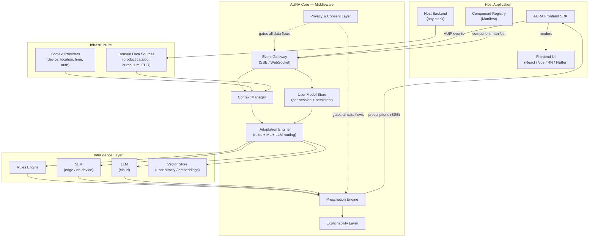
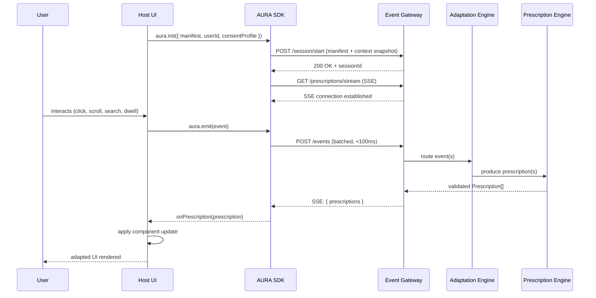
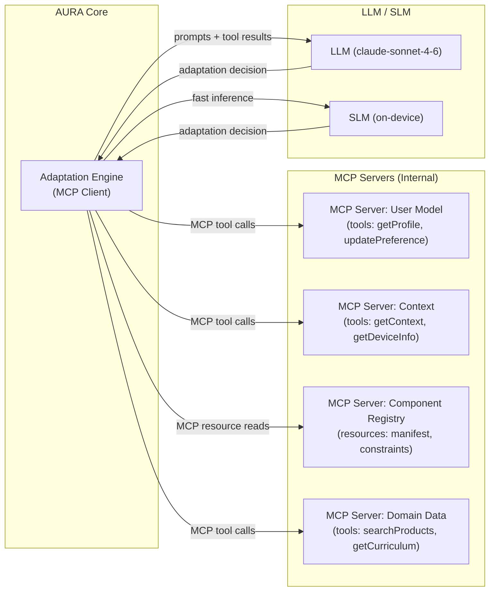
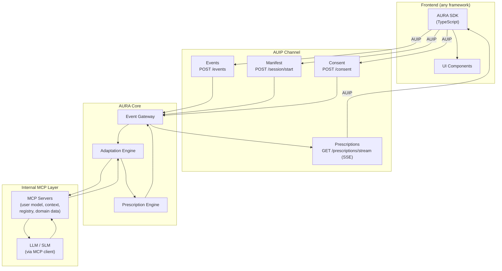
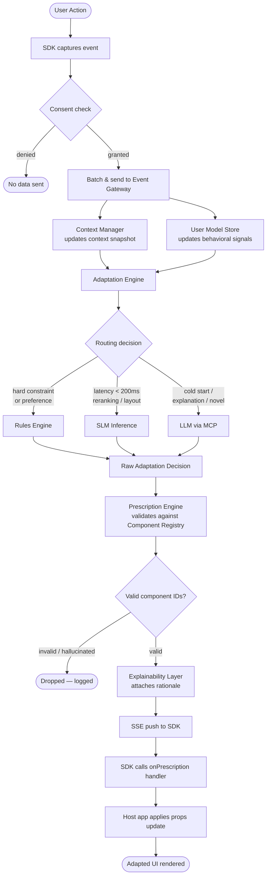
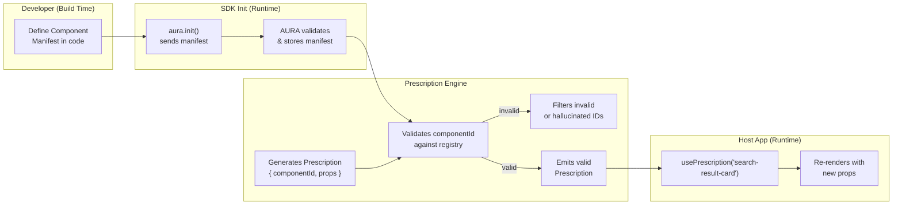
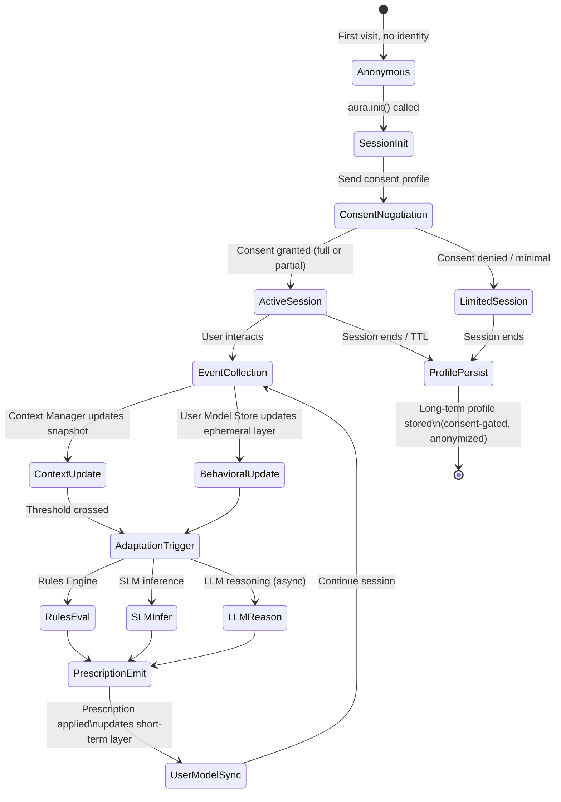
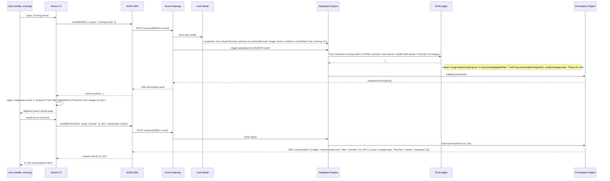
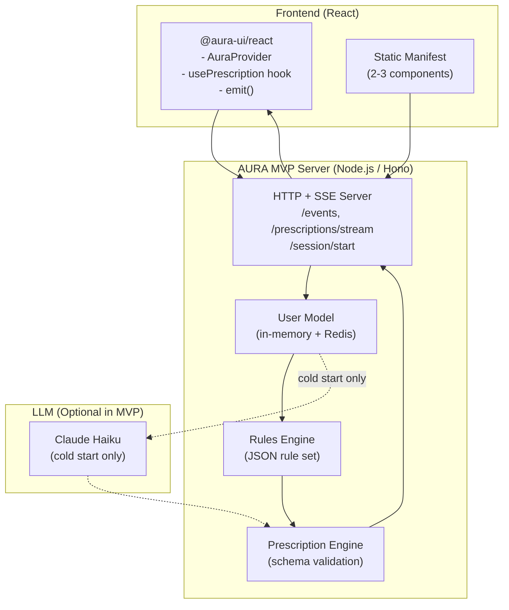
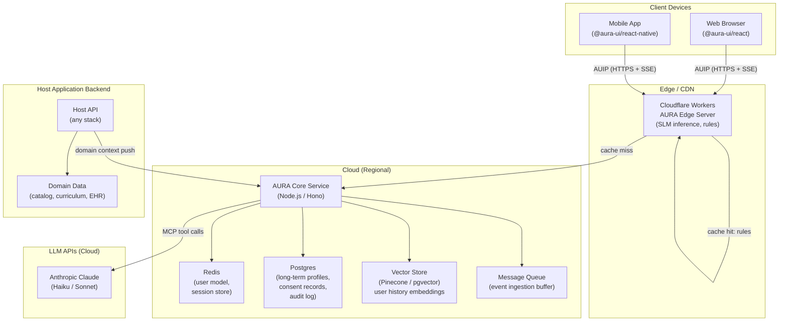

# AURA — Adaptive UI Runtime Architecture
### A Generic Reference Framework for Integrating Adaptive User Interfaces into Modern Web and Mobile Applications

> **Version**: 0.1 (Draft)
> **Date**: 2026-06-20
> **Status**: Research Synthesis & Architecture Design

---

## Table of Contents

1. [Name, Vision, and Conceptual Model](#1-name-vision-and-conceptual-model)
2. [Main Architectural Components](#2-main-architectural-components)
3. [Frontend ↔ Middleware Communication](#3-frontend--middleware-communication)
4. [Is MCP Sufficient?](#4-is-mcp-sufficient)
5. [The Adaptive UI Protocol (AUIP)](#5-the-adaptive-ui-protocol-auip)
6. [Data Flow: From User Interaction to Adaptive UI Decision](#6-data-flow-from-user-interaction-to-adaptive-ui-decision)
7. [Component Registration and UI Prescription](#7-component-registration-and-ui-prescription)
8. [LLM and SLM Usage: Safety, Efficiency, and Latency](#8-llm-and-slm-usage-safety-efficiency-and-latency)
9. [User Profiles and Context Models](#9-user-profiles-and-context-models)
10. [Privacy, Security, Consent, and Explainability](#10-privacy-security-consent-and-explainability)
11. [TypeScript Developer Experience](#11-typescript-developer-experience)
12. [Example: E-Commerce Search and Discovery Adaptation](#12-example-e-commerce-search-and-discovery-adaptation)
13. [Minimal MVP Architecture](#13-minimal-mvp-architecture)
14. [Research and Product Roadmap](#14-research-and-product-roadmap)
15. [Risks, Open Questions, and Open Source Strategy](#15-risks-open-questions-and-open-source-strategy)

---

## 1. Name, Vision, and Conceptual Model

### Name: AURA — Adaptive UI Runtime Architecture

### Vision

Modern applications still deliver the same interface to every user regardless of who they are, what device they are on, what they are trying to accomplish, or how their needs change over time. This is a fundamental mismatch. A decade of research — from Brusilovsky's adaptive hypermedia systems (2012) to Wang et al.'s systematic review of AUI in chronic disease management (2024) to Ghosh et al.'s LLM-powered UI framework for culturally sensitive healthcare (2023) — has demonstrated that adaptive interfaces produce measurable improvements in task completion, engagement, accessibility, and user trust.

What has been missing is a practical, general-purpose middleware layer that any development team can adopt without rebuilding their application.

AURA is that layer.

### Conceptual Model

AURA is a **stateful middleware** that sits between a host application and its users. It:

- **Observes** user events, context signals, and domain data from the host app
- **Builds** a live user model and context model per session
- **Reasons** using rules, SLMs, or LLMs to produce adaptation decisions
- **Prescribes** specific, bounded UI changes back to the frontend via a registered component vocabulary
- **Explains** its decisions on request, preserving user trust and autonomy

The host application retains full rendering authority. AURA only prescribes *what* should change and *why* — it never replaces or owns the UI. This separation is the defining architectural principle.

**Metaphor**: AURA functions like a nervous system's brain stem for user interfaces — always running at low latency, influencing perceptual and motor decisions, operating largely below conscious awareness, but fully observable and overridable when needed.

This stands in deliberate contrast to chatbot-centric or full-rewrite approaches. AURA is ambient and additive, not conversational and disruptive. It integrates into existing products at the SDK level.

### Scope

AURA targets:

- **Web apps** (React, Vue, Angular, Svelte, Solid, vanilla JS)
- **Mobile apps** (React Native, Flutter)
- **Enterprise dashboards**
- **Search and discovery experiences**
- Any domain: e-commerce, education, healthcare, productivity

---

## 2. Main Architectural Components

AURA consists of eight primary components organized into three layers: the **Host Layer** (what the application provides), the **AURA Core** (the middleware), and the **Intelligence Layer** (where reasoning happens).

### Diagram 1 — High-Level Reference Architecture

The following C4-inspired diagram shows how AURA sits between a host application and its intelligence backends.



### Component Descriptions

**1. AURA Frontend SDK**
A thin, framework-agnostic TypeScript library (with official bindings for React, Vue, Svelte, React Native, and Flutter). It handles: event emission, SSE subscription to prescriptions, component manifest registration, and consent negotiation. The SDK is the only surface developers interact with directly.

**2. Component Registry (Manifest)**
Inspired by Mirage (Cordioli & Matera, 2025), this is a structured, typed declaration of every UI component the host app is willing to let AURA influence. Registered components have: a stable ID, a semantic description, typed props schema (Zod/JSON Schema), and optional constraints. AURA can only prescribe changes to registered components. This is the safety boundary.

**3. Event Gateway**
Receives AUIP event payloads from the frontend SDK over SSE or WebSocket. Validates, normalizes, and routes events to the Context Manager and User Model Store. Also serves as the outbound channel for prescription delivery.

**4. Context Manager**
Aggregates context signals: device capabilities, network quality, time of day, location (if consented), session state, domain context injected by the host backend, and emotional/behavioral signals (dwell time, scroll patterns, error rates). Inspired by Alnanih et al.'s (2013) context-based and rule-based mHealth MUI adaptation.

**5. User Model Store**
Maintains a multi-layered user model per user:
- **Ephemeral layer**: current session behavior
- **Short-term layer**: last 30 days of interaction patterns
- **Long-term layer**: stable preferences, demographics, accessibility needs, domain expertise
- **Social layer**: optional population-level signals (anonymized cohort data)

Based on Brusilovsky's (2012) adaptive hypermedia user model structure and extended by Wang et al.'s (2024) AUI guidelines for chronic disease.

**6. Adaptation Engine**
The decision core. Routes adaptation requests to the appropriate reasoning backend:
- **Rules Engine**: deterministic, fast, auditable — for hard constraints (accessibility requirements, regulatory limits, user-set preferences)
- **SLM**: low-latency semantic decisions — for layout reranking, content prioritization, tone adjustment
- **LLM**: complex multi-step reasoning — for cold-start onboarding, explanation generation, novel adaptation hypotheses

**7. Prescription Engine**
Takes raw reasoning output and validates it against the Component Registry before emitting. No hallucinated component IDs can reach the frontend. Outputs typed `Prescription` objects with: target component ID, new props/variants, priority, TTL, and optional explanation string.

**8. Privacy & Consent Layer**
Cross-cutting gate on all data flows. Enforces user consent decisions, data minimization policies, retention limits, and differential privacy budgets. Discussed in detail in Section 10.

**9. Explainability Layer**
Attaches human-readable rationale to prescriptions on request. Draws on Islam et al.'s (2025) HIAG transparency framework and Kim et al.'s (2025) findings on XAI design for older adults. Explanations are audience-aware (end-user plain language vs. developer technical detail).

---

## 3. Frontend ↔ Middleware Communication

### Design Principles

1. **The frontend initiates.** AURA is reactive, not intrusive. The SDK emits events; AURA responds with prescriptions.
2. **Prescriptions are non-blocking.** If AURA is unavailable, the host app renders normally. AURA is progressive enhancement.
3. **The contract is the Component Registry.** AURA cannot prescribe anything the host has not explicitly registered.
4. **Latency tiers.** Prescriptions have latency classes: immediate (<50ms, rule-based), fast (<200ms, SLM), deliberate (<2s, LLM).

### Diagram 3 — Frontend Integration Sequence



### SDK Surface (Simplified)

The SDK exposes four primary operations:

- `aura.init(config)` — establishes session, sends manifest, opens SSE stream
- `aura.emit(event)` — sends a user event or context signal
- `aura.onPrescription(handler)` — registers a callback for incoming prescriptions
- `aura.explain(prescriptionId)` — fetches human-readable rationale

Framework-specific bindings (e.g., React hooks `usePrescription`, `useAdaptive`) wrap these primitives.

---

## 4. Is MCP Sufficient?

### What MCP Does Well

The Model Context Protocol (MCP) is a structured protocol for LLMs to discover and invoke tools and resources. It excels at:

- Tool registration and discovery
- Structured tool call/response cycles
- Resource exposure to LLMs
- Composability across MCP servers

AURA uses MCP internally to expose its Context Manager, User Model Store, and Component Registry as MCP tools/resources to LLM reasoning agents. This is a natural fit.

### Where MCP Falls Short for Adaptive UI

| Requirement | MCP | Gap |
|---|---|---|
| Real-time push from middleware → frontend | ✗ (pull-only) | SSE/WebSocket needed |
| Component manifest registration by host app | ✗ | Custom AUIP manifest format needed |
| Low-latency event streaming from browser | ✗ | Batched HTTP / WebSocket needed |
| Structured Prescription payload format | ✗ | AUIP prescription schema needed |
| Privacy/consent negotiation at session start | ✗ | AUIP session handshake needed |
| Frontend SDK integration (browser/RN/Flutter) | ✗ | AUIP client SDK needed |

**Conclusion**: MCP is used as the internal protocol between the Adaptation Engine and LLM/SLM reasoning backends. It is not used for the frontend ↔ middleware channel. A complementary protocol, AUIP, handles that channel.

### Diagram 6 — MCP-Based Architecture Option

This shows AURA's internal use of MCP for LLM tool integration.



### Diagram 7 — AUIP Custom Protocol Architecture Option

This shows the full picture with AUIP handling the frontend channel.



---

## 5. The Adaptive UI Protocol (AUIP)

AUIP is a thin, JSON-over-HTTP protocol with SSE for server-push. It is intentionally simple and does not require new infrastructure — it runs on any HTTP server.

### Session Start

```
POST /aura/session
Content-Type: application/json

{
  "userId": "u_abc123",          // or "anonymous"
  "sessionId": "s_xyz",
  "consentProfile": {
    "behavioralTracking": true,
    "personalization": true,
    "dataRetentionDays": 30,
    "explainability": true
  },
  "context": {
    "deviceType": "mobile",
    "os": "iOS",
    "viewport": { "width": 390, "height": 844 },
    "locale": "en-US",
    "timezone": "America/New_York",
    "networkQuality": "4g"
  },
  "manifest": {
    "schemaVersion": "1.0",
    "components": [
      {
        "id": "search-result-card",
        "description": "Product card shown in search results",
        "variants": ["standard", "compact", "expanded", "image-lead"],
        "adaptableProps": {
          "variant": { "type": "string", "enum": ["standard", "compact", "expanded", "image-lead"] },
          "showPrice": { "type": "boolean" },
          "showRating": { "type": "boolean" },
          "badgeLabel": { "type": "string", "maxLength": 20 }
        }
      }
    ]
  }
}
```

### Event Schema

```
POST /aura/events
Content-Type: application/json

{
  "sessionId": "s_xyz",
  "events": [
    {
      "type": "USER_INTERACTION",
      "name": "search",
      "payload": { "query": "running shoes", "resultCount": 48 },
      "ts": 1750420800000
    },
    {
      "type": "BEHAVIORAL",
      "name": "dwell",
      "payload": { "componentId": "search-result-card", "itemId": "prod_999", "durationMs": 4200 },
      "ts": 1750420804200
    }
  ]
}
```

### Prescription Schema

```json
{
  "prescriptionId": "pr_001",
  "sessionId": "s_xyz",
  "latencyClass": "fast",
  "prescriptions": [
    {
      "id": "pr_001_a",
      "targetComponent": "search-result-card",
      "scope": "list",
      "priority": 1,
      "props": {
        "variant": "image-lead",
        "showRating": true,
        "badgeLabel": "Top Pick"
      },
      "filter": { "itemIds": ["prod_999", "prod_1001"] },
      "ttlMs": 60000,
      "explainId": "ex_001"
    }
  ]
}
```

### Explanation Response

```
GET /aura/explain/ex_001

{
  "prescriptionId": "pr_001_a",
  "audience": "end-user",
  "text": "We highlighted these products because you spent extra time looking at them and they match your recent interest in running gear.",
  "technicalDetail": {
    "trigger": "dwell > 3000ms on search-result-card",
    "model": "rule:dwell_boost + slm:rerank",
    "confidence": 0.87
  }
}
```

---

## 6. Data Flow: From User Interaction to Adaptive UI Decision

This section traces the full path from a user action to a rendered UI change.

### Diagram 2 — Adaptive UI Decision Pipeline



### Latency Budget

| Path | Target P95 Latency | Mechanism |
|---|---|---|
| Rules Engine | < 20ms | In-memory rule evaluation |
| SLM (edge) | < 150ms | On-device or edge inference |
| SLM (remote) | < 300ms | Dedicated inference endpoint |
| LLM (cloud) | < 2000ms | Streamed, non-blocking |
| Fallback (timeout) | Host default renders | SDK degrades gracefully |

If the LLM path exceeds its budget, the Prescription Engine emits a partial prescription using the best available rule/SLM result and marks it `provisional: true`. The LLM result, when it arrives, can update the prescription if the component is still visible.

---

## 7. Component Registration and UI Prescription

### Diagram 4 — Component Registry and UI Prescription Flow



### Registration Example (TypeScript / React)

```typescript
// manifest.ts — declared once, shared between frontend and backend
import { defineManifest } from '@aura-ui/core'

export const manifest = defineManifest({
  components: {
    'search-result-card': {
      description: 'Product card shown in search result lists',
      variants: ['standard', 'compact', 'expanded', 'image-lead'],
      adaptableProps: z.object({
        variant: z.enum(['standard', 'compact', 'expanded', 'image-lead']),
        showPrice: z.boolean(),
        showRating: z.boolean(),
        badgeLabel: z.string().max(20).optional(),
      }),
    },
    'nav-header': {
      description: 'Top navigation bar',
      adaptableProps: z.object({
        simplified: z.boolean(),
        pinnedCategoryId: z.string().optional(),
      }),
    },
  },
})
```

```tsx
// SearchResultCard.tsx
import { usePrescription } from '@aura-ui/react'

function SearchResultCard({ product, defaultProps }) {
  const prescription = usePrescription('search-result-card', product.id)
  const props = { ...defaultProps, ...prescription?.props }

  return <ProductCard {...props} product={product} />
}
```

### Prescription Lifecycle

1. **Registration**: manifest sent at `aura.init()`. Immutable for the session.
2. **Prescription issued**: Prescription Engine emits a `Prescription` with a TTL.
3. **Application**: SDK passes props to host component via hook/callback.
4. **Expiry**: After TTL, the SDK reverts to host defaults unless a new prescription arrives.
5. **Override**: Users can always override adaptive decisions (preference persisted back to User Model).

User override persistence closes the loop recommended by Wang et al. (2024) and is essential to preventing the "Frustration–Disengagement Loop" identified in Tulak et al.'s (2026) study of adaptive educational platforms.

---

## 8. LLM and SLM Usage: Safety, Efficiency, and Latency

### The Two-Tier Reasoning Model

AURA never routes all decisions to an LLM. Doing so would be slow, expensive, and opaque. Instead, it uses a tiered approach:

| Tier | Model | When | Latency | Cost |
|---|---|---|---|---|
| Rules | Deterministic engine | Hard constraints, user-set prefs | <20ms | ~$0 |
| SLM | Small, on-device or edge | Reranking, layout hints, tone | <300ms | Very low |
| LLM | Cloud LLM (e.g., claude-haiku-4-5 / claude-sonnet-4-6) | Cold start, explanation, novel hypotheses | <2s | Moderate |

The LLM is never on the hot path for returning users with established profiles. It is used for:
- First-session onboarding (cold start profiling)
- Generating natural-language explanations
- Hypothesis generation for A/B testing new adaptation rules
- Complex cross-modal decisions (e.g., layout + content + notification together)

### Safety Constraints on LLM/SLM Output

LLM and SLM outputs are **always** validated before reaching the frontend:

1. **Schema validation**: Output parsed against Zod schema derived from the Component Registry. Invalid shapes are dropped.
2. **Component ID check**: Any referenced component ID must exist in the manifest. Hallucinated IDs are silently dropped with a warning log.
3. **Prop constraint check**: Prop values must satisfy the component's schema (e.g., `variant` must be one of the declared enum values).
4. **Rate limiting**: Maximum one LLM call per session per 30-second window to prevent runaway inference spend.
5. **Fallback**: If the LLM/SLM path fails, the Rules Engine result or host defaults are used.

### Prompt Engineering Principles

- Prompts include the full component manifest as structured context.
- User model data is summarized, not raw-dumped, to reduce token overhead.
- System prompts emphasize: "Only reference component IDs from the provided manifest."
- Chain-of-thought is used for explanation generation but stripped before sending decisions to the Prescription Engine.
- Outputs are requested in strict JSON format matching the Prescription schema.

### Federated and On-Device Learning

For privacy-sensitive domains (healthcare, education for minors), AURA supports:
- **Federated SLM fine-tuning**: local model updates trained on-device, gradients aggregated without raw data leaving the device. Inspired by Chanamalla et al.'s (2024) federated learning approach in multi-agent e-commerce.
- **On-device SLM inference**: Prescription decisions never leave the user's device for basic personalization tasks.

---

## 9. User Profiles and Context Models

### Diagram 5 — User/Context/Profile Model Lifecycle



### User Model Structure

Inspired by Brusilovsky's (2012) adaptive hypermedia user model and extended for modern LLM-assisted inference:

```typescript
interface UserProfile {
  id: string
  anonymousId: string

  // Stable long-term preferences (explicit)
  preferences: {
    accessibilityNeeds: AccessibilityProfile
    preferredLocale: string
    layoutDensity: 'compact' | 'comfortable' | 'spacious'
    darkMode: boolean
    explainabilityLevel: 'off' | 'minimal' | 'detailed'
  }

  // Inferred from behavior (implicit)
  behavioral: {
    domainExpertise: number          // 0–1, domain-specific
    attentionSpan: 'short' | 'medium' | 'long'
    priceAnchoring: 'low' | 'mid' | 'premium'
    preferredContentFormats: ('text' | 'image' | 'video')[]
    typicalSessionDuration: number  // minutes
  }

  // Session-level ephemeral state
  session: {
    currentGoal: string | null
    recentItems: string[]
    frustrationSignals: number
    successSignals: number
    dwellHeatmap: Record<string, number>
  }

  // Context inferred from environment
  context: ContextSnapshot
}

interface ContextSnapshot {
  deviceType: 'mobile' | 'tablet' | 'desktop'
  networkQuality: 'slow-2g' | '3g' | '4g' | 'wifi'
  timeOfDay: 'morning' | 'afternoon' | 'evening' | 'night'
  locale: string
  accessibilityOverrides: AccessibilityProfile
  emotionalSignals?: EmotionalSignal  // consent-gated
}
```

### Context Sources

Following Alnanih et al.'s (2013) context-based MUI adaptation framework, context signals are organized into:

- **User context**: behavioral history, explicit preferences, cognitive load signals (error rate, retry count)
- **Device context**: viewport, input modality, network quality, battery level
- **Environment context**: time, locale, ambient noise (mobile only, consent required)
- **Domain context**: injected by host backend (e.g., current cart state, enrollment status, patient condition severity)
- **Social/emotional context**: dwell time patterns, interaction pace, frustration signals — consent-gated, following Deshmukh et al.'s (2024) emotionally adaptive chatbot ethics framework

### Demographic Inference

De Andrés et al. (2025) demonstrated that demographic features (age, gender) can be inferred with high accuracy from interaction patterns alone (point-and-click timing, drag-and-drop patterns). AURA can use such signals for cold-start profiling but must:
1. Treat inferred demographics as probabilistic hints, not facts
2. Never store inferred demographics without explicit consent
3. Allow users to correct any inferred profile attributes

---

## 10. Privacy, Security, Consent, and Explainability

### Privacy by Design

AURA treats privacy as a first-class architectural constraint, not an afterthought:

1. **Consent-first session start**: No behavioral data is collected before the consent profile is established.
2. **Data minimization**: Only signals required for the active adaptation task are collected. Idle signals are discarded.
3. **Differential privacy**: Aggregate behavioral data used for SLM fine-tuning is noise-injected before aggregation.
4. **On-device option**: Full SLM-based adaptation with zero data leaving the device, for regulated domains (healthcare, finance, education for minors).
5. **Right to erasure**: User model deletion propagates to all stores within 24 hours.
6. **Retention limits**: Ephemeral session data: 24 hours. Short-term behavioral: 30 days (default, configurable). Long-term explicit preferences: indefinite (user-controlled).

### Regulatory Considerations

| Regulation | AURA Mechanism |
|---|---|
| GDPR (EU) | Consent profiles, right to erasure, data minimization, portability export |
| HIPAA (US healthcare) | On-device processing option, no PHI in cloud LLM prompts, audit logs |
| COPPA (children) | Age gate at consent, mandatory on-device mode for <13 |
| CCPA (California) | Opt-out of behavioral sale, data access requests |
| AI Act (EU) | Explainability layer, human override, high-risk domain classification |

### Trust and Transparency

Kim et al.'s (2025) study of XAI for older adults on NAVER Shopping found that:
- Many users don't notice explanation features during routine use
- Local (item-level) explanations are more effective than global system-level ones
- User-model dashboards create tension between empowerment and surveillance

AURA implements this research directly:
- **Passive mode**: explanations available on demand, not surfaced proactively
- **Active mode**: brief inline explanation labels for each adaptive change ("Showing compact view for your screen size")
- **Dashboard mode**: user-facing profile viewer showing inferred preferences, with correction controls
- **Audience-aware explanations**: plain language for end users; technical detail for developers

Islam et al.'s (2025) HIAG framework maps directly to AURA's explainability tiers:
- **Cognitive transparency**: what AURA knows about you and why it made a choice
- **Emotional transparency**: uncertainty is acknowledged; confidence scores are visible
- **Social transparency**: AURA does not act on your behalf without your awareness

### Security

- All AUIP endpoints require authentication (JWT / session token)
- Component manifests are signed at build time; the gateway verifies signatures to prevent injection
- LLM prompts never include raw PII; user data is anonymized or pseudonymized before inclusion
- Prescription payloads are sanitized to prevent XSS (no raw HTML in prescription props)
- Rate limiting and anomaly detection on event ingestion to prevent manipulation attacks

---

## 11. TypeScript Developer Experience

### SDK Installation

```bash
npm install @aura-ui/core @aura-ui/react
# or
npm install @aura-ui/core @aura-ui/vue
# or
npm install @aura-ui/core @aura-ui/react-native
```

### Full Integration (React)

```tsx
// app/providers.tsx
import { AuraProvider } from '@aura-ui/react'
import { manifest } from './aura-manifest'

export function Providers({ children, userId }) {
  return (
    <AuraProvider
      endpoint="https://aura.yourapp.com"
      userId={userId}
      manifest={manifest}
      consent={{ behavioralTracking: true, personalization: true }}
      onPrescriptionError={(err) => console.error(err)}
    >
      {children}
    </AuraProvider>
  )
}
```

```tsx
// components/SearchResultCard.tsx
import { usePrescription, useAuraEmit } from '@aura-ui/react'

function SearchResultCard({ product }) {
  const emit = useAuraEmit()
  const prescription = usePrescription('search-result-card', product.id)

  const variant = prescription?.props.variant ?? 'standard'
  const showRating = prescription?.props.showRating ?? true

  return (
    <div
      className={cardVariants[variant]}
      onMouseEnter={() => emit({ type: 'BEHAVIORAL', name: 'hover', payload: { itemId: product.id } })}
    >
      {showRating && <StarRating value={product.rating} />}
      <ProductInfo product={product} />
      {prescription?.explainId && (
        <ExplanationBadge explainId={prescription.explainId} />
      )}
    </div>
  )
}
```

### Emitting Domain Context (Backend Integration)

```typescript
// server/aura-context-push.ts
import { AuraServerClient } from '@aura-ui/server'

const aura = new AuraServerClient({ endpoint: 'https://aura.yourapp.com', apiKey: process.env.AURA_API_KEY })

// Called after user adds to cart
async function onCartUpdate(sessionId: string, cart: Cart) {
  await aura.pushContext(sessionId, {
    type: 'DOMAIN',
    name: 'cart_updated',
    payload: {
      itemCount: cart.items.length,
      totalValue: cart.total,
      categories: cart.items.map(i => i.category),
    },
  })
}
```

### Manifest Type Safety

```typescript
// aura-manifest.ts
import { defineManifest } from '@aura-ui/core'
import { z } from 'zod'

export const manifest = defineManifest({
  components: {
    'filter-panel': {
      description: 'Sidebar filter panel for search results',
      adaptableProps: z.object({
        collapsed: z.boolean(),
        visibleFilters: z.array(z.string()).max(5),
        highlightedFilter: z.string().optional(),
      }),
    },
    'recommendation-strip': {
      description: 'Horizontal strip of recommended products',
      adaptableProps: z.object({
        title: z.string().max(40),
        algorithm: z.enum(['similar', 'trending', 'personalized', 'complementary']),
        itemCount: z.number().int().min(2).max(8),
      }),
    },
  },
})

// Derived types available throughout the codebase
export type ManifestComponents = typeof manifest['components']
```

### Server-Side Rendering Compatibility

For Next.js App Router (RSC):
- The AURA Provider is a client component boundary
- Initial render uses host defaults (SSR-safe)
- Prescriptions hydrate client-side after SSE connection
- No hydration mismatch because prescriptions are applied post-mount

---

## 12. Example: E-Commerce Search and Discovery Adaptation

### Scenario

A returning user on a fashion e-commerce site searches for "running shoes". They have previously dwelt for >5 seconds on premium trail running items, added one to cart but abandoned it, and tend to shop in the evenings on mobile.

### Diagram 8 — E-Commerce Search/Discovery Adaptation Flow



### Adaptations Applied

| Component | Before | After |
|---|---|---|
| `search-result-card` | Standard list, no badges | Image-lead, 2-column grid, "Picked for You" badges on trail items |
| `filter-panel` | All filters visible, alphabetical | "Trail" filter highlighted and pinned; price filter expanded with premium range selected |
| `recommendation-strip` | "Best Sellers" | "Similar to what you've been exploring" (personalized algorithm) |
| `nav-header` | Standard | Simplified (fewer menu items for mobile evening browsing) |

### Conversion Signal Loop

After the user clicks through and purchases:
- AURA receives a `CONVERSION` domain event from the host backend
- User Model is updated: reinforces premium trail running as confirmed preference
- SLM fine-tunes locally on the signal (federated update)
- Next session starts with a warmer model

This reinforcement loop mirrors the RL-based adaptation approach of Shakshuki et al. (2015) and the dynamic adaptive learning system of Tiwari et al. (2024).

---

## 13. Minimal MVP Architecture

The MVP proves the core loop: emit events → build user model → produce prescriptions → apply to host UI. Everything else is iterative.

### Diagram 9 — MVP Architecture



### MVP Scope

**Include:**
- AUIP session start, event ingestion, SSE prescription stream
- Static component manifest validation
- Rules Engine with ~10 configurable rules (JSON)
- In-memory user model with Redis persistence
- `usePrescription` React hook
- One real component integration (e.g., search result card)

**Exclude from MVP:**
- SLM on-device inference
- Federated learning
- Explainability dashboard
- Multi-tenant support
- Vue / Angular / React Native SDKs
- MCP internal integration

### MVP Tech Stack

```
Server:    Node.js + Hono (edge-compatible)
Storage:   Redis (user model + session)
Protocol:  HTTP + SSE (no WebSocket in MVP)
LLM:       Anthropic Claude Haiku (optional, cold start only)
Frontend:  React + @aura-ui/react (MVP SDK)
Schema:    Zod (shared between frontend and server)
Deploy:    Cloudflare Workers + KV (or any Node host)
```

### Time to First Prescription (MVP Target)

- Developer installs SDK: ~15 minutes
- Defines manifest (2 components): ~30 minutes
- Wraps components with `usePrescription`: ~1 hour
- Writes 5 basic rules: ~1 hour
- First adaptive behavior in production: same day

---

## 14. Research and Product Roadmap

### Phase 1: Foundation (Months 1–4)

**Goal**: Prove the core loop works in production for one domain.

- AUIP protocol v1.0 specification (stable)
- AURA server MVP (Node.js, open source)
- `@aura-ui/react` SDK v0.1
- Rules Engine with JSON DSL
- Redis-backed user model (ephemeral + short-term)
- Reference implementation: e-commerce search page
- Developer documentation + quickstart

**Research questions to validate**:
- What rule complexity is needed before LLM reasoning adds value?
- What prescription latency threshold degrades user experience?
- How does manifest-bounded prescription affect developer adoption?

### Phase 2: Intelligence (Months 5–10)

**Goal**: Introduce SLM reasoning and multi-framework SDK support.

- SLM integration (edge inference via WASM or Cloudflare AI)
- MCP internal integration (LLM tool access to user model, context, registry)
- `@aura-ui/vue`, `@aura-ui/react-native` SDKs
- Explainability layer v1 (per-prescription rationale)
- User consent dashboard component
- Domain adapters: education (LMS integration), healthcare (FHIR context provider)
- A/B testing bridge (prescriptions as experiment variants)

**Research directions** (grounded in corpus):
- Reinforcement learning for long-horizon adaptation (Tiwari et al., 2024)
- Emotionally adaptive signal processing (Deshmukh et al., 2024)
- Accessibility-first adaptive heuristics (Tulak et al., 2026)
- Cross-cultural adaptation (Dong, 2025; Ghosh et al., 2023)

### Phase 3: Ecosystem (Months 11–18)

**Goal**: Platform, community, and enterprise readiness.

- On-device SLM with federated fine-tuning
- Multi-tenant AURA cloud offering
- Plugin API for custom Adaptation Engine modules
- `@aura-ui/flutter`, `@aura-ui/angular` SDKs
- AURA Studio: visual rule authoring + prescription preview
- Compliance packages (HIPAA, GDPR audit logs, COPPA mode)
- Marketplace for community adaptation rules and domain packs
- Integration with analytics platforms (Segment, Amplitude, Mixpanel as context sources)

---

## 15. Risks, Open Questions, and Open Source Strategy

### Technical Risks

| Risk | Likelihood | Impact | Mitigation |
|---|---|---|---|
| LLM hallucinating invalid component IDs | High | Medium | Prescription Engine validation — this is already handled |
| SSE connection instability on mobile | Medium | High | Fallback to polling; offline-first host defaults |
| User model drift (stale preferences) | Medium | Medium | TTL-gated behavioral signals; explicit preference overrides always win |
| SLM on-device latency exceeds budget | Medium | Medium | Async prescription with provisional fallback |
| Privacy regulation changes (e.g., new data types classified as PII) | Low | High | Data minimization defaults; consent profiles are configurable |
| Adversarial manipulation of behavioral signals | Low | High | Anomaly detection on event ingestion; rate limiting |

### Open Questions

1. **When does LLM reasoning outperform rules?** Current evidence (Cordioli & Matera, 2025; Ghosh et al., 2023) is promising but domain-specific. We need controlled studies across e-commerce, education, and healthcare to establish the crossover point.

2. **How granular should the Component Registry be?** Fine-grained registration gives more control but increases developer overhead. Coarse-grained registration is simpler but reduces AURA's influence surface.

3. **What is the right mental model for end users?** Kim et al. (2025) found that users don't notice XAI features in routine use. If adaptive UI is invisible, does explainability matter? We need UX research specifically on AUI discoverability.

4. **Can adaptation cause harm?** In healthcare, an incorrectly simplified UI might hide critical information. Wang et al.'s (2024) AUI guidelines for chronic disease warn explicitly about "preventing user overload while maintaining critical software functionality." AURA needs domain-specific harm prevention modes.

5. **How do we handle multi-user devices?** Shared tablets in healthcare or education break per-user models. AURA needs a fast user-switching mechanism that does not rely on OS-level identity.

6. **Is AUIP the right protocol, or should we build on existing standards?** ActivityPub, WebSub, or a simplified gRPC stream are alternatives worth evaluating. The choice matters for long-term ecosystem interoperability.

### Open Source Strategy

For AURA to become widely adopted, it must follow the playbook of successful developer-focused open source projects (Kubernetes, PostHog, Supabase):

1. **Open core, not open washing**: The AUIP protocol specification, `@aura-ui/core`, `@aura-ui/react`, and the AURA MVP server are fully open source under MIT or Apache 2.0. The business model is cloud hosting, compliance packages, and enterprise SLAs.

2. **Protocol first**: Publishing the AUIP specification independently of any implementation allows competing server implementations. This reduces vendor lock-in concerns and accelerates adoption.

3. **Framework-agnostic from day one**: If the React SDK ships before Vue and Angular, adoption stalls in Vue/Angular-heavy enterprise shops. All framework bindings should ship together.

4. **Developer experience is the product**: The time-to-first-prescription metric (target: <2 hours) is the most important KPI for open source adoption. Every friction point in the getting-started experience kills adoption.

5. **Academic partnership**: The research corpus underlying AURA (Brusilovsky, Wang et al., Ghosh et al., and others) creates a natural bridge to HCI and AI research communities. Publishing AURA as a research platform for AUI experiments — with a dataset-sharing agreement — could drive both academic citations and practitioner adoption.

6. **Domain reference implementations**: Releasing production-quality reference implementations for e-commerce search, LMS adaptive content, and mHealth dashboards would dramatically lower the barrier for teams in those verticals.

### Diagram 10 — Deployment Topology

The following diagram shows AURA in a typical production deployment.



**Key topology decisions**:
- Edge layer handles rule-based prescriptions (<20ms) without hitting the cloud
- SLM inference runs at the edge via WASM (Cloudflare AI Workers)
- LLM calls are always cloud-side, never at edge (latency is acceptable for async paths)
- The host backend pushes domain context to AURA via server-to-server API, avoiding client-side exposure of sensitive data (e.g., patient conditions, financial status)

---

## Conclusion

AURA addresses a genuine gap: the absence of practical, general-purpose middleware for adaptive user interfaces. The research corpus — spanning 37 papers across e-commerce, education, and healthcare — provides strong theoretical grounding. The key architectural decisions are:

1. **Middleware, not framework**: AURA sits between the host app and the user, prescribing bounded changes to registered components. It does not replace the UI.
2. **MCP + AUIP, not MCP alone**: MCP handles LLM tool integration internally; AUIP handles the frontend channel.
3. **Rules first, LLM second**: Deterministic rules are fast, cheap, and auditable. LLMs are reserved for cold start, explanation, and novel hypothesis generation.
4. **Manifest as contract**: The Component Registry is the safety boundary. Nothing AURA says can affect a component that has not been registered.
5. **Privacy as architecture**: Consent, data minimization, and on-device processing are first-class design constraints, not compliance afterthoughts.

The MVP is achievable in days for an experienced team. The ecosystem vision — open protocol, multi-framework SDKs, domain packs, AURA Studio — is a 12–18 month arc that positions AURA as the de facto standard for adaptive UI middleware, the way Tailwind CSS became the de facto standard for utility-first styling.

---

## Research References

Papers drawn from the indexed corpus that directly informed this architecture:

| Paper | Domain | Key Contribution to AURA |
|---|---|---|
| Brusilovsky (2012) — Adaptive Hypermedia for Education | Education | User model structure; adaptation mechanism taxonomy |
| Vasilyeva, Pechenizkiy & Puuronen — Towards AUI Framework for eHealth | HealthCare | AUI component framework; eHealth adaptation principles |
| Alnanih, Ormandjieva & Radhakrishnan (2013) — Context-based MUI in mHealth | HealthCare | Context + rule-based adaptation architecture |
| Shakshuki, Reid & Sheltami (2015) — Adaptive UI in Healthcare | HealthCare | RL-based behavioral user model; multi-agent UI system |
| Ghosh, Yan & Lin (2023) — LLM AUIF for Healthcare | HealthCare | LLM-powered real-time UI adaptation; sensor + feedback loop |
| Ghosh, Huang, Yan & Lin — Enhancing Healthcare UIs Through LLMs | HealthCare | LLM for UX recommendations; real-time HTML adjustment pattern |
| Wang et al. — AUI for Chronic Disease (Systematic Review) | HealthCare | AUI design guidelines; usability/adaptation trade-offs |
| Wang et al. (2024) — AUI Design Guidelines for mHealth | HealthCare | 9 evidence-based AUI design guidelines |
| Cordioli & Matera (2025) — Mirage: Goal-Driven Interfaces | Ecommerce | Component registry pattern; LLM-orchestrated GUI; semantic component descriptions |
| Kim et al. (2025) — XAI for Older Adults in E-Commerce | Ecommerce | Explainability UX; local vs. global explanations; surveillance tension |
| De Andrés et al. (2025) — Demographic Prediction from Interactions | Ecommerce | Interaction-based user profiling; cold-start from behavioral signals |
| Chanamalla et al. — AI-Driven Multi-Agent Shopping | Ecommerce | Multi-agent coordination; federated learning for privacy |
| Islam et al. (2025) — Transparency for Trust in Healthcare AI | HealthCare | HIAG transparency framework; cognitive/emotional/social trust |
| Deshmukh et al. (2024) — Emotionally Adaptive Chatbots | HealthCare | Ethical filtering; emotion recognition; seven-layer modular architecture |
| Hadyaoui & Cheniti-Belcadhi — SOFIA SOA Adaptive Assessment | Education | Service-oriented adaptive framework; microservices modularity |
| Tiwari, Singh & Waoo — Reinforcement for Dynamic Adaptive Learning | Education | RL-based content adaptation; feedback-driven instruction loop |
| Tulak, Kaharuddin & Tulak (2026) — Representational Divide | Education | Gamification failures; frustration-disengagement loop; inclusive design heuristics |
| Fouad et al. — Human-Centered XAI in Chest Radiology | HealthCare | Co-design methodology; clinical XAI UI principles |
| Njei et al. — AI Agents in Healthcare Scoping Review | HealthCare | Agentic architecture patterns; RAG + tool use; multi-agent debate |
