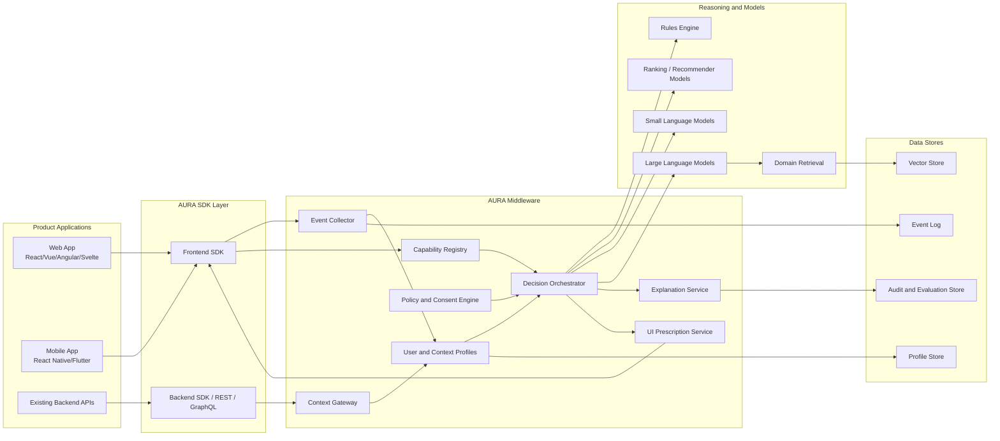
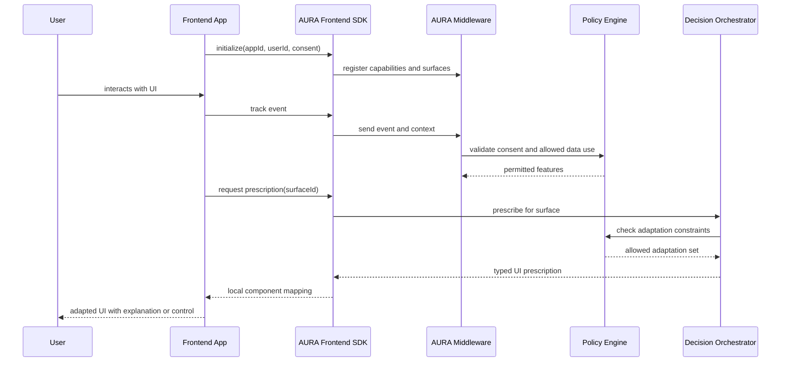
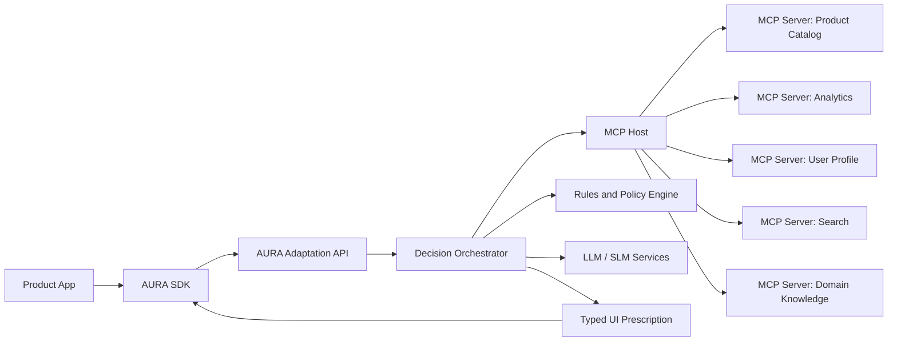
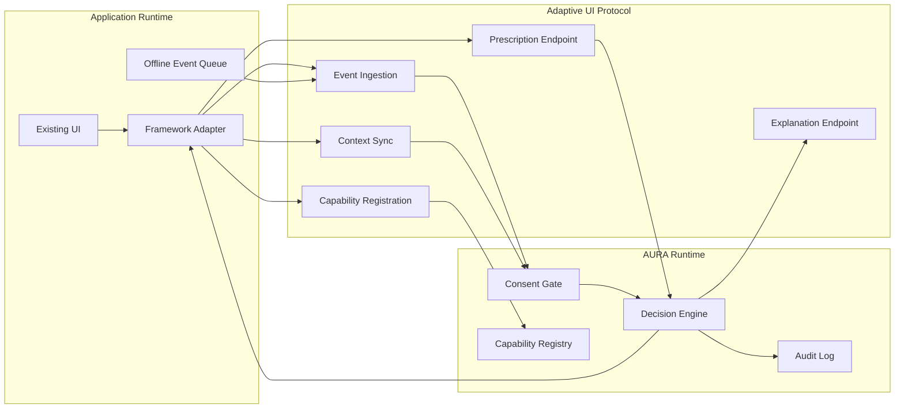
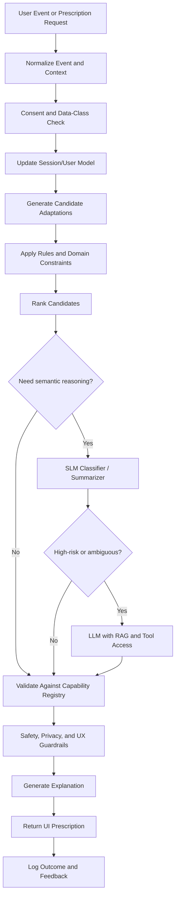
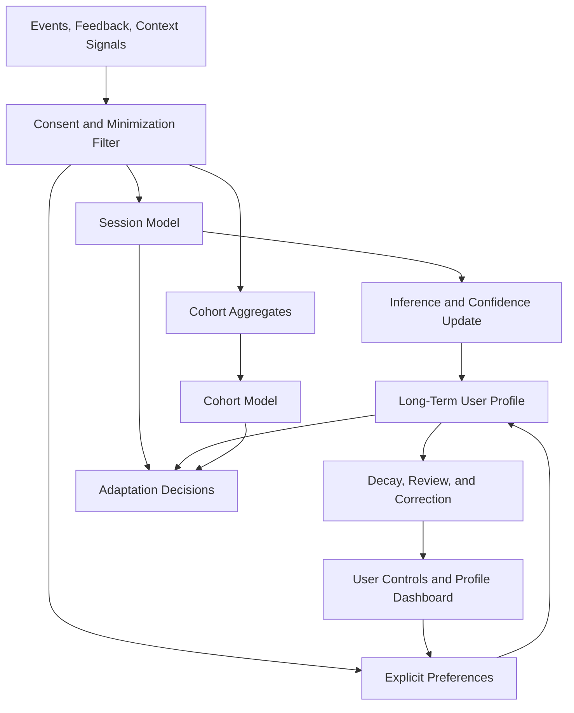
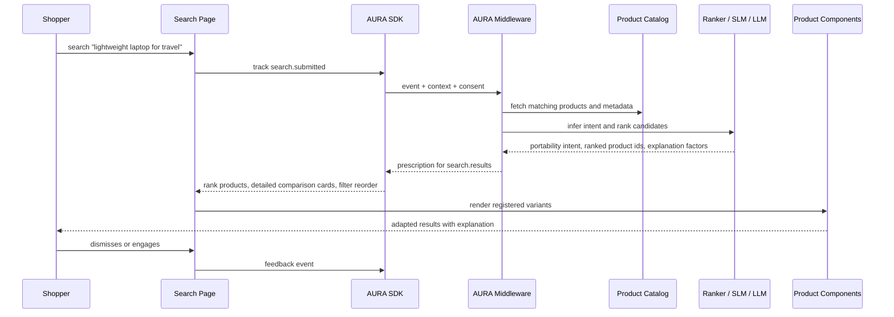
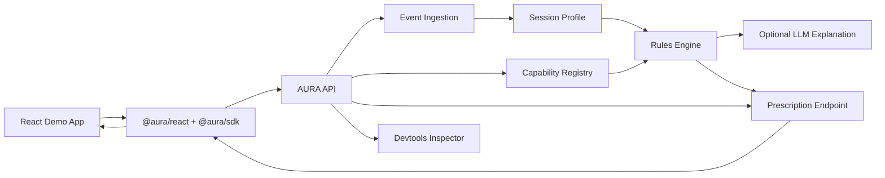
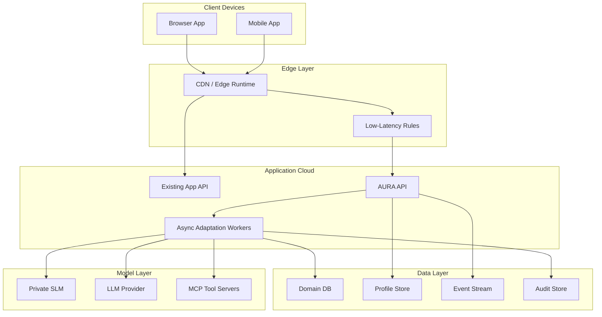

# AURA: Adaptive User Runtime Architecture

AURA is a reference architecture and developer framework for adding adaptive user interfaces to existing web and mobile products. It sits between product applications, user/context data, rules and policy engines, LLM/SLM services, and frontend frameworks. Its job is not to let AI rewrite a product UI at runtime. Its job is to make controlled, observable, reversible UI adaptation a normal application capability.

The framework is grounded in classic adaptive hypermedia and user modeling ideas: maintain a model of the user's goals, knowledge, preferences, capabilities, and context, then adapt presentation, navigation, interaction, recommendations, and explanations. Modern LLMs and SLMs add semantic interpretation, component matching, explanation generation, and agentic workflow support, but deterministic rules, typed contracts, consent, evaluation, and product constraints remain central.

## 1. Conceptual Model

AURA uses a simple conceptual model:

- The application declares what it can adapt: components, slots, actions, data fields, accessibility options, ranking surfaces, notification channels, and constraints.
- The application emits interaction and context events.
- The middleware maintains user, context, task, and domain models.
- The decision layer combines rules, policies, ranking models, SLMs, and selectively used LLMs.
- The frontend receives UI prescriptions, not arbitrary generated UI code.
- Every prescription is bounded by permissions, explanation requirements, and rollback behavior.

Core objects:

- `UserModel`: stable and session-level user traits, preferences, expertise, goals, accessibility needs, inferred interests, and consent state.
- `ContextModel`: device, viewport, locale, time, location class, task state, risk level, connectivity, environment, and domain context.
- `CapabilityRegistry`: a typed catalog of UI components, slots, events, actions, and constraints exposed by the app.
- `AdaptationPolicy`: rules, guards, privacy constraints, safety thresholds, and domain limits.
- `UIPrescription`: the middleware's typed recommendation to alter layout, content, ranking, labels, explanations, interaction mode, or accessibility settings.
- `ExplanationRecord`: user-facing and developer-facing reasons for an adaptation.

## 2. Main Architectural Components

The architecture should be implemented as modular middleware, not as a monolithic AI service.

- Frontend SDKs: thin adapters for React, Vue, Angular, Svelte, Solid, React Native, Flutter, and plain web components.
- Event Collector: captures user events, component impressions, task events, consent changes, and explicit feedback.
- Context Gateway: normalizes device, location class, session, accessibility, domain, and environmental signals.
- Profile Service: stores and updates user, cohort, and session models.
- Capability Registry: records what the product UI can safely change.
- Decision Orchestrator: coordinates rules, recommenders, SLMs, LLM calls, policies, and experiments.
- Policy and Consent Engine: enforces privacy, domain rules, user permissions, tenant policies, and safety gates.
- Prescription Service: returns typed UI prescriptions to the app.
- Explanation Service: produces user-facing and developer-facing explanations.
- Evaluation and Observability: measures outcomes, drift, latency, reversions, harmful adaptations, and user trust.

This high-level view shows AURA as middleware, not a replacement frontend or backend.



## 3. Frontend Communication

The frontend communicates with AURA through a framework-neutral SDK and a transport-neutral protocol. The SDK should support REST, GraphQL, WebSocket, server-sent events, and mobile offline queues.

The frontend integration has four responsibilities:

- Register UI capabilities and adaptation slots.
- Emit normalized interaction and context events.
- Request or subscribe to prescriptions.
- Apply prescriptions only through local component mappings and policy-checked adapters.

Example SDK shape:

```ts
import { createAuraClient } from "@aura/sdk";

const aura = createAuraClient({
  appId: "shop-web",
  userId: session.userId,
  transport: { type: "fetch", endpoint: "/api/aura" },
  consent: { personalization: true, sensitiveInference: false },
});

aura.registerCapabilities({
  surfaces: [
    {
      id: "search.results",
      type: "list",
      slots: ["result-card", "filter-panel", "explanation-banner"],
      allowedAdaptations: ["rank", "reorder", "hide", "highlight", "explain"],
    },
  ],
  components: [
    {
      id: "ProductCard",
      version: "2.1.0",
      propsSchema: "ProductCardProps",
      variants: ["compact", "detailed", "accessible"],
      constraints: { maxPerViewport: 6, requiresProductId: true },
    },
  ],
});

aura.track("search.submitted", {
  query: "running shoes",
  filters: { size: "10", budget: "100-150" },
});

const prescription = await aura.prescribe({
  surfaceId: "search.results",
  intent: "improve-discovery",
});
```

This sequence shows how an application registers capabilities, sends events, and receives bounded UI changes.



## 4. Is MCP Sufficient?

MCP is useful but not sufficient by itself.

MCP is a good fit for connecting the decision layer to tools, application context, retrieval sources, analytics systems, user profile services, product catalogs, LMS data, clinical guidelines, search APIs, and experimentation systems. It gives model-facing agents a standard way to call tools and retrieve context.

MCP is not enough as the frontend-to-middleware adaptation contract because adaptive UI needs:

- Long-lived component and surface registration.
- Strongly typed UI prescriptions.
- Consent-aware event schemas.
- Latency budgets and streaming options.
- Explicit rollback and user override semantics.
- Frontend framework adapters.
- Versioned component capabilities.
- Domain-specific safety classes.
- Audit and explanation requirements for every UI change.

So AURA should use MCP internally where tool access is useful, but expose a purpose-built Adaptive UI Protocol externally.

This MCP-based option is viable for internal orchestration and tool access.



This custom protocol option is better for production UI adaptation boundaries.



## 5. Adaptive UI Protocol Contract

AURA should define an Adaptive UI Protocol, or AUP. It can be implemented over HTTP, GraphQL, WebSocket, or native mobile transports.

Key endpoints:

- `POST /capabilities`: register surfaces, slots, components, events, actions, constraints, and schema versions.
- `POST /events`: send interaction, feedback, impression, task, error, and domain events.
- `POST /context`: sync session, device, accessibility, domain, and environment context.
- `POST /prescriptions`: request an adaptation for one or more surfaces.
- `POST /feedback`: send explicit user response to a prescription.
- `GET /explanations/:id`: fetch user-facing or developer-facing explanation.
- `POST /consent`: update personalization and inference permissions.

Minimal prescription schema:

```ts
type UIPrescription = {
  id: string;
  surfaceId: string;
  version: string;
  priority: "low" | "normal" | "high" | "critical";
  mode: "recommend" | "autoApply" | "askUser" | "observeOnly";
  adaptations: Array<
    | {
        type: "rank";
        target: string;
        orderedIds: string[];
        reasonCode: string;
      }
    | {
        type: "componentVariant";
        slotId: string;
        componentId: string;
        variant: string;
        propsPatch?: Record<string, unknown>;
        reasonCode: string;
      }
    | {
        type: "layout";
        slotId: string;
        layout: "compact" | "expanded" | "step-by-step" | "accessible";
        reasonCode: string;
      }
    | {
        type: "content";
        target: string;
        contentKey: string;
        content: string;
        reasonCode: string;
      }
    | {
        type: "accessibility";
        setting: "fontScale" | "contrast" | "motion" | "inputMode";
        value: string | number | boolean;
        reasonCode: string;
      }
  >;
  constraints: {
    expiresAt: string;
    reversible: boolean;
    requiresUserConfirmation: boolean;
    maxSessionApplications?: number;
  };
  explanation: {
    id: string;
    summary: string;
    userVisible: boolean;
    factors: string[];
  };
  audit: {
    policyVersion: string;
    modelVersions: string[];
    dataClassesUsed: string[];
  };
};
```

## 6. Decision Pipeline

The decision pipeline should be layered. Cheap and deterministic steps should run first. LLMs should be used when semantic reasoning or explanation quality is worth the cost and risk.



Data flow from interaction to decision:

1. A user interacts with the application.
2. The SDK emits a typed event with local context.
3. The consent engine filters or blocks data classes.
4. The profile service updates short-term and long-term models.
5. Candidate adaptations are generated from rules, recommenders, and domain heuristics.
6. SLMs classify intent, friction, task stage, or sentiment where appropriate.
7. LLMs are invoked only for complex semantic mapping, summarization, explanation, or novel component composition within declared capabilities.
8. The policy engine removes unsafe or unauthorized candidates.
9. The prescription service returns a typed, reversible UI prescription.
10. The frontend applies it through local code and reports outcomes.

## 7. Component Registry and Prescription

Applications should never give AURA arbitrary power over the DOM. They should expose a typed registry of safe UI capabilities. This is similar in spirit to goal-driven component orchestration work, but it needs stricter production contracts than prompt-to-UI demos.

The registry includes:

- Components and versions.
- Slots and surfaces.
- Required and optional props.
- Variants and allowed layout modes.
- Accessibility behavior.
- Domain constraints.
- Risk class.
- Experiment flags.
- Fallback behavior.

```mermaid
flowchart LR
  Dev["Developer"] --> Register["Register Components and Surfaces"]
  Register --> Registry["Capability Registry"]
  Registry --> Schema["Schema Validation"]
  Schema --> Decision["Decision Orchestrator"]
  Decision --> Match["Match User Need to Available Capability"]
  Match --> Policy["Policy and UX Guardrails"]
  Policy --> Prescription["UI Prescription"]
  Prescription --> Adapter["Frontend Adapter"]
  Adapter --> LocalMap["Local Component Mapping"]
  LocalMap --> Render["Render Existing Product Components"]
  Render --> Feedback["User Feedback and Metrics"]
  Feedback --> Decision
```



Example:

- E-commerce app exposes `ProductCard` variants: compact, detailed, accessible, trust-focused.
- AURA observes that a user compares specifications repeatedly and expands reviews.
- AURA prescribes `ProductCard:detailed` and moves comparison filters higher.
- The frontend maps the prescription to existing components and records whether engagement improves.

## 8. Safe and Efficient LLM/SLM Use

LLMs should not be the default adaptation engine. They are best used for:

- Mapping natural language goals to registered components.
- Summarizing product, lesson, or clinical content for different expertise levels.
- Generating explanations from structured factors.
- Interpreting ambiguous user intent.
- Translating domain rules into candidate adaptation policies for human review.
- Supporting developer tooling and simulation.

SLMs and classical models should handle:

- Intent classification.
- Friction detection.
- Accessibility preference prediction.
- Ranking and reranking.
- Session summarization.
- Emotion or tone classification where consent and domain policy allow it.
- On-device adaptation when privacy or latency matters.

Guardrails:

- No unreviewed LLM-generated executable UI code.
- No sensitive attribute inference unless explicit consent and legal basis exist.
- No hidden adaptation for high-risk domains without explanation and override.
- Use retrieval, structured context, and tool outputs rather than raw event dumps.
- Log model versions, prompts, tool calls, and data classes used.
- Apply latency budgets: rules under 20 ms, SLM calls under 100 ms where possible, LLM calls async or cached unless the use case tolerates delay.

## 9. User, Context, and Profile Lifecycle

Classic AUI research makes user modeling central. AURA separates profile layers to reduce privacy risk and improve control.

- Ephemeral session model: current task, recent events, device state, active filters, short-term intent.
- Long-term preference model: explicit choices, saved settings, learning history, purchase interests, accessibility preferences.
- Cohort model: non-identifying aggregate patterns.
- Domain model: product catalog, course concepts, clinical workflows, enterprise entities.
- Consent model: what may be collected, inferred, retained, and used.



Profile updates should track confidence and provenance:

```ts
type ProfileAttribute<T> = {
  value: T;
  source: "explicit" | "observed" | "inferred" | "imported";
  confidence: number;
  updatedAt: string;
  expiresAt?: string;
  visibleToUser: boolean;
  userEditable: boolean;
};
```

## 10. Privacy, Security, Consent, and Explainability

Privacy and trust cannot be added later. The healthcare and older-adult e-commerce papers are especially clear that explainability can either support agency or create surveillance anxiety.

Minimum requirements:

- Consent by data class: behavior, location class, accessibility, health, education, demographics, emotion, and sensitive inference.
- Progressive disclosure: explain adaptations when they materially change content, ranking, workflow, or accessibility.
- User controls: pause personalization, reset profile, inspect profile factors, correct wrong assumptions, opt out by surface.
- Data minimization: do not send raw text, health data, education records, or purchase history to an LLM unless necessary and permitted.
- Tenant isolation for enterprise and education deployments.
- Audit logs for all high-impact prescriptions.
- Domain risk classes: low-risk commerce layout changes differ from clinical, educational assessment, or accessibility changes.
- Human approval paths for high-impact policies.
- Reversible UI changes by default.
- Security boundaries between app data, AURA middleware, model providers, and MCP/tool servers.

Explainability should have layers:

- User-facing: "Showing more detailed cards because you compared specifications several times."
- Developer-facing: factors, model versions, policy checks, candidate scores, and rejected alternatives.
- Auditor-facing: data classes, retention policy, consent state, and safety checks.

## 11. TypeScript-Oriented Developer Experience

AURA should be TypeScript-first because modern frontend integration benefits from typed component schemas and event contracts. Backends should still be able to integrate through OpenAPI, GraphQL, gRPC, or message queues.

Package layout:

- `@aura/sdk`: transport, event tracking, prescriptions, consent.
- `@aura/react`, `@aura/vue`, `@aura/angular`, `@aura/svelte`, `@aura/solid`: framework adapters.
- `@aura/react-native`, `@aura/flutter-bridge`: mobile adapters.
- `@aura/server`: Node middleware helpers.
- `@aura/protocol`: shared schemas and generated clients.
- `@aura/devtools`: prescription inspector and profile simulator.
- `@aura/rules`: policy DSL and test runner.

Example React usage:

```tsx
import { AuraProvider, AdaptiveSurface, useAuraEvent } from "@aura/react";

export function SearchPage() {
  const track = useAuraEvent();

  return (
    <AuraProvider client={aura}>
      <SearchBox onSearch={(query) => track("search.submitted", { query })} />
      <AdaptiveSurface
        id="search.results"
        fallback={<DefaultResults />}
        render={(prescription) => (
          <SearchResults prescription={prescription} />
        )}
      />
    </AuraProvider>
  );
}
```

Developer tools should include:

- Local simulation mode.
- Profile and context fixtures.
- Prescription diff viewer.
- Policy test runner.
- Consent debugger.
- Latency and model-cost inspector.
- Replay of event sessions.

## 12. E-Commerce Search and Discovery Example

E-commerce is a strong MVP domain because adaptation value is clear and risk is lower than healthcare. Useful adaptations include search ranking, product card variants, filter ordering, explanation banners, accessibility options, and trust signals.

Example flow:

1. User searches for "lightweight laptop for travel".
2. The app sends query, filters, device context, and consent state.
3. AURA detects intent: portability, battery life, price sensitivity.
4. The product catalog and recommender return candidates.
5. AURA prescribes ranking changes, highlights weight and battery fields, and switches product cards to comparison mode.
6. If the user is an older adult or has chosen simplified mode, explanations are short, visible, and non-technical.
7. The user can dismiss the adaptation, and that feedback updates the profile.



Prescribed changes:

- Rank: prioritize low weight, long battery life, verified availability.
- Component variant: use `ProductCard:comparison`.
- Filter order: weight, battery, price, shipping.
- Explanation: "Prioritizing portable options based on your search."
- Guardrail: do not infer age, gender, health, or income from interaction timing without explicit consent.

## 13. Minimal MVP Architecture

The MVP should avoid broad agent autonomy. Build a narrow, inspectable system for one or two surfaces.

MVP scope:

- One TypeScript SDK.
- React adapter first, plain web adapter second.
- Capability registration.
- Event ingestion.
- Session model and explicit preference model.
- Rules engine.
- Basic ranker or recommender integration.
- Optional LLM explanation generation.
- UI prescription endpoint.
- Devtools inspector.
- E-commerce search page demo.



MVP non-goals:

- Fully autonomous UI generation.
- Healthcare or educational high-stakes decisions.
- Sensitive demographic inference.
- Cross-app identity graph.
- Broad marketplace of third-party adaptation policies.

## 14. Deployment Topology

AURA can be deployed as a managed service, self-hosted middleware, or embedded edge/runtime component. Sensitive domains should prefer self-hosted or private-cloud deployments with strict data boundaries.



## 15. Domain Examples Beyond E-Commerce

Education:

- Personalize learning paths, pacing, difficulty, content modality, quiz sequencing, and formative feedback.
- Keep teachers in control for high-impact interventions.
- Use explicit knowledge models and concept maps rather than vague "learning style" assumptions.
- Support accessibility and Universal Design for Learning principles.

Healthcare:

- Adapt patient-facing complexity, reminders, terminology, accessibility, and culturally sensitive explanations.
- Keep clinical recommendations separate from UI adaptation unless the system is certified for clinical decision support.
- Require audit, consent, explanation, and professional override.
- Prefer on-device or private SLMs for sensitive signals.

Enterprise dashboards:

- Prioritize metrics by role, task, incident state, and recent workflow.
- Use progressive disclosure to reduce information overload.
- Preserve stable navigation for expert users.
- Explain why a metric or alert moved.

Search and discovery:

- Adapt ranking, facets, query suggestions, result-card density, explanations, and exploration modes.
- Combine behavioral signals with explicit controls.
- Avoid hidden manipulation by exposing "why this result" and reset controls.

## 16. Future Research and Product Roadmap

Near term:

- Build AUP schemas and TypeScript SDK.
- Implement React and plain web adapters.
- Ship e-commerce search demo.
- Add local profile simulator and devtools.
- Define policy tests for consent and high-risk adaptation.

Medium term:

- Add Vue, Angular, Svelte, React Native, and Flutter adapters.
- Support on-device SLM inference.
- Add MCP tool integration for catalogs, analytics, LMS, CRM, and knowledge bases.
- Create benchmark tasks for adaptation quality, trust, latency, and user override rate.
- Add experimentation and counterfactual evaluation.

Long term:

- Create an open registry format for adaptive UI capabilities.
- Support policy marketplaces with signed, reviewable adaptation policies.
- Establish domain profiles for education, healthcare, commerce, and enterprise.
- Research longitudinal effects of adaptation on trust, autonomy, skill acquisition, and accessibility.
- Standardize explanation and audit formats for adaptive interfaces.

## 17. Risks and Open Questions

Key risks:

- Over-personalization that reduces user agency or exploration.
- Incorrect inference from sparse behavioral data.
- Accessibility adaptations that annoy users or override explicit preferences.
- LLM hallucination in explanations or component selection.
- Latency and cost from unnecessary model calls.
- Hidden manipulation in commerce or productivity contexts.
- Regulatory exposure in healthcare, education, finance, and employment.
- Developer distrust if prescriptions are opaque or hard to debug.

Open questions:

- What is the right granularity for component capabilities across frameworks?
- How should AURA represent uncertainty in prescriptions?
- Which adaptations require explicit explanation, user confirmation, or audit?
- Can a common AUP contract cover both web and mobile without becoming too generic?
- How should profile portability work without creating privacy risk?
- What benchmark best measures adaptive UI quality: task success, trust, retention, learning gain, safety, or user control?

## 18. Open Source Adoption Strategy

AURA could become widely adopted if it starts as infrastructure developers can trust.

Recommended approach:

- Open source the protocol, schemas, TypeScript SDK, React adapter, and devtools.
- Keep model providers pluggable.
- Provide reference implementations for Node, Python, and edge runtimes.
- Publish demo apps for e-commerce, learning, healthcare intake, enterprise dashboards, and search.
- Include policy templates for low-risk, medium-risk, and high-risk domains.
- Create a test suite that validates prescriptions, consent behavior, and schema compatibility.
- Avoid positioning it as "AI-generated UI"; position it as typed adaptive UI middleware.

The practical adoption path is narrow first: make one product surface measurably better, explain every change, and give developers and users control.

## Corpus Grounding

This architecture draws from the local research indexes:

- Adaptive hypermedia and education papers emphasize user models, knowledge models, adaptive content, feedback loops, and teacher-mediated orchestration.
- Healthcare AUI papers emphasize context-aware and rule-based mobile UI adaptation, chronic disease support, transparency, safety, accessibility, cultural sensitivity, and the limits of real-world deployment.
- E-commerce papers emphasize recommendation, semantic representation, explainability, trust, goal-driven interfaces, AI acceptance, and the risk of sensitive inference from interaction patterns.

The resulting framework treats adaptive UI as a governed software architecture problem, not only a model prompting problem.
